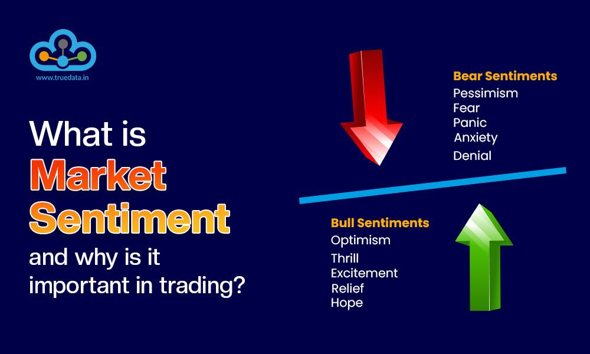

## Table of Contents

## What is market sentiment?

Market sentiment is how people feel about the market or a specific investment. It's like the overall mood of investors, whether they are feeling happy and confident or worried and unsure. This sentiment can influence whether people decide to buy or sell stocks, bonds, or other investments. For example, if everyone feels good about the economy, more people might buy stocks, pushing prices up.

Sentiment can be measured in different ways. Some people look at surveys that ask investors how they feel, while others might watch the news or social media to see what people are saying. Another way is to look at how much people are buying or selling certain investments. If lots of people are buying, it might mean they feel positive about the market. If many are selling, it could mean they're worried. Understanding market sentiment can help investors make better decisions, but it's just one part of the puzzle.

## How does market sentiment affect investment decisions?

Market sentiment can really change how people decide to invest their money. If everyone feels good about the market, they might think it's a great time to buy stocks or other investments. This can push prices up because lots of people want to buy. On the other hand, if everyone is feeling worried or unsure, they might start selling their investments. This can make prices go down because there are more people selling than buying.

Understanding how people feel about the market can help investors make smarter choices. For example, if an investor sees that everyone is feeling really positive, they might decide to buy stocks too, hoping to make money as prices go up. But if they see that people are feeling scared and are selling a lot, they might decide to wait or even sell their own investments to avoid losing money. It's important to remember that market sentiment is just one piece of the puzzle, and investors should look at other things too, like company news and economic reports, before making their decisions.

## What are the different types of market sentiment indicators?

Market sentiment indicators are tools that help people understand how others feel about the market. One type is surveys and polls, where people ask investors if they feel good or bad about the market. Another type looks at how much people are buying or selling. If lots of people are buying, it might mean they feel happy about the market. If many are selling, it might mean they're worried.

Another kind of indicator is technical analysis, where people look at charts and patterns to guess how others might feel. For example, if a stock's price keeps going up, it might mean people are feeling good about it. Also, there are sentiment indexes, like the Volatility Index (VIX), which measures how much people expect the market to move up or down. A high VIX might mean people are scared and expect big changes.

Lastly, there are indicators from news and social media. People can look at what others are saying online to see if the talk is positive or negative. If lots of people are saying good things about a company, it might mean they feel good about it. If there's a lot of bad news, it might mean people are worried. All these indicators help investors understand the mood of the market and make better choices.

## How can beginners identify bullish and bearish market sentiments?

Beginners can identify bullish market sentiment by looking at a few simple signs. If stock prices are going up and more people are buying than selling, it's a good sign that people feel positive about the market. You can also check the news and social media to see if people are talking about the market in a happy way. If you see lots of good news about companies and the economy, it's likely that the market sentiment is bullish. Another way to tell is by looking at sentiment indexes like the VIX. If the VIX is low, it means people are not too worried, which is another sign of a bullish market.

On the other hand, bearish market sentiment can be spotted when stock prices are going down and more people are selling than buying. This shows that people might be worried about the market. If the news and social media are full of bad news about companies or the economy, it's a sign that the market sentiment is bearish. Also, if the VIX is high, it means people are expecting big changes and are feeling scared, which is another sign of a bearish market. By keeping an eye on these simple signs, beginners can get a good idea of whether the market sentiment is bullish or bearish.

## What role do news and social media play in shaping market sentiment?

News and social media play a big role in shaping how people feel about the market. When there's a lot of good news about companies or the economy, it can make people feel happy and confident. They might think it's a good time to buy stocks, which can push prices up. For example, if a company announces a new product that everyone likes, people might feel excited and want to invest in that company. On the other hand, if there's a lot of bad news, like a company losing money or the economy slowing down, it can make people feel worried. They might start selling their investments, which can push prices down.

Social media can spread these feelings even faster. If lots of people are posting positive things about a stock or the market, it can make others feel the same way. This can create a wave of buying and push prices up. But if social media is full of negative posts and scary stories, it can spread fear and make people want to sell their investments. This can lead to a drop in prices. So, news and social media are like the mood setters for the market, influencing how people decide to invest their money.

## How do technical indicators like the RSI and MACD reflect market sentiment?

Technical indicators like the Relative Strength Index (RSI) and the Moving Average Convergence Divergence (MACD) help show how people feel about the market. The RSI measures how fast a stock's price is going up or down. If the RSI is over 70, it means the stock might be overbought, which can show that people are feeling too excited and the price might go down soon. If the RSI is under 30, it means the stock might be oversold, showing that people are feeling too worried and the price might go up soon. So, the RSI can tell us if people are feeling too happy or too scared about a stock.

The MACD also helps us understand market sentiment by looking at the difference between two moving averages of a stock's price. When the MACD line crosses above the signal line, it's a sign that people might be feeling more positive about the stock, and it could be a good time to buy. When the MACD line crosses below the signal line, it's a sign that people might be feeling more negative, and it could be a good time to sell. By watching these indicators, investors can get a sense of whether the market sentiment is leaning towards being bullish or bearish.

## What is the difference between leading and lagging sentiment indicators?

Leading sentiment indicators are like early warnings. They try to guess what the market might do before it happens. For example, if lots of people are buying stocks even before good news comes out, that's a leading indicator. It shows that people are feeling good about the market and expect it to go up. Surveys that ask investors how they feel about the future can also be leading indicators. They help investors get ready for what might happen next in the market.

Lagging sentiment indicators, on the other hand, tell us what has already happened in the market. They are like looking back at the past. For example, if stock prices have been going up for a while and then everyone starts talking about how great the market is, that's a lagging indicator. It shows that people are feeling good because the market has already gone up. Another lagging indicator is the unemployment rate. If it goes down after the market has been doing well, it shows that the good market sentiment has already affected the economy.

## How can sentiment analysis tools be used to predict market movements?

Sentiment analysis tools help predict market movements by looking at what people are saying about the market. These tools can read lots of news articles, social media posts, and other texts to figure out if people feel happy or worried about the market. If the tools see lots of positive words and happy feelings, they might predict that the market will go up because more people will want to buy. But if they see lots of negative words and worried feelings, they might predict that the market will go down because more people will want to sell.

These predictions are not always right, but they can give investors a good idea of what might happen. By using sentiment analysis tools, investors can see trends and changes in how people feel about the market before they show up in stock prices. This can help them make better choices about when to buy or sell. But it's important to remember that sentiment analysis is just one tool, and investors should look at other things too, like company news and economic reports, to make the best decisions.

## What are the limitations of using market sentiment as a sole indicator for trading?

Using market sentiment as the only guide for trading can be risky because it doesn't always tell the whole story. Sentiment can change quickly, and what people feel today might not be the same tomorrow. For example, if everyone feels good about a stock and buys it, the price might go up. But if bad news comes out later, the sentiment can turn negative fast, and the price can drop just as quickly. Also, sometimes the market can be too excited or too scared, leading to prices that don't match what's really happening with a company or the economy.

Another problem is that sentiment can be influenced by things that don't matter in the long run, like rumors or short-term news. If traders only look at sentiment, they might miss important facts like a company's earnings or big economic changes. It's better to use sentiment as one part of a bigger picture, along with other tools like technical analysis and [fundamental analysis](/wiki/fundamental-analysis). This way, traders can make more balanced decisions and avoid being caught off guard by sudden changes in the market.

## How do professional traders incorporate sentiment indicators into their strategies?

Professional traders use sentiment indicators as part of their overall strategy, but they don't rely on them alone. They know that sentiment can show them how other people feel about the market, which can help them guess what might happen next. For example, if sentiment tools show that lots of people are feeling positive about a stock, a trader might decide to buy it too, hoping to make money as the price goes up. But they also look at other things, like the company's earnings reports and economic news, to make sure their decision is based on more than just feelings.

They also use sentiment indicators to find times when the market might be too excited or too scared. If everyone is feeling too happy and buying a lot, a professional trader might think the price is too high and decide to sell. If everyone is feeling too worried and selling a lot, they might see it as a chance to buy at a lower price. By combining sentiment indicators with other types of analysis, professional traders can make smarter choices and avoid big mistakes that come from following the crowd too closely.

## Can market sentiment be quantified, and if so, how?

Yes, market sentiment can be quantified using different tools and methods. One way is through surveys and polls that ask investors how they feel about the market. These surveys can be turned into numbers, like a sentiment index, which shows if people are feeling more positive or negative. Another way is by looking at how much people are buying or selling. If more people are buying than selling, it can be seen as a positive number, showing good sentiment. If more people are selling, it can be seen as a negative number, showing bad sentiment.

Technical indicators like the Relative Strength Index (RSI) and the Moving Average Convergence Divergence (MACD) also help quantify sentiment. The RSI gives a number between 0 and 100, where a number over 70 might mean people are feeling too excited, and a number under 30 might mean they're feeling too worried. The MACD shows the difference between two moving averages, and when it goes up or down, it can show if people are feeling more positive or negative about the market. By using these tools, we can turn feelings into numbers and get a clearer picture of market sentiment.

## What advanced techniques are used to analyze sentiment in financial markets?

Advanced techniques for analyzing sentiment in financial markets include natural language processing (NLP) and [machine learning](/wiki/machine-learning). NLP helps computers understand what people are saying in news articles, social media posts, and other texts. It looks for words that show if people feel happy or worried about the market. Machine learning takes this a step further by learning from past data to guess how sentiment might change in the future. These techniques can handle a lot of information quickly and find patterns that might be hard for people to see.

Another advanced technique is using big data analytics. This means looking at huge amounts of data from different places, like social media, news, and trading data, all at once. By doing this, analysts can see how different pieces of information affect market sentiment. They can also use sentiment scores, which are numbers that show how positive or negative people feel about the market. By putting all this data together, these advanced techniques help traders and investors make better guesses about where the market might be headed.

## What are Sentiment Indicators?

Sentiment indicators are tools designed to gauge and interpret the prevailing moods and attitudes within financial markets. These tools transform qualitative sentiment data into quantitative metrics, allowing for an analytical approach to understanding market psychology. Sentiment indicators typically quantify investor sentiment, categorizing it as bullish (indicative of positive sentiment and rising prices), bearish (reflecting negative sentiment and falling prices), or neutral. 

Common sentiment indicators include the Put/Call Ratio, Volatility Index (VIX), and Commitment of Traders (COT) Report. The Put/Call Ratio measures market sentiment through the ratio of put options (bearish bets) to call options (bullish bets). A high ratio often signals bearish sentiment, whereas a low ratio suggests bullish sentiment. The formula for the Put/Call Ratio can be expressed as:

$$
\text{Put/Call Ratio} = \frac{\text{Volume of Put Options}}{\text{Volume of Call Options}}
$$

The Volatility Index (VIX), often referred to as the "fear index," provides a measure of expected market [volatility](/wiki/volatility-trading-strategies) derived from option prices. Higher VIX values indicate increased uncertainty and fear, while lower values suggest complacency. 

The Commitment of Traders (COT) Report offers insights into the positions held by different types of traders in the futures market, thus revealing potential market sentiment. 

These sentiment indicators capture the emotional responses and expectations of traders and investors, enabling predictive analysis. They allow market participants to gauge the sentiment backdrop against which trades are executed, thus refining trading strategies. By integrating sentiment insights, [algorithmic trading](/wiki/algorithmic-trading) strategies can incorporate market psychology, leading to more informed trading decisions and potentially improved outcomes.

## What are the types of sentiment indicators?

Sentiment indicators play a pivotal role in understanding and predicting market dynamics by capturing the emotional and psychological attitudes of investors. Here, we explore several commonly used sentiment indicators that have proven effective in gauging market sentiment.

**Put/Call Ratio:** The Put/Call Ratio is a popular metric for assessing market sentiment. It is calculated by dividing the volume of put options by the volume of call options over a specific period. This ratio provides insights into whether investors are predominantly bearish or bullish. A high Put/Call Ratio suggests a bearish sentiment, indicating that investors are purchasing more puts as a hedge against potential declines. Conversely, a low ratio may imply bullish sentiment, reflecting confidence in market gains. The formula for the Put/Call Ratio is:

$$
\text{Put/Call Ratio} = \frac{\text{Volume of Put Options}}{\text{Volume of Call Options}}
$$

**Volatility Index (VIX):** Known as the "fear index," the VIX quantifies market volatility expectations, reflecting levels of fear or complacency among investors. The VIX is derived from the implied volatilities of S&P 500 index options and is widely used to gauge the degree of market risk perceived by investors. A higher VIX value signifies greater expected volatility and fear, while a lower value suggests a calmer market environment. The VIX is calculated using a complex formula that incorporates the prices of various options, highlighting its dynamic nature in reflecting market sentiment. 

**Commitment of Traders (COT) Report:** The Commitment of Traders (COT) Report is a weekly publication by the Commodity Futures Trading Commission (CFTC) that details the positions held by different types of traders in the futures market. It categorizes traders into groups such as commercial traders, non-commercial traders, and retail traders. By analyzing the changes in these positions, market participants can gain insights into market sentiment and potential shifts in trends. For example, a significant shift in non-commercial positions can indicate changes in speculative sentiment and potential market movements.

**Social Media Sentiment Analysis:** As social media platforms become increasingly influential, analyzing sentiments expressed on these platforms offers a novel approach to understanding market perceptions. Traders use sentiment analysis techniques, often facilitated by natural language processing (NLP) tools, to evaluate the tone of discussions around specific stocks or markets. Platforms like Twitter are popular sources due to their real-time nature. Analysts develop sentiment scores from the data, which can serve as inputs for trading algorithms. This analysis helps capture the collective mood of the general public and can provide early signals of market trends.

**News Sentiment Analysis:** News sentiment analysis is another powerful tool for interpreting market sentiment by evaluating the tone and sentiment expressed in news articles and reports. By employing advanced machine learning techniques and NLP, traders can quantify the sentiment of news headlines and stories to predict market reactions. For instance, a period of overwhelmingly positive news sentiment about a particular company might lead to increased buying activity. Conversely, negative sentiment could trigger selling pressures. Traders integrate these sentiment scores into their models to enhance the accuracy of their trading strategies.

By leveraging these sentiment indicators, traders can obtain a comprehensive understanding of market psychology, which in turn aids in making informed trading decisions.

## What are strategies incorporating sentiment indicators?

Crowdsourced sentiment strategy capitalizes on the collective intelligence of large groups to pinpoint trading opportunities. By harnessing data from a multitude of sources such as social media platforms, forums, and opinion polls, this strategy analyzes the aggregated sentiment to discern trends and market inclinations. The underlying theory is that the collective wisdom of diverse opinions can provide a more accurate insight into market dynamics compared to individual analysis. Traders implementing this strategy often use advanced data mining techniques and sentiment analysis algorithms to interpret large volumes of textual data.

The contrarian strategy operates on the premise of trading against prevailing sentiment. When sentiment reaches an extreme—either overly bullish or bearish—contrarian traders anticipate a reversal. This approach is grounded in the belief that market participants tend to overreact, leading to inefficiencies that can be exploited. For instance, if sentiment indicators show excessively bullish sentiment, a contrarian might short sell the asset, expecting a price correction. This strategy often requires a comprehensive understanding of market psychology and timing to successfully anticipate reversals.

Trend-following strategy involves aligning trading decisions with the prevailing market trends indicated by sentiment indicators. When these indicators confirm a strong directional sentiment, traders adopt a strategy that follows the established trend. For example, if sentiment analysis reveals a consistent bullish sentiment, a trend-following trader will likely enter a long position to benefit from the continued rise in asset prices. This strategy is generally more effective in stable markets with clear trends and requires continual assessment of sentiment data to adjust positions accordingly.

Event-driven strategy centers on identifying sentiment shifts surrounding specific market events, such as earnings releases or economic announcements. These events can significantly alter investor sentiment, and event-driven strategies aim to capitalize on the resultant short-term market movements. Traders monitor sentiment indicators closely to detect any changes in sentiment and adjust their positions to exploit potential price volatility. This strategy requires timely data and the ability to react swiftly to sentiment shifts to capture trading opportunities.

Sentiment [momentum](/wiki/momentum) strategy combines sentiment analysis with momentum indicators to harness sentiment-driven trends. This approach involves using sentiment indicators to capture the emotional intensity of market participants and aligning these insights with momentum strategies that track the strength and direction of price movements. The formula for a simple momentum indicator is:

$$
\text{Momentum} = \text{Current Price} - \text{Price n periods ago}
$$

By integrating sentiment scores with such momentum indicators, traders can formulate strategies designed to capture persistent sentiment-driven trends, thus maximizing potential returns.

Collectively, these strategies demonstrate the versatile applications of sentiment indicators in enhancing trading decisions and optimizing algorithmic trading models.

## References & Further Reading

[1]: Tetlock, P. C. (2007). ["Giving Content to Investor Sentiment: The Role of Media in the Stock Market."](https://onlinelibrary.wiley.com/doi/abs/10.1111/j.1540-6261.2007.01232.x) The Journal of Finance, 62(3), 1139-1168.

[2]: Li, F. (2010). ["The Information Content of Forward-Looking Statements in Corporate Filings—A Naïve Bayesian Machine Learning Algorithm Approach."](https://onlinelibrary.wiley.com/doi/10.1111/j.1475-679X.2010.00382.x) Journal of Accounting Research, 48(5), 1049-1102.

[3]: Cambria, E., & Liu, B. (2012). ["Sentiment Analysis: Mining Opinions, Sentiments, and Emotions."](https://assets.cambridge.org/97811070/17894/frontmatter/9781107017894_frontmatter.pdf) Computational Linguistics and Intelligent Text Processing, 7697, 507-519.

[4]: ["Python for Data Analysis: Data Wrangling with Pandas, NumPy, and IPython"](https://wesmckinney.com/book/) by Wes McKinney

[5]: ["Natural Language Processing with Python: Analyzing Text with the Natural Language Toolkit"](https://www.nltk.org/book/) by Steven Bird, Ewan Klein, and Edward Loper