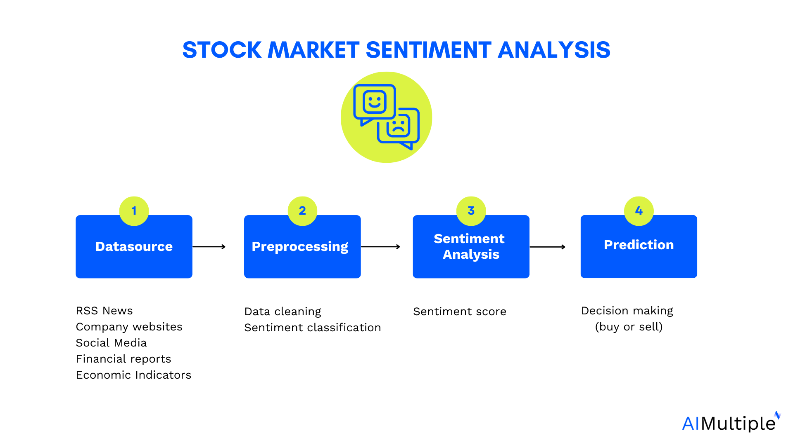

Modern investment strategies in the financial market have evolved significantly due to technological advancements and the increasing availability of data. In the current financial landscape, understanding the complexities of market sentiment is crucial for shaping investment decisions. Market sentiment, a collective attitude of investors towards a particular financial market or asset, can drive price movements and influence the creation of strategies that react to psychological factors rather than pure economic fundamentals.

Financial analysis plays a fundamental role in effective portfolio management by enabling investors to assess the intrinsic value of assets and make informed decisions. It involves the evaluation of historical data, financial statements, and current market conditions to forecast future performance. Key tools such as financial ratios, trend analysis, and cash flow analysis assist investors in identifying undervalued or overvalued assets. Integrating this analysis with market sentiment can help investors develop a nuanced understanding of market trends and optimize their portfolios.



Algorithmic trading has revolutionized investment trends by automating trading strategies that can execute orders at speeds and frequencies far beyond the capabilities of human traders. These algorithms analyze vast datasets to recognize patterns and execute trades based on predetermined criteria. The impact of such technologies is profound, as they provide liquidity, narrow spreads, and reduce transaction costs while also introducing new dynamics and challenges to the market, such as flash crashes caused by algorithmic errors.

This article aims to provide readers with an insight into how modern investment strategies integrate market sentiment and financial analysis with cutting-edge technologies like algorithmic trading. Readers can expect to learn about the methodologies employed to craft these complex investment strategies, the role sentiment analysis plays in decision-making, and the tools and techniques that underpin successful financial analysis and trading. By understanding these components, investors can better navigate the financial markets, leveraging these insights to enhance their investment outcomes.

## Table of Contents

## Understanding Market Sentiment

Market sentiment refers to the overall attitude of investors toward a particular security or the broader financial market. It is the collective emotion or tone of market participants, which can be bullish (positive) or bearish (negative). This sentiment influences decision-making processes and can impact the movement of market prices even more than fundamental financial data.

Numerous factors influence market sentiment, including economic indicators, geopolitical events, news releases, and investor psychology. Economic indicators such as interest rates and employment figures can sway sentiment by indicating the health of an economy. Geopolitical events, such as elections or conflicts, also play a role by creating uncertainty, often leading to increased market volatility. News releases and media coverage can amplify investor emotions, while psychological factors affect how investors perceive risk and opportunity.

To measure and analyze market sentiment, investors use several methods. One common approach is sentiment analysis, which involves using algorithms to process and interpret large volumes of textual information. Sentiment indices, such as the CBOE Volatility Index (VIX), reflect investor sentiment by measuring expected market [volatility](/wiki/volatility-trading-strategies). In addition, social media analytics provide real-time insights into investor opinion patterns and trends.

Real-world examples of market sentiment affecting market dynamics abound. The dot-com bubble of the late 1990s was primarily driven by overly optimistic market sentiment toward internet-based companies. Similarly, the global financial crisis of 2008 was exacerbated by a drastic shift from bullish to bearish sentiment, which led to rapid sell-offs in the stock market. These examples underscore how market sentiment, whether based on reality or perception, can influence financial markets significantly.

The interplay between market sentiment and investment strategies is critical for investors aiming to optimize returns. Investors may adjust their strategies depending on sentiment indicators by either capitalizing on bullish trends or hedging against potential downturns. For instance, sentiment-driven strategies might involve buying undervalued stocks during periods of extreme pessimism or shorting overvalued securities when sentiment is unduly optimistic. Understanding this interplay allows investors to navigate market fluctuations more effectively and make informed strategic adjustments.

## The Art and Science of Financial Analysis

Financial analysis is a cornerstone of informed investment decisions, providing insights into the performance, stability, and profitability of assets or portfolios. It plays an essential role in evaluating the potential for growth and the overall viability of investment opportunities.

### Key Tools and Techniques Used in Financial Analysis

Financial analysis employs several tools and techniques to assess economic conditions and make projections about future performance. Key methods include:

1. **Ratio Analysis**: This involves calculating and interpreting financial ratios from financial statements to evaluate an entity's liquidity, efficiency, profitability, and solvency. Common ratios include the Current Ratio, Return on Equity (ROE), and The Debt-to-Equity Ratio.

2. **Trend Analysis**: This technique examines historical financial data to identify patterns and predict future movements. By recognizing trends, analysts can forecast potential changes in market conditions or company performance.

3. **Comparative Financial Statements**: Analysts compare financial statements of the same company over different periods or between different companies in the same industry to identify trends and benchmarks.

4. **Discounted Cash Flow (DCF) Analysis**: A valuation method used to estimate the value of an investment based on its expected future cash flows. The formula $DCF = \sum \frac{C_t}{(1 + r)^t}$, where $C_t$ is the cash flow at time $t$ and $r$ is the discount rate, represents the present value of expected future cash flows.

5. **Technical Analysis**: This involves the analysis of historical market data, primarily price and volume, to forecast the direction of price movements. Techniques include the use of charts, trading indicators, and patterns.

### How Financial Analysis Helps in Identifying Market Opportunities

Financial analysis aids in discerning lucrative opportunities by evaluating an asset's or sector's historical data and current performance metrics. With effective analysis, investors can forecast potential revenue streams and spot undervalued or overvalued stocks. This assessment allows the identification of entry and [exit](/wiki/exit-strategy) points in various market conditions.

### The Relationship Between Market Sentiment and Financial Analysis Results

Market sentiment often complements financial analysis, providing a broader context for understanding investor behavior and market dynamics. While financial analysis focuses on quantitative metrics, market sentiment captures the qualitative aspects of market behavior. For instance, positive sentiment might drive higher asset prices despite weak fundamental indicators; conversely, negative sentiment can depress prices even if financial health is strong. Thus, merging market sentiment with traditional financial analysis can yield a more holistic assessment of investment viability.

### Case Studies Showcasing Successful Financial Analysis Applications

A classic example of successful financial analysis application is Warren Buffett's investment strategy. By leveraging thorough financial examinations, such as intrinsic value calculations and economic moat assessments, Buffett has effectively identified undervalued companies with strong fundamental prospects. His approach has consistently resulted in significant returns, exemplifying the power of detailed financial evaluation.

In another instance, the 2008 financial crisis highlighted firms that utilized robust financial analysis to weather adverse market conditions. Companies that accurately assessed the risk exposure of their investment portfolios were better equipped to manage and mitigate financial downturns, demonstrating the crucial nature of diligent financial analysis.

In conclusion, financial analysis serves as a vital component in navigating the investment landscape. It equips investors with the necessary tools to evaluate market opportunities, align strategies with underlying market conditions, and ultimately make informed decisions that enhance portfolio performance.

## Investment Strategies in a Market-Driven World

In today's dynamic financial markets, investment strategies play a crucial role in helping investors achieve their financial objectives. These strategies vary widely and are shaped by various factors, including market sentiment, financial analysis, and market volatility. Professionals employ a range of strategies to navigate the complexities of the market and optimize returns.

**Diverse Investment Strategies Used by Professionals**

Investment strategies can be broadly categorized into several types, each tailored to different investment goals and risk tolerance levels. Common strategies include value investing, growth investing, income investing, and [momentum](/wiki/momentum) investing.

1. **Value Investing** focuses on identifying undervalued stocks with the potential for price appreciation. This strategy necessitates a detailed analysis of a company's financial statements and involves metrics such as the price-to-earnings ratio.

2. **Growth Investing** targets companies expected to exhibit above-average growth. Investors look for companies with strong earnings growth potential, often at the cost of accepting higher volatility.

3. **Income Investing** aims to generate regular income through dividends or interest payments. This strategy is popular among retirees seeking a steady cash flow and typically involves investing in dividend-paying stocks or bonds.

4. **Momentum Investing** capitalizes on prevailing market trends by buying stocks that have shown upward price movements or selling short those with downward trends. This strategy relies heavily on technical analysis to time market entries and exits.

**Incorporating Market Sentiment into Investment Strategies**

Market sentiment, the overall attitude of investors toward a particular security or financial market, significantly impacts investment decisions. Understanding and incorporating market sentiment can refine investment strategies, as investor behavior often causes prices to deviate from their intrinsic values.

Professional investors utilize sentiment analysis tools, which assess data from news articles, social media, and trading volumes, to gauge market sentiment. A bullish sentiment might encourage more aggressive growth or momentum strategies, while bearish sentiment could lead to defensive strategies, such as increasing cash positions or investing in stable blue-chip stocks.

**The Influence of Financial Analysis on Strategic Investment Decisions**

Financial analysis serves as the backbone of strategic investment decisions. By scrutinizing financial statements and employing key financial ratios, such as Return on Equity (ROE) and Debt-to-Equity, investors can identify firms with strong fundamentals.

For example, DuPont Analysis, which breaks down ROE into three components—profit margin, asset turnover, and equity multiplier—helps investors understand what drives a company’s financial performance. This analytical approach enables investors to align their strategies with companies showing robust financial health and growth potential.

**Adapting Investment Strategies in Volatile Markets**

Market volatility can pose significant challenges for investors but also presents opportunities for profit. During volatile periods, traditional strategies may require alteration or adaptation to mitigate risk and seize potential gains.

For instance, a shift from a growth-focused to a value-oriented strategy might be advisable in volatile markets, as value stocks are generally perceived to be more resilient to downward market corrections. Furthermore, incorporating hedging techniques, such as options trading or inverse ETFs, can protect portfolios from adverse price movements.

**Examples of Effective Strategies in Different Market Conditions**

Investors who successfully navigate varying market conditions demonstrate the effectiveness of adaptive investment strategies. For example, during the 2008 financial crisis, some hedge funds employed [global macro](/wiki/global-macro-strategy) strategies, capitalizing on currency movements and [interest rate](/wiki/interest-rate-trading-strategies) differentials to generate positive returns amidst market downturns.

Similarly, during the 2020 COVID-19 pandemic-induced market volatility, many investors turned to technology stocks, which benefited from increased digital adoption, as part of their growth investing strategy. This sector rotation proved effective as tech companies significantly outperformed the broader market.

These examples underscore the importance of flexibility and awareness in strategy formulation, allowing investors to adjust their approaches as market conditions fluctuate. By integrating market sentiment, utilizing comprehensive financial analysis, and adapting to volatility, investors can enhance their strategy's effectiveness across different market landscapes.

## Algorithmic Trading: Redefining Investment

Algorithmic trading is a technological advancement in financial markets where computer algorithms execute trades at speeds and frequencies that a human trader cannot achieve. These algorithms are programmed to follow specific rules and, in many cases, use complex formulas and mathematical models to make decisions based on market prices, timing, and other variables.

**Advantages of Algorithmic Trading**

The benefits of [algorithmic trading](/wiki/algorithmic-trading) are substantial, contributing to its adoption across various financial markets. One key advantage is enhanced efficiency. Algorithms can process and act on market data more quickly than human traders, leading to potentially better execution prices. They also minimize human errors that may occur due to emotional decision-making, thereby increasing the consistency of trading strategies.

Another advantage is cost reduction. By optimizing the timing and execution of trades, algorithmic trading can reduce transaction costs. For instance, algorithms can split larger orders into smaller ones to avoid moving the market price unfavorably — a tactic known as "order slicing."

**Integration of Market Sentiment Analysis**

Incorporating market sentiment analysis into algorithmic trading is becoming increasingly common. Sentiment analysis uses data from news articles, social media, and other sources to gauge the mood of the market. Algorithms can be programmed to react to these sentiment indicators, providing an edge by anticipating shifts in market trends that aren't immediately apparent through traditional analysis.

For example, a python-based sentiment analysis can be integrated as follows:

```python
from textblob import TextBlob
import requests

response = requests.get("URL_TO_NEWS_OR_SOCIAL_MEDIA_CONTENT")
content = response.text

# Analyze the sentiment
analysis = TextBlob(content)
sentiment_score = analysis.sentiment.polarity

if sentiment_score > 0.1:
    print("Positive market sentiment detected, consider buying.")
elif sentiment_score < -0.1:
    print("Negative market sentiment detected, consider selling.")
else:
    print("Neutral sentiment, hold position.")
```

**Challenges and Risks Associated with Algorithmic Trading**

Despite its advantages, algorithmic trading presents several challenges and risks. Market conditions can change unpredictably, making sophisticated models outdated quickly. Algorithms can also suffer from technical glitches, leading to unintended trades or market disruptions, such as the infamous "Flash Crash" of 2010.

Regulatory concerns present another significant risk. As algorithmic trading grows, so does scrutiny from regulatory bodies wary of its potential to exacerbate market volatility.

**Future Trends in Algorithmic Trading**

Looking ahead, several trends are likely to shape the future of algorithmic trading. Machine learning and [artificial intelligence](/wiki/ai-artificial-intelligence) are set to play crucial roles, enabling algorithms to learn from and adapt to new data autonomously. This evolution could lead to more predictive and self-improving trading systems.

Another emerging trend is the increased use of [alternative data](/wiki/best-alternative-data) sources, such as satellite imagery and IoT data, enhancing the algorithms’ ability to make informed predictions beyond conventional financial metrics.

In summary, algorithmic trading is redefining investment through its efficiency, cost effectiveness, and integration of modern analytical techniques. By addressing its inherent risks and embracing technological advancements, it holds the potential for more dynamic and adaptive trading strategies in the future.

## Combining Financial Analysis with Algorithmic Trading

Financial analysis and algorithmic trading are complementary pillars in today's investment landscape. The integration of these methodologies offers investors and traders advanced capabilities for making informed decisions. Financial analysis provides the fundamental and technical insights that are crucial in understanding market dynamics, while algorithmic trading utilizes these insights to execute trades with precision and speed.

### Strategies for Integrating Fundamental and Technical Analysis in Algorithms

Fundamental analysis involves evaluating a company’s financial statements, health, competitors, and markets to determine its intrinsic value. Technical analysis, on the other hand, focuses on statistical trends from trading activity, such as price movement and [volume](/wiki/volume-trading-strategy). When integrating these analyses into algorithmic trading, the goal is to create systems that can make buy or sell decisions based on both quantitative financial health and patterns detected in market data.

One approach is to use fundamental data to filter stocks, creating a shortlist of high-potential candidates based on criteria like P/E ratios, EPS growth, or revenue consistency. Then, technical analysis can be employed to time the market entry and exit points within this shortlist. This dual approach ensures that the algorithms are making choices not just on statistical patterns but also on sound economic data.

### The Role of Big Data and Machine Learning in Enhancing Financial Analysis

The rise of big data has transformed financial analysis, allowing algorithms to process vast amounts of information to identify market signals that may not be visible through traditional analysis methods. Machine learning (ML) algorithms can recognize complex patterns in historical data, predict future trends, and make real-time adjustments to trading strategies.

Machine learning models, such as neural networks, decision trees, and support vector machines, are commonly integrated into trading algorithms to enhance decision-making processes. For instance, a model could be trained to predict stock price movements by analyzing historical price data, news sentiment, trading volumes, and macroeconomic indicators.

### Success Stories of Combining Financial Analysis with Algo Trading

There are numerous cases where firms successfully combined financial analysis with algorithmic trading to generate significant returns. One notable example is Renaissance Technologies, a [hedge fund](/wiki/hedge-fund-trading-strategies) known for utilizing sophisticated quantitative models to drive its trading strategies. By meticulously analyzing vast datasets and applying advanced algorithms, the firm has consistently outperformed the market.

Another example is BlackRock's Aladdin platform, which integrates risk analytics and big data to support investment decisions. The platform's success lies in its ability to process data from various sources, allowing traders to make informed decisions that align with their strategic objectives.

### Potential Pitfalls and Solutions in Merging These Two Methodologies

Combining financial analysis with algorithmic trading is not without its challenges. One major pitfall is the risk of overfitting, where an algorithm performs well on historical data but fails in live market conditions due to its excessive complexity. This can be mitigated by using techniques such as cross-validation and regularization when developing models.

Another challenge is data quality and integrity. Inaccurate or incomplete data can lead to poor trading decisions. Ensuring reliable data sources and implementing robust data cleaning processes are essential steps in developing effective trading algorithms.

Moreover, market conditions can change rapidly, making historical data less relevant. Continuous model retraining and validation are necessary to adapt to evolving markets.

In conclusion, the symbiosis of financial analysis and algorithmic trading presents a powerful approach to investment. By leveraging advanced data processing and analytical techniques, investors can improve accuracy and efficiency in their decision-making processes.

## Practical Tips for Investors

Incorporating market sentiment into your investment strategy involves understanding and reacting to the emotions and attitudes of market participants. One effective way to gauge market sentiment is by using sentiment analysis tools. These tools aggregate data from various sources, such as news articles, social media, and market reports, to provide insights into investor sentiment. Platforms like Bloomberg Terminal and Thomson Reuters Eikon offer sentiment analysis features, giving investors real-time access to this critical information.

For conducting effective financial analysis, several tools and resources are available to investors. Software such as Excel or Google Sheets can be used for basic data analysis and modeling. More sophisticated analysis can be performed using financial software like MATLAB, R, or Python libraries such as Pandas, NumPy, and Matplotlib. These tools help in evaluating financial statements, assessing market trends, and conducting quantitative analysis.

Newcomers to algorithmic trading should start by familiarizing themselves with the basics of programming and finance. Python is a recommended language due to its simplicity and robust financial libraries. Platforms such as QuantConnect, AlgoTrader, and MetaTrader offer environments to develop, test, and deploy trading algorithms. It is advisable to start with simple strategies, gradually increasing complexity as one becomes more proficient.

Identifying the right investment strategy requires aligning with your individual goals, risk tolerance, and time horizon. Goals can range from short-term earnings to long-term growth. Risk tolerance varies from conservative strategies, like bond investing, to aggressive strategies, such as trading high-volatility stocks. Understanding your investment horizon will also guide whether to focus on quick returns or long-term capital accumulation.

Staying updated with market trends and sentiment shifts is crucial for timely decision-making. Subscribing to financial news services such as The Wall Street Journal, Financial Times, or Bloomberg News provides regular market updates. Additionally, tools like Google Alerts and Twitter feeds dedicated to financial markets can offer real-time information on emerging trends and sentiment changes. Engaging in webinars and following thought leaders in finance can also enhance your understanding of ongoing market dynamics.

## Conclusion

This article has traversed various facets of modern investment strategies, illuminating the integral components that shape today’s financial decision-making processes. Among these, an understanding of market sentiment emerges as a vital element, influencing both the behaviors of investors and the dynamics of markets. Market sentiment, characterized by the collective emotional bias of investors towards particular securities or market conditions, affects price movements and can be a decisive [factor](/wiki/factor-investing) in the success or failure of investment strategies.

Integrating market sentiment with rigorous financial analysis can greatly enhance the efficacy of investment decisions. Financial analysis, employing both qualitative and quantitative assessments, provides a thorough examination of an entity's financial health, revealing opportunities and potential risks. It complements market sentiment by grounding emotional market perceptions with factual financial data, facilitating a more balanced and informed approach to investing.

Looking ahead, the future of investment strategies will undeniably be shaped by advancements in technology, particularly algorithmic trading and big data analytics. These tools offer investors the ability to analyze vast datasets in real-time, rapidly adapt to market conditions, and execute trades with precision. As the landscape of investing continues to evolve, the integration of cutting-edge technology will be crucial for developing strategies that can thrive amid increasing market complexity and volatility.

Investors are encouraged to leverage financial analysis and technology not merely as tools but as cornerstones of a robust investment strategy. By doing so, they can gain a competitive edge, optimize portfolio management, and achieve their financial goals. The exploration of these topics should not stop here; rather, this article serves as an invitation for readers to deepen their engagement with market sentiment analysis, financial assessment, and technological integration within investing. As these fields continue to grow, so too will the opportunities for investors prepared to apply these insights to future ventures.

## References & Further Reading

[1]: Bergstra, J., Bardenet, R., Bengio, Y., & Kégl, B. (2011). ["Algorithms for Hyper-Parameter Optimization."](https://papers.nips.cc/paper/4443-algorithms-for-hyper-parameter-optimization) Advances in Neural Information Processing Systems 24.

[2]: ["Advances in Financial Machine Learning"](https://www.amazon.com/Advances-Financial-Machine-Learning-Marcos/dp/1119482089) by Marcos Lopez de Prado

[3]: ["Evidence-Based Technical Analysis: Applying the Scientific Method and Statistical Inference to Trading Signals"](https://www.amazon.com/Evidence-Based-Technical-Analysis-Scientific-Statistical/dp/0470008741) by David Aronson

[4]: ["Machine Learning for Algorithmic Trading"](https://github.com/stefan-jansen/machine-learning-for-trading) by Stefan Jansen

[5]: ["Quantitative Trading: How to Build Your Own Algorithmic Trading Business"](https://www.amazon.com/Quantitative-Trading-Build-Algorithmic-Business/dp/1119800064) by Ernest P. Chan