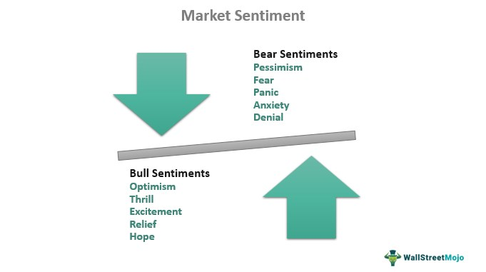

Understanding sentiment indicators is crucial for navigating financial markets due to their powerful influence on trading decisions and market movements. Market sentiment encapsulates the collective emotions and attitudes of investors towards specific financial instruments or markets as a whole, which can lead to significant price fluctuations and impact the financial landscape. It embodies the psychology that drives market participants, reflecting optimism or pessimism and consequently shaping market dynamics.

In recent years, the integration of sentiment analysis into trading strategies has garnered increasing attention, notably within the realm of algorithmic trading. Algorithmic trading relies on complex models and systems to execute trades based on predetermined criteria, often incorporating both technical and fundamental analyses. Sentiment indicators play a critical role in this domain by offering insights into the psychological influences at play within the market, thus enhancing the predictive capabilities of these algorithms.



By leveraging sentiment indicators, traders aim to refine their strategies, potentially improving outcomes by aligning more closely with the prevailing mood of the market. As trading technology advances, so too does the need for sophisticated analysis tools that can harness the vast swathes of data generated every second from news articles, social media, and economic reports. This real-time data allows traders to gauge sentiment effectively and to adjust their strategies in response to shifting market perceptions.

The evolving landscape of trading is increasingly driven by sentiment analysis, as a broader understanding of investor psychology can provide a competitive edge. This fusion of technology and human emotion represents the next frontier in trading, with sentiment indicators serving as a bridge between quantitative data analysis and qualitative human insights. As markets grow more interconnected and complex, the ability to interpret and react to market sentiment is becoming an essential component of any robust trading strategy.

## Table of Contents

## What is Market Sentiment?

Market sentiment refers to the overall attitude and outlook of investors and participants in a financial market. It encapsulates the collective emotions and psychological state of these individuals, influencing their buying, selling, or holding decisions. The sentiment is shaped by various factors, including emotional reactions, crowd psychology, and the general mood of investors. These emotional components drive market dynamics, impacting asset prices and market trends.

A crucial aspect of market sentiment is its bifurcation into bullish and bearish sentiments. Bullish sentiment is characterized by optimism, where investors expect rising asset prices and positive market performance. This outlook often leads to increased buying activity, driving prices up. Conversely, bearish sentiment reflects pessimism, with expectations of declining asset prices. This typically leads to increased selling pressures, which can cause prices to fall.

Although market sentiment is a subjective measure, it is essential for assessing potential market shifts. Unlike objective indicators such as earnings reports or economic data, sentiment is based on perceptions and expectations. It can often lead to self-fulfilling prophecies; for instance, widespread bullish sentiment can bolster prices even if fundamental data do not support such an increase. Consequently, understanding market sentiment is vital for investors aiming to predict market trends and align their strategies accordingly.

While market sentiment provides valuable insights into potential market movements, it is not always aligned with fundamental or technical analysis. This discrepancy can offer opportunities for astute traders to capitalize on the differences, though it also introduces risks associated with over-reliance on sentiment alone. The dynamic and often volatile nature of market sentiment underscores the importance of a balanced approach that incorporates multiple analytical perspectives.

## Key Sentiment Indicators for Financial Markets

The CBOE Volatility Index (VIX) is a widely recognized sentiment indicator, often referred to as the "fear gauge" of the financial markets. It reflects the market's expectation of 30-day forward-looking [volatility](/wiki/volatility-trading-strategies) and is derived from the prices of S&P 500 index options. Increased values in VIX typically correspond to heightened volatility and uncertainty, reflecting a bearish sentiment. Conversely, a decrease in VIX suggests lower anticipated volatility, often aligned with bullish market conditions. Research has shown a strong correlation between elevated VIX levels and market downturns, marking it as an essential tool for traders and investors [1].

The High-Low Index serves as another critical indicator, evaluated by analyzing the ratio of new 52-week highs to the sum of new 52-week highs and lows. It's calculated as:  
$$
\text{High-Low Index} = \left( \frac{\text{Number of New 52-week Highs}}{\text{Total Number of New 52-week Highs and Lows}} \right) \times 100
$$
A High-Low Index above 50 indicates bullish sentiment, while an index below 50 signals bearish sentiment. This metric reveals investor behavior patterns and overall market [momentum](/wiki/momentum) [2].

The Bullish Percent Index (BPI) is an indicator used to measure market optimism or pessimism by calculating the percentage of stocks with bullish point-and-figure chart patterns. Its formula is simply:  
$$
\text{BPI} = \left( \frac{\text{Number of Bullish P\&F Charts}}{\text{Total Number of Charts Analyzed}} \right) \times 100
$$
A BPI above 70 suggests a bullish market, whereas a BPI below 30 indicates bearish conditions. This index enables traders to gauge the broader market sentiment and make informed decisions [3].

Moving averages, particularly the golden cross and death cross, are pivotal in indicating market direction. The golden cross occurs when a short-term moving average crosses above a long-term moving average, historically signaling potential market gains. In contrast, the death cross, where a short-term moving average dips below a long-term moving average, often predicts market declines. These patterns help traders identify emerging trends and potential reversal points in the market [4].

By leveraging these sentiment indicators, traders can better interpret market trends, thereby enhancing their trading strategies.

**References:**

1. Whaley, R. E. (2000). *The Investor Fear Gauge*. Journal of Portfolio Management, 26(3).
2. Lynch, P. (1993). *Beating the Street*. New York: Simon & Schuster.
3. Dorsey, T. (1995). *Point & Figure Charting: The Essential Application for Forecasting and Tracking Market Prices*. Wiley.
4. Murphy, J. J. (1999). *Technical Analysis of the Financial Markets*. New York Institute of Finance.

## Role of Sentiment in Algorithmic Trading

Algorithmic trading, commonly known as algo trading, leverages advanced computational techniques to execute trades based on pre-defined criteria, removing the emotional elements that often accompany human trading. In recent years, sentiment indicators have become integral to [algorithmic trading](/wiki/algorithmic-trading) strategies. These indicators serve as crucial tools for gauging market sentiment, allowing algorithms to interpret and react to the mood and expectations prevalent in the market.

Sentiment indicators in algorithmic trading provide data that reflect the collective emotional state of traders. By incorporating this data into their decision-making processes, algorithms can systematically analyze sentiment changes and adjust strategies accordingly. This capability is particularly beneficial when dealing with large volumes of data that would be infeasible for human traders to process manually. Here, algorithms excel by rapidly digesting sentiment data from diverse sources, including social media, financial news, and market reports, to make informed decisions.

One of the primary advantages of using sentiment indicators is their ability to forecast market movements. Algorithms can utilize sentiment analysis to decipher the direction and intensity of market sentiment, helping to anticipate future price actions. For example, when a sentiment indicator suggests a bullish trend, an algorithm might execute buy orders, while a bearish sentiment could trigger sell orders. This predictive capability is underpinned by complex models that highlight correlations between sentiment changes and price movements.

A key feature of algorithms is their adaptability; they can be tailored to respond dynamically to sentiment indicator changes. Through [machine learning](/wiki/machine-learning) techniques, algorithms can improve their predictive accuracy over time. Consider the integration of natural language processing (NLP) models in sentiment analysis: these models assess text data to evaluate sentiment trends, which can then be quantified and fed into trading algorithms. Python libraries like NLTK (Natural Language Toolkit) and TensorFlow can be employed to build such models. For instance, one might use:

```python
from nltk.sentiment import SentimentIntensityAnalyzer

# Initialize sentiment analyzer
sia = SentimentIntensityAnalyzer()

# Example text, e.g., social media post
text = "The market looks promising with rising stocks!"

# Calculate sentiment score
sentiment_score = sia.polarity_scores(text)
print(sentiment_score)
```

The ability to program algorithms means that strategy adjustments can be made instantaneously in response to fluctuating market sentiment. This feature is vital during periods of high volatility, where market sentiments can swing rapidly in response to events. The flexibility to revise trading strategies based on real-time sentiment data offers a competitive advantage, enabling traders to minimize risk and maximize returns.

Nevertheless, while sentiment indicators provide valuable insights, their integration into algorithmic trading strategies should be approached with caution. As the market landscape continues to evolve, the effectiveness of sentiment-based algorithms may vary, necessitating constant refinement and calibration to ensure optimal performance.

## Limits and Challenges of Sentiment Indicators

Market sentiment is a powerful yet highly unpredictable force in financial markets. It can be significantly influenced by news events and social media, where information is disseminated rapidly and often without verification. This can lead to impulsive market reactions based on incomplete or erroneous data, resulting in heightened volatility.

One major challenge is market sentiment's lack of consistent correlation with fundamental or technical analysis. While [fundamental analysis](/wiki/fundamental-analysis) focuses on the intrinsic value of assets based on economic indicators, sentiment is inherently subjective, often reflecting short-term emotional reactions rather than long-term value assessments. Similarly, technical analysis relies on historical price and [volume](/wiki/volume-trading-strategy) data, which may not capture the immediate shifts driven by sentiment. Consequently, traders relying solely on sentiment indicators may miss critical insights provided by these other analytical approaches.

Sentiment indicators often produce noise, which requires careful filtering and confirmation. The distinction between genuine market sentiment and fleeting information can be complicated. Sentiment data might include tweets, news headlines, or other forms of communication, and separating valuable insights from background noise necessitates sophisticated data processing techniques and analytical skills. For example, natural language processing (NLP) algorithms can be employed to analyze large volumes of textual data, but these algorithms must be meticulously validated to ensure they accurately capture sentiment without falling for misleading signals. 

Additionally, there is a risk of overreacting to sentiment indicators. A sudden surge in negative sentiment on social media might not align with broader market fundamentals, leading to premature sell-offs or panic buying. To mitigate such risks, traders can incorporate sentiment analysis as part of a balanced approach, complementing it with other forms of analysis to verify signals and reduce reliance on sentiment alone. For instance, using moving averages or other technical indicators alongside sentiment indicators can provide a more comprehensive understanding of market conditions and help filter out transient emotional reactions.

To address these challenges, traders and financial institutions are increasingly developing advanced algorithms that integrate sentiment analysis with other data sources. These algorithms can be programmed to adjust their strategies dynamically based on the reliability of sentiment signals, thus minimizing the impact of misleading or volatile sentiment data on trading decisions.

## Practical Applications and Real-World Examples

Understanding and correctly interpreting sentiment can significantly impact trading success, serving as a crucial [factor](/wiki/factor-investing) in distinguishing between profit and loss. In recent years, the influence of market sentiment has been pronounced, with various macroeconomic factors playing pivotal roles in shaping investor attitudes.

In the early 2020s, market sentiment experienced considerable volatility, largely driven by unprecedented global events such as the COVID-19 pandemic, geopolitical tensions, and shifts in monetary policy. These factors significantly affected investor confidence, leading to abrupt changes in market sentiment. For instance, during the height of the pandemic, widespread uncertainty and fear were reflected in sentiment indicators like the CBOE Volatility Index (VIX), which saw substantial spikes as markets anticipated adverse impacts on economic activities.

By 2023, however, there was a notable recovery in market sentiment, with many indicators reflecting a more optimistic economic outlook. As economies reopened and adapted to post-pandemic realities, improved economic indicators and positive corporate earnings reports contributed to a more favorable sentiment. This shift underscored the dynamic nature of sentiment indicators and their ability to adjust rapidly to changing economic landscapes.

Several case studies highlight the practical application of sentiment analysis in trading strategies. A prominent example is the deployment of algorithmic trading systems that integrate sentiment indicators to identify trading opportunities. These systems utilize various data sources, including social media, financial news, and market reports, to gauge investor sentiment and adjust trading strategies accordingly. For instance, during periods of heightened market volatility, algorithms may increase trading activity or employ hedging strategies to mitigate potential risks.

The success of sentiment-driven trading strategies is also evident in quantitative hedge funds and proprietary trading firms that leverage advanced machine learning models. By processing vast amounts of sentiment data, these models discern patterns and trends that are not immediately apparent through conventional analysis, thereby achieving competitive advantages in predicting market movements.

In conclusion, the accurate interpretation and application of sentiment indicators prove indispensable for traders seeking to navigate the complexities of financial markets. As sentiment analysis continues to evolve, its integration into sophisticated trading strategies offers the potential for enhanced decision-making and improved financial performance.

## Conclusion: Integrating Sentiment Indicators into Trading Strategies

Integrating sentiment indicators into trading strategies offers significant advantages by providing traders with nuanced insights that are not always apparent through traditional analysis methods alone. Sentiment analysis, when combined with technical analysis, creates a comprehensive trading approach, reducing the risk inherent in relying solely on one type of indicator. This balanced strategy enhances the ability to predict market movements more accurately.

Traders who incorporate sentiment analysis are better equipped to understand the underlying mood driving market dynamics and investor expectations. By staying informed of shifts in sentiment, investors can make more informed decisions, aligning their strategies with the prevailing market conditions. This understanding helps in identifying potential opportunities and threats that are not readily visible through fundamental or technical analysis alone.

Moreover, traders who adapt their algorithms to align with evolving sentiment indicators position themselves to capitalize on market trends effectively. Algorithms that process sentiment data can adjust trading models in real-time, responding quickly to changes in market sentiment and ensuring that trading strategies remain relevant. As market sentiment can shift rapidly due to news events or social media trends, the ability to adapt quickly is crucial for maintaining a competitive edge.

Incorporating sentiment indicators into trading strategies does not only increase the diversity of the analytical toolkit but also enhances the trader's ability to navigate financial markets more effectively. Successful traders leverage the insights gained from sentiment analysis, integrating them with traditional trading approaches to optimize performance and maximize returns. By doing so, they can develop more resilient trading strategies that reflect both the emotional and rational aspects of market behavior.

## References & Further Reading

[1]: Whaley, R. E. (2000). ["The Investor Fear Gauge."](https://www.semanticscholar.org/paper/The-Investor-Fear-Gauge-Whaley/37ea262fb99beb8bf9dcb8406400d491aab40a0b) Journal of Portfolio Management, 26(3).

[2]: Lynch, P. (1993). *Beating the Street*. New York: Simon & Schuster.

[3]: Dorsey, T. (1995). *Point & Figure Charting: The Essential Application for Forecasting and Tracking Market Prices*. Wiley.

[4]: Murphy, J. J. (1999). *Technical Analysis of the Financial Markets*. New York Institute of Finance.

[5]: Loughran, T., & McDonald, B. (2011). ["When is a Liability not a Liability? Textual Analysis, Dictionaries, and 10‐Ks."](https://onlinelibrary.wiley.com/doi/10.1111/j.1540-6261.2010.01625.x) Journal of Finance, 66(1).

[6]: Tetlock, P. C. (2007). ["Giving Content to Investor Sentiment: The Role of Media in the Stock Market."](https://onlinelibrary.wiley.com/doi/abs/10.1111/j.1540-6261.2007.01232.x) Journal of Finance, 62(3).

[7]: Chan, E. (2009). ["Quantitative Trading: How to Build Your Own Algorithmic Trading Business."](https://github.com/ftvision/quant_trading_echan_book) Wiley.