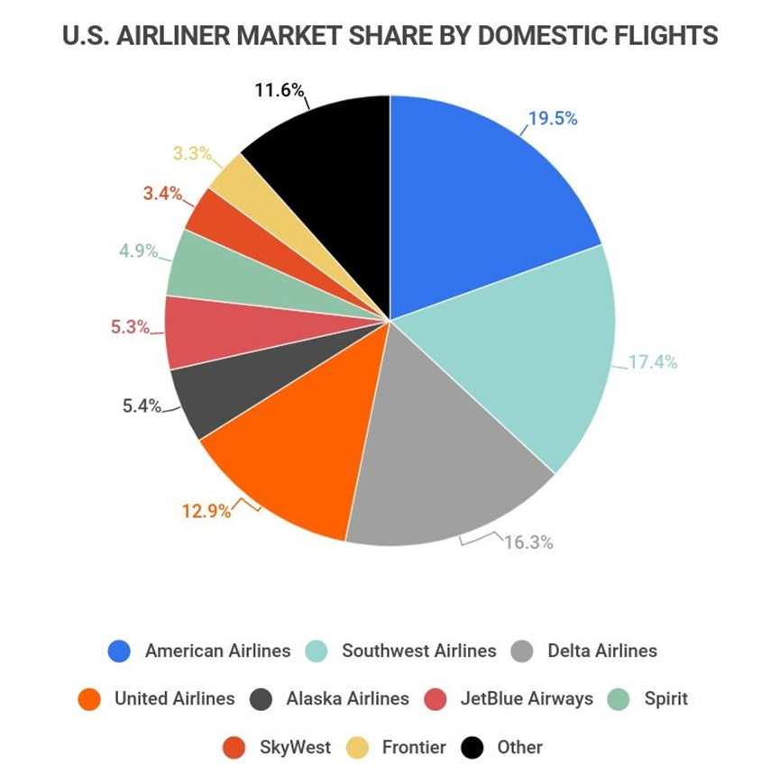

## Table of Contents

## What is market share and why is it important for airlines?

Market share is the percentage of total sales in an industry that a company has. For airlines, it means how much of the total number of passengers or flights an airline has compared to other airlines. It's like a piece of the pie, where the whole pie is all the passengers or flights in the market.

Market share is important for airlines because it shows how well they are doing compared to their competitors. If an airline has a big piece of the pie, it means more people are choosing to fly with them. This can help the airline make more money and grow bigger. It also helps them understand if their marketing and services are working well. If their market share is small, they might need to change their strategies to attract more passengers.

## How is market share calculated in the airline industry?

Market share in the airline industry is calculated by looking at the number of passengers or the number of flights an airline has compared to the whole market. For example, if an airline carried 100,000 passengers in a year, and the total number of passengers in the market was 1 million, the airline's market share would be 10% (100,000 divided by 1,000,000, then multiplied by 100 to get a percentage).

This calculation can be done using different measures, like the number of passengers, the number of flights, or even the revenue earned. Airlines often use passenger numbers because it directly shows how many people are choosing to fly with them. By comparing their numbers to the total market, airlines can see if they are growing or shrinking compared to other airlines.

## What is the current market share of Southwest Airlines?

Southwest Airlines is one of the biggest airlines in the United States. In 2022, they had about 17% of the market share based on the number of passengers. This means that out of every 100 people who flew in the U.S., about 17 chose Southwest Airlines.

Having a big market share like this is important for Southwest because it shows that many people like to fly with them. It helps them make more money and stay competitive with other airlines. Southwest is known for its low prices and friendly service, which helps them keep their market share strong.

## How has Southwest Airlines' market share changed over the past five years?

Over the past five years, Southwest Airlines has seen some changes in its market share. In 2018, Southwest had about 19% of the market. This number went down a bit over the years. By 2022, their market share was around 17%. This shows that while Southwest is still a big player in the airline industry, it has faced some competition and challenges that affected its share of the market.

The changes in Southwest's market share can be due to many things. For example, other airlines might have offered better deals or new routes that attracted more passengers. Also, events like the global health crisis in 2020 made fewer people fly, which affected all airlines. Southwest had to adapt to these changes, and while they still have a strong position, their market share has gone down a little bit over the past five years.

## What are the main factors influencing Southwest Airlines' market share?

Southwest Airlines' market share is influenced by many things. One big [factor](/wiki/factor-investing) is their pricing. Southwest is known for offering low fares, which attracts a lot of passengers. When people can fly for less money, they are more likely to choose Southwest over other airlines. Another factor is their service. Southwest has a reputation for being friendly and efficient, which makes people want to fly with them again. They also have a simple fare structure and no change fees, which many passengers find convenient.

Another important factor is their route network. Southwest flies to many places in the United States, making it easy for people to get where they need to go. They focus on shorter, direct flights, which is popular with travelers. Competition also plays a big role. Other airlines might offer new routes or better deals, which can take passengers away from Southwest. Events like the global health crisis can also affect how many people fly, which impacts Southwest's market share.

Lastly, Southwest's operational efficiency and reliability are crucial. When flights are on time and there are fewer cancellations, passengers are happier and more likely to choose Southwest again. The airline's ability to manage costs and keep fares low while maintaining good service also helps them maintain a strong market position. All these factors together shape how much of the market Southwest Airlines can claim.

## Who are the primary competitors of Southwest Airlines and what are their market shares?

Southwest Airlines has several big competitors in the U.S. airline industry. The main ones are American Airlines, Delta Air Lines, and United Airlines. American Airlines is the biggest of these, with a market share of around 19% in 2022. This means that out of every 100 people who flew in the U.S., about 19 chose American Airlines. Delta Air Lines comes next with a market share of about 17%, the same as Southwest. United Airlines is close behind with a market share of around 14%.

These competitors affect Southwest's market share in different ways. American Airlines and Delta have big route networks and fly to many places around the world, which can attract passengers who want to travel internationally. United also has a strong presence and offers many flights. All these airlines compete with Southwest on price, service, and routes. Sometimes, they might offer lower fares or new routes that take passengers away from Southwest. But Southwest's focus on low prices and good service helps it stay competitive and keep a strong position in the market.

## How does Southwest Airlines' market share vary by region or route?

Southwest Airlines' market share can be different depending on where they fly. In some places, like the southwestern United States, Southwest has a bigger piece of the market because they started there and have been flying there for a long time. People in these areas know and trust Southwest, so they choose to fly with them more often. For example, in cities like Las Vegas or Phoenix, Southwest might have a bigger market share than in other parts of the country.

In other regions, like the Northeast or the Midwest, Southwest might not have as big a share of the market. This is because there are other big airlines, like American, Delta, and United, that have been flying in these areas for a long time. These airlines might have more flights and better deals in these regions, so more people choose them. Southwest is trying to grow in these areas by adding new routes and offering good prices, but it can take time to get a bigger piece of the market.

## What strategies has Southwest Airlines implemented to increase or maintain its market share?

Southwest Airlines has used several strategies to keep and grow its market share. One big strategy is keeping their prices low. Southwest is known for offering cheaper tickets than many other airlines. This attracts a lot of passengers who want to save money. They also have a simple way of charging for flights, with no hidden fees and no charges for changing flights. This makes it easy for people to choose Southwest. Another way they keep their market share strong is by having good service. Southwest is famous for its friendly staff and quick flights. When people have a good experience, they are more likely to fly with Southwest again.

Southwest also focuses on flying to a lot of places in the United States. They have a big network of routes, especially in the southwestern part of the country where they started. By offering many direct flights, they make it easy for people to get where they need to go without having to change planes. Southwest also tries to add new routes to places where they don't have as many flights yet. This helps them grow their market share in other parts of the country. By being efficient and reliable, Southwest keeps their costs down and their flights on time, which makes passengers happy and helps them keep a strong position in the market.

## How does Southwest Airlines' pricing strategy affect its market share?

Southwest Airlines' pricing strategy is all about keeping ticket prices low. They do this by not charging extra fees for things like changing flights or checking bags. This makes their tickets cheaper than many other airlines. When people see they can fly for less money, they are more likely to choose Southwest. This helps Southwest attract a lot of passengers and keep a big part of the market. By keeping prices low, Southwest stays competitive and keeps their market share strong.

Another way Southwest's pricing strategy affects their market share is by making it easy for people to understand what they are paying. Southwest has a simple way of charging for flights, with no hidden fees. This makes people trust Southwest and feel good about flying with them. When passengers have a good experience and know they are getting a good deal, they are more likely to fly with Southwest again. This helps Southwest keep and even grow their market share over time.

## What role does customer satisfaction and loyalty play in Southwest Airlines' market share?

Customer satisfaction and loyalty are very important for Southwest Airlines' market share. When people have a good experience flying with Southwest, they are more likely to choose them again for their next trip. Southwest is known for having friendly staff and quick, reliable flights. This makes passengers happy and builds trust. Happy customers tell their friends and family about their good experiences, which brings in more passengers. This helps Southwest keep a big piece of the market because more people want to fly with them.

Loyalty also plays a big role. Southwest has a loyalty program called Rapid Rewards, which rewards people for flying with them often. When passengers earn points and get free flights or other perks, they are more likely to keep choosing Southwest. This loyalty program helps Southwest keep their customers coming back, which is important for maintaining their market share. By making sure their customers are happy and loyal, Southwest stays strong in the market and keeps a lot of passengers flying with them.

## How do external factors like economic conditions and fuel prices impact Southwest Airlines' market share?

Economic conditions can have a big effect on Southwest Airlines' market share. When the economy is doing well, more people have money to spend on things like travel. This means more passengers for Southwest, which can help them grow their market share. But when the economy is not doing well, people might not travel as much because they want to save money. This can make Southwest's market share go down because fewer people are flying. Southwest tries to keep its prices low to attract passengers even when times are tough, but it's still hard to keep a big piece of the market when fewer people are flying.

Fuel prices are another important factor that can change Southwest Airlines' market share. When fuel prices go up, it costs Southwest more money to fly their planes. They might have to raise their ticket prices to cover these costs, which can make fewer people want to fly with them. If other airlines can keep their prices lower, they might take passengers away from Southwest. But Southwest tries to be smart about how they use fuel and keep their costs down. This helps them keep their prices low and stay competitive, even when fuel prices are high. By managing these external factors well, Southwest can keep a strong position in the market.

## What advanced analytical models or tools can be used to forecast future market share trends for Southwest Airlines?

To forecast future market share trends for Southwest Airlines, analysts can use advanced analytical models like regression analysis. This model looks at past data, like how many passengers Southwest carried and what their market share was, to predict what might happen in the future. By understanding how different things, like ticket prices or the economy, affected Southwest's market share in the past, analysts can make guesses about what might happen next. They can also use time series analysis, which looks at how market share changes over time, to spot patterns and make predictions.

Another useful tool is simulation modeling. This involves creating a computer model of Southwest's business and the airline industry. Analysts can then change things in the model, like fuel prices or how many new routes Southwest adds, to see how these changes might affect their market share. This helps them understand different possible futures and plan for them. By using these advanced models and tools, Southwest can better predict how their market share might change and make smart decisions to keep their position strong in the market.

## References & Further Reading

[1]: ["The Southwest Airlines Way: Using the Power of Relationships to Achieve High Performance"](https://www.amazon.com/Southwest-Airlines-Way-Relationships-Performance/dp/0071396837) by Jody Hoffer Gittell

[2]: ["Flying High at Southwest Airlines"](https://texasbusinessschool.com/wp/caseanalysis/10011-southwest-airliner) Harvard Business Review

[3]: ["Nuts!: Southwest Airlines' Crazy Recipe for Business and Personal Success"](https://www.amazon.com/Nuts-Southwest-Airlines-Business-Personal/dp/0767901843) by Kevin Freiberg and Jackie Freiberg

[4]: "Cost Efficiency and Operational Performance of Low-Cost Carriers in the U.S. Airline Industry" - Journal of Air Transport Management

[5]: ["Algorithmic Trading and DMA: An Introduction to Direct Access Trading Strategies"](https://www.amazon.com/Algorithmic-Trading-DMA-introduction-strategies/dp/0956399207) by Barry Johnson