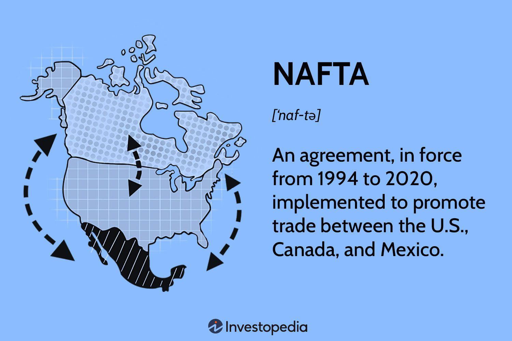

The world of financial markets is vast and complex, with numerous instruments and agreements in place to facilitate trading and investment. Among these are investment agreements, market standoff agreements, and the increasingly popular algorithmic trading, popularly known as algo trading. These elements are crucial in shaping the dynamics of modern finance, influencing how capital flows and risks are managed.

Investment agreements serve as critical legal documents that establish the terms and conditions of a financial transaction between parties. They can include a range of asset classes—such as stocks, bonds, and commodities—and are essential tools for managing risk and expectation. On the other hand, market standoff agreements, also known as lock-up agreements, play a pivotal role in stabilizing stock prices during and after Initial Public Offerings (IPOs) by temporarily restricting insiders from selling their shares. This reduces the risk of stock price volatility due to a sudden influx of available shares.

Algo trading represents a significant advancement in trading strategies, utilizing computer algorithms to execute trades at speeds and frequencies that are impossible for a human trader. This technological evolution has not only increased the efficiency and liquidity of financial markets but has also introduced new challenges associated with market dynamics and regulation.

This article explores these key components, providing a comprehensive overview of their significance and roles in the contemporary financial landscape. Whether you are a seasoned investor or a newcomer to the market, grasping these concepts can significantly enhance your ability to navigate the complex and ever-evolving financial environment effectively.

## Table of Contents

## Overview of Financial Markets Investment Agreements

Investment agreements are formal contracts that articulate the precise terms and conditions under which an investment transaction will take place between two or more parties. These agreements are fundamental in establishing a clear and mutual understanding among the involved entities, thereby mitigating potential risks and aligning expectations.

These contracts typically encompass a broad range of asset classes, which might include stocks, bonds, real estate, and commodities. They set the groundwork for managing the investment by establishing definitive guidelines for profit distribution, investment duration, and strategies related to the exit of the investment. Through these parameters, investment agreements contribute significantly to risk management, by clearly outlining the rights and responsibilities of each party.

A typical investment agreement will include several key components:

1. **Parties Involved**: This identifies the parties entering into the agreement—investors, investees, and any intermediaries. Clearly defining the roles and responsibilities of each party reduces misunderstandings and potential disputes.

2. **Investment Amount and Terms**: This section specifies the amount being invested, the method of investment, and any related terms. It might include details about how additional funds can be provided or called by the investee and the schedule for such payments.

3. **Profit Sharing and Returns**: The agreement outlines how profits will be distributed among the parties. This could include fixed interest payments, dividends, or a share of the business profits. 

4. **Duration**: It specifies the investment duration, stating whether it’s fixed-term or open-ended. Some agreements may allow for early termination under certain conditions.

5. **Exit Strategy**: The agreement delineates possible exit strategies, which might include initial public offerings, buyouts, or selling shares in the secondary market. Clearly articulated exit strategies provide security and predictability to investors.

6. **Dispute Resolution**: This clause details the manner in which disputes will be handled, typically involving arbitration or mediation before litigation is considered.

7. **Risk Management**: Terms about risk management might include agreements on insurance, guarantees, or other mechanisms to protect investors’ interests.

Understanding the intricacies of investment agreements is essential for investors to make informed decisions. The level of detail in these agreements varies depending on the complexity of the investment and the parties' preferences. Nonetheless, at their core, these contracts serve to protect the interests of all parties involved by providing a structured framework for the investment. As financial markets continue to evolve, the importance of well-structured investment agreements remains critical, ensuring that both risks and rewards are fairly managed and distributed. 

For investors, this means a thorough analysis of an investment agreement is crucial not just for compliance but also for strategic planning and risk assessment. A well-drafted investment agreement can substantially reduce uncertainties in investment, making it a vital instrument in financial planning and market participation.

## Understanding Market Standoff Agreements

Market standoff agreements, or lock-up agreements, are vital mechanisms in the financial sector designed to maintain market stability following an Initial Public Offering (IPO). Primarily, these agreements restrict company insiders, such as executives and early investors, from selling their shares for a specified period post-IPO. By controlling the sudden influx of shares into the market, these agreements help prevent a potential precipitous decline in stock prices, which can otherwise result from an oversupply of shares.

A typical lock-up period ranges around 180 days; however, this duration can be adjusted based on negotiations between the underwriter, the company, and key stakeholders. During this time, insiders agree not to sell their shares, providing the market with an opportunity to absorb the initial offering without the additional pressure of a large sell-off from insiders. This temporary restriction serves to stabilize the trading environment, offering reassurance to new investors and promoting confidence in the stock's long-term prospects.

The functioning of market standoff agreements is straightforward yet impactful. They are typically embedded within the underwriting agreement of an IPO. The underwriter, responsible for managing the IPO process, outlines the terms of the lock-up period that are aligned with the company's objectives and market conditions. Insiders are asked to sign these agreements as a commitment to not disrupt the market by flooding it with shares immediately after the company goes public.

The impact of these agreements on IPOs cannot be overstated. By mitigating the risk of volatile stock price fluctuations due to insider share sales, lock-up agreements help preserve the perceived value of a new public company. They are crucial in promoting orderly trading and can influence the pricing of shares during the IPO phase. Investors are typically more willing to buy shares when they know that insiders have a vested interest in supporting the stock's price stability.

Market standoff agreements also play a critical role in market stability. By ensuring that insiders are unable to sell en masse, these agreements contribute to the market's ability to function smoothly without disruptive price swings. This stability is essential for maintaining investor confidence and trust, supporting the company's reputation, and potentially leading to positive long-term performance.

In summary, market standoff agreements serve as a protective measure in the IPO process, safeguarding against excessive [volatility](/wiki/volatility-trading-strategies) and fostering a stable environment for both new and existing investors. As a result, they are a fundamental component of strategic planning during the public offering stage.

## The Rise of Algo Trading in Financial Markets

Algo trading, or [algorithmic trading](/wiki/algorithmic-trading), represents a significant evolution in the financial markets by integrating advanced computational techniques to execute trades. The fundamental principle of algo trading is utilizing computer algorithms to automatically execute trade orders at optimal conditions based on predefined criteria such as timing, price, or [volume](/wiki/volume-trading-strategy). Key benefits of this approach include precision, speed, and the ability to handle complex trade strategies that would be infeasible for human traders to execute manually.

### Advantages of Algo Trading

1. **Speed and Precision**: Computers can process vast amounts of data and make decisions in milliseconds. This speed enables traders to capitalize on short-lived market inefficiencies and price movements that would otherwise be missed by slower, human-mediated processes. For example, algorithmic trading systems can implement arbitrage strategies by rapidly comparing price differences across multiple markets.

2. **Complex Strategy Execution**: Algorithms can execute complex strategies like statistical arbitrage, market making, and pairs trading, which require intensive calculations and precise timing. Such strategies are often designed using statistical methods or artificial intelligence techniques to identify trading opportunities.

3. **Reduced Market Impact**: By executing trades in small fractions rather than in large blocks, algorithms can minimize the market impact, thereby reducing transaction costs and improving net returns. This aspect is particularly beneficial in markets with lower liquidity where large trades can significantly affect prices.

4. **Increased Market Liquidity**: The presence of algorithmic traders contributes to higher liquidity in financial markets, as they often act as counterparties to investor trades. This increased liquidity typically results in tighter bid-ask spreads, which benefits all market participants.

### Challenges of Algo Trading

1. **Technical Risks**: The dependence on technology introduces risks such as software bugs, network disruptions, and hardware failures. A minor error in code can lead to significant financial losses, as evidenced by past high-profile incidents in financial history.

2. **Regulatory Challenges**: The rapid execution of trades by algorithms often raises concerns over market fairness and stability. Regulatory bodies have implemented measures, such as circuit breakers, to mitigate the potential for market disruptions caused by algorithmic trading activities.

3. **Algorithmic Competition**: The competitive nature of algo trading entails constant innovation. Firms invest heavily in developing sophisticated algorithms to maintain a competitive edge. As more firms adopt algorithmic strategies, exploiting market inefficiencies becomes increasingly challenging.

### Integration with Traditional Trading Strategies

Algorithmic trading does not exist in isolation but rather complements traditional trading strategies. By employing a blend of manual and automated strategies, traders can leverage the strengths of both approaches. For instance, human intuition and qualitative analysis might dictate the overall strategy, while algorithms handle the execution to ensure precision and speed.

### Role in Market Liquidity and Efficiency

Algorithmic trading plays a critical role in enhancing market efficiency and [liquidity](/wiki/liquidity-risk-premium). The continuous flow of orders from algorithms ensures that prices reflect all available information quickly, contributing to the informational efficiency of markets. Furthermore, algorithmic market makers provide liquidity by continuously adjusting their prices to match buyers and sellers, especially in electronic markets where traditional market makers might be less prevalent.

In summary, algo trading has revolutionized financial markets by enabling high-speed and complex trading decisions, improving market liquidity, and enhancing efficiency. As technology advances, the role of algorithmic trading is expected to grow even further, presenting new opportunities and challenges for market participants.

## The Interplay Between Investment Agreements and Market Standoff Agreements

Investment agreements and market standoff agreements are key components of Initial Public Offerings (IPOs) and public offerings. Their interplay is crucial for maintaining market stability and ensuring equitable investor relations. 

Investment agreements effectively govern the terms set between investors and issuers. They specify the nature of investments, potential returns, timelines, and [exit](/wiki/exit-strategy) strategies. Meanwhile, market standoff agreements, or lock-up agreements, are designed to prevent significant insider selling immediately after an IPO. This creates a stable market environment by avoiding a sudden influx of shares, which could negatively impact stock prices.

Together, these agreements facilitate strategic investment planning. The coordination between investment agreements and market standoff agreements helps maintain balance. For example, while an investment agreement may outline the investment period, a standoff agreement synchronizes the release of shares to the market to protect both investor interests and stock price stability. This relationship ensures that investors cannot liquidate positions abruptly, maintaining confidence among public investors and underwriters.

For underwriters, these agreements are integral to risk management. Underwriters seek to ensure that newly issued shares maintain their value post-IPO, which is supported by a structured lock-up period. Simultaneously, investment agreements provide predictability of returns and structured entry or exit points, thereby reducing the risk of speculative losses.

In addition to protecting market dynamics, this interplay aids transparent communications about company value and shareholder equity during the volatile post-IPO phase. Investment agreements define clear terms for shareholder returns, while market standoff agreements prevent potential overvaluation or undervaluation stemming from sudden market activities by insiders. 

By understanding these intersecting agreements, companies can effectively leverage them to ensure a successful public offering that benefits all parties involved. Investors gain protection and predictability, while companies can showcase stabilized price points and manage public perceptions positively, fostering overall market confidence.

## Challenges and Future Trends

Financial instruments and strategies such as investment agreements, market standoff agreements, and algorithmic trading play significant roles in the dynamics of financial markets. However, each of these elements comes with its own set of challenges and is subject to future trends that are influenced by regulatory changes, market volatility, and rapid technological advancements. Understanding these dynamics is essential for investors seeking to navigate financial markets effectively.

**Regulatory Changes**

Regulation is a critical [factor](/wiki/factor-investing) affecting financial markets globally. Investment agreements and market standoff agreements are often subject to complex legal frameworks aimed at protecting both investors and the market. Regulatory bodies continually adapt these frameworks to address emerging risks and challenges. This includes potential changes in tax laws, compliance requirements, and disclosure norms that can impact the structuring and execution of investment agreements.

Algorithmic trading, in particular, has invited significant regulatory scrutiny due to concerns about market manipulation and the risk of flash crashes. For instance, regulators might impose stricter controls on high-frequency trading ([HFT](/wiki/high-frequency-trading-strategies)) firms to mitigate these risks. This could include mandatory reporting of algorithmic strategies, minimum resting times for orders, or constraints on the volume of trades HFTs can execute. As regulations evolve, traders and investors must stay abreast of new compliance standards to mitigate legal risks.

**Market Volatility**

Investment agreements and market standoff agreements are inherently linked to market conditions. Volatility can significantly affect the performance and valuation of underlying assets in investment agreements. For instance, investors may demand more stringent terms or higher returns during volatile periods to compensate for increased risk.

In the context of market standoff agreements during an Initial Public Offering (IPO), heightened volatility can dissuade investors from participating if they anticipate a significant drop in stock prices post-IPO. Companies might need to adjust the duration or terms of lock-up agreements to maintain investor confidence.

Algo trading, known for exploiting market volatility, faces its own challenges. While it can increase market efficiency by providing liquidity, it can also exacerbate volatility in extreme conditions. Algo traders must design resilient algorithms that can adapt to changing market conditions without contributing to instability.

**Technological Advancements**

The pace of technological advancement presents both opportunities and challenges for financial markets. In investment agreements, technology enables more efficient due diligence processes, using data analytics and [artificial intelligence](/wiki/ai-artificial-intelligence) to assess potential investments' risks and returns.

For algorithmic trading, technology is the backbone. As computing power increases and [machine learning](/wiki/machine-learning) algorithms become more sophisticated, algo traders can execute highly complex strategies at unprecedented speeds. However, this also leads to heightened competition and the need for constant innovation to maintain a competitive edge.

Moreover, advancements in blockchain technology and smart contracts are shaping the future of investment agreements. These technologies offer the potential for more transparent and secure contract execution, significantly reducing the possibility of disputes.

**Future Trends**

The future of these financial instruments will likely see further integration of technology and data-driven strategies. Investment agreements may increasingly incorporate performance-based measures facilitated by real-time data. Market standoff agreements could evolve to include more customized terms reflecting the unique risk profiles of different investors.

In algo trading, quantum computing presents a tantalizing future prospect, promising to exponentially increase processing speeds and tackle complex optimization problems. This could revolutionize trading strategies, although its practical use remains in nascent stages.

To conclude, while investment agreements, market standoff agreements, and algo trading are facing challenges, they also stand on the brink of transformative advancements. Staying informed about regulatory developments, market trends, and technological innovations will be critical for investors and financial professionals looking to leverage these elements for successful market participation.

## Conclusion

In summary, financial markets investment agreements, market standoff agreements, and algo trading are integral components of contemporary finance. By acquiring a solid understanding of these concepts, investors are better equipped to enhance their decision-making and risk management capabilities. Investment agreements facilitate the establishment of clear terms and expectations between parties, thereby reducing potential conflicts and aligning interests. Market standoff agreements play a crucial role in maintaining stock price stability by preventing the immediate sale of insider shares post-IPO. Algo trading, through automation and speed, has redefined trading dynamics, offering unmatched efficiency and liquidity improvements.

As financial markets undergo continuous transformation, driven by technological advancements and evolving regulatory landscapes, staying informed about these elements is more crucial than ever for successful investing. Understanding and leveraging these financial tools enable investors to navigate market complexities and seize opportunities while mitigating risks. This article has laid a foundational understanding, opening pathways for deeper exploration and insight into these pivotal areas of modern finance.

## References & Further Reading

[1]: Drucker, P. F. (1999). ["The Discipline of Innovation"](https://pubmed.ncbi.nlm.nih.gov/10187245/) Harvard Business Review, August 2002 Issue.

[2]: Ritter, J. R. (1991). ["The Long-Run Performance of Initial Public Offerings."](https://onlinelibrary.wiley.com/doi/full/10.1111/j.1540-6261.1991.tb03743.x) The Journal of Finance, 46(1), 3-27.

[3]: Aldridge, I. (2013). ["High-Frequency Trading: A Practical Guide to Algorithmic Strategies and Trading Systems"](https://onlinelibrary.wiley.com/doi/pdf/10.1002/9781119203803.fmatter). Wiley.

[4]: Sanderson, E., & MacIntyre, M. (2011). ["Maximizing Liquidity in Financial Markets."](https://www.damtp.cam.ac.uk/user/mem/papers/LHCE/) PwC Financial Services.

[5]: Malkiel, B. G. (2019). ["A Random Walk Down Wall Street: The Time-Tested Strategy for Successful Investing"](https://yourknowledgedigest.org/wp-content/uploads/2020/04/a-random-walk-down-wall-street.pdf). W. W. Norton & Company.