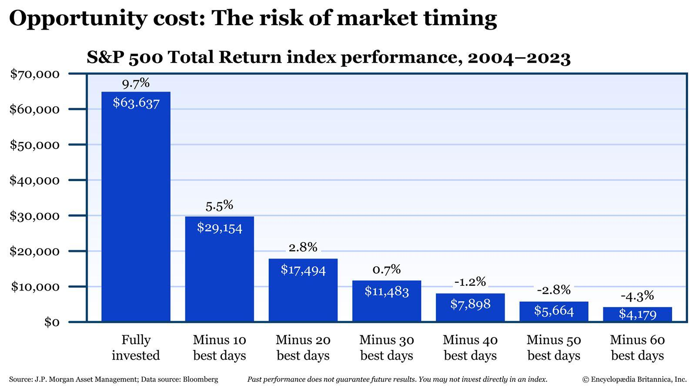

## Table of Contents

## What is market timing?

Market timing is when investors try to guess the best times to buy and sell stocks or other investments. They look at things like economic reports, stock prices, and news to decide when to make their moves. The goal is to buy low and sell high, making more money than if they just held onto their investments.

However, market timing is very hard to do well. It's like trying to predict the weather perfectly every day. Even experts often get it wrong because the market can be unpredictable. Many people end up losing money because they miss out on good times or sell at the wrong time. That's why some experts suggest just keeping your investments for a long time instead of trying to time the market.

## Why do investors attempt market timing?

Investors attempt market timing because they want to make more money. They think that by buying investments when prices are low and selling them when prices are high, they can beat the market and earn bigger returns. It's like trying to catch a wave at the perfect moment to surf; if they time it right, they can ride the wave to success.

However, the reason they try this is also because they believe they can predict the market's ups and downs better than others. They might look at economic indicators, news events, or past stock performance to make their guesses. It's a bit like trying to win a game by outsmarting everyone else. But it's risky, and many investors end up losing money because the market can be very unpredictable.

## What are the basic principles of market timing?

Market timing is about trying to guess when to buy and sell investments to make the most money. People who do this look at things like the economy, stock prices, and news to decide the best times to act. They want to buy when prices are low and sell when prices are high. It's like trying to catch a ball at the perfect moment; if you time it right, you can do well.

But market timing is hard because the market can change quickly and unexpectedly. Even experts can get it wrong. If you buy at the wrong time or sell too early, you might lose money. That's why some people say it's better to just keep your investments for a long time instead of trying to guess the market's moves. It's like choosing to walk steadily instead of trying to run and jump at the right time.

## How can market timing impact investment returns?

Market timing can have a big effect on how much money you make from your investments. If you get it right and buy when prices are low and sell when they're high, you could make a lot more money than if you just held onto your investments. It's like catching a ball at the perfect time to score a point. But if you get it wrong, you could lose money. If you buy when prices are high and they go down, or if you sell too early and miss out on gains, you might end up with less money than if you had just kept your investments.

The problem is, market timing is really hard to do well. The market can be unpredictable, and even experts often guess wrong. If you try to time the market and get it wrong, you could miss out on good times when the market goes up. It's like trying to jump on a moving train; if you miss the jump, you might not get another chance for a while. That's why some people think it's better to just keep your investments for a long time, instead of trying to guess the best times to buy and sell.

## What are the common tools used for market timing?

People who try to time the market use different tools to help them guess when to buy and sell. They often look at stock charts and use something called technical analysis. This means they study past prices and patterns to try to predict what will happen next. They might also use indicators like moving averages or the Relative Strength Index (RSI) to help them decide when to make their moves. These tools help them see trends and possible turning points in the market.

Another tool they use is [fundamental analysis](/wiki/fundamental-analysis). This is when they look at a company's financial health, like its earnings, debts, and how much money it's making. They might also pay attention to economic reports, like unemployment rates or inflation numbers, to get a sense of how the economy is doing. By combining all this information, they try to figure out if the market is going to go up or down.

Some people also use sentiment analysis, which means they look at what other people are thinking and feeling about the market. They might read news articles, social media posts, or surveys to see if people are feeling positive or negative about investing. All these tools together help them try to time the market, but it's still really hard to get it right because the market can change quickly and unexpectedly.

## Can market timing be consistently successful?

Market timing can be tough to do well all the time. It's like trying to guess when it will rain perfectly every day. Even people who know a lot about the market can get it wrong because the market can change fast and in ways no one expects. If you try to time the market and guess wrong, you might miss out on good times when the market goes up or sell your investments too early and lose money. That's why many people who study the market say it's hard to be successful at market timing over a long time.

Some people do get lucky with market timing sometimes, but it's hard to keep doing it well. It's a bit like winning a game by chance; you might win once, but it's hard to win every time. Many experts suggest that instead of trying to time the market, it's better to just keep your investments for a long time. This way, you can ride out the ups and downs of the market and still make money in the end. So, while some people might have short-term success with market timing, it's not usually a good plan for making money consistently over many years.

## What are the psychological challenges associated with market timing?

Market timing can be really hard on your mind. When you try to guess when to buy and sell, you might feel a lot of stress and worry. You could be scared of missing the best times to buy or sell, and this fear can make you make bad choices. If the market goes down right after you buy, you might panic and sell too soon, losing money. Or if the market goes up and you didn't buy, you might feel like you missed out and then buy at the wrong time. All these feelings can make it hard to stick to a plan and can lead to mistakes.

Another big challenge is something called FOMO, or the fear of missing out. When you see other people making money from their investments, you might feel like you need to jump in right away, even if it's not a good time. This can make you buy when prices are high, which is risky. Also, when you try to time the market, you might feel like you always need to be watching the news and the market, which can be exhausting. It's like trying to keep up with a fast-moving game all the time, and it can wear you out. That's why many people find it easier to just invest for the long term and not worry about trying to time the market perfectly.

## How do market cycles affect market timing strategies?

Market cycles are like the ups and downs that happen in the stock market over time. They can last for months or even years, and they go through phases like growth, peak, decline, and recovery. When you're trying to time the market, knowing where you are in the market cycle can help you decide when to buy or sell. For example, if you think the market is at the start of a growth phase, you might want to buy investments because you expect prices to go up. But if you think the market is about to decline, you might want to sell to avoid losing money.

However, guessing where the market is in its cycle is really hard. Market cycles don't always follow a clear pattern, and unexpected things can change them quickly. If you try to time your investments based on the market cycle and get it wrong, you could miss out on good times or sell when you shouldn't. That's why many people find it stressful and risky to try to time the market based on cycles. Instead, some people choose to invest for the long term, knowing that they'll go through all the ups and downs of the market cycles but still come out okay in the end.

## What are the potential risks of market timing?

Market timing can be risky because it's hard to guess when to buy and sell investments perfectly. If you get it wrong, you might buy when prices are high and then they go down, or you might sell too early and miss out on gains. This can lead to losing money instead of making it. It's like trying to jump on a moving train; if you miss the jump, you could be left behind.

Another risk is the emotional stress that comes with market timing. When you're always trying to guess the market's next move, you can feel a lot of pressure and worry. You might make quick decisions based on fear or the fear of missing out, which can lead to mistakes. It's like trying to keep up with a fast game; it can be exhausting and make you more likely to mess up.

## How does market timing compare to a buy-and-hold strategy?

Market timing and a buy-and-hold strategy are two different ways to invest. Market timing is when you try to guess the best times to buy and sell investments. You look at things like stock prices, economic news, and trends to decide when to make your moves. The goal is to buy when prices are low and sell when they're high, hoping to make more money than if you just held onto your investments. But it's really hard to do well because the market can be unpredictable, and even experts often get it wrong. If you guess wrong, you could lose money or miss out on good times when the market goes up.

On the other hand, a buy-and-hold strategy means you buy investments and keep them for a long time, no matter what the market does. You don't try to guess when to buy or sell; you just hold onto your investments and let them grow over time. This strategy can be less stressful because you're not always worrying about the market's next move. While you might not make as much money as someone who times the market perfectly, you also don't risk losing money by guessing wrong. Many experts think that over the long term, a buy-and-hold strategy can be a safer and more reliable way to invest.

## What advanced techniques can be used to enhance market timing?

Some people use advanced techniques to try to get better at market timing. One way is to use something called quantitative analysis, which means using math and computers to look at a lot of data and find patterns. They might use things like algorithms and [machine learning](/wiki/machine-learning) to predict what the market will do next. These tools can help them see things that might be hard to notice just by looking at charts or reading news. But even with all this technology, it's still really hard to guess the market right all the time because unexpected things can happen.

Another technique is to use options and futures, which are special kinds of investments that let you bet on where the market is going without actually buying or selling stocks. By using these, you can try to make money if you guess right about the market's next move. Some people also look at things like market sentiment, which means how other people feel about the market. They might read news, social media, or surveys to see if people are feeling good or bad about investing. All these advanced techniques can help with market timing, but they're still risky because the market can change quickly and in ways no one expects.

## How can investors mitigate the risks associated with market timing?

Investors can reduce the risks of market timing by using a few smart strategies. One way is to set clear rules for when to buy and sell, instead of making quick decisions based on feelings. For example, you might decide to buy when a stock goes below a certain price and sell when it goes above another price. This can help you stay calm and stick to your plan, even when the market is going crazy. Another way is to spread out your investments, so you're not putting all your money into one thing. If you have different kinds of investments, like stocks, bonds, and real estate, it can help protect you if one of them goes down.

Another good idea is to not put all your money into the market at once. Instead, you can use a technique called dollar-cost averaging, where you invest a little bit of money regularly over time. This way, you're not trying to guess the perfect time to buy; you're just buying a bit at a time. It can help you avoid buying when prices are really high and missing out on good times when prices are low. By using these strategies, you can try to make market timing a bit less risky, but remember, it's still hard to get it right all the time.

## References & Further Reading

[1]: Bergstra, J., Bardenet, R., Bengio, Y., & Kégl, B. (2011). ["Algorithms for Hyper-Parameter Optimization."](https://dl.acm.org/doi/10.5555/2986459.2986743) Advances in Neural Information Processing Systems 24.

[2]: ["Advances in Financial Machine Learning"](https://www.amazon.com/Advances-Financial-Machine-Learning-Marcos/dp/1119482089) by Marcos Lopez de Prado

[3]: ["Evidence-Based Technical Analysis: Applying the Scientific Method and Statistical Inference to Trading Signals"](https://www.amazon.com/Evidence-Based-Technical-Analysis-Scientific-Statistical/dp/0470008741) by David Aronson

[4]: ["Machine Learning for Algorithmic Trading"](https://github.com/stefan-jansen/machine-learning-for-trading) by Stefan Jansen

[5]: ["Quantitative Trading: How to Build Your Own Algorithmic Trading Business"](https://github.com/LucindaYa/quant-resources/blob/master/Quantitative%20Trading%20How%20to%20Build%20Your%20Own%20Algorithmic%20Trading%20Business.pdf) by Ernest P. Chan