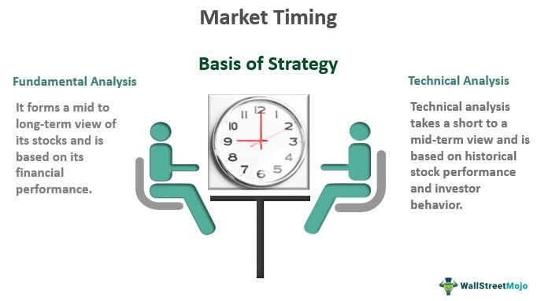

## Table of Contents

## What is market timing and why is it important for investors?

Market timing is when investors try to guess the best times to buy and sell investments. They look at things like stock prices, economic news, and other signs to decide when to make their moves. The goal is to buy low and sell high, making more money than if they just held onto their investments.

It's important for investors because good market timing can help them make more money. If they can buy stocks when prices are low and sell them when prices are high, they can get better returns on their investments. But, market timing is hard to do right. It's risky because no one can predict the market perfectly. So, while it can lead to big gains, it can also lead to big losses if the timing is off.

## How can beginners start to understand market cycles?

Understanding market cycles can seem tough at first, but it's all about seeing the patterns in how the economy and stock market move over time. A market cycle is like a big wave that goes up and down. When the economy is doing well, we're in the expansion part of the cycle. This is when businesses grow, people have jobs, and stock prices usually go up. But then, things can slow down and we enter a contraction phase. This is when the economy might shrink, businesses struggle, and stock prices can fall. By watching these ups and downs, beginners can start to see how the market moves in cycles.

To get better at understanding these cycles, beginners can start by looking at history. There are lots of [books](/wiki/algo-trading-books) and websites that show past market cycles and explain what caused them. It's also helpful to keep an eye on the news and economic reports, like unemployment rates or how much stuff people are buying. These can give clues about where we are in the cycle. Over time, by paying attention and learning from the past, beginners can get a good feel for how market cycles work and use this knowledge to make smarter investment choices.

## What are the basic indicators used for market timing?

Basic indicators for market timing help investors guess when to buy or sell. One common indicator is the moving average, which smooths out price changes over time. For example, a 50-day moving average shows the average price of a stock over the last 50 days. If the stock price goes above this average, it might be a good time to buy. If it falls below, it might be time to sell. Another indicator is the Relative Strength Index (RSI), which measures how fast prices are changing. If the RSI is over 70, it might mean the stock is overbought and due for a price drop. If it's under 30, the stock might be oversold and ready for a price increase.

Another useful indicator is the [volume](/wiki/volume-trading-strategy) of trades. High trading volume can mean more people are interested in the stock, which can push prices up or down. If a stock's price goes up with high volume, it's a strong sign that the price increase might continue. On the other hand, if the price goes up but the volume is low, the price might not keep going up. Economic indicators like unemployment rates and consumer spending also help with market timing. If these numbers are good, it might be a good time to invest because the economy is strong. If they're bad, it might be better to wait. By watching these indicators, investors can make better guesses about when to buy and sell.

## Can you explain the difference between technical and fundamental analysis in market timing?

Technical analysis and [fundamental analysis](/wiki/fundamental-analysis) are two different ways to figure out when to buy or sell investments. Technical analysis looks at past price movements and trading volumes to predict future price changes. It uses charts and indicators like moving averages and the Relative Strength Index (RSI). People who use technical analysis believe that all the information they need is already shown in the price and volume of a stock. They try to find patterns that can help them guess where the price might go next.

On the other hand, fundamental analysis looks at the actual health and performance of a company or the economy. It involves studying things like a company's earnings, its debt, how much it's growing, and even bigger economic factors like interest rates or unemployment. People who use fundamental analysis want to know if a stock is a good buy based on its real value, not just its price. They might decide to buy a stock if they think the company is doing well and its stock is priced lower than it should be.

Both methods can help with market timing, but they focus on different things. Technical analysis is more about the short-term movements of stock prices, while fundamental analysis is about the long-term value of a company. Some investors use both methods together to make better decisions about when to buy and sell.

## What are some common market timing strategies for short-term investors?

Short-term investors often use a strategy called [day trading](/wiki/day-trading-spy). This means they buy and sell stocks within the same day, trying to make quick profits from small price changes. They use technical analysis to look at charts and find patterns that can help them guess where prices might go next. They might use indicators like moving averages or the Relative Strength Index (RSI) to decide when to buy or sell. Day traders need to be quick and pay close attention to the market all day long.

Another common strategy is swing trading. Swing traders hold onto their stocks for a few days or weeks, trying to catch bigger price swings than day traders. They also use technical analysis, but they might look at longer time frames like weekly charts. They try to find stocks that are about to move up or down and then buy or sell at the right time. Swing traders don't need to watch the market as closely as day traders, but they still need to keep an eye on their investments and be ready to act when the time is right. Both day trading and swing trading can be risky, but they can also lead to quick profits if done well.

## How does long-term market timing differ from short-term strategies?

Long-term market timing is different from short-term strategies because it focuses on bigger trends that happen over months or years, not days or weeks. Long-term investors look at the overall health of the economy and the performance of companies over time. They use fundamental analysis to understand if a company is a good investment based on its earnings, growth, and other big factors. Long-term investors might buy stocks when they think the market is in a good spot for a long time, and they usually hold onto their investments for years, hoping to see them grow slowly but steadily.

Short-term strategies, like day trading and swing trading, are all about quick moves and fast profits. These investors use technical analysis to watch price changes and patterns in the market. They try to buy low and sell high within a short time, sometimes even within the same day. Short-term investors need to be very active, watching the market closely and making decisions quickly. This can be exciting but also risky, as the market can be unpredictable in the short term.

## What role do economic indicators play in market timing?

Economic indicators help investors guess when to buy or sell by showing how the economy is doing. Things like unemployment rates, consumer spending, and inflation rates tell investors if the economy is growing or shrinking. If the unemployment rate is low and people are spending more money, it might be a good time to invest because the economy is strong. But if unemployment is high and people are spending less, the economy might be in trouble, and it could be better to wait before investing.

These indicators are important for both short-term and long-term market timing. Short-term investors might use them to make quick decisions, like buying stocks when a new report shows the economy is doing well. Long-term investors look at these indicators to see the bigger picture and decide if it's a good time to invest for the long haul. By keeping an eye on economic indicators, investors can make smarter choices about when to jump into the market or when to hold back.

## How can investors use moving averages to time the market?

Investors use moving averages to help them decide when to buy or sell stocks. A moving average is a line on a chart that shows the average price of a stock over a certain time, like 50 days or 200 days. If the price of the stock goes above the moving average, it might be a good time to buy because it could mean the stock's price is starting to go up. If the price falls below the moving average, it might be a good time to sell because the price could be starting to go down.

There are different ways to use moving averages for market timing. One way is to use two moving averages, like a 50-day and a 200-day moving average. When the shorter moving average (50-day) crosses above the longer one (200-day), it's called a "golden cross," and it might be a good time to buy. When the shorter moving average crosses below the longer one, it's called a "death cross," and it might be a good time to sell. By watching these moving averages, investors can try to time the market and make better decisions about when to buy and sell.

## What are the risks associated with market timing and how can they be mitigated?

Market timing can be risky because it's hard to predict the market perfectly. If you buy or sell at the wrong time, you might lose money instead of making it. For example, if you sell a stock thinking the price will go down, but it goes up instead, you miss out on those gains. Also, trying to time the market can lead to more trading, which means more fees and taxes. This can eat into your profits. Lastly, focusing too much on timing can make you miss out on good investments that grow over time, because you're always trying to jump in and out of the market.

To reduce these risks, it's important to have a clear plan and stick to it. Don't make quick decisions based on every little market move. Instead, use a mix of technical and fundamental analysis to make informed choices. It's also a good idea to diversify your investments, so you're not putting all your money into one stock or one type of investment. This way, if you get the timing wrong with one investment, others might still do well. Finally, consider using stop-loss orders to limit your losses. These orders automatically sell your stock if it drops to a certain price, helping you avoid big losses if the market moves against you.

## Can you discuss advanced tools like algorithmic trading for market timing?

Algorithmic trading is a fancy way of using computers to buy and sell stocks. Instead of people making all the decisions, a computer program follows a set of rules to decide when to trade. These rules can be based on things like moving averages, economic indicators, or even news events. The computer can look at a lot of data very quickly and make trades faster than a person could. This can help with market timing because the computer can spot patterns and act on them right away, trying to buy low and sell high.

But, [algorithmic trading](/wiki/algorithmic-trading) can be tricky. It's not perfect, and the market can still surprise the computer. Sometimes, the rules the computer follows might not work as well as expected, and you could lose money. Also, setting up these programs can be hard and might need help from experts. Even though it can help with market timing, it's important to keep an eye on what the computer is doing and be ready to step in if things aren't going right.

## How do expert investors incorporate global events into their market timing strategies?

Expert investors pay close attention to global events because these can have a big impact on the market. They watch things like elections, wars, natural disasters, and economic news from around the world. If there's good news, like a country's economy growing fast, they might see it as a chance to buy stocks because the market might go up. But if there's bad news, like a war starting, they might sell their stocks to avoid losing money when the market goes down. By keeping an eye on global events, expert investors try to guess what might happen next and time their buying and selling to make the most money.

To use global events for market timing, expert investors often use a mix of news and data. They might look at economic reports from different countries to see how the world economy is doing. They also keep up with the news to know about any big events that could shake things up. Sometimes, they use computer programs to help them analyze all this information quickly. This way, they can make fast decisions about when to buy or sell based on what's happening around the world. It's not easy, but by being smart about global events, expert investors try to stay one step ahead of the market.

## What are the latest trends and technologies impacting market timing strategies?

The latest trends and technologies in market timing are making it easier for investors to guess when to buy and sell. One big trend is the use of [artificial intelligence](/wiki/ai-artificial-intelligence) (AI) and [machine learning](/wiki/machine-learning). These technologies can look at a lot of data very quickly and find patterns that people might miss. They can help predict what the market might do next based on past information and current events. Another trend is the growth of robo-advisors, which are computer programs that use algorithms to manage investments. They can automatically adjust your investments based on market conditions, trying to buy low and sell high without you having to do anything.

Another technology that's changing market timing is high-frequency trading ([HFT](/wiki/high-frequency-trading-strategies)). This is when computers trade stocks very quickly, sometimes in just a few seconds. HFT can help investors take advantage of tiny changes in stock prices. Also, blockchain and cryptocurrencies are becoming more important. They can affect the market in big ways, and investors are using new tools to track these changes and time their trades. Overall, these technologies are making market timing more complex but also more powerful, helping investors make better guesses about when to buy and sell.

## References & Further Reading

[1]: Bergstra, J., Bardenet, R., Bengio, Y., & Kégl, B. (2011). ["Algorithms for Hyper-Parameter Optimization."](https://dl.acm.org/doi/10.5555/2986459.2986743) Advances in Neural Information Processing Systems 24.

[2]: ["Advances in Financial Machine Learning"](https://www.amazon.com/Advances-Financial-Machine-Learning-Marcos/dp/1119482089) by Marcos Lopez de Prado

[3]: ["Evidence-Based Technical Analysis: Applying the Scientific Method and Statistical Inference to Trading Signals"](https://www.amazon.com/Evidence-Based-Technical-Analysis-Scientific-Statistical/dp/0470008741) by David Aronson

[4]: ["Machine Learning for Algorithmic Trading"](https://github.com/stefan-jansen/machine-learning-for-trading) by Stefan Jansen

[5]: ["Quantitative Trading: How to Build Your Own Algorithmic Trading Business"](https://www.amazon.com/Quantitative-Trading-Build-Algorithmic-Business/dp/1119800064) by Ernest P. Chan