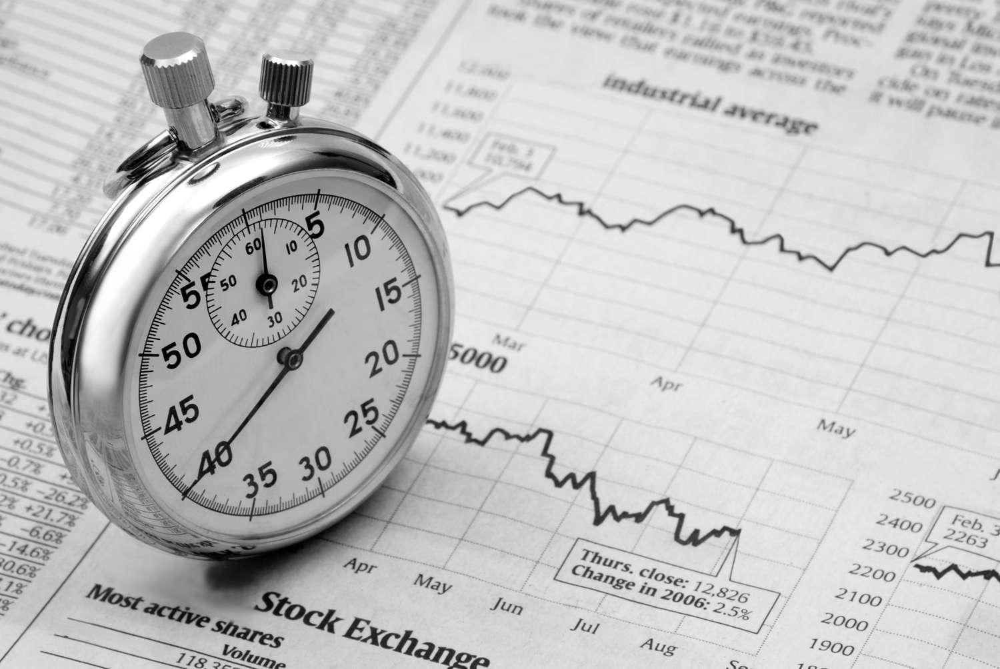

## Table of Contents

## What is market timing?

Market timing is when investors try to guess the best times to buy and sell stocks or other investments. They look at things like economic reports, stock prices, and world events to decide when to make their moves. The goal is to buy low and sell high, making more money than if they just held onto their investments.

But market timing is really hard to do well. It's tough to predict what the market will do next, and even experts often get it wrong. If you guess wrong, you might buy when prices are high or sell when they're low, which can lead to losing money. Many people think it's better to invest for the long term instead of trying to time the market.

## Why do investors attempt market timing?

Investors try market timing because they want to make more money. They think that if they can buy stocks when prices are low and sell them when prices are high, they can earn bigger profits than just holding onto their investments. It's like trying to catch the best waves at the beach – if you time it right, you can have a great ride.

However, market timing is very hard to do well. The stock market can be unpredictable, and even experts often guess wrong. If an investor gets the timing wrong, they might end up buying high and selling low, which can lead to losing money. That's why many people believe it's safer and often more rewarding to invest for the long term, rather than trying to time the market.

## What are the basic principles of market timing?

Market timing is all about trying to guess when to buy and sell stocks to make the most money. People who do market timing look at things like the economy, stock prices, and big news events to decide when to make their moves. They want to buy stocks when prices are low and sell them when prices are high. The idea is to get in and out of the market at just the right times to make more money than if they just held onto their investments.

But market timing is really hard to do well. It's like trying to predict the weather – it can change quickly and unexpectedly. Even experts often get it wrong, and if you guess wrong, you might buy when prices are high or sell when they're low. This can lead to losing money instead of making it. That's why a lot of people think it's better to invest for the long term, instead of trying to time the market.

## How can market timing be used in different types of markets?

Market timing can be used in different types of markets like stocks, bonds, and even real estate. In the stock market, people who try market timing watch things like company news, economic reports, and stock prices to decide when to buy or sell. They might buy stocks when they think prices are going to go up and sell them when they think prices are going to go down. In the bond market, market timing could mean buying bonds when interest rates are high and selling them when rates are low, because bond prices and interest rates usually move in opposite directions.

In real estate, market timing might involve buying property when the market is down and prices are low, then selling when the market is up and prices are high. This can be trickier because real estate markets can be very local, and what works in one city might not work in another. No matter the type of market, the big challenge with market timing is that it's hard to predict the future. If you guess wrong, you could end up losing money instead of making it.

## What are the common indicators used for market timing?

People who try to time the market use different signs to help them decide when to buy or sell. Some common signs they look at are stock prices, economic reports, and big news events. They might watch the stock market's overall trend to see if it's going up or down. Economic reports like unemployment numbers or how fast the economy is growing can also give clues about what might happen next in the market. Big news events, like elections or natural disasters, can shake things up and make people want to buy or sell quickly.

Another thing market timers look at is something called technical indicators. These are special charts and numbers that try to predict where stock prices are heading. For example, moving averages show the average price of a stock over a certain time, and if the current price is above or below this average, it might mean the stock is going up or down. Another popular indicator is the Relative Strength Index (RSI), which measures if a stock is being bought or sold a lot. If it's being bought a lot, it might be overbought and due for a price drop, and if it's being sold a lot, it might be oversold and due for a price increase. Even with all these signs, it's still really hard to time the market right because things can change fast and unexpectedly.

## What are the risks associated with market timing?

Market timing can be risky. One big risk is that it's really hard to guess when the market will go up or down. Even experts often get it wrong. If you buy stocks when you think prices will go up, but they go down instead, you could lose a lot of money. The same thing can happen if you sell stocks thinking prices will drop, but they go up instead. It's like trying to catch a ball in the dark – you might miss it and get hurt.

Another risk is that market timing can make you miss out on good times in the market. If you're always trying to guess the right time to buy and sell, you might end up sitting on the sidelines when the market is doing well. Studies show that missing just a few of the best days in the market can make a big difference in your returns. So, even if you get some of your timing right, you could still end up with less money than if you had just stayed invested.

Lastly, market timing can lead to a lot of stress and bad decisions. When you're always watching the market and trying to guess what will happen next, it can make you feel anxious. This can lead to making quick choices without thinking them through, which often results in mistakes. Many people find that a long-term investment strategy is less stressful and more likely to help them reach their financial goals.

## How does market timing differ from a buy-and-hold strategy?

Market timing and a buy-and-hold strategy are two different ways to invest in the stock market. Market timing is when investors try to guess the best times to buy and sell stocks. They watch things like stock prices, economic reports, and big news events to decide when to make their moves. The goal is to buy stocks when prices are low and sell them when prices are high, making more money than just holding onto their investments. But it's really hard to predict what the market will do next, and even experts often get it wrong. If you guess wrong, you might buy when prices are high or sell when they're low, which can lead to losing money.

A buy-and-hold strategy is simpler and less risky. Instead of trying to time the market, investors just buy stocks and hold onto them for a long time, like years or even decades. They believe that over time, the market will go up, and their investments will grow in value. This strategy doesn't require watching the market all the time or making quick decisions. It's less stressful and can lead to good returns if you pick solid investments and let them grow over time. Many people think it's a safer and more reliable way to invest than trying to time the market.

## What are some popular market timing strategies?

One popular market timing strategy is called the moving average crossover. People who use this strategy watch the average price of a stock over a certain time, like 50 days or 200 days. When the short-term moving average (like 50 days) goes above the long-term moving average (like 200 days), it's a sign to buy the stock because it might be going up. When the short-term average goes below the long-term average, it's a sign to sell because the stock might be going down. This strategy tries to catch trends in the market, but it can still be tricky because the market can change quickly.

Another strategy is called the Relative Strength Index (RSI). This looks at how fast a stock's price is changing to see if it's being bought or sold a lot. If the RSI is over 70, it means the stock might be overbought and due for a price drop, so it's a sign to sell. If the RSI is under 30, it means the stock might be oversold and due for a price increase, so it's a sign to buy. This strategy tries to find good times to buy and sell based on how much people are trading the stock, but it's not always right because the market can be unpredictable.

A third strategy is called the economic cycle approach. People who use this strategy look at the bigger picture of the economy to decide when to buy and sell. They watch things like unemployment rates, interest rates, and how fast the economy is growing. When the economy is doing well and growing, they might buy stocks because they think prices will go up. When the economy is slowing down or in a recession, they might sell stocks because they think prices will go down. This strategy tries to use big economic trends to time the market, but it's still hard because economic cycles can be hard to predict and can change suddenly.

## How can technical analysis assist in market timing?

Technical analysis can help with market timing by looking at charts and numbers to guess where stock prices might go next. People who use technical analysis watch things like moving averages, which show the average price of a stock over time. If the short-term moving average goes above the long-term moving average, it might be a good time to buy because the stock could be starting to go up. If the short-term average goes below the long-term average, it might be a good time to sell because the stock could be starting to go down. They also look at the Relative Strength Index (RSI), which tells them if a stock is being bought or sold a lot. If the RSI is high, it might mean the stock is overbought and due for a price drop, so it's a sign to sell. If the RSI is low, it might mean the stock is oversold and due for a price increase, so it's a sign to buy.

Even though technical analysis can give clues about when to buy and sell, it's not perfect. The stock market can be unpredictable, and even the best technical indicators can be wrong sometimes. If you guess wrong, you might buy when prices are high or sell when they're low, which can lead to losing money. That's why many people think it's better to invest for the long term instead of trying to time the market. But for those who want to try market timing, technical analysis can be a useful tool to help make decisions about when to buy and sell stocks.

## What role does fundamental analysis play in market timing?

Fundamental analysis helps with market timing by looking at a company's financial health and the overall economy to decide when to buy or sell stocks. People who use this method check things like how much money a company is making, its debts, and how fast it's growing. They also look at big economic reports like unemployment rates and interest rates. If a company's numbers look good and the economy is doing well, it might be a good time to buy its stock because the price could go up. On the other hand, if a company's numbers are bad or the economy is slowing down, it might be a good time to sell because the stock price could go down.

Even though [fundamental analysis](/wiki/fundamental-analysis) can give good clues about when to buy and sell, it's not perfect. The stock market can change quickly and unexpectedly, so even the best analysis can be wrong sometimes. If you guess wrong, you might buy when prices are high or sell when they're low, which can lead to losing money. That's why many people think it's better to invest for the long term instead of trying to time the market. But for those who want to try market timing, fundamental analysis can be a useful tool to help make decisions about when to buy and sell stocks.

## How can an investor evaluate the effectiveness of their market timing strategy?

An investor can evaluate the effectiveness of their market timing strategy by looking at their returns over time. They should compare how much money they made using their market timing strategy to how much they would have made if they had just held onto their investments without trying to time the market. If their market timing strategy made more money than a buy-and-hold approach, it might be working well. But if it made less money or even lost money, the strategy might need to be changed or dropped.

Another way to evaluate market timing is by looking at how often the investor got their timing right. If they bought stocks when prices were low and sold when prices were high more often than not, their strategy could be effective. But if they missed a lot of good times in the market or bought high and sold low, their strategy might not be working. It's also important to think about how much stress and time the strategy takes. If it's causing a lot of worry or taking up too much time, it might not be worth it, even if the returns are good.

## What advanced techniques can experts use to improve market timing accuracy?

Experts can use advanced techniques like [algorithmic trading](/wiki/algorithmic-trading) to improve their market timing accuracy. Algorithmic trading involves using computer programs to buy and sell stocks based on a set of rules. These rules can include technical indicators like moving averages and RSI, as well as fundamental data like company earnings and economic reports. The computers can watch the market all the time and make trades much faster than a person could, which can help catch small changes in the market that might be missed otherwise. But even with these fancy tools, it's still hard to get market timing right because the market can be unpredictable.

Another advanced technique is using [machine learning](/wiki/machine-learning) to predict market movements. Machine learning is when computers learn from past data to make better guesses about the future. Experts feed the computers lots of information about past stock prices, economic reports, and other data. The computers then look for patterns and use those patterns to predict what might happen next in the market. This can help experts decide when to buy and sell stocks. But like all market timing methods, machine learning isn't perfect, and it can still make wrong guesses because the market can change quickly and unexpectedly.

## References & Further Reading

[1]: Bergstra, J., Bardenet, R., Bengio, Y., & Kégl, B. (2011). ["Algorithms for Hyper-Parameter Optimization."](https://papers.nips.cc/paper_files/paper/2011/hash/86e8f7ab32cfd12577bc2619bc635690-Abstract.html) Advances in Neural Information Processing Systems 24.

[2]: ["Advances in Financial Machine Learning"](https://www.amazon.com/Advances-Financial-Machine-Learning-Marcos/dp/1119482089) by Marcos Lopez de Prado

[3]: ["Evidence-Based Technical Analysis: Applying the Scientific Method and Statistical Inference to Trading Signals"](https://www.wiley.com/en-gb/Evidence+Based+Technical+Analysis:+Applying+the+Scientific+Method+and+Statistical+Inference+to+Trading+Signals-p-9780470008744) by David Aronson

[4]: ["Machine Learning for Algorithmic Trading"](https://www.amazon.com/Machine-Learning-Algorithmic-Trading-intelligence/dp/9918608013) by Stefan Jansen

[5]: ["Quantitative Trading: How to Build Your Own Algorithmic Trading Business"](https://www.amazon.com/Quantitative-Trading-Build-Algorithmic-Business/dp/0470284889) by Ernest P. Chan