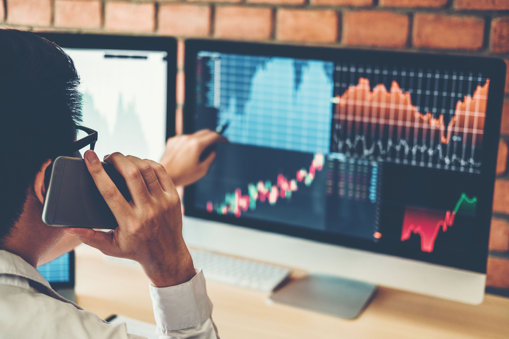

## Table of Contents

## What is market tracking and why is it important for investors?

Market tracking is when people keep an eye on how the stock market and different investments are doing. It's like watching a scoreboard during a game to see which team is winning. Investors look at things like stock prices, how much the market goes up or down, and news that might affect their investments. By doing this, they can see if their investments are doing well or if they need to make changes.

It's important for investors to track the market because it helps them make smart choices about their money. If they see that a certain stock is going down a lot, they might decide to sell it before they lose more money. Or, if they see that a different investment is doing really well, they might want to buy more of it. By keeping track of the market, investors can try to make their money grow and avoid big losses.

## How can busy investors find time to track the market effectively?

Busy investors can find time to track the market by setting aside a specific time each day or week to check on their investments. This could be as simple as spending 15 minutes in the morning or evening to look at stock prices and read a quick news summary. By making it a routine, they can stay updated without it taking up too much time. They can also use tools like mobile apps or email alerts to get important updates sent right to them, so they don't have to constantly check everything themselves.

Another way is to focus on the most important information and ignore the rest. Busy investors don't need to know every little detail about the market. They should look at the big picture, like how their overall portfolio is doing and any major news that could affect their investments. By concentrating on what really matters, they can save time and still make good decisions. Using simple tools like stock market apps that give a quick overview can help them do this efficiently.

## What are the basic tools and resources needed for market tracking?

To track the market, you need some basic tools and resources. One of the most important tools is a stock market app or website. These apps let you see the prices of stocks, how much the market is going up or down, and news about companies you're interested in. Some popular apps are Robinhood, E*TRADE, and Yahoo Finance. You can also use a computer to visit websites like Google Finance or Bloomberg to get the same information.

Another helpful resource is a financial news service. These services, like CNBC or The Wall Street Journal, give you news about the market and companies. They help you understand why stock prices are changing and what might happen next. You can read these news sources online or watch them on TV. Some apps also send you alerts when big news happens, so you don't have to check all the time.

Lastly, you might want to use a portfolio tracker. This is a tool that shows you how all your investments are doing in one place. It can help you see if your overall investments are going up or down. Apps like Personal Capital or Mint can do this for you. By using these tools and resources, you can keep an eye on the market without it taking too much time.

## How can beginners start tracking the market without feeling overwhelmed?

Beginners can start tracking the market by focusing on just a few key things at first. Instead of trying to watch everything, they should pick a few stocks or a stock market index like the S&P 500 to follow. They can use a simple app like Yahoo Finance to check the prices of these stocks and see how the market is doing overall. It's also helpful to set aside a specific time each day, like 10 minutes in the morning, to look at this information. By starting small and being consistent, beginners can get used to tracking the market without feeling overwhelmed.

Another way to make market tracking easier is to use news alerts. Many apps and websites let you sign up for alerts about big news that could affect your investments. This way, you don't have to constantly check for updates; the important news comes to you. Beginners should also remember that they don't need to know everything about the market right away. It's okay to learn slowly and focus on understanding the basics first. By taking it one step at a time, beginners can build their confidence and skills in tracking the market.

## What are the key economic indicators that busy investors should monitor?

Busy investors should keep an eye on a few important economic indicators to understand how the market is doing. One key indicator is the Gross Domestic Product (GDP), which tells us how much all the goods and services in a country are worth. If the GDP is growing, it usually means the economy is doing well, which can be good for the stock market. Another important indicator is the unemployment rate. When fewer people are out of work, it often means the economy is strong, and this can also be good for stocks. Investors should also watch inflation rates because if prices are going up too fast, it can hurt the value of money and affect the stock market.

Another useful indicator to monitor is the Consumer Price Index (CPI), which measures how much prices for things people buy are changing. If the CPI is going up a lot, it means inflation is high, and that can make the stock market nervous. Interest rates set by the central bank, like the Federal Reserve in the U.S., are also important because they affect how much it costs to borrow money. When interest rates go up, borrowing becomes more expensive, which can slow down the economy and affect stock prices. By keeping an eye on these indicators, busy investors can get a good sense of the overall economic health and make better decisions about their investments.

## How can investors use mobile apps to stay updated on market trends?

Investors can use mobile apps to stay updated on market trends by downloading apps like Robinhood, Yahoo Finance, or E*TRADE. These apps let you see stock prices, how the market is doing, and even give you news about companies you care about. You can set up alerts on these apps, so if something big happens, like a stock price going up or down a lot, you get a notification right away. This way, you don't have to check the app all the time; it tells you when something important is happening.

These apps also let you see charts and graphs that show how stocks and the market have been doing over time. This helps you spot trends, like if a stock has been going up or down lately. Some apps even have features where you can read what other investors are saying or join groups to talk about the market. By using these tools, you can keep up with what's happening in the market without spending too much time on it.

## What are some automated tools that can help with market tracking?

Automated tools can make market tracking easier for investors. One popular tool is a robo-advisor, like Betterment or Wealthfront. These tools use computer programs to watch your investments and make changes for you. They look at things like how the market is doing and what you want your money to do, then they buy or sell stocks to keep your investments on track. This way, you don't have to spend a lot of time checking the market yourself.

Another helpful tool is an investment tracking app, like Personal Capital or Mint. These apps connect to your investment accounts and show you how all your money is doing in one place. They can send you alerts if something big happens, like if the market goes up or down a lot. Some of these apps also use computer programs to give you advice on what to do with your money. By using these automated tools, investors can keep an eye on the market without it taking up too much of their time.

## How can investors integrate market tracking into their daily routine?

Investors can easily fit market tracking into their daily routine by setting aside a specific time each day to check on their investments. This could be as simple as spending 10 to 15 minutes in the morning or evening to look at stock prices and read a quick news summary. By making it a habit, like checking the weather or reading the news, they can stay updated without it feeling like a big task. Using a mobile app like Robinhood or Yahoo Finance makes this even easier because they can check their investments on their phone whenever they have a few free minutes.

Another way to integrate market tracking is by using automated tools and alerts. Investors can set up notifications on their apps to get alerts when something important happens, like a big change in the market or news about a company they own stock in. This way, they don't have to constantly check everything themselves; the important updates come to them. By combining a quick daily check with automated alerts, investors can keep an eye on the market without it taking up too much of their time.

## What advanced strategies can experienced investors use for more effective market tracking?

Experienced investors can use advanced strategies like setting up custom algorithms to track the market more effectively. These algorithms can analyze lots of data quickly, looking for patterns and trends that might be hard for a person to see. For example, they might use technical analysis tools to study stock charts and find good times to buy or sell. They can also set up their own alerts based on these algorithms, so they get notified when certain conditions are met, like when a stock's price moves in a specific way. This helps them make faster and smarter decisions without having to watch the market all the time.

Another advanced strategy is using multiple data sources and integrating them into one system. Experienced investors might combine financial news, economic reports, and social media sentiment to get a fuller picture of what's happening in the market. They can use tools like APIs to pull this data together and analyze it all at once. By looking at different kinds of information, they can spot opportunities or risks that others might miss. This way, they can adjust their investments based on a more complete understanding of market trends and events.

## How can investors analyze market data to make informed decisions?

Investors can analyze market data by looking at stock prices, charts, and financial reports. They can use tools like stock market apps or websites to see how stocks are doing over time. By studying these charts, investors can spot patterns, like when a stock goes up or down a lot. They can also look at financial reports from companies to see if they are making money or losing it. This helps investors decide if a stock is a good buy or if they should sell it. Another way to analyze market data is by using economic indicators like GDP, unemployment rates, and inflation. These indicators show how the overall economy is doing, which can affect stock prices. By keeping an eye on these indicators, investors can guess what might happen to the market and make smarter choices about their investments.

Another important part of analyzing market data is understanding news and events that can change stock prices. Investors can read financial news to learn about things like new laws, company announcements, or big world events that might affect the market. For example, if a company says it's going to make more money than expected, its stock price might go up. By staying informed about the news, investors can predict how the market might react and adjust their investments accordingly. Using all this information together, investors can make informed decisions, like when to buy or sell stocks, to help their money grow.

## What are the pitfalls to avoid when tracking the market as a busy investor?

One big pitfall to avoid when tracking the market as a busy investor is trying to watch everything all the time. It's easy to feel like you need to know every little detail, but that can take up too much time and make you feel overwhelmed. Instead, focus on the most important things, like how your overall investments are doing and any big news that could affect them. Use tools like stock market apps and set up alerts for important updates so you don't have to check everything yourself.

Another pitfall is reacting too quickly to small changes in the market. The stock market can go up and down a lot in a short time, and it's easy to get scared and make quick decisions that might not be good for your investments. It's better to look at the big picture and not worry too much about small changes. By sticking to a plan and not making sudden moves, you can avoid making mistakes that could hurt your money.

## How can investors use market tracking to optimize their investment portfolio?

Investors can use market tracking to optimize their investment portfolio by keeping an eye on how their investments are doing and making changes when needed. For example, if they see that one of their stocks is going down a lot, they might decide to sell it before they lose more money. On the other hand, if they notice that a different stock is doing really well, they might want to buy more of it. By regularly checking the market, investors can see which parts of their portfolio are working and which ones aren't, and then adjust their investments to make their money grow better.

Another way market tracking helps is by letting investors know about big news or events that could affect their investments. If they hear about a company they own stock in announcing good news, like making more money than expected, they might decide to hold onto or buy more of that stock. If there's bad news, like a company losing money, they might choose to sell their stock to avoid bigger losses. By staying informed and making smart changes based on what they learn from tracking the market, investors can keep their portfolio in good shape and aim for better returns.

## What are Investor Strategies for Building a Robust Portfolio?

The selection of the right investment strategies hinges largely on an investor’s risk tolerance and financial objectives. Investors can typically choose between active and passive investing approaches, each with distinct characteristics and requirements. Active investing demands ongoing portfolio management and frequent market analysis to capitalize on short-term price movements. This strategy appeals to those willing to engage deeply with market dynamics and adjust their holdings proactively. In contrast, passive investing focuses on long-term growth and generally involves less intervention, often through investing in index funds or ETFs that mirror market indices.

A cornerstone of effective portfolio management is diversification, which involves spreading investments across various asset classes such as stocks, bonds, ETFs, and commodities. This strategy helps in mitigating risk because the poor performance of one asset class may be offset by more robust gains in another. For example, during periods of stock market [volatility](/wiki/volatility-trading-strategies), bonds or commodities might provide a stabilizing effect due to their typically inverse relationship with equities.

To ensure a robust portfolio, investors should engage in periodic reviews of financial statements and maintain open discussions with fund managers. These activities can provide valuable insights into future market movements and potential adjustments needed to align the portfolio with an investor’s financial goals. Analyzing financial statements enables investors to assess the health and performance of their investments, while regular consultations with fund managers can provide professional perspectives on market trends and strategic asset allocation.

Furthermore, adopting a data-driven approach is essential for informed decision-making. By leveraging statistical tools and financial models, investors can augment their strategy formulation. For instance, calculating the expected return of a portfolio can be done using the formula:

$$
E(R_p) = \sum_{i=1}^{n} w_i \cdot E(R_i)
$$

where $E(R_p)$ is the expected return of the portfolio, $w_i$ is the proportion of the portfolio invested in asset $i$, and $E(R_i)$ is the expected return of asset $i$.

By applying such formulas and adopting a structured approach to portfolio management, investors can build strategies that not only align with their risk profiles but also maximize growth potential.

## References & Further Reading

[1]: Aldridge, Irene. ["High-Frequency Trading: A Practical Guide to Algorithmic Strategies and Trading Systems."](https://www.amazon.com/High-Frequency-Trading-Practical-Algorithmic-Strategies/dp/1118343506) Wiley, 2009.

[2]: Jansen, Stefan. ["Machine Learning for Algorithmic Trading."](https://github.com/stefan-jansen/machine-learning-for-trading) Packt Publishing, 2020.

[3]: Aronson, David R. ["Evidence-Based Technical Analysis: Applying the Scientific Method and Statistical Inference to Trading Signals."](https://www.amazon.com/Evidence-Based-Technical-Analysis-Scientific-Statistical/dp/0470008741) Wiley, 2006.

[4]: Lopez de Prado, Marcos. ["Advances in Financial Machine Learning."](https://www.amazon.com/Advances-Financial-Machine-Learning-Marcos/dp/1119482089) Wiley, 2018.

[5]: Chan, Ernest P. ["Quantitative Trading: How to Build Your Own Algorithmic Trading Business."](https://github.com/ftvision/quant_trading_echan_book) Wiley, 2008.

[6]: Bloomberg. ["Bloomberg Terminal."](https://www.bloomberg.com/professional/products/bloomberg-terminal/)

[7]: Reuters. ["Financial News."](https://www.reuters.com/business/finance/)

[8]: Investopedia. ["Investopedia Simulator."](https://www.investopedia.com/simulator/)
