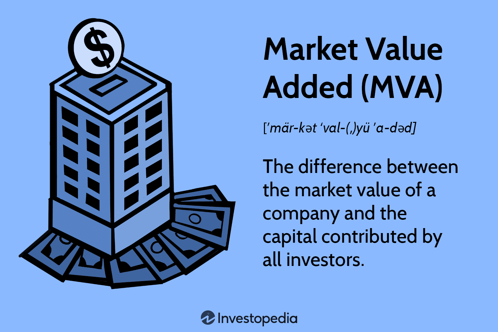

Market Value Added (MVA) is an essential financial metric that quantifies the value a company creates for its shareholders. It is derived from the difference between the company's market value and the capital invested by shareholders and bondholders. This metric is pivotal in corporate finance as it offers a comprehensive measure of a company's ability to generate wealth and assess management's performance. By focusing on value creation, MVA provides insights into the effectiveness of managerial decisions and long-term corporate success.

In recent years, the significance of MVA has expanded into algorithmic trading, where it helps optimize investment decisions. Quantitative traders integrate MVA within trading algorithms, using it as a key input to develop strategies focused on long-term value creation. This integration aids in identifying stocks with the potential for sustained appreciation and aligns trading strategies more closely with the objective of wealth creation for investors.



This article examines the calculation of MVA, its role in evaluating corporate performance, and the impacts it has on trading strategies. By understanding MVA's function in financial analysis and decision-making, readers can appreciate its importance in both corporate finance and algorithmic trading.

## Table of Contents

## What is Market Value Added (MVA)?

Market Value Added (MVA) represents the difference between a firm’s market value and the capital invested by both bondholders and shareholders. This metric serves as an important indicator of managerial effectiveness by quantifying the wealth created for the company’s stakeholders. The MVA calculation uses the formula:

$$
\text{MVA} = V - K
$$

where $V$ is the market value of the firm, which includes both equity and debt, and $K$ is the invested capital. This invested capital encompasses the total funds provided by shareholders and bondholders to the firm.

MVA closely relates to Economic Value Added (EVA). While EVA focuses internally on the operational performance and financial decisions that create economic profit, MVA reflects the market's perception and valuation of a company's ability to generate wealth. Unlike EVA, which assesses internal efficiencies and cost management, MVA considers how these efficiencies translate into the firm’s stock and bond valuation in the capital markets.

By capturing the market's judgment, MVA emphasizes the tangible outcome of corporate strategies in enhancing shareholder value. It highlights the economic value created above the capital invested, directly aligning with the interests of investors who seek a return on their investments higher than their initial capital outlay.

## Benefits of MVA in Corporate Finance

Market Value Added (MVA) offers substantial leverage in understanding a company's long-term performance, particularly in how effectively it generates shareholder value. High MVA serves as a potent signal that a company is employing successful investment strategies and sound management practices. This attracts potential investors who are seeking firms that capitalize on wealth generation effectively. 

One of the critical benefits of a high MVA is its implication that a company is not just surviving but thriving—demonstrating strategic foresight and effective capital allocation that yields a net gain above initial investments. Mathematically, MVA is expressed as: 

$$
\text{MVA} = V - K
$$

where $V$ represents the market value of the firm, and $K$ symbolizes the total invested capital. 

Companies maintaining a sustained high MVA over time are often viewed as stable and possessing significant growth potential. This characteristic makes them appealing for long-term investment strategies, as it suggests a favorable trajectory in their financial and operational performances.

Furthermore, MVA extends beyond traditional accounting metrics by incorporating market perceptions and operational outcomes. Traditional ratios typically focus on historical financial data without necessarily accounting for market sentiment or future potential. In contrast, MVA provides a holistic view, aligning more closely with the dynamic nature of market valuations. This alignment offers a comprehensive measure of corporate success and effectively reflects the company's current and potential performance in the market.

By bridging the gap between operational outcomes and market perceptions, MVA becomes indispensable for investors and corporate managers looking to evaluate the true value a company is generating for its shareholders over the long term.

## Calculating MVA

To calculate Market Value Added (MVA), you start by determining a company's market value, which includes both equity and debt, and subtract the total capital invested. The market value of a company is derived from its market capitalization, which is the total market value of its outstanding shares, and the market value of its debt. 

The formula to calculate MVA is given by:

$$
\text{MVA} = V - K
$$

where:
- $V$ is the market value of the company, calculated as the sum of its market capitalization and the market value of its debt.
- $K$ is the total capital invested, comprising equity capital and debt capital.

**Market Capitalization:**
Market capitalization, also known as market cap, represents the equity component and is calculated as:

$$
\text{Market Capitalization} = \text{Share Price} \times \text{Number of Outstanding Shares}
$$

**Market Value of Debt:**
The market value of the debt can be determined based on the trading price of the company’s bonds in secondary markets or estimated if not directly observable.

**Equity Capital:**
Equity capital reflects shareholder investments, forming part of the initial capital base used to fund operations. It encompasses common stock and possible retained earnings.

**Debt Capital:**
Debt capital indicates borrowed funds, including long-term bonds and other forms of credit undertaken by the company.

The significance of the calculated MVA lies in its ability to show additional wealth created over the initial investments made by both shareholders and bondholders. A positive MVA suggests that the company has generated value in excess of the invested capital, while a negative MVA may indicate underperformance relative to the market's expectations.

## MVA in Algorithmic Trading

In [algorithmic trading](/wiki/algorithmic-trading), Market Value Added (MVA) emerges as a valuable tool in the formulation of strategies aimed at fostering long-term value creation. By leveraging MVA, quantitative models can effectively identify stocks with the potential for sustained value appreciation. When selecting stocks, these models typically assess the difference between a company's market value and the capital invested by its stakeholders. A high MVA indicates that the market perceives the company to enjoy a superior return on invested capital, signaling potential for long-term growth.

Algorithmic trading strategies can be sharpened by focusing on companies with robust MVA. Identifying such companies not only enhances the potential for value creation but also mitigates risks associated with market [volatility](/wiki/volatility-trading-strategies). By evaluating stocks based on MVA, traders can align their portfolios with firms exhibiting strong market confidence and operational efficiency.

The integration of MVA into trading algorithms can substantially refine decision-making processes. This integration is achieved through the inclusion of real-time market data and forecasts into the algorithmic framework. For example, Python, a popular programming language in finance, can be employed to analyze and implement MVA-focused trading strategies. 

Here's a simple Python script that integrates MVA data into an algorithm for selecting promising stocks:

```python
import pandas as pd
import numpy as np

# Load market data
market_data = pd.read_csv('market_data.csv')

# Calculate MVA for each stock
market_data['MVA'] = market_data['Market Value'] - market_data['Invested Capital']

# Define a threshold for high MVA
mva_threshold = market_data['MVA'].quantile(0.75)

# Select stocks with high MVA
high_mva_stocks = market_data[market_data['MVA'] > mva_threshold]

print("Selected Stocks with High MVA:")
print(high_mva_stocks[['Stock', 'MVA']])
```

This script calculates the MVA for each stock and selects those surpassing a specified threshold, indicative of strong market confidence. The strategic integration of MVA within algorithmic models allows traders to [factor](/wiki/factor-investing) in real-time insights, ensuring alignment with both market trends and long-term growth opportunities.

## Comparing MVA with Other Metrics

Market Value Added (MVA) provides investors and corporate financiers with a unique perspective by emphasizing the overall value that a company creates for its shareholders, which other metrics like Net Present Value (NPV) and Internal Rate of Return (IRR) do not fully capture. While NPV and IRR are traditional tools used primarily in investment appraisal and project evaluation by assessing project-specific cash flows, MVA encompasses the entire valuation of a company, offering a more holistic view of the firm's market performance.

The MVA is derived using the formula:

$$
\text{MVA} = V - K
$$

where $V$ represents the market value of the firm, incorporating both equity and debt, and $K$ signifies the invested capital. This divergence from the cash flow-focused NPV and IRR, which are often project-limited and rely on forecast cash flows and discount rates, underscores MVA's utility in assessing the firm as a dynamically valued entity in the market.

In contrast to Economic Value Added (EVA), which measures a firm's internal financial performance by focusing on operational efficiency and returns above the cost of capital, MVA reflects external market perceptions, providing insights on how well management strategies translate into market valuation. EVA's internal perspective misses the market dynamics that affect a company's valuation, which MVA captures effectively.

Thus, MVA's strength lies in its ability to offer insights into market-based company value and management performance, as it incorporates external market dynamics and investor sentiments, reflecting a comprehensive picture of the company’s standing and its management’s effectiveness in value creation.

## Real-World Applications of MVA

Market Value Added (MVA) holds considerable practical importance in evaluating and steering corporate strategies and investment decisions. Companies commonly adopt MVA as a critical metric to assess the effectiveness of strategic initiatives such as mergers and acquisitions. By measuring the created economic value against the invested capital, MVA helps determine whether these strategic actions have successfully enhanced shareholder value. For instance, a positive MVA post-merger suggests that the new entity is valued more highly by the market than the sum of its parts, indicating successful value creation from the merger.

Investors use MVA as a reliable indicator to pinpoint companies with a consistent track record of value creation. Businesses that consistently generate high MVA are often perceived as stable and promising investments. The positive adjustment in market value reflected by MVA can serve as a proxy for sustained operational performance and effective management, positioning such companies as viable long-term investment opportunities.

Furthermore, MVA is instrumental in the development of performance-based compensation schemes. By linking executive and managerial compensation to MVA, companies align the interests of management with those of the shareholders. This alignment ensures that as managers strive to enhance MVA, they simultaneously drive the company towards greater profitability and market value, thus benefitting shareholders. Performance-based compensation can motivate management to pursue strategies that optimally allocate resources and invest in high-value projects, thereby fostering an environment focused on long-term growth and sustainability.

Thus, MVA's applications extend beyond mere evaluations, providing a comprehensive framework for making informed strategic decisions, incentivizing management, and guiding investment strategies. Its role in aligning corporate actions with shareholder expectations makes it an invaluable tool in modern financial analysis and decision-making.

## Conclusion

Market Value Added (MVA) stands as a pivotal metric in corporate finance, offering critical insights into long-term value creation within a company. By measuring the surplus created over the capital invested by bondholders and shareholders, MVA gives a clear indication of a company's ability to enhance shareholder wealth through effective management strategies. This utility extends beyond traditional financial metrics by encompassing market perceptions and external valuation, providing a holistic view of company performance.

In the domain of algorithmic trading, MVA's application underscores its versatility and significance in quantitative finance. Algorithmic trading strategies increasingly incorporate MVA to pinpoint investments likely to yield sustainable value appreciation. The integration of MVA into these models not only offers a measure of current market value relative to investments but also supports enhanced decision-making through the assimilation of real-time data and predictive analytics. This is particularly instrumental in reducing exposure to market volatility and enhancing the strategic selection of assets.

With financial markets leaning heavily on sophisticated analytical tools, grasping the calculation and ramifications of MVA is imperative for corporate strategists and traders alike. The evolving landscape suggests that advanced MVA-based trading strategies could potentially unlock more robust financial models. Such strategies might be developed through quantitative analyses and [machine learning](/wiki/machine-learning) techniques that further refine MVA calculations, thereby improving forecast accuracy and investment outcomes. Continuous research in this area holds promise for generating higher returns and fostering a deeper understanding of financial dynamics.

## References & Further Reading

[1]: Stewart, S. C., & Stern, J. M. (1991). ["The Quest for Value: The EVA™ Management Guide."](https://www.amazon.com/Quest-Value-Guide-Senior-Managers/dp/0887304184) HarperBusiness.

[2]: Copeland, T., Koller, T., & Murrin, J. (1990). [Valuation: Measuring and Managing the Value of Companies](https://www.amazon.com/Valuation-Measuring-Managing-Companies-Frontiers/dp/0471086274) McKinsey & Company Inc.

[3]: Damodaran, A. (2011). [The Little Book of Valuation: How to Value a Company, Pick a Stock and Profit](https://www.amazon.com/Little-Book-Valuation-Company-Profit/dp/1118004779) Wiley.

[4]: Frydman, R., & Goldberg, M. D. (2007). [Imperfect Knowledge Economics: Exchange Rates and Risk](https://archive.org/details/imperfectknowled0000fryd) Princeton University Press.

[5]: Peters, E. E. (1999). [Fractal Market Analysis: Applying Chaos Theory to Investment and Economics](https://archive.org/details/fractalmarketana0000pete) Wiley.