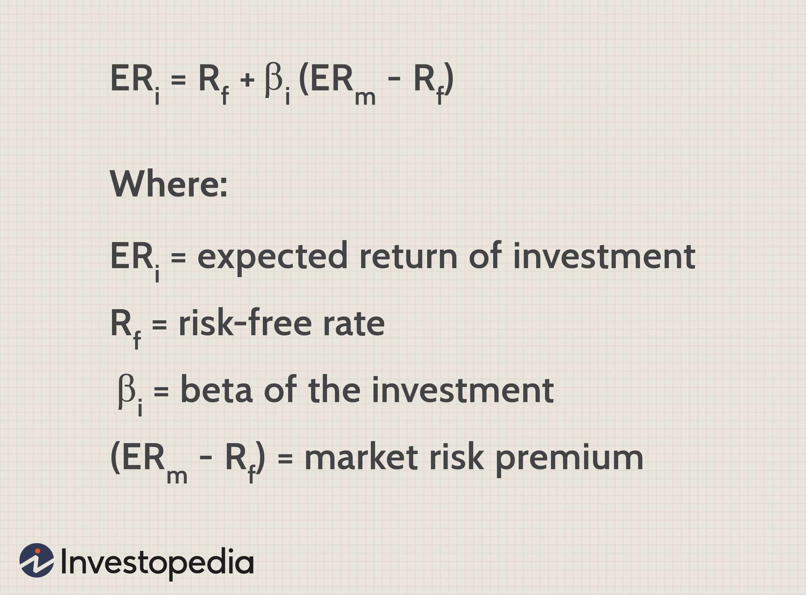

In today's fast-paced financial world, accurate valuation of fixed assets is paramount for both businesses and investors. Fixed assets, which include machinery, buildings, and equipment, represent a significant portion of a company's balance sheet and are crucial in determining its financial health. With the continual advancement of technology, incorporating sophisticated trading strategies like algorithmic trading into the valuation process can greatly improve the precision and efficiency of determining asset values.

Algorithmic trading employs computer algorithms to automate financial decision-making, enabling quick responses and adjustments to market conditions. This technology can streamline the asset valuation process by promptly incorporating real-time data and market trends, thus reducing the time lag that typically plagues traditional valuation methods. As markets become more complex and data-driven, the ability to rapidly process vast datasets and execute trades with precision is an invaluable asset for financial stakeholders.



Understanding the impact of market value adjustments on financial reporting and investment decisions is essential for businesses aiming to maintain accurate financial records and optimize asset management. Market value adjustments involve revising the value of an asset to reflect its current market price, influenced by a myriad of factors including economic conditions, regulatory changes, and technological innovations. Businesses that incorporate algorithmic models into these adjustments can better reflect the true economic value of their assets, thereby enhancing their financial transparency and decision-making processes.

In this article, we explore the integration of fixed asset valuation, market value adjustments, and algorithmic trading, which are integral to modern financial strategies. By harnessing these tools, companies can not only achieve a more precise assessment of their assets but also gain a competitive edge in the dynamic financial landscape. Through the adoption of these technologies, businesses can make more informed decisions, ultimately leading to more robust financial management and strategic growth.

## Table of Contents

## Understanding Fixed Assets and Their Valuation

Fixed assets, also known as tangible assets, consist of long-term resources owned by a business that are vital to its operations and not readily convertible into cash within the standard business cycle. Examples include buildings, machinery, and equipment. Accurate valuation of these assets is critical for financial reporting, investment analysis, and making informed managerial decisions.

### Methods of Fixed Asset Valuation

There are several widely-recognized methods for valuing fixed assets, each with its own implications for financial statements:

1. **Cost Model**:
   - Under the cost model, fixed assets are carried at their historical cost less any accumulated depreciation and impairment losses. This approach offers simplicity and stability as it avoids frequent fluctuations in asset values.
   - *Example*: If a machine was purchased for $100,000 and has accumulated $20,000 in depreciation, its carrying amount would be $80,000.

2. **Revaluation Model**:
   - This model allows for assets to be revalued at fair value at specific intervals. It reflects the current worth of the asset and is usually adjusted by a professional valuation. Any increase in value is credited to a revaluation surplus within equity, unless it reverses a previous loss.
   - *Example*: A property initially bought for $500,000 might be revalued to $600,000 based on market conditions, reflecting updated value on the balance sheet.

3. **Fair Value Model**:
   - Assets are reported at their fair market value, with regular updates required to account for price changes. This model allows an asset's valuation to reflect the most recent market conditions but may introduce more volatility into financial reporting.
   - Fair value is determined via market comparisons or appraisals.

### Impact on Financial Statements

The choice of valuation method can significantly impact a company’s financial statements in the following ways:

- **Balance Sheet**: Different valuation methods result in varying asset values being listed, which can affect total asset worth and equity.
- **Income Statement**: Depreciation expenses differ under each method, impacting net income. The revaluation model, for example, might lead to volatile earnings if revaluation increments or decrements are recognized in profit or loss.
- **Cash Flows**: While valuation impacts the reported book value and profitability, it does not directly affect cash flow. However, perceived value can influence investment and financing decisions affecting future cash flows.

### Application of Valuation Methods

In practice, the application of these valuation methods depends on:

- **Industry Norms**: Certain sectors may favor specific methodologies based on regulatory standards or norms.
- **Market Conditions**: Firms may choose the revaluation or fair value model in volatile markets to reflect current asset value more accurately.
- **Accounting Standards**: International Financial Reporting Standards (IFRS) and Generally Accepted Accounting Principles (GAAP) guide which models can be applied and how.

For businesses, adopting the most suitable asset valuation model involves assessing various financial, regulatory, and operational factors. While the cost model provides simplicity, the revaluation and fair value models offer comprehensive insights into current asset values, albeit with added complexity.

## The Role of Market Value Adjustment

Market value adjustment is a crucial financial process that involves re-evaluating an asset to reflect its current market price more accurately. This financial adjustment is essential for businesses to ensure that their financial records present an accurate and up-to-date picture of asset values, thereby supporting transparency and informed decision-making.

One of the significant factors influencing market value adjustments is economic conditions. Fluctuations in economic variables such as interest rates, inflation, and currency values can significantly impact asset prices. For instance, when interest rates rise, the present value of future cash flows from an asset like a bond decreases, necessitating a downward market value adjustment. Conversely, a booming economy may increase asset demand, leading to upward adjustments in market values.

Regulatory changes also play a substantial role in market value adjustments. Financial regulations can directly or indirectly affect market dynamics and, consequently, asset valuations. For example, changes in tax laws or accounting standards might require companies to reassess their asset portfolios to comply with new regulations. These changes can lead to adjustments in the market value of assets, ensuring that firms stay compliant while maintaining accurate financial records.

Technological advancements are another pivotal [factor](/wiki/factor-investing) in market value adjustments. The introduction of new technologies can render certain existing assets obsolete or significantly increase the value of innovative assets. Additionally, technology facilitates more rapid and precise assessments of market conditions, enabling more timely and accurate adjustments of asset values. For example, the advent of real-time data analysis tools has enhanced the ability to monitor and adjust asset values in response to market fluctuations.

Regular market value adjustments are necessary to maintain the integrity of financial performance metrics. Without these adjustments, financial statements might reflect outdated or inaccurate asset values, misleading investors and other stakeholders. Accurate market value adjustments ensure that key metrics such as net asset value (NAV), return on assets (ROA), and equity valuations are reliable, providing a true reflection of a company's financial health.

Industries where market value adjustments are particularly crucial include real estate, commodities, and securities markets. In real estate, property values can change significantly due to market demand, location developments, or regulatory changes. For commodities, prices can fluctuate based on global supply and demand dynamics, necessitating frequent reevaluation of inventory values. In the securities market, the value of stocks and bonds is continuously influenced by market conditions, requiring regular adjustments to reflect these changes in financial statements accurately.

In summary, market value adjustments are a vital aspect of financial management, influenced by economic conditions, regulatory changes, and technological advancements. They ensure that businesses maintain accurate financial records, which is crucial for reliable financial performance metrics and effective decision-making.

## Algorithmic Trading: A Tool for Precision

Algorithmic trading utilizes sophisticated algorithms and software to execute trades in financial markets with exceptional precision and speed. This approach significantly surpasses the capabilities of manual trading methods, allowing for transactions to be conducted in fractions of a second. By leveraging historical data and current market conditions, these algorithms are equipped to identify optimal trading opportunities, thus enhancing the precision in asset valuation and adjustments.

One of the primary advantages of [algorithmic trading](/wiki/algorithmic-trading) is its capacity to reduce human error. Traders can rely on algorithms to consistently execute predefined strategies, reducing the probability of mistakes associated with human decision-making, such as emotional biases or fatigue. For example, algorithms can be programmed to maintain strict compliance with trading rules, ensuring a disciplined approach that can be difficult for human traders to achieve consistently.

Another significant benefit is the ability of algorithmic trading to process and interpret vast datasets swiftly. This capability is essential as financial markets generate an immense amount of data every second. Algorithms can analyze this data in real-time, identifying patterns and trends that may not be immediately apparent to human analysts. This rapid data processing contributes to quick, informed decision-making, which is crucial in volatile market environments where asset values can shift rapidly.

Despite its benefits, algorithmic trading also presents certain challenges and risks. One notable risk is the potential for technology malfunctions or software bugs, which can lead to unintended trades and financial losses. Moreover, the reliance on algorithms may lead to a lack of oversight and increased vulnerability to market anomalies or manipulations, as seen in events like the "Flash Crash" of 2010. Additionally, the use of sophisticated trading algorithms necessitates investment in advanced technological infrastructure and the recruitment of skilled personnel to develop and manage these systems.

In conclusion, while algorithmic trading offers significant advantages in terms of precision and efficiency in financial markets, it also requires careful implementation and monitoring to mitigate associated risks. By doing so, businesses can effectively harness the power of technology to enhance asset valuation accuracy and responsiveness to market fluctuations.

## Integrating Algo Trading into Asset Valuation

Combining algorithmic trading with asset valuation processes creates a dynamic framework for managing fixed assets. This integration leverages real-time data and predictive analytics to enhance accuracy and responsiveness in fixed asset valuation. By utilizing algorithmic trading, businesses can implement live market data, allowing for immediate adjustments in asset valuations in response to market fluctuations.

Real-time data feeds act as a backbone for this system, supplying continuous updates that ensure asset valuations remain accurate. Predictive analytics, often powered by [machine learning](/wiki/machine-learning) algorithms, can anticipate market trends and potential asset value changes, enabling businesses to make proactive decisions. This predictive capability is crucial for aligning investments with market trajectories, thus optimizing resource allocation.

The integration of technology in this context requires careful planning and efficient execution. Businesses aiming to implement such systems must consider several technological and operational components. Essential prerequisites include sophisticated software capable of handling high-frequency data transactions and skilled personnel proficient in programming and data analysis. For instance, Python, with its extensive libraries like NumPy and pandas, can serve as an effective tool for processing large datasets and developing predictive models:

```python
import pandas as pd
import numpy as np
from sklearn.ensemble import RandomForestRegressor

# Example of processing real-time market data
market_data = pd.DataFrame({
    'timestamp': pd.date_range(start='2023-01-01', periods=100, freq='T'),
    'asset_value': np.random.uniform(100, 200, size=100)
})

# Predictive analytics model setup
model = RandomForestRegressor(n_estimators=100)
X = market_data[['timestamp']].apply(lambda x: x.timestamp())
y = market_data['asset_value']
model.fit(X.values.reshape(-1, 1), y)

# Predict future asset values
future_timestamps = pd.DataFrame(pd.date_range(start='2023-01-01', periods=10, freq='T'), columns=['timestamp'])
X_future = future_timestamps.apply(lambda x: x.timestamp())
predicted_values = model.predict(X_future.values.reshape(-1, 1))
```

Despite the apparent benefits, there are potential hurdles to integration. The deployment of sophisticated software systems needs significant investment, not only in financial terms but also in human resources. There is a requirement for personnel with specialized skills to manage and interpret complex algorithms and datasets. Organizations must also consider issues related to data privacy and system security, ensuring robust measures are in place to protect sensitive financial data.

Successful integration of algorithmic trading and asset valuation can be observed in several case studies. For example, financial institutions have adopted real-time valuation systems to optimize their trading strategies and asset management capabilities. These systems enable institutions to adjust asset values dynamically, reflecting the current market scenario and thus supporting strategic decision-making processes.

In summary, integrating algorithmic trading into asset valuation offers significant advantages in terms of valuation precision and strategic responsiveness. This approach necessitates an understanding of both technical capabilities and personnel management to overcome potential challenges and fully exploit the benefits of this integration.

## Benefits and Challenges

Integrating technologies like algorithmic trading and advanced asset valuation models into financial management presents several benefits. These advancements result in enhanced accuracy by employing sophisticated algorithms that analyze vast datasets to determine the most precise asset values. The improved accuracy leads to better financial transparency, as stakeholders can rely on real-time and precise information for decision-making. Furthermore, asset management practices become more efficient, as automated processes replace manual methods, optimizing the allocation and utilization of resources.

Despite these advantages, challenges accompany the adoption of such technologies. Cybersecurity concerns are paramount, with the increased connectivity and data sharing exposing systems to potential breaches. Businesses must invest in robust cybersecurity measures to protect sensitive financial information. Additionally, the cost of implementing these technologies can be significant. Necessary expenses include purchasing sophisticated software, maintaining hardware, and hiring skilled personnel capable of managing and analyzing complex systems. Data privacy issues also arise, necessitating adherence to regulations such as GDPR to ensure that personal and sensitive data are handled responsibly.

Mitigating these challenges requires strategic planning and implementation. Organizations can adopt a phased approach, initially integrating components of new technologies that promise the highest return on investment. This gradual integration can help manage costs and minimize disruptions to existing operations. Regular cybersecurity audits and employing encryption technologies are crucial for maintaining data integrity and security.

Maintaining a balance between technological adoption and traditional valuation methods necessitates incorporating human oversight into automated systems. Human expertise can offer valuable insights and context that algorithms might overlook, ensuring that the output remains aligned with business strategies and goals. Training programs can elevate the skill sets of current employees, enabling them to harness new tools effectively and enhance traditional methods with cutting-edge technology.

For businesses considering adopting these advanced approaches, a comprehensive assessment of their current asset management practices is recommended. Identifying areas where technology can deliver the most significant enhancements should be the priority. Investing in talent acquisition and employee training will ensure that the workforce is equipped to handle these transformative changes. Furthermore, establishing a clear roadmap with milestones can facilitate a smoother transition and track progress towards achieving desired outcomes. Proactively addressing these aspects can position companies to reap the full spectrum of benefits offered by the fusion of algorithmic trading and modern asset valuation techniques.

## Conclusion

The valuation of fixed assets remains a cornerstone of robust financial management, and this area has witnessed substantial enhancements due to technological advancements. The introduction and integration of market value adjustments alongside algorithmic trading methodologies have yielded tools capable of determining precise asset values with greater efficiency. 

Market value adjustments are pivotal as they ensure that asset valuations stay reflective of current market prices, thus maintaining the integrity and accuracy of financial records. Similarly, algorithmic trading introduces significant benefits, such as speed and precision in trading operations, which contribute to more precise valuation processes. When applied effectively, these tools enable companies to keep pace with real-time market fluctuations, ultimately yielding a more reliable financial portrayal.

As businesses move forward, the adoption of these tools is expected to confer a decisive competitive edge. By embracing innovative technologies, organizations can streamline their asset management processes, thus achieving better transparency and decision-making capabilities. However, it is essential to acknowledge and address the challenges that accompany such integration. Key issues include cybersecurity concerns, substantial implementation costs, and data privacy implications. Strategic investments in appropriate technologies and skilled professionals are imperative to mitigate these risks.

Overall, combining asset valuation processes with algorithmic trading opens new avenues for enhanced financial management. By aligning these efforts with strategic objectives, businesses can harness the full potential of these modern tools, positioning themselves advantageously in the evolving financial landscape. This fusion not only strengthens financial management practices but also paves the way for sustainable growth and innovation.

## References & Further Reading

[1]: Bergstra, J., Bardenet, R., Bengio, Y., & Kégl, B. (2011). ["Algorithms for Hyper-Parameter Optimization."](https://papers.nips.cc/paper/4443-algorithms-for-hyper-parameter-optimization) Advances in Neural Information Processing Systems 24.

[2]: ["Advances in Financial Machine Learning"](https://www.amazon.com/Advances-Financial-Machine-Learning-Marcos/dp/1119482089) by Marcos Lopez de Prado

[3]: ["Evidence-Based Technical Analysis: Applying the Scientific Method and Statistical Inference to Trading Signals"](https://www.amazon.com/Evidence-Based-Technical-Analysis-Scientific-Statistical/dp/0470008741) by David Aronson

[4]: ["Machine Learning for Algorithmic Trading"](https://github.com/stefan-jansen/machine-learning-for-trading) by Stefan Jansen

[5]: ["Quantitative Trading: How to Build Your Own Algorithmic Trading Business"](https://www.amazon.com/Quantitative-Trading-Build-Algorithmic-Business/dp/1119800064) by Ernest P. Chan