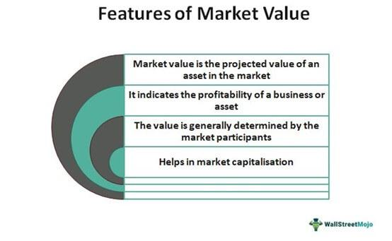

The intersection of insurance, market value clauses, contract terms, and algorithmic trading represents a multifaceted and evolving domain within the financial and legal sectors. These elements are pivotal for stakeholders who seek to effectively manage risks and optimize trading strategies. Understanding the interplay between these components is vital as they collectively influence how assets are valued, traded, and insured, thus impacting the financial ecosystem at large.

Market value clauses in insurance are designed to offer compensation that reflects the current market worth of an asset, instead of its original purchase price. This is particularly important for commodities and properties subject to market volatility, emphasizing accurate valuation in insurance to prevent over or undercompensation. This provision plays a critical role for policyholders in ensuring their coverage remains adequate over time.

Algorithmic trading, characterized by the use of computer programs to execute trades at high speed and in large volumes, has become a significant force in financial markets. Its rise presents new challenges, particularly in embedding market value clauses into trading contracts to ensure they remain adaptable to real-time market conditions. As the trade algorithms rapidly alter the landscape, the integration of such clauses becomes essential to maintain compliance and operational efficiency in trading activities.

Exploring the implications of these elements within the modern financial framework is crucial for navigating ongoing changes. The fast-paced evolution of technology, coupled with stringent regulatory environments, demands innovative approaches in contract design and risk management. Addressing these factors is key to leveraging the potential benefits while mitigating associated risks. Therefore, stakeholders are encouraged to embrace adaptable legal structures aligned with technological advancements, ensuring they stay ahead in a landscape characterized by constant flux and complexity.

## Table of Contents

## Understanding Market Value Clause in Insurance

A market value clause is a provision in insurance policies that ensures compensation for assets based on their current market value rather than their historical purchase price. This feature of insurance contracts is particularly crucial for assets such as commodities and real estate, where values can fluctuate significantly over time due to market dynamics, economic conditions, and asset depreciation.

The fundamental objective of a market value clause is to furnish fair compensation to the policyholder, reflecting the true value of an asset at the time of loss or damage. Unlike a replacement cost policy, which reimburses the cost of repairing or replacing an asset irrespective of market conditions, a market value clause aligns payout with the present-day worth of the asset. This approach helps in preventing overestimation of asset value, which can occur if depreciation and wear-and-tear are not accounted for.

Understanding how market value clauses function is essential for policyholders to ensure that their insurance coverage is adequate. When purchasing insurance for assets that are prone to value changes, incorporating a market value clause can safeguard against receiving insufficient compensation due to asset depreciation or market [volatility](/wiki/volatility-trading-strategies). For instance, residential real estate might decrease in market value due to economic downturns, while ignoring this fluctuation in insurance terms could lead to a payout that exceeds the current value of the property, resulting in underwriting losses for insurers.

Real-life scenarios illustrate the application and impact of market value clauses on insurance claims and payouts. Consider a commercial property purchased for $1 million a decade ago. Due to changes in the local real estate market, its current market value might be $800,000. Should the property incur damage, a market value clause would ensure the payout aligns with its current valuation of $800,000, thus reflecting its real market worth rather than the original purchase or replacement costs.

Similarly, in the case of replaceable goods such as vehicles or machinery, which depreciate over time, market value clauses help balance the interests of both insurer and insured by providing coverage that mirrors the asset’s existing market state. This ensures that while the insurer does not payout amounts exceeding the asset's market value, providing a check against inflated claims, the insured receives compensation that is reflective of the actual loss in asset value, aligning expectations and financial outcomes more accurately.

In summary, market value clauses play a strategic role in insurance policies by adapting coverage and compensation to the current economic landscape, thus protecting both policyholder interests and insurer finances through fair and accurate valuation mechanisms.

## Algorithmic Trading and Legal Frameworks

Algorithmic trading involves using complex computer algorithms to execute trades rapidly and efficiently. These algorithms analyze vast amounts of data to identify trading opportunities, execute orders, and manage positions at speeds unattainable by humans. Due to the inherent complexity of [algorithmic trading](/wiki/algorithmic-trading) systems and the significant financial stakes involved, robust legal frameworks are essential to mitigate associated risks.

Legal structures like the Uniform Electronic Transactions Act (UETA) have been established to provide validity to electronic contracts and signatures. However, while UETA supports the formation of contracts electronically, it may not fully address the specific requirements and risks of algorithmic trading. The dynamic and automated nature of these systems introduces unique legal challenges, such as accountability for erroneous trades and compliance with financial regulations.

Incorporating market value clauses into algorithmic trading contracts presents an opportunity to promote compliance and adaptability. Market value clauses enable automatic adjustments of contractual terms in response to market fluctuations, ensuring that agreements remain relevant and equitable without manual intervention. Such integrations can enhance the resilience of trading systems to market volatility and regulatory changes.

Case studies highlight the importance of incorporating precise legal terms in algorithmic trading contracts. For instance, instances of flash crashes—sudden, severe stock market crashes—underscore the potential risks of algorithmic trading. These events emphasize the necessity of including specific clauses that address liability and risk management in automated trading agreements.

In essence, the integration of market value clauses and other legal terms in algorithmic trading contracts is not just a means to ensure compliance but also a strategic approach to enhance adaptability and mitigate risks in an increasingly automated trading environment. Adopting these measures can significantly improve the operational integrity of algorithmic trading systems, ultimately offering greater protection against unforeseen financial discrepancies.

## Integrating Market Value Clauses into Algorithmic Contracts

Market value clauses, when integrated into algorithmic trading contracts, play a crucial role in maintaining the responsiveness and adaptability of these agreements with respect to fluctuating market conditions. This integration is achieved by enabling automatic adjustments to the terms of the contracts in accordance with evolving regulations and market dynamics. 

One of the primary advantages of incorporating market value clauses is the legal adaptability they offer. By embedding these clauses in algorithmic contracts, the need for manual amendments is significantly reduced. This enhancement not only streamlines the process but also ensures that contracts remain compliant with current laws and market expectations. For instance, in the event of sudden market shifts, the algorithm can detect changes in asset values and subsequently adjust the trading terms, mitigating potential risks associated with non-compliance.

This integration is particularly beneficial in algorithmic trading due to its high-speed nature and the large volumes of transactions executed. Traditional methods of contract modification are often too slow and cumbersome to keep up with the pace of algorithmic trading. Market value clauses, however, provide a mechanism for contracts to self-adjust, thereby maintaining their relevance and accuracy over time. An example scenario could involve a rapid change in commodity prices due to geopolitical tensions. In such cases, a contract equipped with a market value clause could automatically recalibrate trading parameters to reflect the new market prices, thus preventing financial losses.

Furthermore, the integration of market value clauses represents a proactive approach to addressing legal and operational challenges inherent in algorithmic trading. By adopting such forward-thinking measures, stakeholders can enhance the operational integrity of trading systems, facilitating smoother and more efficient transactions. These clauses serve as a buffer against unforeseen market changes that could otherwise disrupt trading activities.

Overall, the strategic incorporation of market value clauses into algorithmic trading contracts not only improves legal compliance but also enhances the operational efficiency of trading systems. This approach ensures that stakeholders are well-equipped to manage the complexities of modern financial markets.

## Risk Management and Insurance Strategies

Contractual liability insurance and market value clauses are instrumental in managing the multifaceted risks associated with algorithmic trading. These elements serve as safeguards against a variety of potential issues including trading errors, technical failures, and regulatory compliance challenges. Insurance strategies tailored to these risks provide financial protection and stability, ensuring that businesses can operate with confidence in the ever-evolving trading landscape.

Algorithmic trading, characterized by high-speed and high-frequency transactions, introduces unique operational risks. Trading errors can lead to significant financial losses in seconds, while technical failures such as system outages or glitches can cause trading interruptions and discrepancies. Additionally, algorithmic trading operates under strict regulatory frameworks which, if violated, can result in substantial penalties.

Insurance policies specifically designed for algorithmic trading cover liabilities that arise from these scenarios. For instance, contractual liability insurance protects firms from claims related to trading errors and subsequent financial losses. These policies often include market value clauses that adjust coverage based on the real-time valuation of trading assets, ensuring that the insurance remains relevant and adequate.

Integrating market value clauses within these insurance strategies further enhances their effectiveness. These clauses enable automatic recalibration of policies to better align with current market valuations and evolving regulations, reducing the need for frequent manual amendments. This integration allows businesses to maintain seamless operations even amidst shifting market conditions.

Moreover, continuous evaluation of insurance coverage is crucial. As algorithmic trading evolves, so do the potential risks and regulatory requirements. Regular assessments of insurance needs help ensure that coverage remains comprehensive and responsive to new developments in the trading environment. This proactive approach not only mitigates potential operational disruptions but also provides a strategic advantage in managing unforeseen events.

In essence, the combination of contractual liability insurance and market value clauses provides a robust framework for risk management in algorithmic trading. These tools offer protection and flexibility, allowing businesses to adapt swiftly to changes and maintain financial health even in the face of challenges.

## Conclusion

Incorporating market value clauses within insurance and algorithmic trading contracts is essential to managing the inherent complexities of modern financial environments. Legal adaptability remains a cornerstone in ensuring that both compliance and operational efficiency are upheld amidst the rapid changes characteristic of today's trading landscape. Market value clauses coupled with robust insurance strategies offer crucial protections against a spectrum of financial risks, from asset depreciation to rapid market fluctuations. 

For stakeholders, prioritizing the integration of adaptable legal structures is imperative to keep pace with technological advancements and evolving regulatory demands. Such structures not only provide the necessary flexibility to respond to unforeseen scenarios but also fortify the safety nets essential in navigating financial uncertainties.

Moreover, ongoing research and collaboration among legal, financial, and technological experts are vital in refining the functionalities and frameworks governing these contracts. This continuous evolution is necessary to adapt to new challenges and opportunities presented by advancements in algorithmic trading technologies and shifting market dynamics. By fostering an environment of cross-disciplinary engagement, the industry can develop more resilient and responsive systems that anticipate and mitigate potential pitfalls, thereby securing the ongoing stability and growth of financial markets.

## References & Further Reading

Investopedia offers accessible explanations on market value and insurance clauses, which are crucial for understanding how these elements impact both personal and commercial insurance policies. Their articles explore the conditions and applications of market value clauses, thereby aiding policyholders and stakeholders in navigating these critical financial elements.

To gain a deeper understanding of algorithmic trading and the requisite legal frameworks, numerous detailed articles are available. These resources unpack the technical complexity and regulatory requirements essential for ensuring the legal soundness of algorithmic trading operations. They examine the technical aspects of algorithms and their integration within legal contracts, providing a foundation for compliance and adaptability in rapidly evolving markets.

Academic papers and legal reviews serve as rich resources for comprehensive analysis. These documents often explore the intersection of legal frameworks, algorithmic trading, and insurance, evaluating their combined impact on financial markets. Such scholarly articles highlight significant case studies and theoretical models, offering a more nuanced understanding of the broad implications and applications of these topics.

Consultation with industry experts and insurance professionals is recommended for obtaining up-to-date information and expert advice. These professionals offer insights shaped by the latest industry trends and regulatory changes, advising on practical applications and strategies for integrating market value clauses and insurance policies within algorithmic trading systems.

Books and online tutorials also provide valuable information on related financial and legal strategies. They cover a range of topics from basic principles to advanced strategies in both insurance and algorithmic trading, equipping readers with practical knowledge and skills needed for effective implementation.

