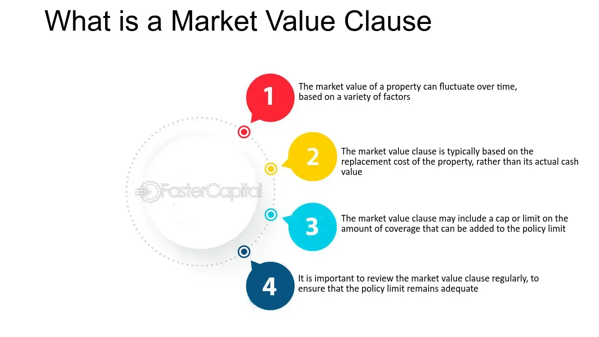

## Table of Contents

## What is a Market Value Clause?

A Market Value Clause is a part of an insurance policy that says how much money the insurance company will pay if something gets damaged or lost. It is based on what the item would cost to replace at today's prices, not what you paid for it originally. This means if you have an old TV that you bought for $500, but a new one costs $800 now, the insurance might pay you $800 if it gets damaged.

This clause helps make sure that you can replace your items without losing money. It is important because prices can change over time, and you want to be able to buy something similar to what you had. Not all insurance policies have this clause, so it's good to check your policy to see if it's included and how it works.

## Why is a Market Value Clause important in contracts?

A Market Value Clause is important in contracts because it helps make sure that if something gets damaged or lost, the insurance company will pay enough money to replace it at today's prices. This is good because the cost of things can go up over time. If you bought a laptop for $1000 a few years ago, and now a similar one costs $1500, the clause means the insurance will pay you $1500 to get a new one, not just the $1000 you originally paid.

Having a Market Value Clause also gives people peace of mind. They know that if something bad happens, they won't lose money because of rising prices. It makes the insurance more fair and useful. Not all contracts have this clause, so it's important to check and understand your contract to see if it's included and how it works.

## How does a Market Value Clause affect the pricing of goods or services?

A Market Value Clause doesn't directly change the price of goods or services. Instead, it affects how much money an insurance company will pay if something gets damaged or lost. If a contract has this clause, the insurance will pay based on what it costs to replace the item now, not what it cost when you bought it. This means if prices have gone up, you get more money to buy a new item.

This clause can make people feel more secure about buying expensive things. They know that if something happens, the insurance will cover the current cost to replace it. This might make people more willing to spend money on goods or services, knowing they won't lose out if prices rise. But, it's important to check if the clause is in your contract because not all insurance policies include it.

## Can you provide an example of a Market Value Clause in a real estate contract?

In a real estate contract, a Market Value Clause might be used to decide how much money someone gets if their property is damaged. For example, if a house is destroyed by a fire, the clause would say that the insurance company needs to pay enough money to buy a similar house at today's prices. If someone bought their house for $200,000 a few years ago, but now similar houses cost $250,000, the insurance would pay $250,000 to replace it.

This clause is important because it makes sure that people can get a new home that is worth the same as their old one, even if prices have gone up. It gives people peace of mind knowing that if something bad happens to their home, they won't lose money because of rising costs. Not all real estate contracts have a Market Value Clause, so it's a good idea to check your contract and see if it's included.

## What are the key components that should be included in a Market Value Clause?

A Market Value Clause should clearly say how the market value of an item or property will be decided. This means the clause needs to explain that the insurance company will pay based on what it would cost to replace the item or property at today's prices, not what was paid for it originally. It's important for the clause to mention who will figure out the market value, like an independent appraiser or a specific method agreed upon by both the insured and the insurer.

The clause should also include any limits or conditions that might affect how much money is paid out. For example, it might say that the insurance will only cover up to a certain percentage of the current market value, or it might list specific situations where the market value calculation could be different. This helps make sure everyone understands exactly how the clause works and what to expect if something gets damaged or lost.

## How is market value determined under a Market Value Clause?

Under a Market Value Clause, the market value is figured out by looking at what it would cost to replace the damaged or lost item or property at today's prices. This means if you bought a TV for $500 a few years ago, but now a similar TV costs $800, the insurance will pay you $800 if your TV gets damaged. The clause usually says that an independent appraiser or a specific method agreed upon by both the insured and the insurer will be used to decide this value.

The clause might also have rules or limits that affect how the market value is calculated. For example, it might say that the insurance will only pay up to 90% of the current market value, or it might list special situations where the market value could be different. This helps make sure everyone knows how much money they might get if something bad happens to their things.

## What are the potential risks of including a Market Value Clause in a contract?

Including a Market Value Clause in a contract can be risky because it might make insurance more expensive. If the insurance company has to pay based on today's prices, which can be higher than what someone paid for an item, they might charge more for the insurance to cover this risk. This means people might have to pay more for their insurance if they want to make sure they can replace their things at today's prices.

Another risk is that figuring out the market value can be tricky. It might need an independent appraiser or a special method to decide what something is worth now. If people disagree on the value, it can lead to arguments or even legal fights. This can make things more complicated and stressful if someone needs to use their insurance.

## How can parties negotiate the terms of a Market Value Clause effectively?

To negotiate the terms of a Market Value Clause effectively, both parties should start by clearly understanding what they want from the clause. The insured person wants to make sure they get enough money to replace their things at today's prices if something bad happens. The insurance company wants to make sure they don't have to pay too much. They should talk openly about what they expect and be willing to listen to each other's concerns. This helps them find a middle ground that works for both.

They can also agree on how to figure out the market value. They might decide to use an independent appraiser who knows how to find out what things are worth now. Or, they might agree on a specific way to calculate the value, like using the average price of similar items in the market. By agreeing on these details upfront, they can avoid disagreements later if they need to use the insurance. It's important for both parties to be clear and honest during these talks to make sure the clause is fair and useful for everyone involved.

## What legal considerations should be taken into account when drafting a Market Value Clause?

When drafting a Market Value Clause, it's important to think about the law. The clause needs to follow the rules in the place where the contract is made. This means looking at local insurance laws to make sure the clause is legal and fair. If the clause doesn't follow the law, it might not be valid, and that can cause problems if someone tries to use their insurance. So, it's a good idea to talk to a lawyer who knows about insurance and local laws to make sure the clause is right.

Another thing to think about is how clear the clause is. It should be easy to understand so that everyone knows what it means. This can help avoid arguments later if someone needs to use the insurance. The clause should say exactly how the market value will be figured out, like who will do the appraisal or what method will be used. It should also say if there are any limits or special rules that could affect how much money is paid out. By making sure the clause is clear and legal, both the person with the insurance and the insurance company can feel more confident about the contract.

## How do Market Value Clauses differ across industries?

Market Value Clauses can be different depending on the industry. In real estate, the clause might focus on the current price of a house or building if it gets damaged. It might say that an independent appraiser needs to figure out what the property is worth now, and the insurance will pay that amount. This helps people buy a similar home without losing money because of rising costs. In the auto industry, the clause might be about what a car is worth if it gets totaled. The insurance would pay enough money to buy a similar car at today's prices, not what the owner paid for it originally.

In other industries, like technology or electronics, the Market Value Clause might deal with things like computers or TVs. If a laptop gets damaged, the clause would make sure the insurance pays what it costs to replace it now, not what it cost when it was bought. This is important because technology prices can change quickly. Each industry has its own way of figuring out market value, and the clause needs to fit the specific needs of that industry. This makes sure the insurance is fair and useful for everyone involved.

## What are the best practices for monitoring and enforcing a Market Value Clause?

To monitor a Market Value Clause, it's important to keep an eye on the current prices of the things covered by the insurance. This means checking the market regularly to see if the value of items like houses, cars, or electronics has gone up or down. If something gets damaged or lost, the person with the insurance should quickly tell the insurance company and start the process to figure out the current market value. This might involve hiring an independent appraiser who knows how to find out what things are worth now. By staying on top of these things, both the insured person and the insurance company can make sure the clause works as it should.

Enforcing a Market Value Clause means making sure the insurance company pays the right amount based on today's prices. If there's a disagreement about the value, both sides should talk it out and try to come to an agreement. If they can't agree, they might need to go to a mediator or even to court to settle the issue. It's helpful to have clear rules in the contract about how to figure out the market value and what to do if there's a problem. By following these rules and keeping good records, everyone can make sure the clause is enforced fairly and that the insured person gets the money they need to replace their things.

## How have recent court decisions impacted the interpretation of Market Value Clauses?

Recent court decisions have made it clearer how Market Value Clauses should work. Courts have said that these clauses need to be fair and easy to understand. They've ruled that if the clause is not clear, it might not be valid. This means insurance companies and people with insurance need to make sure their contracts are written in a way that everyone can understand. Courts have also said that the market value should be figured out by someone who knows what they're doing, like an independent appraiser. This helps make sure the value is fair and based on today's prices.

These decisions have also affected how much money insurance companies have to pay. Courts have said that if the market value goes up, the insurance company needs to pay the higher amount, not what the person paid for the item originally. This is important because it helps people replace their things without losing money because of rising costs. But, if the clause has limits or special rules, the courts will look at those too. This means both sides need to be careful about how they write the clause and make sure it follows the law.

## References & Further Reading

Investopedia offers accessible explanations on market value and insurance clauses, which are crucial for understanding how these elements impact both personal and commercial insurance policies. Their articles explore the conditions and applications of market value clauses, thereby aiding policyholders and stakeholders in navigating these critical financial elements.

To gain a deeper understanding of [algorithmic trading](/wiki/algorithmic-trading) and the requisite legal frameworks, numerous detailed articles are available. These resources unpack the technical complexity and regulatory requirements essential for ensuring the legal soundness of algorithmic trading operations. They examine the technical aspects of algorithms and their integration within legal contracts, providing a foundation for compliance and adaptability in rapidly evolving markets.

Academic papers and legal reviews serve as rich resources for comprehensive analysis. These documents often explore the intersection of legal frameworks, algorithmic trading, and insurance, evaluating their combined impact on financial markets. Such scholarly articles highlight significant case studies and theoretical models, offering a more nuanced understanding of the broad implications and applications of these topics.

Consultation with industry experts and insurance professionals is recommended for obtaining up-to-date information and expert advice. These professionals offer insights shaped by the latest industry trends and regulatory changes, advising on practical applications and strategies for integrating market value clauses and insurance policies within algorithmic trading systems.

Books and online tutorials also provide valuable information on related financial and legal strategies. They cover a range of topics from basic principles to advanced strategies in both insurance and algorithmic trading, equipping readers with practical knowledge and skills needed for effective implementation.

