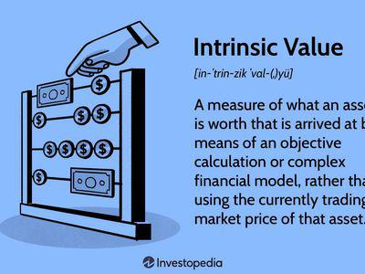

In the ever-evolving world of finance and investment, understanding the value of assets is crucial for making informed decisions. Two pivotal concepts often discussed in asset valuation are intrinsic value and market value. Intrinsic value represents the perceived or calculated 'true' value of an asset, built upon underlying fundamentals like cash flow, growth prospects, and the overall financial health of the asset in question. Market value, on the other hand, is the current price at which an asset is being traded in financial markets, directly influenced by supply and demand dynamics, investor sentiment, and prevailing market conditions.

The rise of algorithmic trading has added a significant layer of complexity and opportunity to the interplay between intrinsic and market values. Algorithmic trading employs sophisticated computer programs to execute trades with precision based on specific predefined criteria and can process vast amounts of financial data with speed and accuracy that human traders cannot match. As such, understanding the nuances between an asset’s intrinsic and market values becomes even more crucial.

This article examines the differences and relationships between intrinsic value and market value, particularly within the context of algorithmic trading. By exploring how these values interact and influence each other, readers will gain insights into their impact on trading strategies and investment decisions. As financial markets and technologies continue to evolve, navigating and leveraging these two key valuation concepts will remain essential for investors and traders aiming to achieve their financial objectives.

## Table of Contents

## Understanding Intrinsic Value

Intrinsic value refers to the perceived or calculated true value of an asset based on its inherent attributes and fundamental factors rather than its current market price. It is viewed as a comprehensive measure that reflects the core worth of a company or asset, irrespective of the market sentiment or external conditions. The determination of intrinsic value involves a thorough analysis of various elements, such as cash flows, growth prospects, and the overall financial health of an entity.

Key factors involved in assessing intrinsic value include:

1. **Cash Flows**: Future cash flows are a critical component in valuing an asset. The Discounted Cash Flow (DCF) model is widely utilized to estimate intrinsic value. The core principle of DCF is to project the future cash flows of an asset and discount them back to their present value using a discount rate representing the risk associated with those cash flows. The formula for DCF is:
$$
   \text{Intrinsic Value} = \sum \frac{CF_t}{(1 + r)^t}

$$

   where $CF_t$ represents the cash flow in time period $t$, and $r$ is the discount rate.

2. **Growth Prospects**: Evaluating a company's growth prospects involves analyzing industry trends, competitive positioning, and future expansion opportunities. This assessment helps estimate the potential increase in cash flows and value over time, providing a more comprehensive understanding of the asset's potential.

3. **Financial Health**: The financial stability of a company, indicated through metrics like earnings, profit margins, debt levels, and liquidity ratios, significantly impacts its intrinsic value. A robust financial position reduces risk and enhances the asset's valuation.

Unlike market value, intrinsic value is inherently subjective and can differ among analysts and investors, who may employ varying assumptions and methodologies in their calculations. This subjectivity is both a strength and a challenge—it allows for a personalized assessment of value but also results in differing opinions and estimates.

Understanding intrinsic value is crucial for investors aiming to identify undervalued or overvalued assets. By comparing the intrinsic value to the current market value, investors can make informed decisions. An asset is considered undervalued if its market price is below the calculated intrinsic value, presenting a potential buying opportunity. Conversely, if the market price exceeds intrinsic value, the asset might be deemed overvalued, suggesting a possible sale or avoidance.

Overall, intrinsic value serves as a fundamental guide for long-term investment strategies, helping investors focus on the inherent qualities and prospects of an asset rather than short-term market fluctuations.

## Deciphering Market Value

Market value represents the current price at which an asset is traded on the market. It serves as an objective measure of an asset's worth at any given moment and is determined by the interactions within the marketplace. Unlike intrinsic value, which is based on calculations of an asset's fundamental characteristics, market value is tangible and directly observable.

Several factors influence market value, including supply and demand dynamics. When demand for an asset exceeds supply, its market value tends to increase, and conversely, if supply surpasses demand, the market value typically decreases. This basic economic principle is applicable across various asset classes, from stocks to real estate.

Investor sentiment also plays a critical role in shaping market value. Positive news regarding a company's performance or the broader economic outlook can lead to increased buying interest, driving up market value. Conversely, negative news can have the opposite effect, leading to a decrease. Economic indicators, like interest rates and inflation reports, can cause significant fluctuations in market value by altering investor expectations about future economic conditions.

Market value is inherently variable and can experience significant fluctuations, especially in response to news, events, and economic data releases. For example, quarterly earnings announcements often lead to sharp swings in a company's stock market value as traders react to the new information.

Due to its dynamic nature, tracking market value is crucial for traders who aim to capitalize on short-term price movements. By observing changes in market value, traders can identify potential opportunities for profit. This short-term focus distinguishes market-oriented strategies from those grounded in intrinsic value, which may involve a longer-term perspective.

For practical purposes, market value can be readily accessed through financial platforms and exchanges that provide up-to-date pricing information. This accessibility allows traders and investors to make timely decisions based on the latest market data, enabling them to respond swiftly to market developments.

## Comparing Intrinsic Value and Market Value

Comparing intrinsic value to market value is an essential approach in formulating effective investment strategies. A fundamental strategy that arises from this comparison is value investing, wherein investors seek to buy stocks that are undervalued by the market but have a higher intrinsic value based on their [fundamental analysis](/wiki/fundamental-analysis). This approach is predicated on the belief that, over time, the market will recognize the true value of these stocks, leading to a price correction that can yield significant returns.

Discrepancies between intrinsic and market values offer potential opportunities for profit. An asset is deemed undervalued when its intrinsic value, as derived from methods such as the Discounted Cash Flow (DCF) model, surpasses its market value. This mispricing suggests that the asset is being traded for less than its actual worth, providing investors with a chance to purchase it at a bargain before the market corrects itself.

Market corrections occur when the market value realigns with intrinsic value over time. Such corrections are driven by new information or changes in investor perception that prompt a reevaluation of an asset's worth. Historical data shows that markets have a tendency to overreact in the short term due to information asymmetry or behavioral biases, resulting in prices deviating from intrinsic values. Over the long term, however, rational assessments and efficient dissemination of information typically lead to an equilibrium where market prices reflect intrinsic values more accurately.

Understanding both intrinsic and market values is crucial in developing a comprehensive view of asset valuation. While intrinsic value provides a baseline estimate of an asset's worth grounded in its fundamental attributes, market value offers real-time insights into investor sentiments and market conditions. By evaluating both perspectives, investors gain a holistic understanding of an asset's potential, allowing them to make informed and strategic decisions that align with their risk tolerance and investment goals. This dual approach ensures that investment strategies are not only theoretically sound but also practically grounded in the realities of the trading environment.

## The Role of Algo Trading in Value Analysis

Algorithmic trading, known for its precision and speed, utilizes computer algorithms to execute trades based on a set of predefined rules. This methodology allows for the rapid analysis and execution of trades, capitalizing on minute market fluctuations that might be imperceptible to human traders. By integrating assessments of both intrinsic and market value, algo trading strategies can be fine-tuned to better match the underlying worth of assets, potentially enhancing profitability.

1. **Incorporating Intrinsic and Market Value Assessments**: Leveraging intrinsic and market value calculations within algorithms helps refine decision-making processes. Intrinsic value models, such as discounted cash flow (DCF) analysis, assess an asset's genuine value by considering projected cash flows and growth rates. Algorithms utilizing these models can evaluate whether the market price of an asset is above or below its intrinsic value, informing buy or sell signals. For instance, if the intrinsic value of a stock, calculated using DCF, is $50 per share, but the market price is $40, an algorithm might identify it as undervalued and trigger a buy order.

2. **Rapid Data Processing and Analysis**: Algorithms can swiftly process large volumes of financial data, a critical component of identifying discrepancies between intrinsic and market values. These programs can scan news feeds, economic indicators, and historical price data to detect patterns or trends that may impact an asset’s valuation. The computational power of algorithms enables them to discern subtleties in data that could signify mispricing opportunities, thus allowing for more informed trading strategies.

3. **Capitalizing on Market Opportunities**: The ability of algorithmic trading to execute trades within milliseconds presents opportunities to capitalize on transient market conditions. Traders can implement strategies that respond almost instantaneously to shifts in market value, exploiting inefficiencies before the broader market adjusts. For example, price anomalies between different exchanges can be exploited using arbitrage strategies, provided the algorithm can execute trades faster than human competitors.

4. **Reliance on Robust Models**: A critical aspect of algo trading is the accuracy of the models used to estimate intrinsic value. Algorithms depend heavily on these models to make trading decisions; hence, inaccuracies can lead to significant financial losses. Developing robust models that accurately reflect an asset’s intrinsic value entails continuous refinement and validation, considering factors such as changes in market dynamics and economic conditions. Advanced machine learning techniques are increasingly employed to enhance these models, enabling algorithms to learn from vast data sets and improve their predictive capabilities over time.

In conclusion, while algo trading offers significant advantages in processing and acting on vast financial data swiftly, its effectiveness hinges on the precision of the models it utilizes to assess intrinsic value. The integration of intrinsic and market value assessments into algorithmic strategies provides traders with a powerful toolset to navigate complex and fast-moving markets. However, ongoing refinement and adaptation of these models are critical to maintaining their accuracy and efficacy in a dynamic trading environment.

## Challenges and Considerations

Accurately determining intrinsic value presents a significant challenge due to its inherently subjective nature. Intrinsic value assessment relies heavily on underlying fundamentals, which are interpreted differently by various analysts and investors. This subjectivity arises from differing opinions on future cash flows, growth rates, and the overall financial health of a company. The models used to calculate intrinsic value, such as discounted cash flow (DCF) analysis, require assumptions about future market conditions and company performance that can vary widely, leading to disparate intrinsic value estimates.

Market [volatility](/wiki/volatility-trading-strategies) is another [factor](/wiki/factor-investing) that complicates the relationship between intrinsic and market values. Volatile market conditions can cause market prices to deviate significantly from their intrinsic values, either undervaluing or overvaluing assets. This volatility is often driven by external events, economic indicators, and changes in investor sentiment. In such unstable environments, market values can become highly unpredictable, further challenging the evaluation of asset worth.

For traders employing [algorithmic trading](/wiki/algorithmic-trading) strategies based on intrinsic and market value assessments, it is crucial to consider transaction costs and market impact. These factors can substantially affect the profitability of trades. Incorporating these additional costs into algorithmic models is essential for accurately anticipating net returns and ensuring that trading strategies remain viable.

Regulatory changes can also impact algorithmic trading strategies focused on value analysis. Financial markets are subject to evolving regulations that can affect trading practices, data accessibility, and the overall market landscape. Traders must stay informed about regulatory changes and adapt their strategies accordingly to maintain compliance and effectiveness.

Ongoing research and development are vital to improving valuation models and refining trading algorithms. As financial markets and technologies advance, continuous innovation is required to enhance the accuracy of intrinsic value calculations and the efficiency of algorithmic trading systems. This includes integrating more sophisticated data analytics, leveraging [machine learning](/wiki/machine-learning) techniques, and adapting to new market dynamics.

In summary, the interplay between intrinsic value, market volatility, transactional considerations, regulatory environments, and technological advancements presents a complex array of challenges and considerations that traders and investors must navigate to optimize their strategies effectively.

## Conclusion

Understanding the interplay between intrinsic value, market value, and algorithmic trading is crucial within the world of finance. These elements together form a complex framework that influences investment strategies and decision-making processes. By grasping how intrinsic value, which is rooted in an asset's fundamental characteristics, contrasts with market value, influenced primarily by external market forces and trader sentiment, investors can better align their strategies with financial objectives. The understanding of these concepts allows for the development of tailored investment approaches that meet specific goals, whether they focus on short-term gains or long-term value accumulation.

As technological advances continue to shape financial markets, the capacity to aptly navigate and leverage intrinsic and market values becomes increasingly vital. Algorithmic trading, utilizing extensive computational power and advanced modeling techniques, offers traders the opportunity to react swiftly to market fluctuations based on these valuations. However, the evolving nature of both financial markets and technology requires investors and traders to engage in continual learning and adaptation. Staying abreast of new developments in valuation methods and trading algorithms is key to maintaining a competitive edge.

Ultimately, a profound understanding of asset valuation provides the bedrock for making well-informed investment decisions. It equips investors with the insights necessary to pinpoint opportunities and mitigate risks, laying a strong foundation for achieving long-term financial success. As the financial landscape continues to evolve, the ability to integrate these valuation concepts effectively will remain an essential skill for investors and traders alike.

## References & Further Reading

[1]: ["The Intelligent Investor: The Definitive Book on Value Investing."](https://www.amazon.com/Intelligent-Investor-Definitive-Investing-Essentials/dp/0060555661) by Benjamin Graham

[2]: Damodaran, A. (2012). ["Investment Valuation: Tools and Techniques for Determining the Value of Any Asset."](https://books.google.com/books/about/Investment_Valuation.html?id=5SRHAAAAQBAJ) Wiley Finance.

[3]: Farmer, J. D., & Skouras, S. (2012). ["An ecological perspective on the future of computer trading."](https://www.tandfonline.com/doi/full/10.1080/14697688.2012.757636) Bank of England Financial Stability Paper, no. 22.

[4]: Kissell, R. (2014). ["The Science of Algorithmic Trading and Portfolio Management"](https://www.sciencedirect.com/book/9780124016897/the-science-of-algorithmic-trading-and-portfolio-management) Academic Press.

[5]: Lo, A. W. (2008). ["Efficient market hypothesis."](https://web.mit.edu/Alo/www/Papers/EMH_Final.pdf) The New Palgrave Dictionary of Economics.