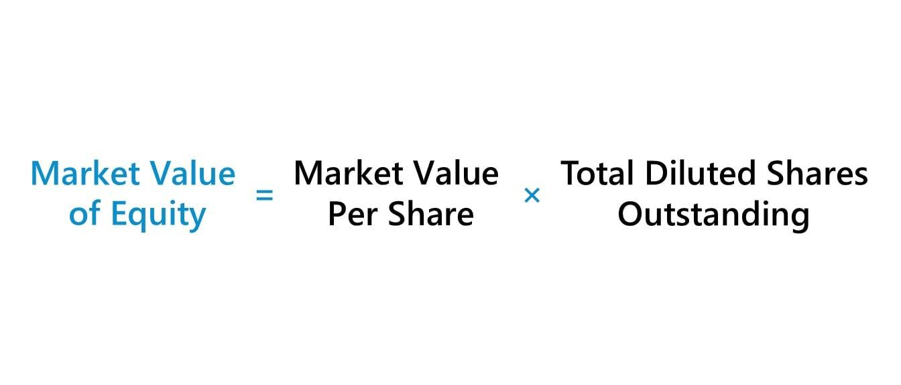

## Table of Contents

## What is the market value of equity?

The market value of equity is the total value of a company's shares of stock. It is calculated by multiplying the current stock price by the total number of outstanding shares. This value represents what investors believe the company is worth at any given time and can fluctuate based on market conditions, company performance, and other factors.

Understanding the market value of equity is important for both investors and the company itself. For investors, it helps them determine if a stock is priced fairly and whether it might be a good investment. For the company, knowing its market value can influence decisions about issuing new shares, buying back existing shares, or planning for future growth. It's a key indicator of the company's health and potential in the eyes of the market.

## Why is the market value of equity important for investors?

The market value of equity is important for investors because it tells them how much the company is worth according to the stock market. This value helps investors decide if a stock is a good buy. If the market value is high, it might mean the company is doing well and could be a good investment. But if the market value is low, it might mean the company is not doing so well, and investors might want to be careful.

Investors also use the market value of equity to compare different companies. They can see which companies are valued higher or lower by the market. This helps them make choices about where to put their money. By looking at the market value, investors can get a quick idea of a company's size and how the market feels about its future.

## How does the market value of equity differ from book value of equity?

The market value of equity is what investors think a company is worth right now. It's found by taking the current stock price and multiplying it by the total number of shares that are out there. This number can go up and down every day because it depends on what people are willing to pay for the stock. If lots of people want to buy the stock, the price goes up, and so does the market value of equity.

The book value of equity, on the other hand, is more about what the company has already done, not what people think it will do. It's calculated by taking everything the company owns (its assets) and subtracting everything it owes (its liabilities). This gives you the net worth of the company according to its own records. Book value doesn't change as quickly as market value because it's based on the company's financial statements, which are updated less often.

So, market value of equity is like a current snapshot of what the market thinks the company is worth, while book value of equity is like a historical record of the company's net worth. Both are important, but they tell you different things about the company.

## What are the basic methods to calculate the market value of equity?

The most common way to find the market value of equity is by multiplying the current price of one share of the company's stock by the total number of shares that are out there. This is called the "outstanding shares." So, if a stock is trading at $50 per share and there are 10 million shares, the market value of equity would be $500 million. This method gives a quick snapshot of what the market thinks the company is worth at that moment.

Another way to estimate the market value of equity is by using financial models like the Discounted Cash Flow (DCF) method. This method looks at the future cash flows the company is expected to make and then discounts them back to today's value. It's a bit more complicated because it involves making guesses about the future, but it can give a different perspective on the company's value. Both methods are useful, but they might give different results because they look at the company's worth in different ways.

## Can you explain the formula for calculating market value of equity using stock prices?

The formula for calculating the market value of equity using stock prices is very straightforward. You just take the current price of one share of the company's stock and multiply it by the total number of shares that the company has out there. These shares are called "outstanding shares." For example, if a company's stock is trading at $20 per share and there are 5 million shares outstanding, you multiply $20 by 5 million to get a market value of equity of $100 million.

This method gives you a quick and easy way to figure out what the market thinks the company is worth at any given moment. The value can change from day to day because stock prices go up and down based on what people are willing to pay for them. If more people want to buy the stock, the price might go up, and so will the market value of equity. If fewer people want to buy, the price might go down, and the market value will drop too.

## How do you calculate the market value of equity for a company with multiple types of stock?

If a company has more than one type of stock, like common stock and preferred stock, you need to calculate the market value of each type separately and then add them together. Common stock is the type most people think of when they talk about stocks, and it usually gives voting rights and dividends. Preferred stock is different because it often doesn't give voting rights but might pay a fixed dividend. To find the market value of equity for each type, you take the current price of each stock and multiply it by the number of shares of that type that are out there.

For example, let's say a company has common stock trading at $30 per share with 2 million shares outstanding, and preferred stock trading at $50 per share with 1 million shares outstanding. You would calculate the market value of the common stock by multiplying $30 by 2 million, which gives you $60 million. Then, you would calculate the market value of the preferred stock by multiplying $50 by 1 million, which gives you $50 million. Finally, you add these two amounts together to get the total market value of equity, which would be $110 million in this case.

## What factors can influence the market value of equity?

The market value of equity can change because of many things. One big thing is how well the company is doing. If the company makes more money or grows bigger, people might want to buy its stock more, which can make the stock price go up. Also, if the company does something exciting, like coming out with a new product that everyone wants, the stock price can go up too. On the other hand, if the company is not doing well or if it has problems, people might not want to buy its stock, and the price can go down.

Another thing that can change the market value of equity is what's happening in the world or the economy. If the economy is doing well, people might feel good about buying stocks, and prices can go up. But if there's a big problem, like a recession or a war, people might be scared to buy stocks, and prices can go down. Also, things like interest rates and inflation can make a difference. If interest rates go up, borrowing money becomes more expensive, which can make it harder for companies to grow, and their stock prices might go down.

Lastly, what other people think and do can also affect the market value of equity. If a lot of people start buying a stock because they think it's a good investment, the price can go up just because of that. This is called "market sentiment." Also, if big investors, like hedge funds or mutual funds, buy or sell a lot of a company's stock, it can move the price a lot. So, the market value of equity is not just about the company itself but also about what's happening around it and what people think.

## How can market value of equity be used in financial analysis and valuation models?

The market value of equity is a key number that people use when they want to understand how much a company is worth. In financial analysis, it helps people see if a stock is a good buy. They can compare the market value of equity to other things, like the company's earnings or its book value, to see if the stock price makes sense. For example, if the market value of equity is much higher than the book value, it might mean that people think the company will do really well in the future. But if it's much lower, it might mean the company is not doing so well, or people are worried about it.

In valuation models, the market value of equity is used to figure out if a company is a good investment. One common model is the Discounted Cash Flow (DCF) model, where people guess how much money the company will make in the future and then figure out what that money is worth today. The market value of equity is compared to this number to see if the stock is priced right. Another model is the Price-to-Earnings (P/E) ratio, where the market value of equity is divided by the company's earnings to see if the stock is expensive or cheap compared to other companies. By using the market value of equity in these models, people can make better choices about where to put their money.

## What are the limitations of using market value of equity as a sole indicator of a company's worth?

Using the market value of equity as the only way to figure out how much a company is worth can be tricky. The market value changes a lot because it depends on what people think the stock is worth at any moment. If lots of people want to buy the stock, the price goes up, and so does the market value of equity. But if people are scared or not interested, the price can go down, even if the company is doing well. So, the market value can be affected by things like news, rumors, or even just what people feel that day, not just how the company is actually doing.

Also, the market value of equity doesn't tell the whole story about a company. It doesn't show things like how much money the company is making, how much it owes, or how well it's run. A company might have a high market value because people think it will do well in the future, but it could still have a lot of debt or not be making much money right now. So, if you only look at the market value of equity, you might miss important details that could affect whether the company is a good investment or not.

## How do changes in market conditions affect the market value of equity?

Changes in market conditions can make the market value of equity go up and down a lot. If the economy is doing well and people feel good about the future, they might want to buy more stocks. This can make stock prices go up, and so the market value of equity goes up too. But if there's bad news, like a recession or a big problem in the world, people might get scared and not want to buy stocks. This can make stock prices fall, and the market value of equity goes down.

Also, things like interest rates and inflation can change how much people are willing to pay for stocks. If interest rates go up, it can be harder for companies to borrow money to grow, which might make their stock prices go down. If inflation is high, people might worry about the future and not want to invest in stocks, which can also push stock prices down. So, the market value of equity is not just about the company itself but also about what's happening in the world around it.

## Can you discuss advanced techniques for estimating market value of equity, such as discounted cash flow analysis?

One advanced way to figure out the market value of equity is by using something called Discounted Cash Flow (DCF) analysis. This method looks at how much money the company might make in the future and then figures out what that money is worth today. You start by guessing how much money the company will make each year for a while, and then you use a special formula to "discount" those future amounts back to today's dollars. The idea is that money you get in the future isn't worth as much as money you get right now because you could invest it and make more money. So, the DCF method helps you see if the company's stock price makes sense based on what you think it will earn in the future.

Another part of the DCF analysis is choosing the right "discount rate." This rate is like the interest rate you use to figure out how much less the future money is worth today. It's usually based on how risky the company is. If the company is very safe, you might use a lower discount rate, but if it's risky, you would use a higher one. Once you have all your future cash flows discounted back to today, you add them up. If this number is higher than the current market value of equity, it might mean the stock is a good buy because the market is not giving the company enough credit for its future earnings. But if it's lower, the stock might be too expensive. So, DCF analysis is a smart way to look at a company's worth, but it depends a lot on your guesses about the future.

## How do global economic factors impact the market value of equity across different industries?

Global economic factors can change the market value of equity a lot, and it can be different for each industry. If the world economy is doing well, people might feel good about investing in stocks. This can make stock prices go up in industries like technology or consumer goods, where people spend more money when they feel rich. But if there's a big problem, like a global recession or a trade war, people might get scared and not want to buy stocks. This can hit industries like manufacturing or energy hard because they rely on big investments and global trade. So, what's happening around the world can make a big difference in how much people think a company's stock is worth.

Also, things like changes in currency values and interest rates can affect different industries in different ways. If a country's currency gets weaker, it can help companies that sell things to other countries because their products become cheaper for foreigners to buy. This can make the market value of equity go up for companies in industries like exports. But if interest rates go up, it can be bad for industries that need to borrow a lot of money, like real estate or construction, because it becomes more expensive to build things. So, the market value of equity can go up or down depending on what's happening in the global economy and how it affects each industry.

## What is Understanding Equity Valuation?

Equity valuation is a crucial process in assessing the financial health and potential of a company. It involves determining the value of a firm's equity, which serves as a fundamental indicator for investors and financial analysts to make informed decisions regarding investments. The significance of equity valuation is underscored by its ability to provide insights into a company's worth, helping stakeholders evaluate its size, growth potential, and market position.

A variety of metrics can be employed to estimate the value of a company's equity, each offering unique insights into different aspects of the firm’s performance.

### Market Capitalization

Market capitalization is one of the most prevalent metrics and is calculated by multiplying the company's current share price by its total outstanding shares:

$$
\text{Market Capitalization} = \text{Current Share Price} \times \text{Outstanding Shares}
$$

This metric provides a straightforward measure of a company's size, reflecting the market's perception of its overall value. While market capitalization offers a quick snapshot of a company’s market value, it does not account for debt or cash reserves, thus providing a limited view of its financial health.

### Enterprise Value (EV)

Enterprise value presents a more comprehensive valuation metric, as it considers not only equity but also debt and cash holdings. It is often used as an alternative to market capitalization:

$$
\text{Enterprise Value} = \text{Market Capitalization} + \text{Total Debt} - \text{Cash and Cash Equivalents}
$$

EV is favored for its ability to provide a holistic view of a company's value, offering insights into its total valuation, including obligations to creditors. This makes EV particularly useful for comparing companies with varying capital structures.

### Book Value

Book value, another important metric, represents the net asset value of a company as per its balance sheet. It is calculated as the difference between total assets and total liabilities:

$$
\text{Book Value} = \text{Total Assets} - \text{Total Liabilities}
$$

Book value is often used to evaluate whether a stock is overvalued or undervalued by comparing it with the company's market capitalization. It is particularly insightful in assessing the intrinsic value of a company based on historical costs and can indicate a company’s basic financial health and stability.

These valuation metrics are instrumental in providing a comprehensive understanding of a company's size, growth potential, and market position. While market capitalization offers immediacy, enterprise value delivers depth, and book value affords a fundamental perspective. Together, they form a robust framework for investors seeking to evaluate a company's financial standing and make informed decisions in the ever-evolving financial markets.

## What are the key financial metrics related to the market value of equity?

Market value of equity, often referred to as market capitalization, is a key financial metric that provides insight into a company's size and market position. It is calculated by multiplying the current stock price of a company by the total number of its outstanding shares. The formula is:

$$
\text{Market Value of Equity} = \text{Current Stock Price} \times \text{Outstanding Shares}
$$

This metric is crucial for investors as it offers a snapshot of the company's value as perceived by the market at any given time. Since stock prices fluctuate throughout the trading day due to various factors such as market conditions, investor sentiment, and company performance, the market value of equity is not static. These price fluctuations mean that the market capitalization of a company can increase or decrease swiftly within a short span, reflecting real-time market sentiment and company performance updates.

The market value of equity plays a significant role in investment strategies, particularly in diversification and risk management. From a diversification standpoint, classifying companies by their market capitalization—such as large-cap, mid-cap, or small-cap—is a common practice. Large-cap companies, typically considered safer investments, are generally more established with a lower risk and potential for modest growth. In contrast, investing in small-cap companies might offer higher growth potential but comes with increased [volatility](/wiki/volatility-trading-strategies) and risk.

For risk management, understanding the market value of equity is critical. It allows investors to gauge the size-related risk factors of a company. Larger companies with higher market values often have more resources to weather economic downturns, reducing risk for investors. Additionally, shifts in a company's market capitalization can signal changes in business health or market perception, prompting reassessment of investment risks.

In summary, the market value of equity is an essential metric not only for valuing a company but also for strategic asset allocation and risk assessment in investment portfolios, serving as a dynamic indicator of financial health and company stature in the marketplace.

## References & Further Reading

[1]: ["The Fundamentals of Equity Valuation"](https://365financialanalyst.com/courses/fundamentals-of-equity-valuation/) by Katherine Schiro

[2]: Narang, R. K. (2009). ["Inside the Black Box: A Simple Guide to Quantitative and High-Frequency Trading"](https://onlinelibrary.wiley.com/doi/book/10.1002/9781118267738) by Rishi K. Narang

[3]: Lopez de Prado, M. (2018). ["Advances in Financial Machine Learning"](https://www.amazon.com/Advances-Financial-Machine-Learning-Marcos/dp/1119482089) by Marcos Lopez de Prado

[4]: Aronson, D. R. (2006). ["Evidence-Based Technical Analysis: Applying the Scientific Method and Statistical Inference to Trading Signals"](https://www.amazon.com/Evidence-Based-Technical-Analysis-Scientific-Statistical/dp/0470008741) by David Aronson

[5]: Jansen, S. (2020). ["Machine Learning for Algorithmic Trading"](https://github.com/stefan-jansen/machine-learning-for-trading) by Stefan Jansen

[6]: Chan, E.P. (2009). ["Quantitative Trading: How to Build Your Own Algorithmic Trading Business"](https://github.com/ftvision/quant_trading_echan_book) by Ernest P. Chan