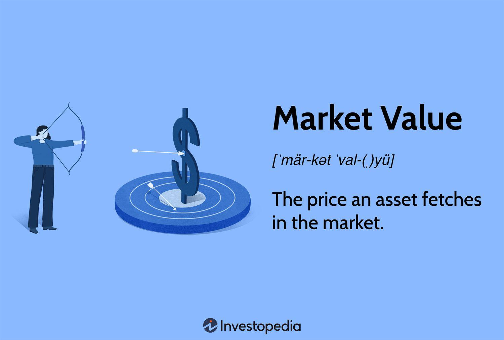

## Table of Contents

## What is market value?

Market value is the price that someone is willing to pay for something in the market at a certain time. It is used to find out how much things like houses, stocks, or businesses are worth. The market value can change because it depends on what people think the item is worth and how much they want it.

To find the market value, people look at things like how much similar items have sold for recently, what is happening in the economy, and what buyers and sellers think. For example, if many people want to buy a certain type of house, its market value might go up. But if fewer people want it, the value might go down. Market value is important because it helps people make decisions about buying and selling.

## How is market value determined?

Market value is figured out by looking at what people are willing to pay for something at a certain time. It's like a guess of how much something is worth based on what buyers and sellers think. To find this out, people check how much similar things have sold for recently. They also think about what's happening in the economy and how much people want the item. If lots of people want to buy something, its market value might go up. If not many people want it, the value might go down.

For example, if you want to know the market value of a house, you would look at the prices of other houses that are similar and have sold nearby. You would also think about things like the economy, interest rates, and how many people are looking to buy houses. All these things help decide the market value. It's important because it helps people make smart choices about buying and selling things.

## What factors influence market value?

Market value is influenced by many things. One big thing is how much people want something. If lots of people want to buy it, the market value goes up. If not many people want it, the value goes down. Another thing is what similar things have sold for recently. If houses like yours sold for a lot of money, your house's market value might be high too.

The economy also plays a big part. If the economy is doing well, people might have more money to spend, which can make market values go up. But if the economy is not doing well, people might not want to spend as much, and market values could go down. Interest rates are important too. If it's cheap to borrow money, more people might buy things, pushing up market values. If borrowing money is expensive, fewer people might buy, and market values could drop.

Lastly, location can affect market value a lot, especially for things like houses. If your house is in a popular area, its market value might be higher. Also, the condition of the item matters. If a house is in good shape, it might be worth more than a similar house that needs a lot of repairs. All these factors together help decide the market value of something.

## How does market value differ from book value?

Market value and book value are two ways to figure out how much something is worth, but they look at different things. Market value is what someone is willing to pay for something right now. It changes all the time based on what people think and want. For example, if a lot of people want to buy a certain type of car, its market value might go up. Market value is used a lot when people are buying and selling things like houses, stocks, or businesses.

Book value, on the other hand, is more about what something is worth on paper. It's usually found by looking at the original cost of something and then taking away how much it has worn out or lost value over time. For a company, book value can be found by subtracting its debts from what it owns. Book value doesn't change as quickly as market value and is often used in accounting to show the value of assets on a balance sheet. So, while market value is about what people are willing to pay now, book value is about what something is worth according to the records.

## What is the difference between market value and fair value?

Market value and fair value are two ways to figure out how much something is worth, but they look at things a bit differently. Market value is what someone is willing to pay for something right now in the market. It changes all the time based on what people think and want. For example, if a lot of people want to buy a certain type of house, its market value might go up. Market value is used a lot when people are buying and selling things like houses, stocks, or businesses.

Fair value, on the other hand, is a bit more complicated. It's what someone thinks something is worth based on a lot of information, not just what people are willing to pay right now. Fair value takes into account things like what similar items have sold for, what's happening in the economy, and even what might happen in the future. It's often used in accounting and finance to make sure things are valued in a way that's fair and makes sense, even if it's not exactly what the market says right now.

## How can market value be used in investment decisions?

Market value is really important when people are making choices about investments. If you're thinking about buying stocks, you'll look at the market value to see how much the stock is worth right now. If the market value is low, it might be a good time to buy because you could make money later if the value goes up. But if the market value is really high, you might decide to wait or sell because it might go down later.

Market value also helps when you're thinking about buying things like real estate or businesses. For example, if you want to buy a house to rent out, you'll check the market value to see if it's a good deal. If the market value of houses in that area is going up, it could be a good investment because you might be able to sell it for more later. But if the market value is dropping, you might want to look at other investments instead. So, knowing the market value helps you make smarter choices about where to put your money.

## What role does supply and demand play in market value?

Supply and demand are big reasons why market value changes. When there's a lot of something, like too many houses for sale, the market value can go down. That's because people have more choices, so sellers might have to lower their prices to get someone to buy. On the other hand, if there's not enough of something, like not many houses for sale in a popular area, the market value can go up. People might be willing to pay more because they really want what's available.

This balance between supply and demand helps set the market value all the time. If more people start wanting to buy something, like a new type of phone, the market value can go up because the demand is high. But if a lot of people are selling the same thing, like old phones, the market value can go down because there's too much supply. So, understanding supply and demand is really important for figuring out why things are worth what they are in the market.

## How do economic conditions affect market value?

Economic conditions play a big role in deciding market value. When the economy is doing well, people usually have more money to spend. This means they might be willing to pay more for things like houses, cars, or stocks, which can push up market values. For example, if people feel confident about their jobs and the future, they might be more likely to buy a new home, making the market value of homes go up. On the other hand, if the economy is not doing well, people might be more careful with their money. They might not want to spend as much, which can make market values go down. If people are worried about losing their jobs, they might not buy a new house, and the market value of homes could drop.

Interest rates are another part of economic conditions that affect market value. When interest rates are low, it's cheaper for people to borrow money. This can make them more likely to buy things like houses or cars, which can increase market values. For example, low interest rates might make more people want to take out a mortgage, pushing up the market value of homes. But when interest rates are high, borrowing money costs more, and people might not want to buy as much. This can make market values go down because fewer people are willing to spend. So, the overall health of the economy and interest rates are key factors in how market values change.

## What are the methods used to appraise market value?

To figure out the market value of something, people use different ways to look at it. One common way is the sales comparison approach. This means looking at what similar things have sold for recently. For example, if you want to know the market value of a house, you would check the prices of other houses that are similar and have sold nearby. This helps you see what people are willing to pay for houses like yours. Another way is the income approach, which is often used for things like rental properties or businesses. This method looks at how much money the property or business makes and uses that to guess its market value.

Another method is the cost approach, which is good for figuring out the market value of new or unique things. This way looks at how much it would cost to replace the thing if you had to build it again from scratch, and then takes away how much it has worn out over time. For example, if you want to know the market value of a new factory, you would think about how much it would cost to build a similar factory today and then subtract how much the current factory has lost value due to age and use. All these methods help people get a good idea of what something is worth in the market by looking at different parts of the picture.

## How does market value impact financial reporting?

Market value plays a big role in financial reporting because it helps companies show how much their assets are worth. When a company makes its financial statements, it needs to report the value of things like buildings, equipment, and investments. If the market value of these assets goes up, the company can show a higher value on its balance sheet, which can make it look healthier financially. On the other hand, if the market value drops, the company might have to report a lower value, which could make it look less financially strong. So, keeping an eye on market values helps companies give a true picture of their financial situation.

Market value also affects how companies report their profits and losses. For example, if a company owns stocks and the market value of those stocks goes up, the company might report a gain on its income statement. But if the market value goes down, the company could report a loss. This can change how much profit or loss the company shows, which is important for investors and others who look at the company's financial health. By using market values, companies can make sure their financial reports are as accurate and up-to-date as possible, helping everyone understand the real value of the company's assets and performance.

## What are the limitations of using market value in financial analysis?

Using market value in financial analysis can be tricky because it changes a lot. Market value depends on what people are willing to pay at a certain time, which can go up and down quickly. For example, the market value of a stock might be high one day and low the next because of news or what people think about the company. This makes it hard to use market value as a steady measure of how much something is worth. If you're trying to plan for the future or make long-term decisions, relying too much on market value can be risky because it might not show the true value of an asset over time.

Another problem with using market value is that it might not be the same as the real value of something. Sometimes, the market can get too excited or too worried, which makes market values go way up or way down. This can happen with things like stocks or houses. If everyone starts buying a certain stock because they think it's going to be the next big thing, its market value might go up a lot, even if the company isn't doing that well. On the other hand, if people are scared and start selling everything, market values can drop a lot, even if the assets are still worth a lot. So, while market value is important, it's good to look at other ways to value things too, like book value or fair value, to get a fuller picture.

## How can market value be manipulated and what are the implications?

Market value can be manipulated in different ways, often to make something seem more or less valuable than it really is. One way people do this is by spreading false information or rumors. For example, if someone wants to sell a stock at a higher price, they might say the company is doing better than it is, making more people want to buy the stock and pushing up its market value. Another way is through "pump and dump" schemes, where people talk up a stock to get the price high, then sell their own shares at the high price before the value drops again. This can also happen with things like houses, where sellers might make their house look better than it is to get a higher market value.

The implications of manipulating market value can be serious. When market values are artificially pushed up, people might pay too much for something, thinking it's worth more than it really is. This can lead to big losses when the true value comes out. For example, if someone buys a stock at a high price because of false information and then the price drops, they could lose a lot of money. Also, manipulating market values can hurt trust in the market. If people think the market values aren't real, they might not want to buy or sell as much, which can make the whole market less stable. Regulators, like the SEC, work hard to stop these kinds of manipulations, but it's still something that happens and can have big effects.

## What is the understanding of market value in valuation economics?

Market value plays a pivotal role in valuation economics as it determines the worth of an asset or a company in real-time, reflecting current market conditions. This concept is primarily influenced by the perceptions and behaviors of market participants, where supply and demand dynamics can lead to fluctuations. Essentially, market value is what investors are willing to pay for an asset, factoring in market sentiment, investor expectations, and macroeconomic conditions.

One of the critical differentiators between market value and book value is their basis of calculation. Market value is determined by current stock prices in the financial markets, often influenced by investor psychology and external factors such as news or economic indicators. On the other hand, book value is derived from the company's financial statements, reflecting historical cost accounting practices. It represents the net asset value of a company, providing a snapshot of what a company is worth if liquidated at that point.

To calculate market value, a straightforward and widely used approach is to multiply the total number of outstanding shares by the current market price per share. This formula can be expressed as:

$$
\text{Market Value} = \text{Outstanding Shares} \times \text{Current Market Price per Share}
$$

For example, if a company has 1 million shares outstanding and the current market price is $50, the market value would be $50 million.

Understanding market value is critical for investors and traders for several reasons. It enables them to determine whether an asset is overvalued or undervalued by comparing it to intrinsic value estimates. When the market value is lower than intrinsic values, assets may be considered undervalued, attracting buyers aiming for future gains. Conversely, when the market value exceeds intrinsic values, investors might see it as a signal to sell.

The ability to accurately assess market value is a key motivation for trading decisions. By analyzing market value fluctuations, traders can make informed predictions about potential price movements and strategize accordingly. This understanding leads to better decision-making, aligning buy and sell choices with market trends and individual risk profiles.

## References & Further Reading

[1]: Bergstra, J., Bardenet, R., Bengio, Y., & Kégl, B. (2011). ["Algorithms for Hyper-Parameter Optimization."](https://papers.nips.cc/paper/4443-algorithms-for-hyper-parameter-optimization) Advances in Neural Information Processing Systems 24.

[2]: ["Advances in Financial Machine Learning"](https://www.amazon.com/Advances-Financial-Machine-Learning-Marcos/dp/1119482089) by Marcos Lopez de Prado

[3]: ["Evidence-Based Technical Analysis: Applying the Scientific Method and Statistical Inference to Trading Signals"](https://www.amazon.com/Evidence-Based-Technical-Analysis-Scientific-Statistical/dp/0470008741) by David Aronson

[4]: ["Machine Learning for Algorithmic Trading"](https://github.com/PacktPublishing/Machine-Learning-for-Algorithmic-Trading-Second-Edition) by Stefan Jansen

[5]: ["Quantitative Trading: How to Build Your Own Algorithmic Trading Business"](https://books.google.com/books/about/Quantitative_Trading.html?id=j70yEAAAQBAJ) by Ernest P. Chan