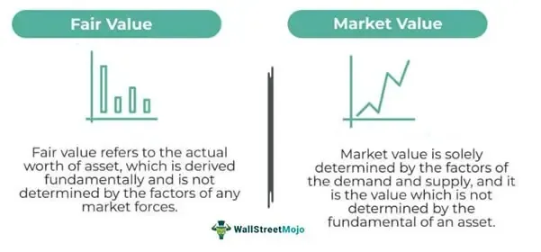

In today's fast-paced financial markets, staying informed about core concepts like Market Versus Quote (MVQ) and algorithmic trading is crucial for investors, regardless of their experience level. MVQ serves as a metric that compares a security's last traded price to its most recent bid and ask prices, providing insights into market liquidity and efficiency. Understanding MVQ alongside financial quotes offers a window into market sentiment and performance, highlighting differences between market and quoted prices that may influence trading decisions.

Algorithmic trading further enhances market interactions by automating trading decisions through predefined computer algorithms. This automation enables rapid trading execution and can exploit minor price movements that manual traders may overlook. By leveraging algorithmic trading, investors can benefit from increased trading speed, improved accuracy, and the ability to rigorously test and refine strategies, adapting to the dynamism of global markets.



This article aims to offer a thorough understanding of how MVQ analysis and algorithmic trading are shaping the contemporary trading environment. In doing so, it illustrates the transformative power of technology and data-driven decision-making in optimizing trading performance and managing investment risks. As automation continues to evolve, the intersection of MVQ, financial quotes, and algorithmic strategies will remain a key interest area for traders seeking to enhance their market positioning.

## Table of Contents

## Understanding Market Versus Quote (MVQ)

Market Versus Quote (MVQ) is an essential metric in financial markets, serving as a key indicator of a security's liquidity and market efficiency. The MVQ metric is determined by comparing the last traded price of a security to its most recent bid and ask prices. This comparison provides insights into how a particular security is being valued by the market participants at any given moment.

To calculate MVQ, one must assess the difference between the last traded price and the midpoint of the most recent bid and ask prices. For instance, if the last traded price is $P_{\text{last}}$, the bid price is $P_{\text{bid}}$, and the ask price is $P_{\text{ask}}$, the formula for determining the bid-ask midpoint is:

$$
P_{\text{mid}} = \frac{P_{\text{bid}} + P_{\text{ask}}}{2}
$$

Thus, the MVQ can be expressed as:

$$
\text{MVQ} = P_{\text{last}} - P_{\text{mid}}
$$

The significance of MVQ lies in its ability to reflect the [liquidity](/wiki/liquidity-risk-premium) of a security. A smaller MVQ value often suggests that the security is highly liquid, with frequent trading activity that ensures minimal discrepancies between the market price and the quoted prices. This typically occurs in markets with high trading volumes where the differences between the bid and ask prices are tight, ensuring efficient price discovery and execution of trades.

Conversely, a larger MVQ is indicative of a less liquid security. In such cases, there is often a wider bid-ask spread, signifying less frequent trading. This scenario could lead to higher transaction costs and difficulty in executing large trades without impacting the market price significantly. Hence, traders and investors closely monitor MVQ as it influences their trading strategies and decisions. By understanding the liquidity and market dynamics indicated by the MVQ, market participants can align their strategies to optimize trade execution, manage risk, and enhance overall market efficiency.

## The Role of Financial Quotes in MVQ Analysis

Financial quotes are integral to assessing market dynamics and underpin the calculation of Market Versus Quote (MVQ) metrics, providing a gauge for market sentiment and the immediate performance of assets. These quotes, which typically consist of the bid price, ask price, and last traded price, serve as critical indicators for traders and investors to identify discrepancies between market and quoted prices. 

MVQ is evaluated by analyzing the difference between the last traded price and the most recent bid and ask prices. The formula for calculating MVQ can be expressed as:

$$
\text{MVQ} = \left|\frac{\text{Last Traded Price} - \left(\frac{\text{Bid Price} + \text{Ask Price}}{2}\right)}{\left(\frac{\text{Bid Price} + \text{Ask Price}}{2}\right)} \right|
$$

This metric aids in assessing the efficiency and liquidity of a market. Securities with a low MVQ are typically associated with high liquidity, signifying that recent trade prices are close to the bid-ask spread. This indicates tight market conditions where trading occurs frequently and at prices near the prevailing market quote. For example, in markets where high-frequency trading is prevalent, the bid and ask prices are closely aligned with the last traded price, reducing the MVQ.

Conversely, illiquid securities often display a larger MVQ, revealing a significant gap between the market and quoted prices. This suggests that trades are infrequent or occur at prices divergent from the current market perception. Such conditions can result from larger spreads between the bid and ask prices, highlighting inefficiencies or a lack of active participation in the market.

By understanding these dynamics, investors are better equipped to interpret market signals and adjust their strategies accordingly, enabling them to make informed decisions based on real-time data. Financial quotes thus form the backbone of MVQ analysis, offering a snapshot of market conditions that are essential for strategic trading decisions.

## Algorithmic Trading and Automation

Algorithmic trading, commonly referred to as algo trading, employs computer algorithms to systematically execute trading decisions based on predefined criteria. These algorithms integrate large volumes of data to perform complex calculations, thus automating trading processes that would be labor-intensive and time-consuming if performed manually.

Automation offers a significant advantage in executing trades at high speeds. High-frequency trading ([HFT](/wiki/high-frequency-trading-strategies)), a subset of [algorithmic trading](/wiki/algorithmic-trading), showcases this capability by executing thousands of trades within seconds, capturing profits from small price fluctuations that may go unnoticed in manual trading. The rapid execution of trades also reduces the risk of slippage, where the execution price differs from the expected price, thereby maximizing the efficiency of order fulfillment.

Another key benefit of algorithmic trading is the reduction of human error. By removing human intervention from the decision-making process, algo trading minimizes emotional bias, which can often cloud judgment during volatile market conditions. This leads to more disciplined trading practices, adhering strictly to the strategy defined in the algorithm.

Moreover, algorithmic trading enables extensive [backtesting](/wiki/backtesting) of trading strategies. Backtesting involves simulating the strategy against historical data to evaluate its viability and performance before its actual implementation in live markets. This process helps in refining strategies by allowing traders to adjust parameters and conditions based on observed data patterns and outcomes. For example, a simple moving average crossover strategy can be tested across various datasets to ascertain profitable entry and [exit](/wiki/exit-strategy) points.

An example of a simple algorithmic strategy can be illustrated using Python:
```python
import pandas as pd

# Load historical price data
data = pd.read_csv('historical_prices.csv')

# Calculate moving averages
data['Short_MA'] = data['Close'].rolling(window=40).mean()
data['Long_MA'] = data['Close'].rolling(window=100).mean()

# Generate trading signals
def generate_signals(data):
    signal = 0  # 0 means do nothing
    if data['Short_MA'] > data['Long_MA']:
        signal = 1  # Buy signal
    elif data['Short_MA'] < data['Long_MA']:
        signal = -1  # Sell signal
    return signal

data['Signal'] = data.apply(generate_signals, axis=1)

# Determine performance
data['Strategy_Return'] = data['Signal'].shift(1) * (data['Close'].pct_change())
cumulative_return = (1 + data['Strategy_Return']).cumprod().iloc[-1]
print(f"Cumulative Return of Strategy: {cumulative_return}")
```
This snippet demonstrates a moving average crossover strategy, which generates buy signals when the short-term moving average rises above the long-term moving average and sell signals when it falls below.

In summary, the structured, rule-based nature of algorithmic trading enhances efficiency, accuracy, and the ability to adapt to various market conditions, making it an indispensable tool in modern financial markets.

## Leveraging Closing Quotes in Algorithmic Trading

Closing quotes play a pivotal role in algorithmic trading as they provide critical insights into the market sentiment at the end of a trading day. These data points are indispensable for crafting overnight trading strategies due to their reflection of market consensus after a full trading session. The closing price is often perceived as the most accurate representation of a security's value for a given day, making it a reliable metric for strategizing future trades.

Algorithmic systems capitalize on closing quotes by analyzing price trends and detecting potential reversals. This analysis helps in forming predictions about price movements when the market reopens. For instance, if a security shows a significant upward trend in its closing prices over consecutive days, an algorithm might identify this as a bullish signal, prompting a buy order at the next market opening.

To integrate closing quotes into broader trading strategies, algorithms often employ statistical models or [machine learning](/wiki/machine-learning) techniques. These models might include linear regression to identify trends or more complex models like neural networks to probe potential reversals. An example of a simple linear regression model in Python to evaluate closing price trends could be:

```python
import numpy as np
from sklearn.linear_model import LinearRegression
import matplotlib.pyplot as plt

# Mock data: closing quotes for ten days
closing_quotes = np.array([100, 102, 101, 105, 107, 110, 112, 115, 115, 120]).reshape(-1, 1)
days = np.array([1, 2, 3, 4, 5, 6, 7, 8, 9, 10]).reshape(-1, 1)

# Model fitting
model = LinearRegression()
model.fit(days, closing_quotes)

# Predicting trends
trend = model.predict(days)

# Visualization
plt.plot(days, closing_quotes, 'o', label='Closing Quotes')
plt.plot(days, trend, '-', label='Trend Line')
plt.xlabel('Days')
plt.ylabel('Closing Price')
plt.title('Trend Analysis with Closing Quotes')
plt.legend()
plt.show()
```

Utilizing closing quotes in automated trading processes allows traders to manage positions with precision while mitigating potential risks. Algorithms can systematically execute trades at optimal points based on historical closing price patterns, reducing human error and emotional decision-making. Furthermore, by continuously monitoring the closing price trends, algorithms can adjust strategies in real-time, aligning with the evolving market conditions.

Overall, leveraging closing quotes equips traders with the information needed to anticipate market movements, aiding in the development of strategies that aim to not only limit losses but also enhance profit margins in automated trading environments.

## Popular Algorithmic Strategies Using MVQ and Quotes

Strategies like mean reversion, [trend following](/wiki/trend-following), and statistical [arbitrage](/wiki/arbitrage) play a pivotal role in leveraging Market Versus Quote (MVQ) and closing quotes for generating effective trading signals.

Mean reversion is based on the principle that asset prices will tend to move back towards their historical average. In the context of MVQ, this strategy aims to capitalize on price discrepancies indicated by abnormal MVQ values. When the MVQ ratio is significantly higher or lower than typical levels, it may suggest that the security is temporarily mispriced compared to its historical average. Traders can identify these opportunities and predict that the price will revert to a more normalized level. This strategy generally assumes that the market overreacts to news, creating short-term price anomalies that can be corrected over time.

Trend following strategies rely on identifying and capitalizing on the [momentum](/wiki/momentum) of a security. These strategies use MVQ and closing quotes as signals to determine potential trends in the market. A persistently low MVQ ratio over several sessions may indicate a strong trend, prompting traders to follow the existing price direction. Conversely, a widening MVQ may signal a potential trend reversal. Traders employing trend following strategies often utilize technical indicators such as moving averages and relative strength index (RSI) to confirm trends.

Statistical arbitrage involves the exploitation of price differentials between correlated securities, typically by leveraging complex statistical and econometric techniques. MVQ and closing quotes play a crucial role in identifying these arbitrage opportunities. When the MVQ of a security deviates from its historical norms relative to a correlated asset, it could signal an imbalance. Traders can execute a long position on the undervalued asset and a short position on the overvalued one, profiting as prices converge. Statistical arbitrage requires sophisticated models and rapid execution to exploit short-lived inefficiencies.

Understanding and implementing these algorithmic strategies necessitates a thorough comprehension of market dynamics and a rigorous approach to risk management. Traders must consider market conditions and their risk tolerance to select the most appropriate strategy. Additionally, integrating data-driven insights into these strategies can enhance decision-making and improve the likelihood of success in today's competitive trading environment.

## Risks and Challenges in Algo Trading

Algorithmic trading, while advantageous, presents several risks and challenges that traders must navigate. One significant risk arises from technical failures, which can disrupt the execution of trades. As algorithms are dependent on technology, any failure in software, hardware, or connectivity can result in significant financial losses. Systems should be redundantly designed to ensure continuity in trading operations, minimizing the likelihood of a catastrophic system failure.

Furthermore, market [volatility](/wiki/volatility-trading-strategies) poses another risk to algorithmic trading. Rapid price movements can outpace the response time of algorithms, leading to unfavorable trade executions. During high volatility episodes, liquidity can also diminish, causing wider bid-ask spreads and increased slippage. Traders need to implement volatility filters and adjust their algorithms dynamically to better handle these situations.

Data inaccuracies are an additional concern for algorithmic traders. Algorithms rely on data inputs to make informed trading decisions, and inaccuracies in the data can lead to misguided trades. Maintaining high-quality data is crucial. This involves regularly validating and cleansing data to ensure its accuracy and reliability.

Mitigating these risks requires adopting robust risk management practices. Traders must continually test and adapt their algorithms to align with current market conditions and challenges. Backtesting strategies using historical data is a common practice to refine trading algorithms and reduce potential risks.

Compliance with regulatory standards also plays a pivotal role in mitigating risks associated with algorithmic trading. Regulatory environments can change rapidly, and adhering to these regulations is essential to avoid legal and financial repercussions. Keeping algorithms transparent and ensuring they are auditable can facilitate compliance with evolving standards.

In summary, while algorithmic trading offers speed and efficiency, it is not without risks. Traders must employ a combination of technological resilience, adaptive strategies, high-quality data, and strict adherence to regulatory standards to navigate the challenges presented by this trading method.

## Real-Life Success Stories

Several trading firms have effectively integrated Market Versus Quote (MVQ) data and algorithmic trading to gain a competitive advantage, displaying superior performance compared to traditional trading approaches. These success stories provide valuable insights into the potential of data-driven strategies in enhancing market operations and achieving financial goals.

One well-documented example is Renaissance Technologies, a prominent quantitative investment firm known for its Medallion Fund. The firm employs complex mathematical models and automated trading algorithms that incorporate MVQ analysis to exploit inefficiencies in market pricing. By maintaining a close watch on liquidity patterns and discrepancies between market prices and quoted prices, Renaissance Technologies has consistently achieved remarkable returns that outperform indices and other market benchmarks [Cohen, 2011; Woodard, 2016].

Another success story is the case of Citadel Securities, a leading market maker and trading firm. Citadel leverages MVQ data within its high-frequency trading (HFT) strategies to provide liquidity across different asset classes. By building algorithms that rapidly assess and respond to changes in bid-ask spreads and last traded prices, the firm has been able to efficiently manage large trade volumes while minimizing transaction costs. This capability has positioned Citadel as a major liquidity provider in global markets [Malkiel & Sauter, 2013].

A more recent example involves Two Sigma Investments, a [hedge fund](/wiki/hedge-fund-trading-strategies) that utilizes data science and technology to guide investment decisions. Two Sigma analyzes vast amounts of market data, including MVQ metrics, to develop predictive trading models. Their approach focuses on identifying statistical patterns that indicate pricing anomalies, thereby enhancing their ability to execute trades with precision and maximize returns [Gerstenhaber, 2018].

These cases underscore the transformative impact of integrating MVQ analysis with algorithmic trading techniques. Firms that successfully harness the power of data and automation can capture market inefficiencies, optimize liquidity provision, and achieve significant financial gains. The continuous refinement of algorithms and investment in cutting-edge technologies remain crucial for maintaining competitiveness in the ever-evolving financial landscape.

## Maximizing Profits with MVQ and Algo Trading

Combining Market Versus Quote (MVQ) analysis with algorithmic trading strategies offers a potent approach to optimizing trading outcomes. This method leverages the analytical strengths of MVQ and the operational efficiencies of automation, resulting in increased potential for profitability.

To maximize profits, traders must first ensure the selection of appropriate algorithms that align with their trading goals and market conditions. Traders may employ various algorithmic models, each customized to extract value from specific market scenarios. For instance, mean reversion algorithms can identify when a security's price deviates significantly from historical MVQ levels, anticipating a return to mean values. Here is an illustrative example of a mean reversion strategy in Python:

```python
import pandas as pd
import numpy as np

def mean_reversion_strategy(prices, window=20, threshold=0.01):
    moving_average = prices.rolling(window=window).mean()
    price_difference = (prices - moving_average) / moving_average

    signals = np.where(price_difference > threshold, -1, np.nan)  # Sell signal
    signals = np.where(price_difference < -threshold, 1, signals) # Buy signal
    signals = pd.Series(signals, index=prices.index).fillna(0)

    return signals

# Sample usage with stock prices
prices = pd.Series([100, 102, 98, 105, 100, 95, 110, 108, 103, 101])
signals = mean_reversion_strategy(prices)
```

Fine-tuning such strategies involves backtesting with historical data to identify optimal parameters. This iterative process allows traders to refine their models to achieve better predictive accuracy and efficacy in live markets.

Execution risk management is another critical element. High-frequency trading environments require meticulous control over trade execution to minimize slippage — the difference between expected and actual transaction prices. Deployment of sophisticated order types and routing strategies can mitigate these risks, thereby protecting potential profit margins.

Furthermore, staying apprised of technological advancements and evolving market trends fortifies an algorithmic trading strategy. With the rapid development of machine learning techniques, such as predictive analytics and natural language processing, traders can gain new insights from large data sets, consequently enhancing their strategic edge.

Ultimately, the intersection of MVQ analysis and algorithmic trading not only provides the tools necessary for profit maximization but also encourages adaptation to market dynamism. Utilizing cutting-edge technology and embracing continuous learning will ensure sustained success in the ever-changing financial landscape.

## Conclusion

Market Versus Quote (MVQ) analysis and algorithmic trading are essential tools for navigating modern financial markets, providing a clear pathway to improve trading efficiency and profitability. By leveraging the combination of technology and data insights, traders can manage risks more effectively while identifying and capitalizing on opportunities across various securities. 

MVQ analysis offers a decisive metric, allowing traders to evaluate the liquidity and market efficiency of assets. This metric can provide valuable input into trading strategies by highlighting discrepancies between market and quoted prices. Algorithmic trading, on the other hand, automates these strategies, executing trades at speeds and with precision beyond human capabilities. The synergy between MVQ and algorithmic trading amplifies market analysis and decision-making processes, thereby offering a competitive edge in fast-paced trading environments.

As technology continues to advance, the importance of staying abreast of new developments cannot be overstated. Continued education and adaptability are crucial for traders looking to refine their algorithmic strategies and leverage cutting-edge tools. By maintaining a commitment to learning and embracing technological innovations, traders can ensure they remain competitive in algorithmic trading, seizing emerging opportunities to maximize their profits.

## References & Further Reading

[1]: Hasbrouck, J. (2007). ["Empirical Market Microstructure: The Institutions, Economics, and Econometrics of Securities Trading."](https://academic.oup.com/book/52241) Oxford University Press.

[2]: Aldridge, I. (2009). ["High-Frequency Trading: A Practical Guide to Algorithmic Strategies and Trading Systems."](https://www.ahmetbeyefendi.com/wp-content/uploads/2020/07/High-Frequency-Trading-Irene-Aldridge.pdf) Wiley Finance.

[3]: Lo, A. W., & MacKinlay, A. C. (1999). ["A Non-Random Walk Down Wall Street."](https://www.amazon.com/Non-Random-Walk-Down-Wall-Street/dp/0691092567) Princeton University Press.

[4]: Bouchaud, J.-P., & Potters, M. (2003). ["Theory of Financial Risks and Derivative Pricing: From Statistical Physics to Risk Management."](https://www.cambridge.org/core/books/theory-of-financial-risk-and-derivative-pricing/5BBBA04CE72ED9E5E7C1C028D9A94FCB) Cambridge University Press.

[5]: Duhigg, C. (2009). ["Renaissance Technologies, Robert Mercer, and the Medallion Fund."](https://www.hedgethink.com/renaissance-technologies-fund-pioneering-the-quantitative-trading-revolution/) The New York Times.

[6]: Patterson, S. (2010). ["The Quants: How a New Breed of Math Whizzes Conquered Wall Street and Nearly Destroyed It."](https://scottpattersonbooks.com/books/the-quants/) Crown Business.

[7]: Kirilenko, A. A., & Lo, A. W. (2013). ["Moore's Law versus Murphy's Law: Algorithmic Trading and Its Discontents."](https://www.aeaweb.org/articles?id=10.1257/jep.27.2.51) The Journal of Finance.