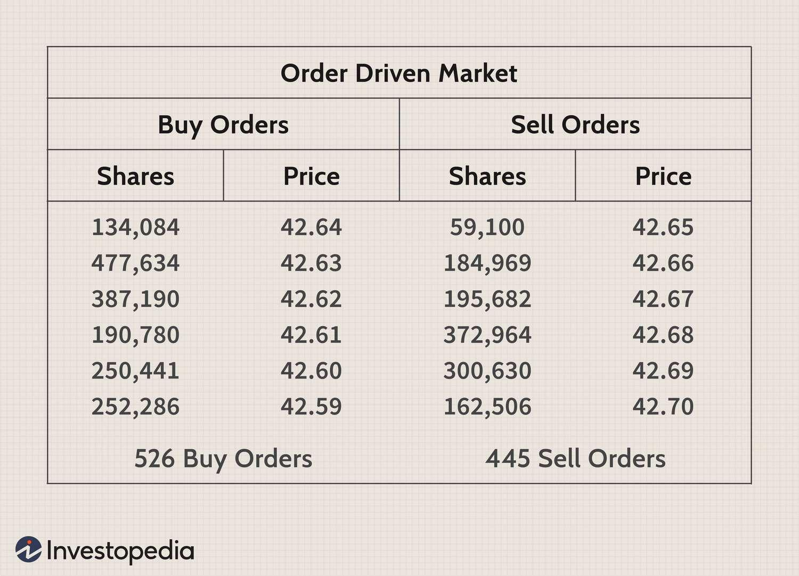

## Table of Contents

## What is the basic difference between a market order and a quote?

A market order is an instruction you give to buy or sell a stock right away at the current market price. When you place a market order, you're telling your broker to get the trade done as quickly as possible. This means you'll get the stock, but the exact price you pay might be a bit different from what you see on the screen because prices can change quickly.

A quote, on the other hand, is just information about the current price of a stock. It shows you the last price at which the stock was traded, and often includes the highest and lowest prices of the day, as well as the current bid and ask prices. A quote doesn't involve buying or selling; it's just a snapshot of what's happening with the stock at that moment.

## How does a market order work in stock trading?

When you want to buy or sell a stock quickly, you use a market order. This tells your broker to make the trade happen right away at the best available price. For example, if you see a stock priced at $50 and you place a market order to buy it, your broker will buy the stock for you at around $50. But remember, the price might be a little different by the time your order goes through because stock prices can change fast.

Market orders are great when you want to get in or out of a stock fast. They are usually filled quickly because they prioritize speed over price. However, this means you might end up paying a bit more or getting a bit less than you expected if the stock price moves suddenly. So, it's good to use market orders when you're okay with small price changes and just want to make sure your trade happens right away.

## What is the purpose of a quote in financial markets?

A quote in financial markets gives you important information about a stock's price. It tells you the last price the stock was traded at, which is helpful if you want to know what the stock is currently worth. A quote also shows the highest and lowest prices the stock reached during the day, so you can see how much the price has moved.

Besides the last traded price, a quote includes the bid and ask prices. The bid price is what buyers are willing to pay for the stock, and the ask price is what sellers are asking for it. This helps you understand the current demand and supply for the stock. Knowing these prices can help you decide if you want to buy or sell the stock at that moment.

## Can you explain the components of a quote?

A quote in the financial markets gives you important details about a stock's price. It shows the last price at which the stock was traded. This is useful because it tells you what the stock is currently worth. The quote also includes the highest and lowest prices the stock reached during the day. This helps you understand how much the stock's price has moved, giving you a sense of its volatility.

Another part of the quote is the bid price, which is the highest price someone is willing to pay to buy the stock right now. On the other hand, the ask price is the lowest price someone is willing to sell the stock for. The difference between the bid and ask prices is called the spread. Knowing these prices helps you see the current demand and supply for the stock. This information can guide you in deciding whether to buy or sell at that moment.

## What are the advantages of using a market order?

Using a market order is great when you want to buy or sell a stock quickly. When you place a market order, it tells your broker to get the trade done right away at the best price available. This means you can be sure your order will go through fast, which is really helpful if you need to make a trade in a hurry.

Another advantage is that market orders are simple to use. You don't have to worry about setting a specific price; you just tell your broker to buy or sell at the current market price. This makes it easier for people who are new to trading or who don't want to spend a lot of time thinking about the exact price they want to pay or receive.

## What are the potential risks associated with market orders?

One risk with market orders is that you might not get the exact price you see on your screen. Stock prices can change really fast, so by the time your order goes through, the price could be different. This means you might end up paying more than you wanted to buy a stock or getting less money than you hoped for when selling.

Another risk is that if a stock doesn't trade very often, your market order might cause the price to move a lot. This is called slippage. If there aren't many people trading that stock, your order to buy or sell can push the price up or down more than you expected. So, it's good to be careful with market orders for stocks that don't have a lot of trading activity.

## How does the timing of a market order affect its execution?

The timing of a market order can really change how it gets done. If you place a market order when the market is busy, like right at the opening or closing of the trading day, your order might take a bit longer to go through. This is because lots of people are trying to buy and sell at the same time. But, the good thing is, there are usually more buyers and sellers, so you might still get a pretty good price.

If you place your market order when the market is not so busy, it might go through faster because there are fewer orders to deal with. But, there's a catch. If there aren't many people trading the stock you want, your order might push the price up or down more than you expected. So, thinking about when to place your market order can help you get a better deal and avoid surprises.

## What factors should be considered when deciding between a market order and a quote?

When deciding between a market order and just looking at a quote, think about what you want to do. If you need to buy or sell a stock right away, a market order is the way to go. It tells your broker to make the trade happen at the current best price. But remember, the price might be a little different from what you see because prices can change fast. Market orders are good when you want speed and don't mind small price changes.

On the other hand, if you just want to know about a stock's price without buying or selling, a quote is what you need. A quote shows you the last price the stock traded at, the highest and lowest prices of the day, and the bid and ask prices. This helps you see how the stock is doing and what people are willing to pay or sell it for. It's useful for making decisions about whether to buy or sell later, but it doesn't actually do the trading for you.

## How do market orders and quotes impact liquidity in the market?

Market orders can help make the market more liquid. When you place a market order, you're telling your broker to buy or sell a stock right away at the best price available. This can help move stocks faster because it adds to the number of trades happening. More trades mean more people are buying and selling, which makes it easier for others to buy or sell their stocks too. So, market orders can help keep the market moving smoothly.

Quotes, on the other hand, show you information about a stock's price but don't directly affect liquidity. A quote tells you the last price a stock traded at, the highest and lowest prices of the day, and the bid and ask prices. This information can help traders decide if they want to buy or sell, but it's the actual buying and selling that makes the market liquid. So, while quotes help people make decisions, it's the market orders and other types of orders that really keep the market liquid by making trades happen.

## What advanced strategies involve the use of market orders and quotes?

One advanced strategy that involves market orders and quotes is called scalping. Scalpers use quotes to watch the bid and ask prices closely. They look for small price changes and use market orders to quickly buy and sell stocks to make small profits. Because market orders are fast, scalpers can get in and out of trades quickly. This strategy works best in a very liquid market where there's a lot of trading happening, so the market orders can be filled at the prices they want.

Another strategy is called market making. Market makers use quotes to set the bid and ask prices for a stock. They make money from the difference between these prices, which is called the spread. When someone wants to buy or sell using a market order, the market maker fills that order at the quoted prices. This helps keep the market liquid because market makers are always ready to buy or sell. They use market orders to manage their inventory of stocks and keep the market moving smoothly.

A third strategy involves using market orders to take advantage of big news or events. Traders might watch quotes to see how a stock's price reacts to news. If the price moves a lot, they might use a market order to quickly buy or sell the stock before the price changes even more. This can be risky because the price might keep moving in the opposite direction after they make their trade. But if they time it right, they can make a big profit from the quick price change.

## How do different trading platforms handle market orders and quotes differently?

Different trading platforms can handle market orders and quotes in their own ways. Some platforms might show you real-time quotes, which means you see the most up-to-date prices for stocks. Others might have a small delay, so the prices you see might not be as current. When it comes to market orders, some platforms might fill your order faster than others. This can depend on how many people are using the platform and how good their technology is. If a platform is really busy, it might take a bit longer for your market order to go through.

Also, some trading platforms might have different fees for market orders. One platform might charge you less to place a market order than another. This can affect how much you end up paying or getting when you trade. Some platforms might also have special features, like letting you see more detailed quotes or giving you tools to help you decide when to use a market order. So, it's a good idea to check out different platforms to see which one works best for you and your trading style.

## What are the regulatory considerations for market orders and quotes in different countries?

Different countries have their own rules about market orders and quotes. In the United States, the Securities and Exchange Commission (SEC) makes sure that quotes are fair and that market orders are filled at the best possible price. They have rules like the National Best Bid and Offer (NBBO) which means that when you place a market order, it should be filled at the best price available across all markets. This helps make sure that everyone gets a fair deal.

In Europe, the Markets in Financial Instruments Directive (MiFID) sets rules for how quotes and market orders work. MiFID wants to make sure that the markets are transparent and that investors get good prices. They have rules about how quotes should be shown and how market orders should be handled. Each country in Europe might have its own extra rules on top of MiFID, so it can be a bit different from one place to another.

In Asia, countries like Japan and Singapore have their own regulators, like the Financial Services Agency (FSA) in Japan and the Monetary Authority of Singapore (MAS). These regulators make rules to protect investors and keep the markets fair. They might have rules about how quickly market orders need to be filled and how quotes should be displayed. Just like in other parts of the world, the exact rules can change from one country to another in Asia.

## What is the difference between Market and Quote (MVQ)?

Market Versus Quote (MVQ) is an essential metric in financial markets, serving as a key indicator of a security's liquidity and market efficiency. The MVQ metric is determined by comparing the last traded price of a security to its most recent bid and ask prices. This comparison provides insights into how a particular security is being valued by the market participants at any given moment.

To calculate MVQ, one must assess the difference between the last traded price and the midpoint of the most recent bid and ask prices. For instance, if the last traded price is $P_{\text{last}}$, the bid price is $P_{\text{bid}}$, and the ask price is $P_{\text{ask}}$, the formula for determining the bid-ask midpoint is:

$$
P_{\text{mid}} = \frac{P_{\text{bid}} + P_{\text{ask}}}{2}
$$

Thus, the MVQ can be expressed as:

$$
\text{MVQ} = P_{\text{last}} - P_{\text{mid}}
$$

The significance of MVQ lies in its ability to reflect the [liquidity](/wiki/liquidity-risk-premium) of a security. A smaller MVQ value often suggests that the security is highly liquid, with frequent trading activity that ensures minimal discrepancies between the market price and the quoted prices. This typically occurs in markets with high trading volumes where the differences between the bid and ask prices are tight, ensuring efficient price discovery and execution of trades.

Conversely, a larger MVQ is indicative of a less liquid security. In such cases, there is often a wider bid-ask spread, signifying less frequent trading. This scenario could lead to higher transaction costs and difficulty in executing large trades without impacting the market price significantly. Hence, traders and investors closely monitor MVQ as it influences their trading strategies and decisions. By understanding the liquidity and market dynamics indicated by the MVQ, market participants can align their strategies to optimize trade execution, manage risk, and enhance overall market efficiency.

## What is the Role of Financial Quotes in MVQ Analysis?

Financial quotes are integral to assessing market dynamics and underpin the calculation of Market Versus Quote (MVQ) metrics, providing a gauge for market sentiment and the immediate performance of assets. These quotes, which typically consist of the bid price, ask price, and last traded price, serve as critical indicators for traders and investors to identify discrepancies between market and quoted prices. 

MVQ is evaluated by analyzing the difference between the last traded price and the most recent bid and ask prices. The formula for calculating MVQ can be expressed as:

$$
\text{MVQ} = \left|\frac{\text{Last Traded Price} - \left(\frac{\text{Bid Price} + \text{Ask Price}}{2}\right)}{\left(\frac{\text{Bid Price} + \text{Ask Price}}{2}\right)} \right|
$$

This metric aids in assessing the efficiency and liquidity of a market. Securities with a low MVQ are typically associated with high liquidity, signifying that recent trade prices are close to the bid-ask spread. This indicates tight market conditions where trading occurs frequently and at prices near the prevailing market quote. For example, in markets where high-frequency trading is prevalent, the bid and ask prices are closely aligned with the last traded price, reducing the MVQ.

Conversely, illiquid securities often display a larger MVQ, revealing a significant gap between the market and quoted prices. This suggests that trades are infrequent or occur at prices divergent from the current market perception. Such conditions can result from larger spreads between the bid and ask prices, highlighting inefficiencies or a lack of active participation in the market.

By understanding these dynamics, investors are better equipped to interpret market signals and adjust their strategies accordingly, enabling them to make informed decisions based on real-time data. Financial quotes thus form the backbone of MVQ analysis, offering a snapshot of market conditions that are essential for strategic trading decisions.

## References & Further Reading

[1]: Hasbrouck, J. (2007). ["Empirical Market Microstructure: The Institutions, Economics, and Econometrics of Securities Trading."](https://academic.oup.com/book/52241) Oxford University Press.

[2]: Aldridge, I. (2009). ["High-Frequency Trading: A Practical Guide to Algorithmic Strategies and Trading Systems."](https://www.ahmetbeyefendi.com/wp-content/uploads/2020/07/High-Frequency-Trading-Irene-Aldridge.pdf) Wiley Finance.

[3]: Lo, A. W., & MacKinlay, A. C. (1999). ["A Non-Random Walk Down Wall Street."](https://www.amazon.com/Non-Random-Walk-Down-Wall-Street/dp/0691092567) Princeton University Press.

[4]: Bouchaud, J.-P., & Potters, M. (2003). ["Theory of Financial Risks and Derivative Pricing: From Statistical Physics to Risk Management."](https://www.cambridge.org/core/books/theory-of-financial-risk-and-derivative-pricing/5BBBA04CE72ED9E5E7C1C028D9A94FCB) Cambridge University Press.

[5]: Duhigg, C. (2009). ["Renaissance Technologies, Robert Mercer, and the Medallion Fund."](https://www.hedgethink.com/renaissance-technologies-fund-pioneering-the-quantitative-trading-revolution/) The New York Times.

[6]: Patterson, S. (2010). ["The Quants: How a New Breed of Math Whizzes Conquered Wall Street and Nearly Destroyed It."](https://scottpattersonbooks.com/books/the-quants/) Crown Business.

[7]: Kirilenko, A. A., & Lo, A. W. (2013). ["Moore's Law versus Murphy's Law: Algorithmic Trading and Its Discontents."](https://www.aeaweb.org/articles?id=10.1257/jep.27.2.51) The Journal of Finance.