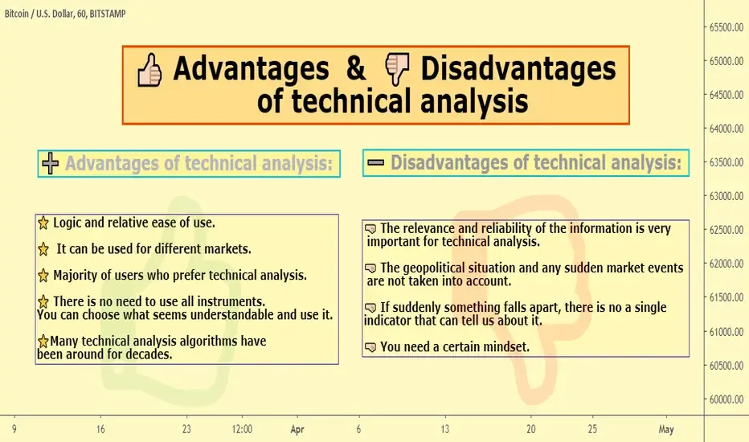

## Table of Contents

## What is technical analysis?

Technical analysis is a way to study and predict how the prices of things like stocks, currencies, or commodities might move in the future. It does this by looking at past price movements and trading volumes, rather than the actual value or health of the company or product. People who use technical analysis believe that all the information they need is already shown in the price movements and charts, so they don't need to look at other details about the company or market.

The main tools used in technical analysis are charts and indicators. Charts show how prices have changed over time, and they can be simple lines or more complex patterns. Indicators are calculations based on the price and volume data, and they help traders spot trends or possible turning points in the market. By studying these charts and indicators, traders try to find patterns that can help them decide when to buy or sell. While technical analysis can be useful, it's not perfect and it doesn't always predict the future correctly.

## What does 'market weakness' mean in the context of technical analysis?

In the context of technical analysis, 'market weakness' means that the market is not doing well and might go down in price. Traders look at different signs on charts to see if the market is weak. These signs can include things like prices going down over time, more people selling than buying, or certain patterns that show the market might keep going down.

When traders see these signs, they might decide to sell their investments to avoid losing more money. Market weakness can be a warning that it's time to be careful. But, it's important to remember that even if the market looks weak, it doesn't always mean it will definitely go down. Sometimes the market can surprise everyone and go up instead.

## How can beginners identify market weakness using simple technical indicators?

Beginners can identify market weakness by looking at a few simple technical indicators. One common indicator is the moving average. A moving average is a line on a chart that shows the average price of a stock or market over a certain period of time, like 50 days or 200 days. If the price of the stock or market falls below its moving average, it might be a sign of market weakness. This means more people might be selling than buying, and the price could keep going down.

Another simple indicator is the Relative Strength Index (RSI). The RSI measures how fast and how much a price has changed recently. It gives a number between 0 and 100. If the RSI is below 30, it might mean the market is oversold and could be weak. But if it's above 70, it might mean the market is overbought and could be strong. By watching these two indicators, beginners can get a sense of whether the market is showing signs of weakness or strength.

It's important for beginners to remember that no single indicator is perfect. They should use these tools along with other information and always be careful with their money. The market can be unpredictable, and what looks like weakness might turn into strength, or vice versa. So, it's good to keep learning and not rely on just one or two indicators to make decisions.

## What are the key technical indicators used to detect market weakness?

To detect market weakness, traders often use key technical indicators like the moving average and the Relative Strength Index (RSI). A moving average is a line on a chart that shows the average price of a stock or market over a certain period. If the price falls below this moving average, it might signal that the market is weak. This happens because more people are selling than buying, which can push the price down. Traders watch for this because it can help them decide when to sell their investments to avoid losing more money.

Another important indicator is the Relative Strength Index (RSI). The RSI measures how fast and how much the price has changed recently. It gives a number between 0 and 100. If the RSI is below 30, it might mean the market is oversold and weak. This suggests that the price has gone down a lot and might keep going down. On the other hand, if the RSI is above 70, it might mean the market is overbought and strong. By keeping an eye on these indicators, traders can get a sense of whether the market is showing signs of weakness or strength.

## How does volume play a role in confirming market weakness?

Volume is how many shares or contracts are traded in a market. It's like seeing how many people are buying and selling. When the market looks weak, and the volume is high, it means a lot of people are selling. This can confirm that the market is really weak because more people are getting out of their investments. If the price is going down and a lot of people are selling, it's a strong sign that the market might keep going down.

On the other hand, if the market looks weak but the volume is low, it might not be as bad. Low volume means fewer people are trading, so the weakness might not be as strong. It could mean that the market is just taking a small break and might go back up soon. So, volume helps traders see if the market weakness is real and strong or if it's just a small dip that might not last long.

## Can market weakness be observed in different time frames, and how does this affect analysis?

Market weakness can be seen in different time frames, like short-term (a few days or weeks), medium-term (a few months), or long-term (a year or more). Each time frame can show different things about the market. For example, if you look at a short-term chart, you might see the market is weak right now. But if you look at a long-term chart, the market might still be strong overall. This means that what looks weak in the short term might just be a small dip in a bigger, stronger trend.

Looking at different time frames can help traders understand the market better. If the market looks weak in all time frames, it's a stronger sign that the market might keep going down. But if the market looks weak in the short term but strong in the long term, it might just be a good time to buy because the price could go back up. So, checking different time frames helps traders make better decisions about when to buy or sell.

## What are the common chart patterns associated with market weakness?

Common chart patterns that show market weakness are the head and shoulders, the double top, and the bearish flag. The head and shoulders pattern looks like three peaks, with the middle peak being the highest. It means that the market tried to go up three times but couldn't keep going higher. The double top pattern looks like two peaks at about the same height. It means the market tried to go up twice but failed to break through a certain price. The bearish flag pattern looks like a small rectangle after a big drop in price. It means the market took a short break after falling but might keep going down.

These patterns help traders see that the market might be getting weaker. When traders see a head and shoulders or a double top, they might decide to sell their investments before the price goes down more. The bearish flag tells them that after a short break, the market could keep falling. By watching these patterns, traders can make better decisions about when to sell and avoid losing money. But remember, these patterns are not perfect, and the market can sometimes surprise everyone by going up instead of down.

## How do moving averages help in identifying and confirming market weakness?

Moving averages are lines on a chart that show the average price of a stock or market over a certain time, like 50 days or 200 days. They help traders see if the market is getting weaker by comparing the current price to the moving average. If the price of the stock or market falls below the moving average, it's a sign that the market might be weak. This happens because more people are selling than buying, which pushes the price down. Traders watch this closely because it can help them decide when to sell their investments to avoid losing more money.

To confirm market weakness, traders often use two moving averages together, like a short-term one (50 days) and a long-term one (200 days). If the short-term moving average crosses below the long-term moving average, it's called a "death cross." This is a strong sign that the market is getting weaker and might keep going down. By watching these moving averages, traders can get a better idea of whether the market is really weak or if it's just a small dip that might not last long.

## What are the advanced techniques for detecting market weakness that go beyond basic indicators?

Advanced techniques for detecting market weakness go beyond just looking at basic indicators like moving averages and RSI. One such technique is using the Fibonacci retracement levels. These levels help traders see where the price might go next after it has gone up or down. If the price falls to a key Fibonacci level, like 61.8%, and then keeps going down, it's a sign that the market might be weak. Traders also use the Elliott Wave Theory, which looks at patterns in the market to predict where it might go next. If the waves show a bearish pattern, it can confirm that the market is getting weaker.

Another advanced technique is using the Ichimoku Cloud, which is a more complex chart that shows support and resistance levels, as well as trend direction. If the price falls below the cloud, it's a sign of market weakness. Traders also look at the Average Directional Index (ADX) to see how strong a trend is. If the ADX is high and the trend is down, it means the market is not just weak but also moving strongly in that direction. By combining these advanced techniques with basic indicators, traders can get a clearer picture of whether the market is really weak or if it's just a small dip that might not last long.

## How can market weakness signals be integrated into a comprehensive trading strategy?

When you're making a trading plan, it's good to use signals of market weakness to help you decide when to buy or sell. You can start by looking at simple things like moving averages and the RSI. If the price goes below the moving average or the RSI is below 30, it might mean the market is weak. You can also check the volume to see if a lot of people are selling, which can confirm that the market is really weak. By using these basic signs, you can get a good idea of when the market might be going down.

But to make your trading plan even better, you can add more advanced techniques. For example, you can use Fibonacci retracement levels to see where the price might go next. If the price falls to a key level and keeps going down, it's a strong sign of weakness. You can also use the Ichimoku Cloud to see if the price is below the cloud, which means the market is weak. By combining these advanced techniques with the basic signs, you can make smarter choices about when to sell your investments. This way, you can avoid losing too much money and maybe even make some profit when the market goes down.

## What are the limitations and potential pitfalls of relying on technical analysis for detecting market weakness?

Using technical analysis to find out if the market is weak can be helpful, but it has some problems. One big problem is that technical analysis looks at past prices and patterns, but it can't always predict the future. Just because the market looked weak in the past doesn't mean it will keep being weak. Sometimes, the market can surprise everyone and go up instead of down. Also, technical analysis doesn't tell you why the market is weak. It might be because of something big happening in the world or because a company is doing badly, but you won't know that from just looking at charts.

Another issue is that people can see different things when they look at the same chart. What one trader thinks is a sign of weakness might look like a buying opportunity to another trader. This can make it hard to trust your own analysis. Plus, relying too much on technical analysis can make you miss important news or events that can change the market quickly. So, while technical analysis can be a good tool, it's important to use it along with other information and not depend on it too much.

## How do expert traders use market weakness signals in conjunction with other forms of analysis for better decision-making?

Expert traders use market weakness signals as part of a bigger picture when they make decisions. They don't just look at charts and indicators like moving averages or RSI. They also pay attention to what's happening in the world, like news about the economy or big events that might affect the market. By combining technical analysis with what's called [fundamental analysis](/wiki/fundamental-analysis), which looks at the real value and health of a company, they get a better idea of whether the market is really weak or if it's just a short dip. This helps them decide if it's a good time to sell their investments or if they should wait a bit longer.

Another thing expert traders do is use different time frames to check for market weakness. They might look at a short-term chart and see that the market looks weak right now, but then check a long-term chart and see that the market is still strong overall. By looking at both, they can tell if the weakness is just a small bump or part of a bigger problem. They also talk to other traders and listen to what experts are saying to get more information. By putting all these pieces together, expert traders can make smarter choices about when to buy or sell, and they're less likely to be surprised by sudden changes in the market.

## What is Understanding Market Weakness?

Market weakness is a critical concept in financial markets, embodying a state where the market shows signs of vulnerability and potential downturns. This vulnerability is typically indicated by declining prices, reduced trading volumes, and negative signals from technical indicators. Such conditions can pose significant challenges to traders and investors, necessitating a clear understanding to effectively navigate and mitigate associated risks.

One of the primary indicators of market weakness is a downward trend in the advance/decline line, which measures the number of advancing stocks minus the number of declining stocks over a period. A persistent negative trend suggests sustained selling pressure across a broad section of the market, signaling potential weakness. Moreover, high values in the Arms Index (TRIN) often accompany market weakness. The Arms Index is calculated as follows:

$$
\text{TRIN} = \left(\frac{\text{Advancing Issues}}{\text{Declining Issues}}\right) \div \left(\frac{\text{Advance Volume}}{\text{Decline Volume}}\right)
$$

A TRIN value greater than 1.0 typically indicates that the sell [volume](/wiki/volume-trading-strategy) is greater than the buy volume, exacerbating bearish conditions in the market.

Another significant indicator of market weakness is trading below key moving averages. Moving averages, such as the 50-day or 200-day averages, are vital tools for identifying trends. When asset prices consistently fall below these averages, it often points to a bearish sentiment and potential further declines in stock prices.

For traders, recognizing market weakness is essential as it impacts trading strategies. A weak market often necessitates a defensive approach, possibly involving reducing exposure to equities, increasing allocations in cash or bonds, or using hedging strategies like options or futures to protect against downside risks.

Identifying market weakness requires a careful analysis of these indicators and understanding their implications. By incorporating tools like the TRIN, moving averages, and the advance/decline line, traders can better anticipate potential downturns and adjust their strategies accordingly. Developing a keen insight into market weakness thus forms the cornerstone for constructing robust risk mitigation strategies and maintaining a resilient investment portfolio.

## What are the tools and techniques used in technical analysis?

Technical analysis is an analytical methodology for forecasting the direction of prices through the study of past market data, primarily price and volume. It is grounded in the assumption that historical trading activity and price changes often repeat themselves. By scrutinizing these patterns, traders can predict future market behavior and make more informed decisions.

**Key Tools in Technical Analysis**

1. **Moving Averages**: Moving averages are used to smooth price data to identify trends over a specific period. The simple moving average (SMA) calculates the average price over a set time frame, while the exponential moving average (EMA) gives more significance to recent prices, making it more responsive to new information. These tools are crucial for filtering out 'noise' and predicting trend directions.

   Formula for SMA:
$$
   \text{SMA} = \frac{P_1 + P_2 + \cdots + P_n}{n}

$$

   where $P$ is the price and $n$ is the number of periods.

2. **Relative Strength Index (RSI)**: RSI is a momentum oscillator that measures the speed and change of price movements. It operates on a scale of 0 to 100 and is traditionally used to identify overbought or oversold conditions in a market. An RSI above 70 suggests that a security might be overbought, while below 30 indicates it might be oversold.

   Calculation of RSI:
$$
   \text{RSI} = 100 - \frac{100}{1 + \frac{\text{Average Gain}}{\text{Average Loss}}}

$$

3. **Pattern Analysis**: This involves studying price charts to identify patterns like "head and shoulders," which signal potential price movements. Patterns can indicate continuation signals or reversal points, serving as vital inputs for decision-making.

4. **Support and Resistance Levels**: These levels represent the price points on a chart where an asset tends to stop and reverse. The ability to identify these levels allows traders to pinpoint market entry and exit points, as they represent areas where supply and demand have historically shifted.

**Application of Technical Indicators**

Technical indicators are essential tools for identifying market trends and potential reversal points. They help traders establish the foundation for making trading decisions. The integration of different indicators can provide a more comprehensive view, allowing traders to confirm signals and better understand price action.

**Determining Entry and Exit Points**

To optimize trading strategies, technical analysis helps traders determine precise market entry and [exit](/wiki/exit-strategy) points. For instance, a trader might decide to enter a trade when the RSI indicates an oversold market condition, complemented by a price bouncing off a support level. Similarly, traders may place exit orders when a price reaches a key resistance level or when the moving average signals a downtrend.

```python
# Example Python Code for Calculating SMA and RSI

def calculate_sma(prices, period):
    return sum(prices[-period:]) / period

def calculate_rsi(prices, period=14):
    gains = []
    losses = []
    for i in range(1, len(prices)):
        delta = prices[i] - prices[i - 1]
        if delta > 0:
            gains.append(delta)
            losses.append(0)
        else:
            gains.append(0)
            losses.append(abs(delta))

    average_gain = sum(gains[:period]) / period
    average_loss = sum(losses[:period]) / period

    if average_loss == 0:  # Prevent division by zero
        return 100

    rs = average_gain / average_loss
    return 100 - (100 / (1 + rs))

# Sample usage
prices = [45, 46, 44, 45, 47, 49, 50, 48, 51, 52, 55, 54, 53, 56]
sma = calculate_sma(prices, 5)
rsi = calculate_rsi(prices)
```

By employing these tools and techniques, traders can better navigate the complexities of financial markets, enhancing their capability to forecast market movements and make evidence-based trading decisions.

## References & Further Reading

[1]: Bergstra, J., Bardenet, R., Bengio, Y., & Kégl, B. (2011). ["Algorithms for Hyper-Parameter Optimization."](https://dl.acm.org/doi/10.5555/2986459.2986743) Advances in Neural Information Processing Systems 24.

[2]: ["Advances in Financial Machine Learning"](https://www.amazon.com/Advances-Financial-Machine-Learning-Marcos/dp/1119482089) by Marcos Lopez de Prado

[3]: ["Evidence-Based Technical Analysis: Applying the Scientific Method and Statistical Inference to Trading Signals"](https://www.amazon.com/Evidence-Based-Technical-Analysis-Scientific-Statistical/dp/0470008741) by David Aronson

[4]: ["Machine Learning for Algorithmic Trading"](https://github.com/stefan-jansen/machine-learning-for-trading) by Stefan Jansen

[5]: ["Quantitative Trading: How to Build Your Own Algorithmic Trading Business"](https://www.amazon.com/Quantitative-Trading-Build-Algorithmic-Business/dp/1119800064) by Ernest P. Chan