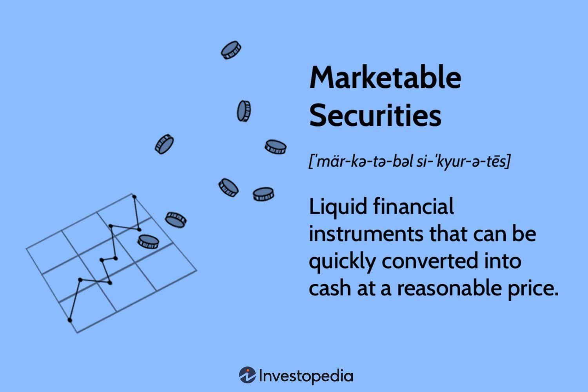

In today's financial landscape, investors are consistently exploring avenues to optimize their portfolios and maximize returns. This quest often encompasses the utilization of diverse financial instruments and strategies, notably marketable securities, marketable assets, and the implementation of algorithmic trading.

Marketable securities form an essential part of investment portfolios, offering a blend of liquidity and potential returns. These securities are characterized by their ability to be swiftly converted into cash, which empowers investors with the versatility to respond to fluctuating market conditions. Their liquidity makes marketable securities attractive to investors who need to maintain a certain level of fluidity within their portfolios.

In contrast, algorithmic trading signifies a technological progression in trading methodologies, utilizing computer algorithms to carry out trades with precision and efficiency that surpasses human capability. By automating trading strategies, algorithmic trading not only accelerates the trading process but also minimizes human error and emotion-driven decision-making. This technology allows for executing trades based on pre-determined criteria such as timing, price, and volume, enhancing the execution efficiency in trading plans.

This article provides an overview of investments in financial securities and marketable assets and discusses the significance of algorithmic trading in current financial markets. These elements, when considered together, represent a modern approach to portfolio management that combines the stability and accessibility of liquid assets with the cutting-edge precision and speed of algorithmic trading technologies.

## Table of Contents

## Understanding Financial Securities and Marketable Assets

Financial securities are essential components of the financial markets, acting as tradable instruments that can be bought and sold by investors. These instruments typically include stocks, bonds, and options. Stocks represent equity ownership in a company, providing investors with the possibility of capital appreciation and dividends. Bonds are fixed-income securities, where investors lend money to an entity, such as a corporation or government, in exchange for periodic interest payments and the return of the bond's face value upon maturity. Options are financial derivatives that provide the right, but not the obligation, to buy or sell an underlying asset at a predetermined price before a specified expiration date.

Marketable assets, on the other hand, comprise securities that can be easily converted into cash. This ease of conversion defines their marketability, with examples including Treasury bills and money market instruments. Treasury bills are short-term government securities with maturities ranging from a few days to one year, offering a way for investors to lend money to the government at low risk. Money market instruments, such as commercial paper and certificates of deposit, are also short-term financial products that maintain liquidity and safety.

The key benefit of marketable assets is their [liquidity](/wiki/liquidity-risk-premium), allowing investors to convert them into cash with minimal loss of value. This feature is particularly crucial in volatile or uncertain market conditions where quick access to funds can help mitigate risk.

These assets are vital for the financial strategies of both individuals and corporations. On the individual side, they provide a safe avenue for preserving capital while [earning](/wiki/earning-announcement) modest returns. For corporations, marketable securities offer a mechanism to manage excess cash reserves efficiently. This allows companies to maintain flexibility and readiness for capital expenditures or unforeseen expenses.

In summary, understanding the nuances of financial securities and marketable assets is essential for crafting effective investment strategies, as they provide a balance between liquidity, safety, and potential returns.

## Marketable Securities: A Key Component of Portfolios

Marketable securities are highly liquid financial instruments, making them indispensable in short-term investment strategies. Their liquidity stems from their ease of conversion into cash with minimal impact on their value. This characteristic is crucial for both individual and corporate investors, allowing them to quickly respond to financial needs or opportunities without incurring significant losses.

Corporations often prefer marketable securities for managing surplus cash. These securities offer a temporary investment vehicle for excess funds, ensuring quick access to capital when necessary. By maintaining a portion of their assets in marketable securities, companies can effectively manage their short-term liquidity needs while earning returns on otherwise idle cash.

The appeal of marketable securities lies not only in their liquidity but also in their balance between safety and return potential. Investors seeking to manage risk in volatile markets gravitate toward these instruments because they provide both a buffer against market uncertainty and a means to achieve modest gains. This balance is especially pertinent in environments with fluctuating interest rates or economic instability.

Several types of marketable securities are commonly utilized for these purposes. Publicly traded stocks offer ownership stakes in companies and the potential for dividends and capital gains. Government bonds, known for their lower risk, provide a stable return backed by the issuing government's creditworthiness. Money market instruments, including Treasury bills and commercial paper, offer short-term investment options with attractive liquidity and lower risk compared to longer-term investments.

In summary, the strategic use of marketable securities enables investors to maintain flexibility and manage risk while achieving an appropriate balance between liquidity and returns. This makes them a vital component of diversified portfolios aimed at optimizing capital allocation and meeting both immediate and future financial objectives.

## Algorithmic Trading: Revolutionizing Market Strategies

Algorithmic trading is a transformative approach in financial markets where computer algorithms execute trades quickly and efficiently based on predetermined criteria such as timing, price, and [volume](/wiki/volume-trading-strategy). This method allows for the swift execution of high-frequency trades, enabling traders to exploit short-lived market opportunities that would be difficult to perceive manually. By leveraging advanced computational techniques, [algorithmic trading](/wiki/algorithmic-trading) can evaluate vast amounts of data at speeds unattainable by human traders, potentially enhancing profitability and market responsiveness.

One of the primary benefits of algorithmic trading is its capacity to enhance liquidity within financial markets. By facilitating rapid trades, it helps maintain a continuous supply of buy and sell orders, thereby reducing market spreads and increasing overall market efficiency. Moreover, algorithmic trading can alleviate the emotional and cognitive biases that often influence human decision-making in trading scenarios, leading to more consistent and rational execution based on data-driven insights.

Despite these advantages, algorithmic trading is not without risks. The reliance on complex algorithms and automated systems necessitates precise coding and robust risk management practices. System errors, such as those stemming from coding bugs or unforeseen market events, can lead to significant disruptions, exemplified by incidents like the infamous "flash crash" of May 2010 when major stock indices in the United States plunged rapidly before quickly recovering. To mitigate such risks, it is essential to maintain comprehensive monitoring systems and implement fail-safes that can intervene during anomalies.

Algorithmic trading also demands a significant initial investment in technology and expertise, making it more accessible to large institutions rather than individual retail investors. Nonetheless, advancements in financial technology and increased availability of computational resources are gradually expanding the accessibility of algorithmic trading tools to a broader audience.

In conclusion, while algorithmic trading represents a significant evolution in market strategies, offering increased efficiencies and the potential for enhanced returns, it also requires careful oversight and sophisticated risk management. As financial markets continue to evolve, the role of algorithmic trading will likely expand, driven by ongoing technological advancements and innovations in data analytics. Traders and investors must remain informed of these developments to harness the full potential of algorithmic strategies effectively.

## The Confluence of Marketable Securities and Algorithmic Trading

Algorithmic trading finds a particularly advantageous application in trading marketable securities due to their inherently high liquidity. The high liquidity of marketable securities, like stocks and government bonds, allows for rapid trade execution, which is essential for algorithmic trading to capitalize on fleeting market opportunities. The efficiency of portfolio management is significantly enhanced by the ability to quickly execute trades at optimal prices. This rapidity is pivotal in maintaining an agile investment strategy, enabling investors to respond to market changes with minimal delay.

Algorithmic trading strategies, such as [arbitrage](/wiki/arbitrage) and trend-following, are especially well-suited for marketable securities. Arbitrage exploits price discrepancies across different markets or instruments, requiring rapid execution to realize profits before the market corrects itself. The liquidity of marketable securities ensures that these trades are executed swiftly, optimizing the potential for profit. Trend-following strategies, which depend on detecting and riding market trends, also benefit from the liquidity of marketable securities, allowing for seamless adjustments to positions in response to trend signals.

The convergence of algorithmic trading and marketable securities represents a cutting-edge evolution in financial market strategies. This integration offers a competitive edge by combining the immediacy and precision of algorithmic systems with the versatility and accessibility of marketable securities. As financial markets increasingly adopt technological innovations, the synergy between these elements highlights a forward-thinking approach that marries traditional financial instruments with modern trading methodologies, setting the stage for future advancements in investment practices. 

Investors aiming to optimize their portfolios can leverage the capabilities of algorithmic trading in the context of marketable securities to achieve enhanced performance and adapt to the fast-paced dynamics of global markets. The ongoing development and refinement of algorithmic techniques promise a continued evolution of strategies, ensuring that portfolios remain robust and responsive in an ever-changing financial landscape.

## Conclusion

Investments in financial securities and marketable assets, complemented by algorithmic trading, continue to evolve, offering unprecedented opportunities and challenges. The integration of these components in portfolio strategies is crucial for adapting to the dynamic nature of financial markets. Understanding the intricate dynamics of financial securities and marketable assets is essential for investors seeking to make informed decisions and harness market opportunities.

Marketable assets provide liquidity and can be an effective tool for managing risk, allowing investors to quickly reposition their portfolios in response to economic shifts. Algorithmic trading enhances this adaptability by executing trades more rapidly and efficiently than manual processes. These algorithms, based on pre-determined criteria, enable high-frequency trading and the exploitation of market conditions which might be imperceptible to human traders.

As technology advances, staying updated with trends in algorithmic trading and marketable securities will be vital for achieving financial success. The rapid innovation in this field demands that investors maintain a keen awareness of technological developments and evolving market structures. For instance, the increasing use of [machine learning](/wiki/machine-learning) and [artificial intelligence](/wiki/ai-artificial-intelligence) in trading algorithms presents both opportunities for increased efficiency and challenges related to data security and system stability.

Investors are encouraged to blend traditional investment approaches with modern, algorithm-driven strategies to navigate the complexities of today's financial landscape. While traditional investment principles provide a foundation of stability and risk management, modern technologies offer tools for optimizing performance and gaining a competitive edge.

Remaining vigilant and adaptable is essential. By integrating traditional methods with innovative technologies, investors can better position themselves to respond to both anticipated and unforeseen changes in the global economy. Consequently, those who can effectively combine these strategies will likely thrive in the increasingly complex world of finance.

## References & Further Reading

[1]: ["Advances in Financial Machine Learning"](https://www.amazon.com/Advances-Financial-Machine-Learning-Marcos/dp/1119482089) by Marcos Lopez de Prado

[2]: ["Quantitative Trading: How to Build Your Own Algorithmic Trading Business"](https://books.google.com/books/about/Quantitative_Trading.html?id=j70yEAAAQBAJ) by Ernest P. Chan

[3]: ["Machine Learning for Algorithmic Trading"](https://github.com/PacktPublishing/Machine-Learning-for-Algorithmic-Trading-Second-Edition) by Stefan Jansen

[4]: Bergstra, J., Bardenet, R., Bengio, Y., & Kégl, B. (2011). ["Algorithms for Hyper-Parameter Optimization."](https://dl.acm.org/doi/10.5555/2986459.2986743) Advances in Neural Information Processing Systems 24.

[5]: Aldridge, I. (2013). ["High-Frequency Trading: A Practical Guide to Algorithmic Strategies and Trading Systems"](https://onlinelibrary.wiley.com/doi/pdf/10.1002/9781119203803.fmatter). Wiley.

[6]: Aronson, D. R. (2007). ["Evidence-Based Technical Analysis: Applying the Scientific Method and Statistical Inference to Trading Signals"](https://www.amazon.com/Evidence-Based-Technical-Analysis-Scientific-Statistical/dp/0470008741). Wiley.