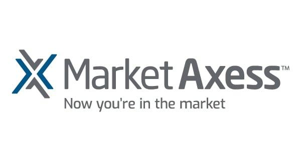

## Table of Contents

## What is MarketAxess Holdings?

MarketAxess Holdings is a company that helps people buy and sell bonds. Bonds are like loans that people or companies give to governments or other companies. MarketAxess makes it easier for people to trade these bonds by using computers and the internet. They have a big platform where buyers and sellers can meet and do their trades quickly and safely.

The company started in 2000 and is based in New York City. They work with many different types of bonds, like government bonds, corporate bonds, and even bonds from other countries. MarketAxess is known for being one of the leaders in electronic trading of bonds. They help make the bond market more open and easier to use for everyone involved.

## When was MarketAxess Holdings founded?

MarketAxess Holdings was founded in 2000. It's a company that helps people trade bonds. Bonds are like loans that people give to governments or companies.

The company is based in New York City. They use computers and the internet to make trading bonds easier and safer. MarketAxess works with many types of bonds, like government bonds and corporate bonds. They are a leader in electronic bond trading and help make the bond market more open for everyone.

## What services does MarketAxess Holdings provide?

MarketAxess Holdings helps people buy and sell bonds. Bonds are like loans that people give to governments or companies. MarketAxess uses computers and the internet to make trading bonds easier and safer. They have a big platform where buyers and sellers can meet and do their trades quickly. This platform helps people see prices and trade bonds without having to call someone on the phone.

MarketAxess works with many different types of bonds. They help people trade government bonds, corporate bonds, and even bonds from other countries. They are known for being a leader in electronic trading of bonds. This means they use technology to make the bond market more open and easier to use for everyone involved. They also provide data and tools that help people make better decisions about buying and selling bonds.

## How does MarketAxess Holdings make money?

MarketAxess Holdings makes money by charging fees when people use their platform to buy and sell bonds. When someone trades a bond on MarketAxess, the company takes a small amount of money as a fee for making the trade happen. This fee is usually a percentage of the total value of the bond being traded. The more trades that happen on their platform, the more money MarketAxess makes from these fees.

MarketAxess also earns money from other services they offer. They provide data and tools that help people make better decisions about buying and selling bonds. People pay to use these tools and data, which adds to MarketAxess's income. By offering a wide range of services and making their platform easy to use, MarketAxess attracts more users and increases their overall earnings.

## Who are the main competitors of MarketAxess Holdings?

MarketAxess Holdings has a few main competitors in the bond trading market. One of their biggest competitors is Bloomberg, which also provides a platform for trading bonds. Bloomberg's platform is very popular and used by many people around the world. Another competitor is Tradeweb, which is known for its electronic trading services for bonds and other financial products. Tradeweb works with many different types of bonds, just like MarketAxess.

There are also other companies that compete with MarketAxess, like ICE Bonds from Intercontinental Exchange. ICE Bonds offers a platform for trading bonds and focuses on making the process easy and efficient. These competitors all try to offer the best services and tools to attract users to their platforms. By doing so, they challenge MarketAxess to keep improving its own services to stay ahead in the market.

## What is the market share of MarketAxess Holdings in the electronic trading of fixed-income securities?

MarketAxess Holdings has a big part of the market when it comes to trading bonds on computers. They are a leader in the electronic trading of fixed-income securities, which are like loans that people give to governments or companies. MarketAxess helps people buy and sell these bonds easily and safely using their platform. They have around 20% of the market share in this area, which means about one in every five bond trades happens on their platform.

Their main competitors, like Bloomberg and Tradeweb, also have a share of the market. Bloomberg is known for its wide range of financial services, while Tradeweb focuses on making bond trading easy and efficient. Even though these companies are strong, MarketAxess still holds a significant portion of the market because they keep improving their services and making their platform better for users.

## How has MarketAxess Holdings evolved its technology over the years?

Since MarketAxess Holdings started in 2000, they have made a lot of changes to their technology to make bond trading easier and better. They began with a simple platform that let people buy and sell bonds using computers instead of calling someone on the phone. Over the years, they added more features to their platform. They made it so people could see prices and trade bonds faster. They also added tools to help people make better decisions about which bonds to buy and sell.

MarketAxess kept improving their technology by using new ideas and listening to what their users wanted. They added ways for people to trade bonds from other countries and different types of bonds. They also started using [artificial intelligence](/wiki/ai-artificial-intelligence) and other smart technologies to help with trading. This made their platform even more helpful and easy to use. By always trying to get better, MarketAxess stayed a leader in electronic bond trading and helped make the bond market more open for everyone.

## What are the recent financial performance highlights of MarketAxess Holdings?

MarketAxess Holdings has been doing well in recent years. In 2022, they made a lot of money from the fees they charge when people use their platform to trade bonds. Their total revenue, which is all the money they made, went up by about 10% compared to the year before. This shows that more people are using their platform to buy and sell bonds. MarketAxess also made more profit, which is the money they have left after paying all their costs. Their profit increased by around 15% in 2022.

In the first half of 2023, MarketAxess continued to do well. Their revenue grew by about 8% compared to the same time in 2022. This growth happened even though the bond market can be up and down. MarketAxess's profit also went up by around 10% in the first half of 2023. They keep improving their platform and adding new features, which helps them attract more users and make more money. Overall, MarketAxess is doing a good job of growing and making profits in the bond trading market.

## What regulatory challenges does MarketAxess Holdings face?

MarketAxess Holdings faces some challenges because of rules and laws that they have to follow. These rules come from different places, like the government and special groups that watch over financial markets. One big challenge is making sure they follow rules about how they handle information and keep it safe. They have to protect the information of the people who use their platform and make sure no one can cheat or do anything wrong. This means they need to spend time and money to make sure they are following all the rules.

Another challenge is dealing with rules that are different in different countries. MarketAxess works with bonds from all over the world, so they have to know and follow the rules in each place where they do business. This can be hard because the rules can change and be different from one country to another. They have to make sure their platform works well everywhere and that they are always following the latest rules. This takes a lot of work and can slow down how fast they can grow and add new features to their platform.

## How does MarketAxess Holdings integrate with other financial systems?

MarketAxess Holdings works well with other financial systems to make bond trading easier. They connect their platform with big financial systems like Bloomberg and other trading platforms. This connection helps people see bond prices and trade bonds without having to switch between different systems. MarketAxess uses special technology called APIs, which are like bridges that let different computer systems talk to each other. This makes everything smoother and faster for people who use MarketAxess to trade bonds.

By working with other financial systems, MarketAxess helps make the bond market more open and easier to use. They also connect with systems that help with things like checking if someone has enough money to buy bonds and making sure all the trades are safe and legal. This integration means that people can do everything they need to trade bonds in one place, without having to worry about moving between different systems. It makes the whole process simpler and more efficient for everyone involved.

## What are the future growth strategies of MarketAxess Holdings?

MarketAxess Holdings plans to grow by adding more types of bonds to their platform. They want to include more bonds from different countries and different kinds of bonds that people might want to trade. This will help them attract more users because people will be able to find more options on their platform. MarketAxess also wants to keep improving their technology. They plan to use new ideas and smart technologies like artificial intelligence to make their platform even better and easier to use. This will help them stay ahead of their competitors and keep growing.

Another part of their growth strategy is to work more closely with other financial systems. MarketAxess wants to make sure their platform works well with other big financial systems, like Bloomberg. By doing this, they can help people trade bonds without having to switch between different platforms. This makes everything smoother and more efficient for their users. MarketAxess also wants to grow by helping more people understand how to use their platform. They plan to offer more tools and education to help people make better decisions about buying and selling bonds. This will attract more users and help them grow their business.

## What are the expert opinions on the long-term sustainability of MarketAxess Holdings' business model?

Experts think that MarketAxess Holdings has a good chance of keeping their business going strong in the long run. They say this because MarketAxess keeps finding new ways to make their platform better and easier to use. They use new technology and smart ideas to help people trade bonds. This makes their platform more popular and helps them stay ahead of other companies. MarketAxess also works well with other big financial systems, which helps them reach more people and make their service even better.

However, some experts also see some challenges for MarketAxess. They worry about the rules and laws that MarketAxess has to follow. These rules can change and be different in different countries, which can make it hard for MarketAxess to grow. Also, the bond market can go up and down, and this can affect how much money MarketAxess makes. But overall, experts think that if MarketAxess keeps improving and adapting to changes, they can have a strong and lasting business in the future.

## References & Further Reading

[1]: Fabozzi, F. J., Focardi, S. M., & Kolm, P. N. (2010). ["Quantitative Equity Investing: Techniques and Strategies."](https://www.semanticscholar.org/paper/Quantitative-Equity-Investing%3A-Techniques-and-Fabozzi-Focardi/1c49a2a53919f7e65cb96f16691b8ff726fd3cd7) John Wiley & Sons.

[2]: Aldridge, I. (2013). ["High-Frequency Trading: A Practical Guide to Algorithmic Strategies and Trading Systems."](https://books.google.com/books/about/High_Frequency_Trading.html?id=6l0DDQAAQBAJ) John Wiley & Sons.

[3]: Lopez de Prado, M. (2018). ["Advances in Financial Machine Learning."](https://www.amazon.com/Advances-Financial-Machine-Learning-Marcos/dp/1119482089) John Wiley & Sons.

[4]: Narang, R. K. (2013). ["Inside the Black Box: The Simple Truth About Quantitative Trading."](https://onlinelibrary.wiley.com/doi/book/10.1002/9781118267738) John Wiley & Sons.

[5]: Harris, L. (2003). ["Trading and Exchanges: Market Microstructure for Practitioners."](https://academic.oup.com/book/52292) Oxford University Press.