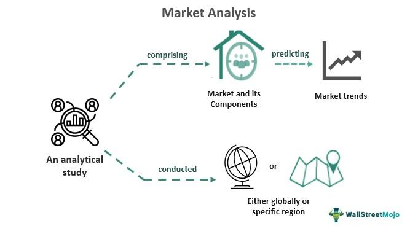

Quantitative analytics is integral to the evolution of algorithmic trading. It involves the application of mathematical, statistical, and computational techniques to optimize trading strategies. These methods enable traders to analyze vast amounts of financial data, uncover patterns, and make informed decisions with precision and speed. The role of quantitative analytics is paramount in transforming traditional trading methods, offering enhanced efficiency and effectiveness in executing trades.

MarketQA has emerged as a pivotal entity in the quantitative analytics landscape. By providing sophisticated analytical tools and solutions, MarketQA enhances the capabilities of traders and investment firms. Its innovative approaches in data analysis and model development have set a benchmark in the industry, supporting traders in navigating complex financial markets.

The advancement of technology in quantitative trading is reshaping the financial industry. Cutting-edge techniques, such as machine learning and artificial intelligence, allow for the development of complex trading models that automatically adapt to changing market conditions. These innovations have become essential in creating robust and adaptive quantitative strategies, furthering the efficiency of trading operations.

Quantitative analysis offers significant advantages over traditional trading approaches. It provides a systematic and objective framework for decision-making, reducing emotional bias. By leveraging high-frequency data and employing backtested models, quantitative analytics increases the accuracy and speed of trading decisions, ultimately leading to improved trading performance.

In conclusion, the emergence of technology-driven solutions, epitomized by MarketQA, is enhancing the scope and impact of quantitative analytics in the trading sector. As the landscape of algorithmic trading continuously evolves, the integration of advanced analytics and technology remains crucial in sustaining trading efficiency and accuracy. The strategic application of quantitative analytics paves the way for future innovations and a more sophisticated trading ecosystem.

## Table of Contents

## What is Quantitative Analytics in Algo Trading?

Quantitative analytics in [algorithmic trading](/wiki/algorithmic-trading) involves using mathematical models, statistical analyses, and computational techniques to inform and enhance trading decisions. This approach leverages vast datasets to identify patterns, trends, and inefficiencies in the financial markets. Quantitative analytics provides a systematic, data-driven foundation for developing and executing trading strategies, offering a significant advantage over more traditional, discretionary trading methods.

A key component of quantitative analytics is the integration of complex mathematical models. These models help in pricing financial instruments, managing risk, and forecasting market movements. For example, the Black-Scholes model is utilized for pricing options, while the Capital Asset Pricing Model (CAPM) helps in assessing expected returns. By integrating these models with high-frequency data, traders can optimize their algorithms for better returns.

Statistical analyses are also paramount in quantitative analytics, aiding in the understanding of market behavior. Techniques such as regression analysis, [machine learning](/wiki/machine-learning), and time series analysis are employed to identify correlations and causal relationships between various market variables. The use of statistical [arbitrage](/wiki/arbitrage) is a popular strategy, where traders exploit price discrepancies between related financial instruments. This strategy relies heavily on identifying statistical deviations from expected relationships, allowing traders to execute trades that capture profits when prices converge back to their expected values.

Trend following and mean reversion are other examples of strategies employed in [quantitative trading](/wiki/quantitative-trading). Trend-following strategies attempt to capitalize on strong market trends by buying high and selling higher, while mean reversion strategies focus on assets that deviate significantly from their historical averages, expecting these deviations to revert over time. These strategies benefit from quantitative analytics by providing a systematic approach to decision-making, reducing emotional bias and improving execution efficiency.

The significance of data-driven strategies over traditional practices is apparent in their ability to process and analyze large volumes of data quickly and accurately. This capacity enables traders to identify opportunities and execute trades at speeds unattainable by human traders relying on manual processes. Moreover, quantitative analytics facilitates [backtesting](/wiki/backtesting), a vital process in strategy development. By simulating a trading strategy on historical data, traders can determine its potential success before deploying it in live markets.

Overall, quantitative analytics enhances decision-making and trading efficiency by providing a robust framework for analyzing market data and developing profitable strategies. It allows traders to systematically exploit market opportunities, manage risk, and improve performance through the continuous refinement of strategies based on empirical evidence.

## Role of MarketQA in Quantitative Analytics

MarketQA has emerged as a significant entity in quantitative analytics, particularly within the domain of algorithmic trading. This company's contributions are reflected in its innovative approaches, tools, and technologies designed to optimize trading performance and accuracy.

MarketQA's innovative approaches have set a new benchmark in the field of quantitative analytics. The company employs advanced data science techniques to uncover insights from large datasets, facilitating more effective decision-making processes in algorithmic trading. This methodology integrates mathematical models, statistical analyses, and computational power, allowing MarketQA to derive actionable insights that enhance traders' strategic decisions.

The tools and technologies developed by MarketQA play a pivotal role in enhancing algorithmic trading. The company offers platforms that incorporate machine learning algorithms and big data analytics, enabling traders to process and analyze vast amounts of market data in real time. These tools allow for the development of sophisticated trading strategies that can adapt to changing market conditions, thus optimizing performance.

Several case studies highlight the effectiveness of MarketQA's analytics solutions. For instance, a prominent [hedge fund](/wiki/hedge-fund-trading-strategies) reported a significant improvement in its trading accuracy after incorporating MarketQA's analytics tools into its strategy development process. This was achieved by leveraging MarketQA's capabilities to refine and backtest trading models, ensuring that strategies were robust against historical market events and anomalies.

MarketQA's impact on trading performance and accuracy cannot be overstated. By providing robust analytical tools, the company has enabled traders to significantly reduce risks associated with market [volatility](/wiki/volatility-trading-strategies). These tools assist in identifying patterns and anomalies in market data, aiding in the development of strategies that are not only profitable but also resilient to market fluctuations. Furthermore, MarketQA's analytics have been instrumental in increasing the speed and efficiency of trade executions, thereby minimizing opportunities for slippage and increasing the overall profitability of trading strategies.

In conclusion, MarketQA's contributions to quantitative analytics have been transformative, offering crucial advancements that enhance algorithmic trading's efficiency and effectiveness. Their innovative tools and technologies provide traders with the means to navigate complex market environments, improving decision-making capabilities and trading performance.

## Types of Quantitative Strategies Employed

Algorithmic trading has transformed market interactions, largely due to the application of quantitative strategies. These strategies are designed to leverage data-driven insights to optimize trading performance, often by executing trades at speeds and frequencies unattainable by human traders. Below is an overview of popular quantitative strategies and their application within algorithmic trading, notably with the assistance of MarketQA's advanced analytical tools.

### Statistical Arbitrage
Statistical arbitrage, often referred to as "stat arb," revolves around identifying pricing inefficiencies between securities. Typically, this involves pairs trading, a strategy where traders identify two closely related stocks and take opposite positions based on expected mean reversion. 

The core concept relies on statistical models to predict price movements and ensure that any deviations from historical price patterns represent opportunities for profit. MarketQA's quantitative analytics enhance this approach by providing robust statistical tools to model these relationships precisely. Algorithms can pinpoint optimal entry and [exit](/wiki/exit-strategy) points, thereby improving the risk-adjusted returns of these trades.

### Trend Following
Trend following is a strategy that capitalizes on the [momentum](/wiki/momentum) of an asset, holding that prices which have been moving in one direction will continue to do so. This strategy is less about predicting reversals and more about riding existing trends as long as possible. 

Quantitative analytics play a pivotal role here by employing moving averages, momentum indicators, and [breakout](/wiki/breakout-trading) techniques to systematically identify and act on these trends. With MarketQA's tools, traders can efficiently backtest historical data to identify which trends have historically proven profitable, adjusting their models accordingly to maximize future gains.

### High-Frequency Trading
High-frequency trading ([HFT](/wiki/high-frequency-trading-strategies)) employs powerful algorithms to execute a high number of orders at rapid speeds, capturing minuscule price discrepancies. Speed and low latency are critical, meaning technological infrastructure and precise algorithms define success in this domain. 

MarketQA enhances high-frequency strategies through its advanced data analytics platforms, which optimize algorithmic efficiency and execution speed. The firm’s analytics tools help in refining these algorithms by offering insights into latency, slippage, and rebate structures, which are crucial components of high-frequency trading profits.

### Comparison of Effectiveness
Each quantitative strategy has its distinct advantages and limitations. Statistical arbitrage suits markets with identifiable long-term relationships, whereas [trend following](/wiki/trend-following) thrives in volatile environments with clear directional movement. High-frequency trading requires extensive technological resources but offers rapid profit potential with even the smallest market movements.

### Backtesting and Strategy Refinement
Integral to all these strategies is the concept of backtesting—simulating a strategy's performance using historical data to gauge its potential effectiveness before actual deployment. This process is critical in refining strategies and ensuring they are not overfitted to past data, a common pitfall that can lead to significant financial losses when market conditions change.

MarketQA provides extensive backtesting capabilities, allowing traders to test hypotheses and tweak algorithms iteratively. This iterative process includes altering parameters based on past performance outcomes, stress-testing strategies against various market scenarios, and continuously seeking improvement in algorithm robustness.

Through MarketQA’s comprehensive suite of analytical tools, traders can effectively evaluate and enhance their quantitative trading strategies. By leveraging these capabilities, traders can gain a competitive edge in algorithmic trading environments.

## Technological Tools in Quantitative Trading

Technological advancements have significantly influenced quantitative trading, with a variety of tools and platforms emerging as essential aids in the development and execution of algorithmic strategies. Among the most prominent programming languages employed in the quantitative finance sector are Python, R, and MATLAB.

Python has gained widespread popularity due to its simplicity and extensive library support. Libraries such as Pandas and NumPy facilitate data manipulation and numerical computation, while SciPy and Scikit-learn are utilized for statistical modeling and machine learning tasks. Matplotlib and Seaborn are well-regarded for data visualization, allowing analysts to interpret and present data trends effectively. The flexibility of Python makes it a preferred choice for both prototyping and deploying trading strategies.

R is another language that is heavily used for statistical analysis and data visualization. It offers robust packages such as Tidyverse for data manipulation and ggplot2 for high-quality visualizations. These tools help quants analyze market data and develop model-driven insights, thereby enhancing trading decision efficiency.

MATLAB is favored in situations requiring rapid prototyping and iterative testing, particularly owing to its powerful computational and visualization toolboxes. It supports integration with external data sources and systems, facilitating the quick implementation of algorithmic models within trading frameworks.

Machine learning libraries are instrumental in quantitative trading, providing the capability to identify intricate patterns and relationships within vast datasets. TensorFlow and PyTorch are [neural network](/wiki/neural-network) libraries that enable the development of [deep learning](/wiki/deep-learning) models capable of predicting price movements. These tools aid in the advancement of adaptive models that can respond to evolving market conditions with precision.

Big data and AI play crucial roles in advancing quantitative methodologies. The ability to process and analyze vast amounts of unstructured data, sourced from financial markets or alternative datasets, enhances the decision-making process. Technologies such as Hadoop and Apache Spark allow for distributed processing of large datasets, providing scalability and speed which are essential for high-frequency trading environments.

MarketQA, as a leading provider of quantitative analytics solutions, leverages these technological tools to optimize trading strategies and enhance market performance. By integrating Python and R interfaces within their analytics platforms, MarketQA provides flexibility and comprehensive analytical capabilities to traders and analysts. The incorporation of machine learning algorithms and big data processing capabilities into its solutions enables MarketQA to offer nuanced insights and predictive analytics, optimizing trading execution and expanding the potential for profitable trades.

Through the convergence of these technological tools and data analytics capabilities, MarketQA fosters an environment where quantitative strategies are not only developed with precision but executed with enhanced efficacy and adaptability.

## Challenges and Ethical Considerations

Identifying key challenges in algorithmic trading involves understanding the complexities and risks quants face in this domain. Algorithmic trading is predominantly driven by quantitative models and computational algorithms, which, while reducing human error, introduce their own set of challenges. One significant challenge is developing models capable of adapting to the ever-changing market conditions. These models must be robust enough to handle varying degrees of volatility and unexpected market events, such as economic announcements or geopolitical tensions, which can significantly affect trading outcomes.

The potential risks associated with algorithmic and automated trading systems include technical failures, data inaccuracies, and the inadvertent amplification of market anomalies. A common risk is the possibility of executing trades based on outdated or erroneous data, leading to substantial financial losses. Moreover, automated systems can exacerbate market volatility if not properly monitored, as evidenced by events such as the Flash Crash of 2010.

Ethical considerations and regulations are increasingly shaping the landscape of quantitative trading. Regulatory bodies, such as the U.S. Securities and Exchange Commission (SEC) and the European Securities and Markets Authority (ESMA), have implemented policies to ensure fair and transparent trading practices. Quants must navigate these regulations adeptly to avoid legal repercussions while ensuring competitive trading strategies. Ethical considerations also extend to the use of big data and machine learning, where concerns about privacy and data security are paramount.

Handling market volatility and unexpected events requires sophisticated risk management strategies. Quants utilize advanced statistical and probabilistic models to predict and mitigate the impact of such events. Techniques like Value at Risk (VaR) and stress testing are commonly employed to evaluate potential risks and prepare contingency plans.

MarketQA, a leader in quantitative analytics, addresses these challenges through comprehensive risk management frameworks and adherence to ethical guidelines. Their approach includes rigorous testing of algorithms, continuous monitoring for performance anomalies, and implementing robust data validation protocols. MarketQA emphasizes transparency and compliance with industry regulations to reinforce ethical practices in algorithmic trading. By leveraging cutting-edge technologies and maintaining a strong ethical framework, MarketQA aids quants in navigating the intricate landscape of quantitative trading.

## Future Trends in Quantitative Analytics for Trading

The field of quantitative analytics for trading is evolving rapidly, driven by technological advancements and changing market dynamics. As we look to the future, several emerging trends are expected to shape the landscape of algorithmic trading.

Technological progress is having a profound impact on quantitative strategies. High-performance computing and advanced algorithms allow traders to analyze vast volumes of data faster and with greater precision. Machine learning and [artificial intelligence](/wiki/ai-artificial-intelligence) are increasingly integrated into trading models, enabling systems to learn from past data and improve decision-making processes.

Market dynamics are equally influential. With the growth of electronic trading platforms and the availability of granular market data, traders can refine strategies to exploit short-term market inefficiencies. These dynamics prompt a shift towards more sophisticated models that can adapt to changing market conditions in real-time.

Quantum computing is a pioneering technology with potential applications in trading. Unlike classical computers, quantum computers can process complex calculations simultaneously, potentially solving optimization problems faster and more efficiently. While still in its infancy, quantum computing could revolutionize trading strategies by significantly improving the speed at which large datasets are processed.

Blockchain technology is also emerging as a significant player in the trading world. Its decentralized and secure nature can enhance trading transparency and reduce counterparty risks. Additionally, smart contracts—self-executing contracts with the terms of the agreement written into code—can automate trading processes, further increasing efficiency.

MarketQA envisions leveraging these advancements to continue leading in quantitative analytics. By integrating cutting-edge technologies such as AI, quantum computing, and blockchain into their suite of tools, MarketQA plans to enhance trading accuracy and performance. Their roadmap focuses on developing adaptive algorithms that can preemptively identify and capitalize on market opportunities, ensuring they remain at the forefront of innovation in quantitative trading.

In conclusion, the future of quantitative analytics in trading is bright, with technology playing a pivotal role in driving new strategies and efficiencies. As advancements unfold, industry leaders like MarketQA are well-positioned to capitalize on these opportunities, setting new standards for success in algorithmic trading.

## Conclusion

Quantitative analytics stands as a cornerstone of modern trading, providing a foundation for algorithmic decision-making and strategic execution. By leveraging complex mathematical models and computational techniques, quantitative analytics facilitates insights that drive efficiency and precision in trading. The shift towards data-driven methodologies has revolutionized traditional practice, improving decision-making capabilities and minimizing human error.

MarketQA has emerged as a pivotal figure in this field, offering innovative solutions that enhance the efficacy of algorithmic trading strategies. The firm's contributions extend across developing advanced tools and technologies that refine data analysis and strategy implementation. MarketQA's analytics solutions have demonstrably improved trading performance, underscoring the importance of its role in advancing quantitative methodologies and accuracy.

The rapidly evolving nature of algo trading and quantitative analytics emphasizes the necessity for continuous exploration and adoption of these strategies. As trading markets grow more complex, the demand for robust analytical approaches intensifies, highlighting the need for financial entities to integrate cutting-edge quantitative techniques. MarketQA exemplifies the commitment to pushing the frontiers of trading technology, offering resources and solutions that facilitate deeper engagement with quantitative analytics.

Given these advancements, professionals and institutions alike are encouraged to embrace quantitative strategies actively. Engaging with MarketQA's sophisticated tools and frameworks can provide a competitive edge, fostering innovation and optimization in trading activities. As the landscape of algorithmic trading continues to evolve, MarketQA promises to be a leader in shaping the future of quantitative analytics. For those interested in advancing their understanding or practice of algo trading, MarketQA offers a wealth of opportunities to explore and leverage the latest in quantitative strategies.

## References & Further Reading

[1]: Bergstra, J., Bardenet, R., Bengio, Y., & Kégl, B. (2011). ["Algorithms for Hyper-Parameter Optimization."](https://proceedings.neurips.cc/paper/2011/file/86e8f7ab32cfd12577bc2619bc635690-Paper.pdf) Advances in Neural Information Processing Systems 24.

[2]: ["Advances in Financial Machine Learning"](https://www.amazon.com/Advances-Financial-Machine-Learning-Marcos/dp/1119482089) by Marcos Lopez de Prado

[3]: ["Evidence-Based Technical Analysis: Applying the Scientific Method and Statistical Inference to Trading Signals"](https://www.amazon.com/Evidence-Based-Technical-Analysis-Scientific-Statistical/dp/0470008741) by David Aronson

[4]: ["Machine Learning for Algorithmic Trading"](https://github.com/stefan-jansen/machine-learning-for-trading) by Stefan Jansen

[5]: ["Quantitative Trading: How to Build Your Own Algorithmic Trading Business"](https://books.google.com/books/about/Quantitative_Trading.html?id=j70yEAAAQBAJ) by Ernest P. Chan