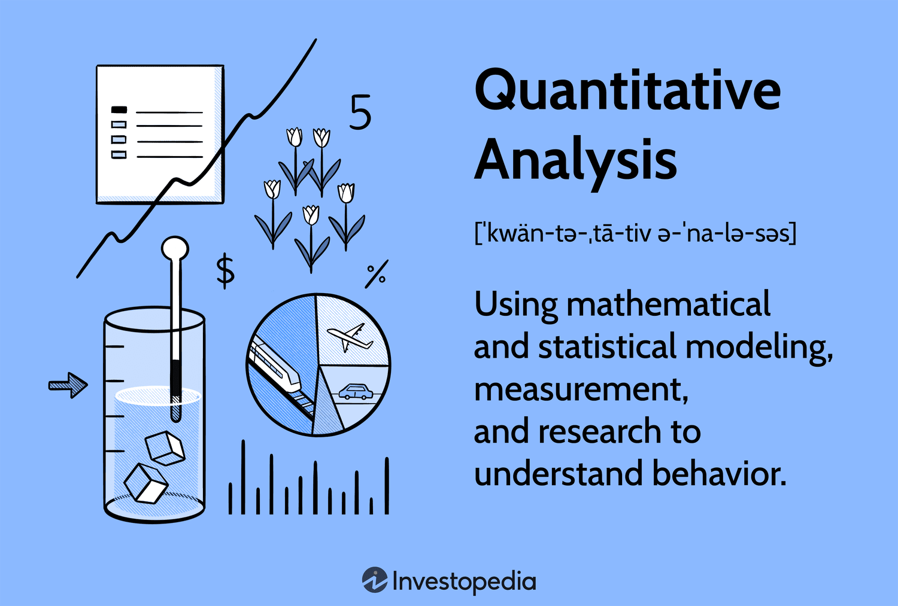

## Table of Contents

## What is MarketQA and why is it important in finance?

MarketQA is a tool that helps people in the finance world understand markets better. It uses a lot of data and special computer programs to answer questions about what's happening in the markets. This can be things like why stock prices are going up or down, or what might happen in the future. By using MarketQA, people can make smarter choices about buying and selling stocks, bonds, and other investments.

MarketQA is important because it makes it easier for everyone to understand complex financial information. Instead of having to read lots of reports and guess what they mean, people can just ask MarketQA their questions. This saves time and helps people make better decisions. It's especially useful for people who don't have a lot of experience in finance, because it breaks down hard information into simple answers.

## How does MarketQA differ from traditional qualitative analysis?

MarketQA uses computers and lots of data to answer questions about the market. It looks at numbers and patterns to give clear answers quickly. This is different from traditional qualitative analysis, which involves people reading reports, talking to experts, and using their own judgment to understand the market. Qualitative analysis can take a long time and depends a lot on the person doing the analysis.

MarketQA makes it easier for everyone to understand the market because it turns complex information into simple answers. You don't need to be an expert to use it. On the other hand, traditional qualitative analysis often requires a lot of experience and knowledge. It's more about understanding the stories and reasons behind the numbers, which can be very detailed and nuanced. MarketQA is faster and more straightforward, while qualitative analysis can give deeper insights but takes more time and effort.

## What are the basic tools and techniques used in MarketQA?

MarketQA uses a lot of data and special computer programs to understand the market. It looks at things like stock prices, trading volumes, and economic reports. These are all numbers that the computer can read and analyze quickly. The main tool MarketQA uses is called [machine learning](/wiki/machine-learning). This is a type of computer program that can learn from the data it sees and get better at answering questions over time. It helps MarketQA find patterns and make predictions about what might happen in the market.

Another important technique MarketQA uses is called natural language processing. This lets MarketQA understand questions that people ask in normal, everyday language. So, instead of having to learn special codes or terms, people can just ask their questions the way they would talk to a friend. This makes MarketQA easy to use for everyone. Together, these tools and techniques help MarketQA give quick and clear answers about the market, making it easier for people to make smart choices about their investments.

## Can you explain the concept of quantitative modeling in MarketQA?

Quantitative modeling in MarketQA is all about using math and numbers to understand the market. It's like a recipe that uses data instead of ingredients to predict what might happen next. MarketQA takes a lot of information, like stock prices and how much people are buying and selling, and puts it into special math formulas. These formulas help MarketQA see patterns and make guesses about the future. It's like trying to solve a puzzle, but instead of pieces, you have numbers and data.

This kind of modeling is really important because it helps MarketQA give clear answers to people's questions. Instead of just guessing or using feelings, MarketQA uses hard numbers to figure things out. This makes its predictions more reliable. When people ask MarketQA about the market, it uses these math models to give them the best information it can. This way, people can make smarter choices about their money, knowing that the advice they're getting is based on solid data and not just someone's opinion.

## What data sources are typically used in MarketQA?

MarketQA uses a lot of different data to understand the market. It looks at things like stock prices, which tell you how much a company's shares are worth at any time. It also uses trading volumes, which show how many shares are being bought and sold. Another important source is economic reports, like those about jobs, inflation, and how fast the economy is growing. These reports help MarketQA see the bigger picture of what's happening in the world.

In addition to these, MarketQA also uses data from news articles and social media. This helps it understand what people are talking about and how they feel about the market. By looking at all these different kinds of information, MarketQA can see patterns and make better predictions. It's like putting together a big puzzle, where every piece of data helps complete the picture of what's going on in the market.

## How can MarketQA be applied to improve investment strategies?

MarketQA can help people make better investment choices by giving them clear answers about the market. When someone wants to know if they should buy or sell a stock, they can ask MarketQA. It uses a lot of data to look at things like stock prices and how much people are buying and selling. This helps it see patterns and predict what might happen next. By using these predictions, people can decide when to buy or sell, making their investment strategies smarter and more likely to make money.

Another way MarketQA helps is by making it easier to understand complex financial information. Instead of reading long reports and trying to figure out what they mean, people can just ask MarketQA their questions. This saves time and helps people make quick decisions. For example, if someone is thinking about investing in a new company, they can ask MarketQA about the company's future. With the information MarketQA provides, they can make a more informed choice, improving their overall investment strategy.

## What are some common statistical methods used in MarketQA?

MarketQA uses a lot of different math tricks to understand the market. One common trick is called regression analysis. This helps MarketQA see how different things, like stock prices and economic reports, are connected. It's like figuring out how much one thing affects another. Another trick is time series analysis, which looks at how things change over time. This helps MarketQA predict what might happen next by looking at what happened before.

Another important method is called clustering. This helps MarketQA group similar things together, like stocks that behave in similar ways. By doing this, it can find patterns that might not be easy to see otherwise. MarketQA also uses something called [factor](/wiki/factor-investing) analysis, which helps it understand what's really driving changes in the market. It's like finding the main reasons behind all the numbers. These methods help MarketQA give clear and useful answers about the market, making it easier for people to make smart choices about their investments.

## How does machine learning enhance MarketQA?

Machine learning makes MarketQA smarter by helping it learn from the data it sees. It's like a student who gets better at solving math problems the more they practice. MarketQA uses machine learning to find patterns in things like stock prices and trading volumes. This means it can predict what might happen in the market better over time. Instead of just looking at numbers once, MarketQA can keep learning and improving its guesses about the future.

This learning ability also helps MarketQA understand the questions people ask. With machine learning, it can figure out what people mean even if they ask in different ways. This makes MarketQA easier to use because people don't need to learn special terms or codes. They can just ask their questions the way they would talk to a friend. By getting better at understanding questions and predicting market trends, MarketQA helps people make smarter choices about their investments.

## What are the challenges and limitations of implementing MarketQA?

One big challenge of using MarketQA is that it needs a lot of data to work well. It looks at things like stock prices and economic reports, but if this data is not correct or complete, MarketQA can make mistakes. Also, the market can change quickly, and sometimes the data MarketQA uses might be old by the time someone asks a question. This means its answers might not always be up to date, which can be a problem when people need to make fast decisions.

Another limitation is that MarketQA uses math and computer programs to understand the market, but it can't always see the whole picture. Sometimes, things like news events or people's feelings about the market can affect stock prices in ways that numbers alone can't explain. MarketQA might miss these important details because it focuses on data and patterns. So, while it can give good guesses about what might happen, it's not perfect and people should use it along with other ways of understanding the market.

## Can you discuss a case study where MarketQA significantly impacted a financial decision?

A big company wanted to know if they should invest in a new technology startup. They used MarketQA to help them decide. MarketQA looked at a lot of data, like the startup's past performance, how much people were buying and selling its shares, and what people were saying about it on social media. It found a pattern that showed the startup was likely to grow fast in the next few years. Based on this, the company decided to invest a lot of money in the startup. A year later, the startup's value had gone up a lot, and the company was happy with their decision.

This case shows how MarketQA can help people make smart choices about their money. By using a lot of data and special math tricks, MarketQA gave the company clear answers about the startup's future. This helped them see a good opportunity that they might have missed otherwise. But it's important to remember that MarketQA is not perfect. It can make mistakes if the data it uses is wrong or old. So, while it's a very helpful tool, people should also use other ways to understand the market before making big decisions.

## How do regulatory environments affect the application of MarketQA?

Regulatory environments can change how MarketQA is used. Rules from governments and financial watchdogs can say what kind of data MarketQA can use and how it can use it. For example, some rules might stop MarketQA from looking at certain kinds of private information. This can make it harder for MarketQA to give the best answers. Also, different countries have different rules, so MarketQA might work differently in one place compared to another.

Even though rules can make things harder, they also help keep things fair and safe. They make sure that MarketQA is used in a way that doesn't hurt people or break the law. For example, rules can stop MarketQA from being used to trick people into making bad investment choices. So, while regulatory environments can limit what MarketQA can do, they also make sure it's used in a responsible way.

## What future trends are expected in the field of MarketQA?

In the future, MarketQA is expected to become even smarter and more useful. One big trend will be using more kinds of data, like pictures and videos from social media. This will help MarketQA understand what people are thinking and feeling about the market in new ways. Another trend will be better machine learning. This means MarketQA will get better at finding patterns and making predictions. It will be like having a super smart friend who can help you make the best choices about your money.

Also, MarketQA will likely be used by more people. Right now, it's mostly used by big companies and experts, but in the future, it could be used by anyone who wants to invest. This will make it easier for everyone to understand the market and make smart choices. But, there will still be challenges. Rules from governments will keep changing, and MarketQA will need to follow them. Also, making sure the data it uses is correct and up to date will always be important. So, while MarketQA will get better, it will need to keep adapting to new situations.

## References & Further Reading

[1]: Bergstra, J., Bardenet, R., Bengio, Y., & Kégl, B. (2011). ["Algorithms for Hyper-Parameter Optimization."](https://proceedings.neurips.cc/paper/2011/file/86e8f7ab32cfd12577bc2619bc635690-Paper.pdf) Advances in Neural Information Processing Systems 24.

[2]: ["Advances in Financial Machine Learning"](https://www.amazon.com/Advances-Financial-Machine-Learning-Marcos/dp/1119482089) by Marcos Lopez de Prado

[3]: ["Evidence-Based Technical Analysis: Applying the Scientific Method and Statistical Inference to Trading Signals"](https://www.amazon.com/Evidence-Based-Technical-Analysis-Scientific-Statistical/dp/0470008741) by David Aronson

[4]: ["Machine Learning for Algorithmic Trading"](https://github.com/stefan-jansen/machine-learning-for-trading) by Stefan Jansen

[5]: ["Quantitative Trading: How to Build Your Own Algorithmic Trading Business"](https://books.google.com/books/about/Quantitative_Trading.html?id=j70yEAAAQBAJ) by Ernest P. Chan