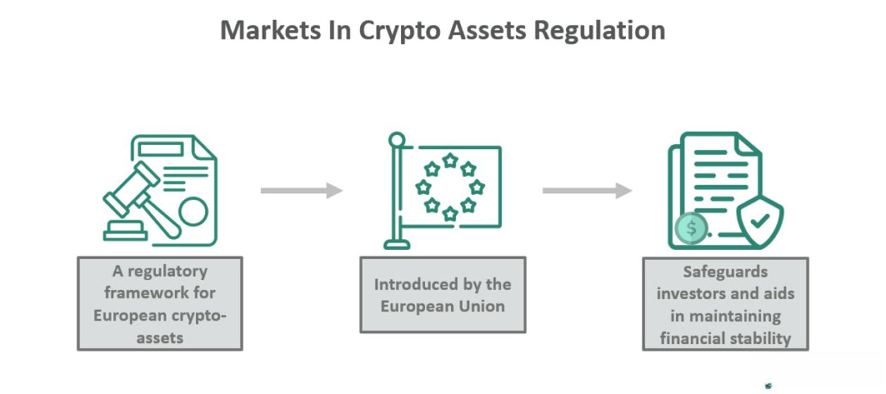

The cryptocurrency market has undergone substantial growth, evolving from a specialized interest to a widespread global phenomenon. This rapid expansion has necessitated a regulatory framework to ensure that investor protection and market stability are maintained effectively. In response to this need, the European Union introduced the 'Markets in Crypto-Assets' (MiCA) regulation, marking a pivotal step in the governance of this rapidly developing sector.

MiCA is distinguished by its comprehensive approach toward governing crypto-assets within the European Union. Its introduction seeks to address the intrinsic challenges posed by the decentralized and borderless nature of cryptocurrencies. This regulation is crucial as it establishes a structured environment, focusing on stabilizing financial systems while ensuring robust protection for investors actively participating in the growing crypto-asset market.



Understanding the impact of MiCA requires analyzing its influence on various components of cryptocurrency markets. These include areas such as crypto-assets, algorithmic trading, and the broader regulatory implications. By exploring these aspects, MiCA aims to provide a clear framework for the operation, oversight, and compliance of crypto market participants. The discussion will cover MiCA's key components, historical background, specific titles, notable exclusions, and its potential implications across the crypto landscape.

This introduction sets the stage for a detailed examination of MiCA's role in aligning the rapidly evolving cryptocurrency markets with the traditional regulatory frameworks, ultimately promoting a secure and transparent environment for all stakeholders involved.

## Table of Contents

## What is MiCA and Its Importance?

The Markets in Crypto-Assets (MiCA) regulation stands as a pivotal framework introduced by the European Commission to govern crypto-assets within European Union countries. As the first comprehensive regulatory regime for cryptocurrencies in the EU, MiCA addresses crucial aspects of this burgeoning sector with the primary objective of safeguarding financial stability and protecting investors.

MiCA came into effect in June 2023 and outlines specific operational guidelines for crypto firms. It mandates various compliance requirements, detailing who is authorized to offer crypto-related services and under what conditions. The regulation aims to minimize the risks associated with crypto-assets, addressing issues such as fraud and market manipulation that have historically plagued the industry.

Central to MiCA's regulatory architecture is its categorization and definition of crypto-assets into distinct types: e-money tokens, asset-referenced tokens, and other crypto-assets. E-money tokens are digital currencies that function similarly to electronic money, while asset-referenced tokens are linked to the value of multiple assets, including fiat currencies. By clearly defining these categories, MiCA establishes a decisive framework for determining which assets fall under its regulatory scope.

The importance of MiCA lies in its comprehensive approach to creating a secure and stable environment for [cryptocurrency](/wiki/cryptocurrency) activities. By establishing clear legal frameworks and operational standards, it mitigates risks and ensures a level playing field for all market participants. This is vital for fostering trust and promoting sustainable growth within the cryptocurrency markets.

For stakeholders, understanding MiCA is crucial as it reshapes the operational landscape and introduces new compliance responsibilities. Firms navigating the crypto space must align their operations with these regulations to ensure legitimacy and avoid potential penalties. MiCA not only serves as a regulatory model within the EU but also potentially influences global approaches to crypto-asset regulation, given its comprehensive nature and robust enforcement mechanisms.

## Historical Context of MiCA

In October 2022, the European Commission's Economic and Monetary Affairs Committee reached a landmark decision by approving the Markets in Crypto-Assets (MiCA) regulation. This decision marked a significant moment in the timeline of financial regulation, setting a historical precedent in the governance of digital and decentralized financial systems within the European Union. The approval demonstrated the EU's commitment to addressing the challenges and opportunities presented by the burgeoning cryptocurrency market. 

MiCA became law in June 2023, following thorough consultations and feedback from key stakeholders, which included policymakers, market participants, and experts in digital finance. The inclusive and exhaustive consultation process ensured that diverse perspectives were considered, fostering a comprehensive approach to regulation. The final legislation stood as a testament to collaborative efforts aimed at balancing the rapid innovation within the cryptocurrency sector with necessary investor protections and market stability.

Enforcement of the regulation is set to occur in phases, commencing with Titles III and IV in June 2024. These titles primarily focus on the issuance of asset-referenced tokens and e-money tokens, which are critical elements in the cryptocurrency ecosystem. Full applicability of the MiCA regulation is projected by December 2024, providing a window for member states to prepare and integrate these new regulations. This staged rollout reflects an understanding of the diverse economic and regulatory landscapes across the EU, allowing for an adaptable approach to compliance.

The historical context of MiCA emphasizes the European Union's proactive stance in navigating the complexities introduced by the decentralized and borderless nature of cryptocurrencies. By instituting MiCA, the EU aims to harmonize the cryptocurrency regulatory landscape across its member states, ensuring a unified approach to mitigating risks associated with crypto-assets while encouraging innovation and protecting investors.

## Key Features and Titles of MiCA

MiCA consists of seven distinct titles that collectively establish a comprehensive framework for regulating crypto-assets within the European Union. Each title is tailored to address different aspects of the cryptocurrency market, ensuring a holistic approach to governance and oversight.

Title I lays the foundation by specifying requirements for offering and trading crypto-assets. It includes detailed definitions and applicability criteria, which are crucial for categorizing different types of crypto-assets under the regulation. This title also establishes the groundwork for compliance, creating a structured environment that market participants must adhere to for transparency and legal certainty.

Title II is primarily concerned with asset-referenced tokens, setting forth a framework for their issuance and management. This section ensures that tokens pegged to multiple types of assets maintain their intended value proportionality, often including a combination of fiat currencies, commodities, or cryptocurrencies. It emphasizes risk management and ensures reserve asset stability to protect token holders.

Similarly, Title III addresses e-money tokens, which are designed to function as a digital form of credit equivalent to the amount of fiat currency. This title mandates operational standards and prudential requirements to safeguard the issuance and circulation of these tokens, mirroring regulations applied to traditional electronic money institutions.

Titles IV through VII focus on the authorization and oversight of crypto-asset services, implementing measures to prevent market abuse and prescribing guidelines for cooperation among member states’ regulatory bodies. Specifically, these titles delineate the responsibilities of service providers, establish protocols to detect and mitigate market manipulation, and encourage inter-jurisdictional regulatory collaboration to facilitate comprehensive market monitoring and enforcement actions.

Titles VIII and IX conclude MiCA by detailing the European Union’s strategy for evaluating the regulation’s effectiveness. These titles mandate the compilation of interim and final assessment reports to be completed by 2025 and 2027, respectively. The assessments aim to provide data-driven insights and feedback on MiCA's implementation, allowing adjustments to be made to ensure the regulation meets its objectives.

Overall, the structured layering of Titles within MiCA provides a regulatory environment designed to foster safe and transparent crypto-asset operations while affording protections to investors and maintaining market stability.

## MiCA Exclusions and Their Implications

The Markets in Crypto-Assets (MiCA) regulation provides a comprehensive framework for regulating various aspects of the cryptographic asset market within the European Union. However, MiCA also delineates specific exclusions that reflect a focused approach towards the most significant market risks. These exclusions encompass certain blockchain-related assets, notably non-fractionalized non-fungible tokens (NFTs) and central bank digital currencies (CBDCs).

The rationale for excluding non-fractionalized NFTs lies in their unique nature, which often categorizes them as distinct digital collectibles rather than financial instruments subject to speculative trading. As NFTs do not typically pose the same level of market risk as other crypto-assets, these assets remain outside the immediate scope of MiCA, subject instead to other forms of intellectual property or digital asset ownership regulations. This exclusion allows regulators to concentrate on more volatile and high-risk assets within the crypto markets, such as cryptocurrencies and tokens intended for widespread economic use.

Central bank digital currencies are also excluded from the MiCA regulatory framework. These digital currencies, issued and managed by central banks, operate under a different set of legal and financial parameters aligned with national monetary policies. By distinguishing CBDCs from traditional crypto-assets, MiCA acknowledges their unique regulatory requirements and the necessity for central banks to maintain autonomy over monetary policy without the constraints of additional crypto-related regulations.

Understanding these exclusions is crucial for stakeholders, enabling them to discern which assets fall under MiCA's regulations versus other legal frameworks. For instance, market participants dealing in NFTs or CBDCs must comply with alternative regulatory guidelines that more appropriately address the unique characteristics of these assets. Furthermore, by focusing on crypto-assets most tied to market risks, MiCA underscores the European Union's strategic prioritization of regulatory resources on areas with the potential for higher investor exposure and market [volatility](/wiki/volatility-trading-strategies).

Ultimately, these exclusions reflect a targeted approach by the European Union to address high-risk areas within the rapidly evolving crypto landscape, ensuring that regulatory efforts are both strategic and effective in maintaining market stability and investor protection.

## Impact of MiCA on Algorithmic Trading

Algorithmic trading forms a critical component of the modern cryptocurrency market landscape, facilitating high-frequency and automated trading strategies that operate with minimal human intervention. These strategies rely on pre-programmed instructions to execute trades at speeds and frequencies that surpass traditional trading practices. With the introduction of the Markets in Crypto-Assets (MiCA) regulation by the European Union, there is a heightened emphasis on transparency and compliance specific to [algorithmic trading](/wiki/algorithmic-trading) within the crypto sector.

One of the primary objectives of MiCA is to fortify market integrity through enhanced transparency measures. Under MiCA, crypto-asset service providers engaged in algorithmic trading are required to adhere to a set of rigorous disclosure requirements. These include providing detailed information about the algorithms employed, their risk profiles, and the operational parameters governing their use. This level of disclosure is crucial in guarding against market manipulation, which might otherwise go undetected due to the opacity and complexity often associated with algorithmic systems.

Moreover, MiCA imposes stringent standards to ensure adherence to operational guidelines. Algorithmic trading entities must demonstrate compliance with these standards to mitigate potential market abuse. This involves rigorous testing of algorithms under various market conditions to assess their robustness and ensuring that systems are in place for continuous monitoring to prevent any unforeseen disruptions or manipulative trading patterns. In practice, this might involve quantitative risk assessments and deploying [machine learning](/wiki/machine-learning) techniques to predict and respond to anomalous market movements.

By setting these guidelines, MiCA pushes for higher operational integrity and accountability within algorithmic trading activities. This regulatory framework demands that firms implement robust internal controls and oversight mechanisms. For instance, an algorithm deployed for trading must include features that can halt operations should it detect anomalies that might indicate a risk of market abuse or failure. This can be implemented using Python scripts to automate detection and response procedures:

```python
def monitor_trading_activity(trades):
    threshold = 10  # Example threshold for abnormal activity
    anomalous_activity = []

    for trade in trades:
        if trade['volume'] > threshold:
            # Log or halt trading algorithm
            anomalous_activity.append(trade)
            halt_trading_system()

    return anomalous_activity

def halt_trading_system():
    # Logic to halt trading operations
    print("Trading system halted due to detected anomalies.")
```

MiCA's regulations compel algorithmic traders to reassess and upgrade their systems and practices, ensuring that the evolution of the crypto market is accompanied by robust regulatory oversight. This reformation is anticipated to enhance market confidence and prevent coordinated attempts to manipulate the market, thereby fostering a more stable and reliable trading environment. As these guidelines come into full effect, they are likely to set a precedent that shapes the global standards for regulatory practices in algorithmic trading beyond the borders of the European Union.

## The Role of Regulators Under MiCA

MiCA establishes a robust framework for regulatory authorities across EU member states by clearly defining their roles and responsibilities. Under MiCA, the EU member states' regulatory authorities are tasked with ensuring compliance with the new regulations, with a focus on consistent application and enforcement across all jurisdictions. This consistency is crucial in avoiding market fragmentation and ensuring that crypto-assets and services operate under a unified regulatory environment.

One of the key features of MiCA is its emphasis on shared insights and reporting among member states. Regulatory bodies are required to collaborate and exchange information not only with each other but also with European supervisory authorities such as the European Securities and Markets Authority (ESMA) and the European Banking Authority (EBA). This collaboration is designed to create a more transparent and efficient regulatory ecosystem. It enables the identification of market trends and emerging risks, facilitating preemptive measures to address potential issues before they escalate.

The establishment of defined powers and responsibilities under MiCA fosters an environment of cooperation among EU regulators, facilitating a coordinated approach to oversight. This is particularly important given the fast-evolving nature of cryptocurrency markets and the challenges posed by new financial technologies. Coordinating regulatory strategies ensures that member states can effectively address cross-border challenges such as market manipulation, fraud, and money laundering.

Furthermore, MiCA provides a mechanism for regulators to adapt to technological advancements and the dynamic nature of the crypto market. By establishing guidelines for ongoing assessment and revision of regulatory practices, MiCA encourages regulatory bodies to stay updated with technological progress and market developments. This adaptive approach is essential in maintaining effective oversight and ensuring that the regulatory framework remains relevant and robust in the face of rapid industry changes.

In conclusion, the role of regulators under MiCA is central to the successful implementation of this regulation. By fostering cooperation, ensuring compliance, and facilitating information exchange, regulators play a pivotal role in maintaining market integrity and protecting investors in the cryptocurrency sector.

## Conclusion

The Markets in Crypto-Assets (MiCA) regulation signifies a critical step forward in the governance of cryptocurrency markets, establishing a framework that could shape future global regulatory endeavors. By focusing on essential elements such as crypto-assets, investment protection, and trading operations, MiCA delivers a robust regulatory structure aimed at stabilizing the financial ecosystem associated with digital assets.

As MiCA progresses toward full implementation by December 2024, its effects are anticipated to extend beyond EU territories, potentially setting a precedent for non-EU jurisdictions to consider adopting similar measures. The comprehensive nature of MiCA underscores its potential to serve as a benchmark for international regulatory standards, influencing how countries across the world approach the rapidly evolving digital finance sector.

It is imperative for investors, cryptocurrency firms, and policymakers to maintain a keen awareness of MiCA's latest developments. With the regulation's phased enforcement, stakeholders must ensure compliance with its provisions to adeptly maneuver the shifting regulatory landscape. This awareness will be crucial for leveraging the opportunities within the cryptocurrency markets while safeguarding against potential risks associated with regulatory non-compliance.

## References & Further Reading

[1]: European Commission. (2020). ["Proposal for the Regulation on Markets in Crypto-Assets (MiCA)."](https://eur-lex.europa.eu/legal-content/EN/TXT/?uri=CELEX:52020PC0593) 

[2]: European Securities and Markets Authority (ESMA). (2023). ["ESMA's Role in Crypto-Assets and the MiCA Regulation."](https://www.esma.europa.eu/esmas-activities/digital-finance-and-innovation/markets-crypto-assets-regulation-mica)

[3]: Hoogduin, L. (2021). ["The Landscape of Crypto-Asset Regulation in the EU."](https://papers.ssrn.com/sol3/papers.cfm?abstract_id=3725395)

[4]: Wytsma, D. M., and Zijp, D. (2022). ["Crypto-assets and Regulation: MiCA as a Global Standard?"](https://papers.ssrn.com/sol3/papers.cfm?abstract_id=3725395)

[5]: Campbell-Verduyn, M. (Ed.). (2020). ["Bitcoin and Beyond: Cryptocurrencies, Blockchains and Global Governance."](https://www.taylorfrancis.com/books/oa-edit/10.4324/9781315211909/bitcoin-beyond-malcolm-campbell-verduyn) Routledge.

[6]: Market Abuse Regulation (MAR) in the Context of MiCA. (2023). ["Regulating Market Integrity in the EU as Crypto Trading Surges."](https://eur-lex.europa.eu/legal-content/EN/TXT/?uri=CELEX%3A32023R1114)

[7]: Lopez de Prado, M. (2018). ["Advances in Financial Machine Learning."](https://www.amazon.com/Advances-Financial-Machine-Learning-Marcos/dp/1119482089) Wiley. 

[8]: Jansen, S. (2020). ["Machine Learning for Algorithmic Trading."](https://github.com/stefan-jansen/machine-learning-for-trading) Packt Publishing. 

[9]: European Central Bank. (2021). ["Eurosystem Report on the Digital Euro."](https://www.ecb.europa.eu/pub/pdf/other/Eurosystem_report_on_the_public_consultation_on_a_digital_euro~539fa8cd8d.en.pdf)

[10]: Chan, E. P. (2009). ["Quantitative Trading: How to Build Your Own Algorithmic Trading Business."](https://github.com/ftvision/quant_trading_echan_book) Wiley.