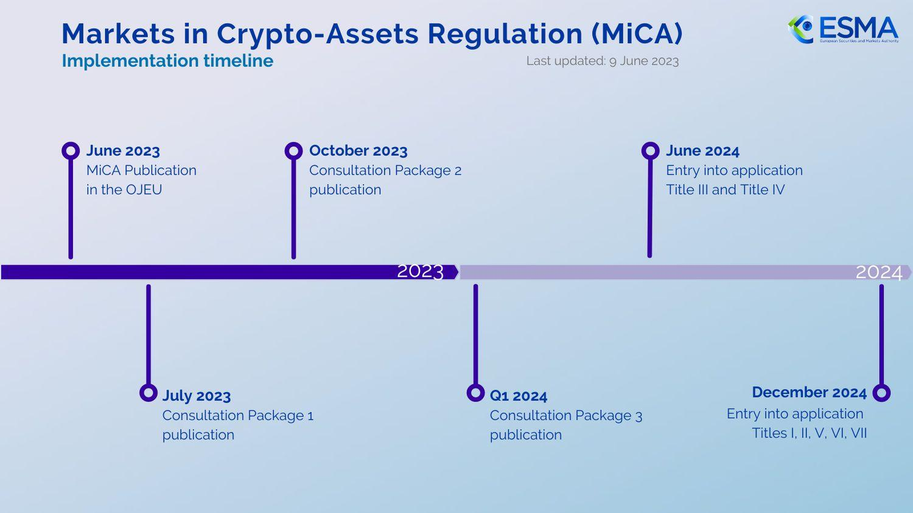

## Table of Contents

## What is Markets in Crypto-Assets (MiCA)?

Markets in Crypto-Assets (MiCA) is a new set of rules made by the European Union to control the use and trading of cryptocurrencies and other digital assets. It aims to make the crypto market safer and more transparent for people who use it. MiCA covers different types of digital assets, like stablecoins and utility tokens, and it sets out rules that companies must follow if they want to offer these services in the EU.

The rules in MiCA include things like getting a license to operate, protecting consumers, and preventing money laundering and terrorist financing. This means that companies will need to follow strict checks and provide clear information to their customers. By doing this, MiCA hopes to build trust in the crypto market and encourage more people to use digital assets safely.

## Why was MiCA introduced by the European Union?

The European Union introduced MiCA because they wanted to make the world of cryptocurrencies safer and easier to understand for everyone. Before MiCA, there were not many rules about how cryptocurrencies should be used or traded. This made it hard for people to know if they were using safe and trustworthy services. The EU wanted to change this by creating clear rules that everyone has to follow.

MiCA helps to protect people who use cryptocurrencies by making sure that the companies offering these services are checked and approved. It also helps to stop bad things like money laundering and funding terrorism. By having these rules in place, the EU hopes that more people will feel confident about using digital assets, knowing that there are safeguards to protect them.

## What types of crypto-assets does MiCA cover?

MiCA covers many types of crypto-assets. It includes cryptocurrencies like Bitcoin and Ethereum, which are often used for buying things or investing. It also covers stablecoins, which are digital currencies that try to keep a steady value by being tied to things like the US dollar or gold.

Another type of crypto-asset that MiCA covers is utility tokens. These are tokens that you can use to get a specific service or product on a platform. For example, you might use a utility token to pay for a service on a blockchain network. By covering all these types of assets, MiCA makes sure that the rules apply to a wide range of digital currencies and tokens.

## How does MiCA affect crypto-asset service providers?

MiCA affects crypto-asset service providers by making them follow strict rules. If a company wants to offer services like trading or storing cryptocurrencies in the European Union, they need to get a license. This means they have to show that they are trustworthy and can keep their customers' money safe. They also have to be clear about what they do and how they do it, so people know what they are getting into.

These rules help to make sure that the companies are doing things the right way. They have to check who their customers are to stop money laundering and terrorist financing. This makes the crypto market safer for everyone. By having to follow these rules, service providers can help build trust in cryptocurrencies, making more people feel comfortable using them.

## What are the key compliance requirements under MiCA?

Under MiCA, crypto-asset service providers need to follow some important rules to keep things safe and fair. They must get a license from the authorities to operate in the European Union. This means they have to prove they are trustworthy and can protect their customers' money. They also need to be open about what they do, so people know exactly what services they are getting. This helps to build trust and make sure everyone understands the risks involved.

Another big part of MiCA is stopping bad things like money laundering and terrorist financing. Service providers have to check who their customers are and keep an eye on their transactions. This is to make sure no one is using cryptocurrencies for illegal activities. By following these rules, companies can help make the crypto market safer and more reliable for everyone.

## How does MiCA impact investor protection?

MiCA helps protect investors by making sure that companies offering crypto services follow strict rules. If a company wants to work in the European Union, they need to get a license. This means they have to show that they are trustworthy and can keep their customers' money safe. They also have to be clear about what they do, so people know what they are getting into. This helps investors feel more confident because they know the companies they are dealing with have been checked and approved.

Another way MiCA protects investors is by stopping bad things like money laundering and terrorist financing. Companies have to check who their customers are and watch their transactions carefully. This helps make sure that no one is using cryptocurrencies for illegal activities. By having these rules, MiCA makes the crypto market safer and more reliable, so investors can feel more secure when they use digital assets.

## What are the differences between MiCA and existing financial regulations?

MiCA is a new set of rules made just for cryptocurrencies and digital assets, while existing financial regulations often cover traditional money and investments. Before MiCA, there were not many specific rules for cryptocurrencies, which made it hard for people to know if they were using safe and trustworthy services. MiCA fills this gap by setting out clear rules that companies must follow if they want to offer crypto services in the European Union. This includes getting a license, being open about what they do, and checking who their customers are to stop money laundering and terrorist financing.

Existing financial regulations, like those for banks and stock markets, have been around for a long time and are designed to protect people who use traditional financial services. These rules often focus on things like making sure banks have enough money to cover their loans and that stock markets are fair. MiCA, on the other hand, is specifically made for the unique challenges and risks of cryptocurrencies. It aims to make the crypto market safer and more transparent, helping to build trust and encourage more people to use digital assets.

## How will MiCA influence the global crypto market?

MiCA, the new set of rules from the European Union, will have a big impact on the global crypto market. Since the EU is a big and important place for business, other countries might start to follow the same rules. This could make the whole world's crypto market safer and easier to understand. If more places have similar rules, it will be easier for people and companies to use cryptocurrencies everywhere, knowing that there are safeguards to protect them.

MiCA could also make it harder for some companies to work in the EU if they can't follow the new rules. This might push them to change how they do things or even leave the EU market. On the other hand, companies that can follow MiCA's rules might find it easier to grow and do business in Europe. This could lead to more trust in cryptocurrencies and help them become more popular around the world.

## What are the potential challenges in implementing MiCA?

Implementing MiCA could be tough because it's a big change for the crypto world. Companies that offer crypto services will need to get a license, which means they have to follow strict rules. This can be hard and expensive, especially for smaller companies. They might need to change how they work, hire new people, and spend a lot of money to make sure they meet all the new rules. Some companies might find it too hard and decide to leave the EU market or not start working there at all.

Another challenge is making sure that all the countries in the EU follow MiCA the same way. Each country might have different ideas about how to apply the rules, which could make things confusing for companies that want to work in many EU countries. It's important for the EU to help everyone understand and follow MiCA in the same way, so the rules are fair and clear. If they can do this, it will be easier for the crypto market to grow and become safer for everyone.

## How does MiCA address issues like money laundering and terrorism financing?

MiCA helps stop money laundering and terrorism financing by making companies check who their customers are. This is called "Know Your Customer" or KYC. Companies have to make sure they know who is using their services and where the money is coming from. By doing this, they can spot and stop any suspicious activity. This makes it harder for people to use cryptocurrencies for illegal things.

Another way MiCA fights these problems is by making companies watch their customers' transactions. They need to keep an eye on how money is moving and report anything that looks wrong. This helps catch money laundering and terrorism financing early. By having these rules, MiCA makes the crypto market safer and helps build trust in digital assets.

## What are the timelines for the implementation of MiCA?

MiCA will start being used in the European Union in a few steps. The rules were officially agreed on in May 2023, but they won't start right away. The EU needs some time to get everything ready. The first part of MiCA will start in July 2024. This is when companies need to start getting ready to follow the new rules.

The full rules of MiCA will come into effect in January 2025. This is when all the companies offering crypto services in the EU need to have their licenses and be following all the rules. It's important for companies to get ready during this time so they can keep working in the EU without any problems.

## What future developments can we expect from MiCA and similar regulations?

As MiCA starts working, we might see more countries making their own rules for cryptocurrencies. This could make the whole world's crypto market safer and easier to use. If more places have similar rules, it will be easier for people and companies to use digital assets everywhere, knowing they are protected. This could also help stop bad things like money laundering and terrorism financing on a global level.

In the future, we might see MiCA and similar rules change and grow. As new types of digital assets come out, the rules might need to change to cover them. This could mean new rules for things like non-fungible tokens (NFTs) or other new kinds of cryptocurrencies. By keeping the rules up to date, the EU and other places can keep making the crypto market safer and more trustworthy for everyone.

## References & Further Reading

[1]: European Commission. (2020). ["Proposal for the Regulation on Markets in Crypto-Assets (MiCA)."](https://eur-lex.europa.eu/legal-content/EN/TXT/?uri=CELEX:52020PC0593) 

[2]: European Securities and Markets Authority (ESMA). (2023). ["ESMA's Role in Crypto-Assets and the MiCA Regulation."](https://www.esma.europa.eu/esmas-activities/digital-finance-and-innovation/markets-crypto-assets-regulation-mica)

[3]: Hoogduin, L. (2021). ["The Landscape of Crypto-Asset Regulation in the EU."](https://papers.ssrn.com/sol3/papers.cfm?abstract_id=3725395)

[4]: Wytsma, D. M., and Zijp, D. (2022). ["Crypto-assets and Regulation: MiCA as a Global Standard?"](https://papers.ssrn.com/sol3/papers.cfm?abstract_id=3725395)

[5]: Campbell-Verduyn, M. (Ed.). (2020). ["Bitcoin and Beyond: Cryptocurrencies, Blockchains and Global Governance."](https://www.taylorfrancis.com/books/oa-edit/10.4324/9781315211909/bitcoin-beyond-malcolm-campbell-verduyn) Routledge.

[6]: Market Abuse Regulation (MAR) in the Context of MiCA. (2023). ["Regulating Market Integrity in the EU as Crypto Trading Surges."](https://eur-lex.europa.eu/legal-content/EN/TXT/?uri=CELEX%3A32023R1114)

[7]: Lopez de Prado, M. (2018). ["Advances in Financial Machine Learning."](https://www.amazon.com/Advances-Financial-Machine-Learning-Marcos/dp/1119482089) Wiley. 

[8]: Jansen, S. (2020). ["Machine Learning for Algorithmic Trading."](https://github.com/stefan-jansen/machine-learning-for-trading) Packt Publishing. 

[9]: European Central Bank. (2021). ["Eurosystem Report on the Digital Euro."](https://www.ecb.europa.eu/pub/pdf/other/Eurosystem_report_on_the_public_consultation_on_a_digital_euro~539fa8cd8d.en.pdf)

[10]: Chan, E. P. (2009). ["Quantitative Trading: How to Build Your Own Algorithmic Trading Business."](https://github.com/ftvision/quant_trading_echan_book) Wiley. 