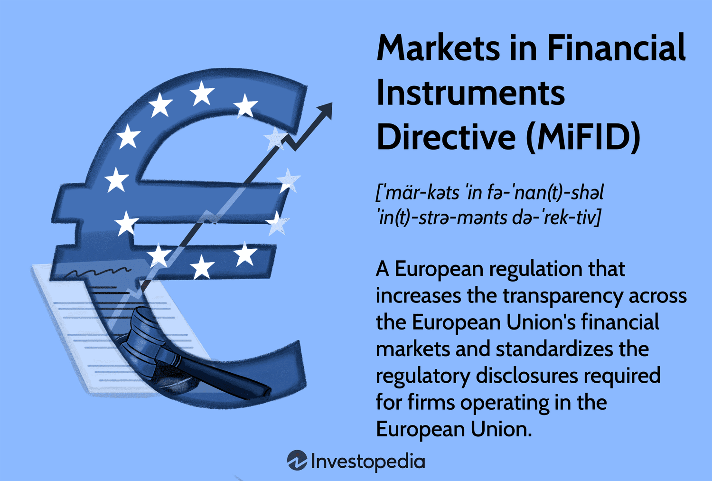

The landscape of financial markets has undergone substantial transformation with the implementation of regulations aimed at enhancing transparency, stability, and investor trust. Among these, the Markets in Financial Instruments Directive (MiFID) stands out as a cornerstone regulatory framework within the European Union’s financial market. Initially introduced in 2007, MiFID has played a vital role in governing market activities and ensuring a fair trading environment. 

Algorithmic trading has emerged as a significant component of today's financial markets, leveraging advanced computer algorithms to execute trades at speeds and volumes that were previously unattainable. This rise in algorithmic trading has increased the complexity of financial markets, necessitating robust regulatory oversight. MiFID regulations have evolved to provide such oversight, ensuring that the benefits of algorithmic trading do not come at the cost of market stability and fairness.



This article examines the intricate relationship between financial instruments governed by the MiFID framework, the regulatory demands imposed by MiFID, and the burgeoning trend of algorithmic trading. Through an exploration of these elements, the article seeks to illuminate how modern financial regulations support a stable yet dynamic market environment.

## Table of Contents

## Understanding the Markets in Financial Instruments Directive (MiFID)

The Markets in Financial Instruments Directive (MiFID) was first implemented in 2007 as a significant piece of regulatory legislation within the European Union. Its primary objective was to increase market transparency and bolster investor protection across the EU financial markets. MiFID established a comprehensive framework governing the trading and reporting activities of financial firms, introducing standardized regulations designed to harmonize the European financial landscape. This legislation aimed to facilitate cross-border investment services and ensure a consistent regulatory environment throughout the EU.

MiFID addressed several key aspects of financial operations, including the methods by which investment services are offered and conducted. It required financial firms to adhere to standardized practices in executing client orders, ensuring that such transactions were conducted with honesty, fairness, and professionalism. Additionally, MiFID enforced obligations for detailed reporting and record-keeping, enhancing transparency and traceability within the financial market operations.

Over time, financial markets evolved, and so did the complexities associated with financial instruments. Recognizing these developments, the EU introduced substantial updates to MiFID, culminating in the launch of MiFID II in January 2018. This revised directive significantly expanded the scope of the original MiFID. While MiFID primarily focused on equities, MiFID II broadened its regulatory reach to encompass a wider array of financial products, including derivatives and various complex financial instruments. The enhanced framework aimed to address previous regulatory gaps and ensure comprehensive governance over contemporary financial instruments.

Through these updates, MiFID II not only modernized the regulatory environment to match the evolving financial landscape but also imposed more stringent requirements for both financial transparency and investor protection. It served to refine market practices, reduce systemic risk, and further align the European financial markets with international standards.

## The Scope and Objectives of MiFID II

Implemented in 2018, MiFID II sought to rectify the deficiencies of its predecessor by enhancing market transparency and fortifying investor protection. This directive expanded its regulatory scope to include a wider array of financial securities beyond traditional equities, such as derivatives and structured financial instruments. This expansion enabled a broader oversight of financial activities within the European Union, thereby attempting to ensure a more cohesive regulatory environment across various asset classes.

A key innovation under MiFID II was the establishment of stringent pre- and post-trade transparency requirements. These rules mandate that detailed information on trading activities must be made available both before and after trades are executed. Pre-trade transparency involves displaying bid and offer prices along with their respective volumes to market participants, thus allowing for more informed decision-making. Post-trade transparency requires the disclosure of executed trade details, including price, [volume](/wiki/volume-trading-strategy), and time, ensuring that all market participants have access to the same information. This level of transparency aims to curb inefficiencies and promote fair competition, ultimately protecting the interests of investors.

Furthermore, MiFID II introduced measures designed to deter market manipulation and enhance market stability. It provided a framework for the collection and dissemination of transaction data across trading venues, thereby facilitating improved market surveillance by regulatory authorities. This comprehensive approach not only aimed to boost investor confidence but also sought to ensure that the European financial markets remained competitive globally.

In summary, MiFID II addressed critical gaps left by the original MiFID directive by significantly broadening its scope and implementing robust transparency requirements. These efforts collectively aim to create a more transparent, fair, and efficient financial market environment within the EU.

## Algorithmic Trading Under MiFID Regulations

Algorithmic trading utilizes computer algorithms to automate trading decisions, enabling rapid order execution in financial markets. MiFID II sets stringent regulations to manage the complexities and risks associated with [algorithmic trading](/wiki/algorithmic-trading). It mandates firms to have robust risk management processes and trading controls to maintain market integrity and stability.

A critical component of MiFID II’s framework is the requirement for firms to test and monitor their algorithms continuously. This includes verifying that algorithms behave as intended under various market conditions and do not contribute to market disruptions. Firms are also required to implement systems to capture data related to algorithmic trading activities, facilitating surveillance and compliance monitoring by regulatory authorities.

One of the key focuses of MiFID II is to ensure that algorithmic trading does not lead to "disorderly trading conditions". To address this, firms must have mechanisms in place, such as kill switches, that can quickly disable problematic algorithms. Additionally, firms must ensure that their trading systems can handle extreme market [volatility](/wiki/volatility-trading-strategies) without malfunctioning.

MiFID II also dictates that algorithmic trading firms must contribute to the orderly functioning of financial markets by, for example, maintaining a consistent presence in the markets they operate in. This reduces the likelihood of [liquidity](/wiki/liquidity-risk-premium) shortages and supports overall market efficiency.

Here is a simplified Python script that illustrates a basic concept of algorithmic trading under risk management constraints:

```python
import random

def check_market_conditions():
    # Simulates the current market condition
    return random.choice(['stable', 'volatile'])

def algorithmic_trading_strategy(market_condition):
    # Simple trading strategy based on market conditions
    if market_condition == 'stable':
        print("Executing trades under normal strategy.")
    elif market_condition == 'volatile':
        print("Activating risk controls and reducing trading volume.")

def risk_management():
    market_condition = check_market_conditions()
    algorithmic_trading_strategy(market_condition)

# Simulating the execution of the trading strategy
risk_management()
```

Firms must also maintain comprehensive records of their trading algorithms, including details about their development and testing phases, to provide transparency and accountability. This documentation is crucial for audits and reviews by regulatory bodies, ensuring that firms comply with MiFID II's requirements aimed at safeguarding the integrity of financial markets.

## Client Classifications and Protections

MiFID establishes a framework for client classification to ensure that individuals and entities receive appropriate levels of protection and service in financial markets. Clients are categorized into three distinct groups: professional clients, retail clients, and eligible counterparties, each with varying degrees of regulatory safeguards.

1. **Professional Clients**:
   Professional clients are institutions or individuals possessing the experience, knowledge, and expertise to make their own investment decisions and adequately assess the risks they incur. This category typically includes financial institutions, large corporations, and certain high-net-worth individuals who meet specific criteria defined by MiFID. Professional clients are afforded a lower level of protective measures compared to retail clients, as they are presumed to have a better understanding of market intricacies and risks.

2. **Retail Clients**:
   Retail clients encompass individual investors and smaller businesses who are considered to have a limited understanding of financial markets. Consequently, MiFID ensures retail clients are provided with the highest level of protection. This includes comprehensive disclosures, ensuring the transparency of information regarding financial products, services, fees, and potential risks. Financial firms are also mandated to provide suitability assessments to ensure that investment advice or products are appropriate for the retail client’s needs and risk tolerance.

3. **Eligible Counterparties**:
   Eligible counterparties are entities involved in large-scale investment or corporate transactions, such as investment firms, credit institutions, and other authorized or regulated financial institutions. Transactions conducted with eligible counterparties face diminished MiFID protections due to the presumption that these entities have the capacity to negotiate terms and comprehend transaction risks independently. This category recognizes their proficiency in handling complex financial operations, obviating the necessity for extensive investor protection measures.

The client classification system under MiFID is designed to strike a balance between market integrity and investor protection. By tailoring protections based on the client’s sophistication and financial literacy, the directive seeks to uphold a transparent and fair financial environment across the European Union.

## Challenges and Impacts of MiFID II

The Markets in Financial Instruments Directive II (MiFID II), implemented in 2018, has significantly transformed the regulatory landscape of the European Union’s financial markets. While primarily designed to enhance market transparency and offer heightened investor protection, MiFID II has introduced various challenges, particularly concerning increased compliance costs for financial institutions.

One of the major impacts of MiFID II is the reshaping of investment banking practices, especially in terms of trading venues and handling large trades. The directive has mandated greater transparency across trading operations, which requires investment banks to adapt to new reporting and record-keeping standards. These standards necessitate significant investments in technology and human resources to ensure compliance, leading to increased operational costs. 

Moreover, MiFID II has altered the way large trades are executed. The directive introduced rules that demand large trades be conducted in "dark pools" or systematic internalisers, structures that provide pre-trade transparency while minimizing market impact. This shift reduces the information leakage that typically accompanies significant transactions, but it also necessitates sophisticated systems to monitor market conditions and execute orders efficiently.

Despite these challenges, MiFID II plays an essential role in fostering investor confidence by ensuring that all market participants have access to the same vital information. This transparency enhances market fairness and integrity, crucial factors that underpin investor trust. With rigorous investor protection measures in place, retail clients, who receive the highest level of protection under MiFID II, can engage with financial markets with increased assurance. 

Furthermore, the directive's emphasis on transparency has contributed to a more level playing field, allowing smaller firms access to markets traditionally dominated by larger entities. While these benefits are substantial, they underscore the necessity for firms to balance the regulatory costs with the advantages of a transparent and equitable market environment. 

In summary, MiFID II presents a dual-faceted impact: it imposes considerable compliance costs and operational adjustments on financial institutions, yet it concurrently enhances market transparency and investor confidence in the EU financial landscape. This balance is crucial for the sustained health and growth of the financial market ecosystem, ensuring it remains robust and accessible in an increasingly complex financial world.

## The Role of MiFID II in the Age of Digital Finance

The advent of digital finance has necessitated a reevaluation of existing regulatory frameworks, with MiFID II standing at the forefront of these adaptations. As technology reshapes financial markets, the directive now extends its purview to encompass innovative financial products such as digital and crypto-assets. This extension underscores the dynamic nature of MiFID II as it integrates with the accelerating trends in digital finance.

One clear indicator of MiFID II's evolving applicability is the introduction of the Markets in Crypto-Assets Regulation (MiCA) by the European Union. MiCA aims to establish a comprehensive regulatory framework for digital assets, ensuring investor protection while fostering innovation. As part of a broader regulatory strategy, MiCA complements MiFID II by addressing potential risks associated with crypto-assets, such as market manipulation and security vulnerabilities.

Moreover, MiFID's amendments in 2022 to cover tokenized assets demonstrate its commitment to regulatory efficacy in response to technological advancements. Tokenization, the process of converting physical or intangible assets into digital tokens that can be traded on a blockchain, represents a significant development in the financial industry. By encompassing such assets, MiFID II provides a regulatory framework that supports market integrity and investor protection.

The adaptation of MiFID II to digital finance is characterized by a structured approach to managing the complexities introduced by digital assets. This includes imposing stringent transparency requirements and enhancing the scope of investor protections. These measures are integral to maintaining market stability as digital assets become increasingly mainstream.

In summary, MiFID II's role in the age of digital finance is crucial. By expanding its framework to include digital and crypto-assets, it ensures that the financial markets remain robust and protected against the emerging challenges posed by technological advancements. As digital finance continues to evolve, MiFID II and related regulations like MiCA will play pivotal roles in shaping a secure financial landscape that promotes innovation while safeguarding participants.

## Conclusion

MiFID II has considerably reshaped the financial regulatory landscape within the European Union, primarily by enhancing transparency and improving investor protection. This regulatory framework, implemented in 2018, addresses the complexities of modern financial markets, and has since been pivotal in establishing clear guidelines and protocols intended to secure safe and stable trading environments. The directive extends its influence beyond traditional financial instruments, covering a wide range of securities including derivatives, which has resulted in a more comprehensive market architecture.

As algorithmic trading's influence grows, continuously evolving regulatory updates are essential to maintain stable and accessible financial markets. Algorithmic trading, characterized by the use of complex algorithms in making trading decisions at lightning speed, demands stringent oversight to prevent market abuse and systemic risks. MiFID II has introduced comprehensive requirements for algorithmic trading firms, including regulations on risk management and the implementation of trading controls, ensuring that the rapid trading pace does not lead to disorderly markets.

The synergy between financial instruments, MiFID regulations, and algorithmic trading underscores the necessity of robust policies in today's financial landscape. By adapting to technological advances, such as the rise of digital finance and tokenized assets, MiFID II demonstrates a commitment to evolve alongside market developments. The framework's adaptability is further evidenced by its amendments to encompass emerging trends and technologies, thereby solidifying its role as a cornerstone in the regulation of EU financial markets.

In conclusion, MiFID II plays a critical role in the evolution of financial markets, highlighting the importance of regulatory frameworks that are both comprehensive and adaptable. Its ongoing influence ensures that as financial markets evolve, they remain transparent, secure, and fairly accessible to all participants, ultimately fostering a more resilient financial system.

## References & Further Reading

[1]: ESMA. (2017). ["Guidelines on MiFID II product governance requirements."](https://www.esma.europa.eu/document/guidelines-mifid-ii-product-governance-requirements) European Securities and Markets Authority.

[2]: Moloney, N. (2018). ["EU Securities and Financial Markets Regulation."](https://academic.oup.com/book/57973) Oxford University Press.

[3]: De Servigny, A., & Renault, O. (2004). ["Measuring and Managing Credit Risk."](https://www.semanticscholar.org/paper/Measuring-and-Managing-Credit-Risk-Servigny-Renault/11357a81b5bd332d5e8f77f1e53d4a2b5d1eb470) McGraw-Hill.

[4]: Junius, K., & Gunhild, R. (2013). ["The New MiFID II and MiFIR Guidelines."](https://www.esma.europa.eu/trading/mifid-ii-and-mifir-review) Shearman & Sterling LLP.

[5]: Gomber, P., Arndt, B., Lutat, M., & Uhle, T. (2011). ["High-frequency trading."](https://www.researchgate.net/publication/271631628_High-Frequency-Trading) In Business & Information Systems Engineering.