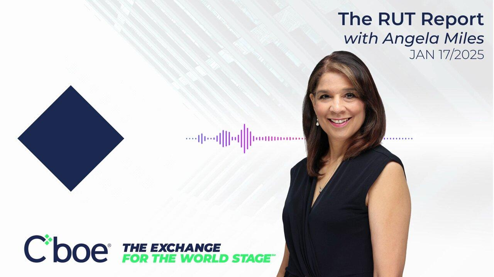

## Table of Contents

## What is MarketsWiki Daily Highlight?

MarketsWiki Daily Highlight is a daily email newsletter that provides updates and news about financial markets. It is created by John J. Lothian & Company, Inc., and it helps people stay informed about what's happening in the world of finance.

The newsletter includes a main story each day, along with other important news and events. It is a helpful tool for anyone interested in finance, as it gives a quick and easy way to catch up on the latest market news.

## Who can benefit from reading MarketsWiki Daily Highlight?

Anyone who wants to stay updated on financial markets can benefit from reading MarketsWiki Daily Highlight. It's great for people who work in finance, like traders, investors, and analysts. They can use the newsletter to keep track of important news and events that might affect their work.

Even if you're not a finance professional, you can still find the newsletter useful. If you're interested in learning more about the economy and how markets work, MarketsWiki Daily Highlight can help you understand what's happening in the financial world. It's a simple way to get daily news without spending too much time.

## How often is MarketsWiki Daily Highlight published?

MarketsWiki Daily Highlight comes out every day. That means you get a new email with the latest financial news each morning.

It's a good routine to check your email and read the newsletter to stay up to date. Whether you're at work or just want to know what's happening in the markets, you can count on getting fresh news every day.

## What kind of content does MarketsWiki Daily Highlight typically feature?

MarketsWiki Daily Highlight usually has a main story each day. This story is about something big happening in the financial world. It could be about new rules for trading, big changes in the market, or important news about companies. The newsletter helps you understand why these things matter and how they might affect you.

Besides the main story, the newsletter also has other news and events. These can be quick updates on different parts of the finance world, like stocks, bonds, or cryptocurrencies. It's a good way to get a full picture of what's going on without reading a lot of different places.

## How can someone subscribe to MarketsWiki Daily Highlight?

To subscribe to MarketsWiki Daily Highlight, you need to visit their website. Look for a section that says "Subscribe" or "Newsletter." There, you'll find a form where you can enter your email address. After you fill it out and click submit, you'll start getting the newsletter in your email every day.

It's a simple process that only takes a few minutes. Once you're subscribed, you'll get the latest financial news right in your inbox each morning. This way, you can stay updated without having to search for news yourself.

## Can you explain the process of how articles are selected for MarketsWiki Daily Highlight?

The team at John J. Lothian & Company, Inc., who makes MarketsWiki Daily Highlight, works hard every day to pick the best articles for the newsletter. They look at lots of news from different places to find the most important stories about financial markets. They choose one main story that they think will be really interesting and helpful for people who read the newsletter. This main story could be about new rules for trading, big changes in the market, or important news about companies.

Besides the main story, they also pick other news and events to include. These are shorter updates about different parts of the finance world, like stocks, bonds, or cryptocurrencies. They want to give a full picture of what's happening, so they choose a mix of news that covers many areas of finance. This way, readers can get a quick and easy overview of the latest happenings in the financial world.

## What impact does MarketsWiki Daily Highlight have on the financial industry?

MarketsWiki Daily Highlight has a big impact on the financial industry by keeping people informed. It sends out news every day, so traders, investors, and anyone interested in finance can stay up to date. This helps them make better decisions because they know what's happening in the markets. When everyone has the same information, it makes the market more fair and open.

The newsletter also helps spread important news quickly. When there's a big change or a new rule, MarketsWiki Daily Highlight tells people about it right away. This can help the whole industry react faster and better to changes. By sharing knowledge, it helps the financial world work more smoothly and keeps everyone on the same page.

## How does MarketsWiki Daily Highlight ensure the accuracy and reliability of its content?

MarketsWiki Daily Highlight makes sure its news is correct and trustworthy by using a team that knows a lot about finance. They check the news from many places and only pick the best and most true stories to share. If something is not clear, they look into it more to make sure they are giving the right information.

This careful way of [picking](/wiki/asset-class-picking) news helps keep the newsletter reliable. People who read it can trust that what they're reading is true and important. By doing this, MarketsWiki Daily Highlight helps everyone in the financial world make good choices based on good information.

## What are some notable stories or features that have been highlighted in MarketsWiki Daily Highlight?

MarketsWiki Daily Highlight has shared many important stories over time. One big story was about a new rule that changed how people trade. This rule made a lot of traders and investors pay attention because it could change how they work. The newsletter explained the rule in a simple way so everyone could understand why it mattered.

Another interesting feature was about a big company that got into trouble. The newsletter told the story of what happened and how it could affect the market. It was good to know because it helped people see how one company's problems can impact everyone. These kinds of stories show how MarketsWiki Daily Highlight keeps readers informed about things that really matter in the financial world.

## How does MarketsWiki Daily Highlight integrate with other MarketsWiki resources?

MarketsWiki Daily Highlight works well with other parts of MarketsWiki. It's like a daily update that connects to the bigger world of MarketsWiki. When you read a story in the newsletter, you can click on links to find out more on the MarketsWiki website. This helps you learn more about the people, companies, and events that are in the news.

The newsletter also uses information from the MarketsWiki database. This means the stories are based on facts and details that are already checked and stored in MarketsWiki. By using this information, MarketsWiki Daily Highlight makes sure its news is correct and helpful. It's a good way to get the latest news and then explore more if you want to know even more.

## What are the future plans or developments for MarketsWiki Daily Highlight?

The team at John J. Lothian & Company, Inc., is always thinking about ways to make MarketsWiki Daily Highlight even better. They want to keep adding new features that will help readers understand the financial world more easily. One idea is to include more interactive parts in the newsletter, like quizzes or polls, so readers can test their knowledge and share their thoughts on the news.

Another plan is to make the newsletter available in more languages. This way, people from different countries can read it and stay updated on what's happening in the financial markets. By doing this, MarketsWiki Daily Highlight can reach more people and help them make better decisions about money and investing.

## How can someone contribute to or provide feedback on MarketsWiki Daily Highlight?

If you want to help or give feedback on MarketsWiki Daily Highlight, you can send an email to the team. They have a special email address where you can write your thoughts and ideas. You can tell them what you like about the newsletter, what you think could be better, or even suggest new stories you think they should cover. They really want to hear from readers because it helps them make the newsletter even better.

Another way to contribute is by sharing the newsletter with others. If you know someone who might find it helpful, you can forward it to them. This helps more people learn about financial news and can make the community around MarketsWiki Daily Highlight bigger. The team appreciates when readers help spread the word and get more people involved.

## What is Understanding Algorithmic Trading?

Algorithmic trading involves the use of computer programs to execute trades in financial markets automatically, based on predefined rules. This approach has gained prominence by allowing traders to enhance execution efficiency and performance. Within algorithmic trading, there are various forms, including black-box trading and high-frequency trading ([HFT](/wiki/high-frequency-trading-strategies)), as well as execution algorithms like Volume Weighted Average Price (VWAP) and Time Weighted Average Price (TWAP).

Black-box trading refers to the use of proprietary trading systems where the rules and logic are not disclosed to the users. Typically, such systems are highly complex and use advanced algorithms to analyze data and make trading decisions without human intervention. High-frequency trading, a subcategory of [algorithmic trading](/wiki/algorithmic-trading), involves executing a large number of trades at extremely high speeds, often within fractions of a second, to capitalize on very short-term market inefficiencies.

Execution algorithms like VWAP and TWAP are designed to optimize the execution of larger orders by breaking them down into smaller parts and executing them over time. The VWAP strategy aims to execute trades close to the average price over a specific period, with the formula:

$$
\text{VWAP} = \frac{\sum_{i} P_i \times V_i}{\sum_{i} V_i}
$$

where $P_i$ represents the price for each transaction, and $V_i$ is the volume of each trade. This ensures that the trader participates in the market without causing significant price distortion. The TWAP algorithm, on the other hand, focuses on executing trades at a consistent, averaged pace, irrespective of price volatility.

The technology backing algorithmic trading relies heavily on speed and precision, leveraging high-powered computing and sophisticated data analysis techniques. Algorithms are designed to process vast amounts of market data in real-time, enabling the identification of trading opportunities and rapid execution. The advantage of algorithmic trading lies in its ability to reduce human error and emotional biases, which often lead to suboptimal trading decisions. By automating the execution process, algorithms can react to market changes more swiftly than human traders. This efficiency is crucial in ensuring competitive edge, especially in markets where price movements can occur in milliseconds.

In summary, algorithmic trading is characterized by its ability to execute trades based on pre-set rules, employing a range of strategies and technologies to optimize performance and market participation. It offers advantages in speed, accuracy, and reduced human intervention, making it a critical tool in modern trading environments.

## References & Further Reading

[1]: Bergstra, J., Bardenet, R., Bengio, Y., & Kégl, B. (2011). ["Algorithms for Hyper-Parameter Optimization."](https://dl.acm.org/doi/10.5555/2986459.2986743) Advances in Neural Information Processing Systems 24.

[2]: ["Advances in Financial Machine Learning"](https://www.amazon.com/Advances-Financial-Machine-Learning-Marcos/dp/1119482089) by Marcos Lopez de Prado

[3]: ["Evidence-Based Technical Analysis: Applying the Scientific Method and Statistical Inference to Trading Signals"](https://www.amazon.com/Evidence-Based-Technical-Analysis-Scientific-Statistical/dp/0470008741) by David Aronson

[4]: ["Machine Learning for Algorithmic Trading"](https://github.com/stefan-jansen/machine-learning-for-trading) by Stefan Jansen

[5]: ["Quantitative Trading: How to Build Your Own Algorithmic Trading Business"](https://www.amazon.com/Quantitative-Trading-Build-Algorithmic-Business/dp/1119800064) by Ernest P. Chan