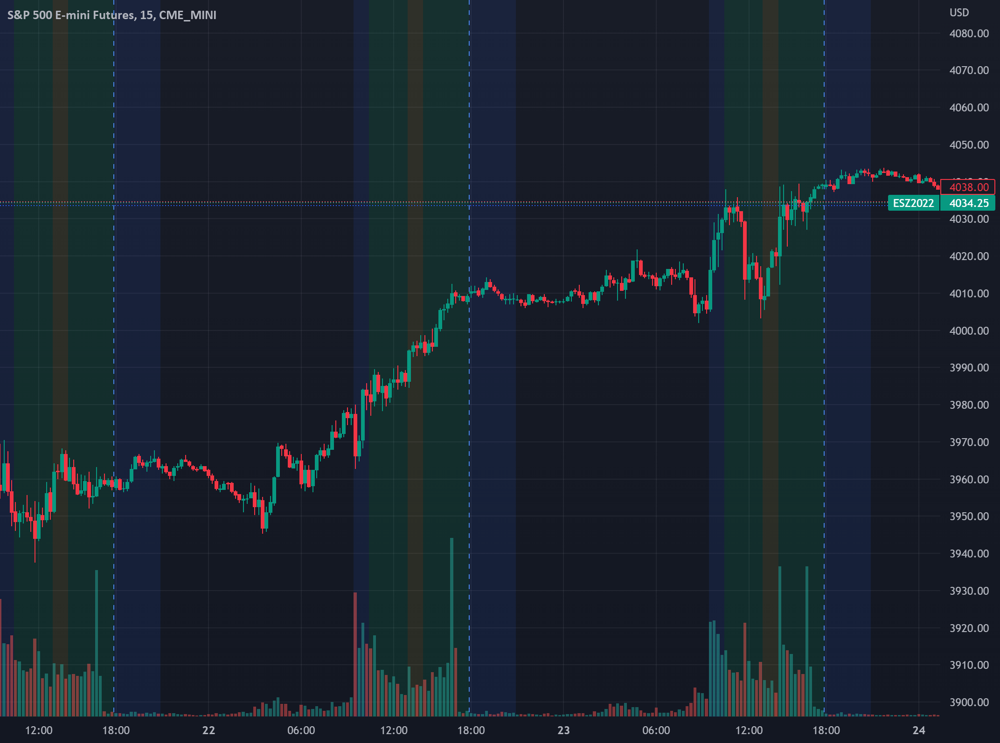

The world of financial markets is undergoing rapid transformation, largely due to advancements such as algorithmic trading. This innovation involves using computer algorithms to automate trading activities based on predetermined criteria, enhancing the efficiency and speed of transaction execution. Such technologies enable traders to process large volumes of data and execute trades at a scale and speed far beyond human capabilities. MarketsWiki, a comprehensive online resource dedicated to the financial community, plays a crucial role in keeping market participants informed about significant trends, including the rise of algorithmic trading. It provides daily updates and insights that are vital for understanding market dynamics.

Algorithmic trading has substantially influenced the financial markets by altering the way trades are made and the speed at which they are executed. It reduces the impact of human error and emotion, allowing for more precise and consistent trading decisions. As we analyze the function and influence of algorithmic trading, it becomes clear that technology has not only revolutionized trade execution but also enhanced overall market efficiency.

However, this technological advancement brings to light important regulatory considerations. Ensuring market safety and fairness is paramount as algorithmic trading becomes more widespread. Regulatory bodies worldwide are increasingly focusing on establishing frameworks to monitor and manage the impact of algorithmic trading on the markets. This includes setting rules that aim to prevent unfair practices and protect individual investors.

Looking forward, the future of algorithmic trading will likely be driven by continuous technological innovation, including the integration of artificial intelligence and machine learning. These advancements will contribute to even more sophisticated trading strategies and provide new opportunities and challenges for traders. A balanced approach is necessary to harmonize innovation with regulation, ensuring that the benefits of algorithmic trading are maximized while safeguarding market integrity.

In summary, algorithmic trading is redefining the landscape of financial markets. As it continues to evolve, platforms like MarketsWiki are essential for providing timely information and insights. Continuous learning and adaptation by traders and investors will be crucial to exploiting the full potential of these technological advancements.

## Table of Contents

## Understanding Algorithmic Trading

Algorithmic trading involves the use of computer programs to execute trades in financial markets automatically, based on predefined rules. This approach has gained prominence by allowing traders to enhance execution efficiency and performance. Within algorithmic trading, there are various forms, including black-box trading and high-frequency trading ([HFT](/wiki/high-frequency-trading-strategies)), as well as execution algorithms like Volume Weighted Average Price (VWAP) and Time Weighted Average Price (TWAP).

Black-box trading refers to the use of proprietary trading systems where the rules and logic are not disclosed to the users. Typically, such systems are highly complex and use advanced algorithms to analyze data and make trading decisions without human intervention. High-frequency trading, a subcategory of [algorithmic trading](/wiki/algorithmic-trading), involves executing a large number of trades at extremely high speeds, often within fractions of a second, to capitalize on very short-term market inefficiencies.

Execution algorithms like VWAP and TWAP are designed to optimize the execution of larger orders by breaking them down into smaller parts and executing them over time. The VWAP strategy aims to execute trades close to the average price over a specific period, with the formula:

$$
\text{VWAP} = \frac{\sum_{i} P_i \times V_i}{\sum_{i} V_i}
$$

where $P_i$ represents the price for each transaction, and $V_i$ is the volume of each trade. This ensures that the trader participates in the market without causing significant price distortion. The TWAP algorithm, on the other hand, focuses on executing trades at a consistent, averaged pace, irrespective of price volatility.

The technology backing algorithmic trading relies heavily on speed and precision, leveraging high-powered computing and sophisticated data analysis techniques. Algorithms are designed to process vast amounts of market data in real-time, enabling the identification of trading opportunities and rapid execution. The advantage of algorithmic trading lies in its ability to reduce human error and emotional biases, which often lead to suboptimal trading decisions. By automating the execution process, algorithms can react to market changes more swiftly than human traders. This efficiency is crucial in ensuring competitive edge, especially in markets where price movements can occur in milliseconds.

In summary, algorithmic trading is characterized by its ability to execute trades based on pre-set rules, employing a range of strategies and technologies to optimize performance and market participation. It offers advantages in speed, accuracy, and reduced human intervention, making it a critical tool in modern trading environments.

## Impact on Financial Markets

Algorithmic trading has significantly reshaped financial markets by enhancing trading volumes and [liquidity](/wiki/liquidity-risk-premium). The implementation of sophisticated algorithms allows for automated trade execution, which minimizes reliance on human intervention, thereby reducing errors and emotional biases typically encountered in traditional trading environments. Algorithms operate based on pre-defined criteria and real-time data analysis, making decisions swiftly and without the emotional elements that often lead traders to make suboptimal decisions.

A notable concern in algorithmic trading is the potential for market manipulation practices, such as spoofing. Spoofing involves placing large orders with the intent to cancel them before execution, misleading other traders about supply and demand, thus impacting market prices. Regulatory bodies worldwide are keen on controlling such practices due to their detrimental effects on market integrity and the unfair advantage they provide to the perpetrators.

High-frequency traders (HFTs) and major market players are often identified as dominant forces in algorithmic trading markets. HFTs execute numerous trades at exceptionally high speeds, leveraging advanced algorithms to capitalize on minute price discrepancies. These players contribute to market liquidity and depth but also raise concerns regarding unfair competition, as their technological advantages can marginalize smaller traders who do not have access to similar resources or technology.

Retail investors are increasingly engaging with algorithmic trading, driven by advancements in technology and the democratization of trading tools. Platforms offering user-friendly algorithmic trading interfaces, along with educational resources, empower retail traders to participate more actively. This growing interest is facilitated by the availability of technologies such as application programming interfaces (APIs) and trading bots, which allow retail traders to automate their strategies without requiring extensive programming knowledge.

The impact of algorithmic trading is multifaceted, enhancing market efficiency and liquidity while also posing challenges in terms of fairness and regulatory oversight. The participation of both institutional and retail traders reflects a dynamic evolution in trading patterns, necessitating continuous adaptation and regulation to maintain market stability and integrity.

## Regulatory Perspectives

Algorithmic trading has grown significantly, prompting regulatory bodies globally to devise methods ensuring the fairness, integrity, and safety of financial markets. In India, the Securities and Exchange Board of India (SEBI) has proposed a robust framework to address the complexities associated with algorithmic trading, particularly focusing on protecting retail investors. SEBI's framework mandates more transparency and real-time monitoring of trading activities to counteract potentially unfair practices.

Globally, different regulatory bodies approach algorithmic trading regulations with varying strategies tailored to their respective markets. The United States, through the Securities and Exchange Commission (SEC) and the Commodity Futures Trading Commission (CFTC), has emphasized market surveillance, requiring firms to maintain stringent record-keeping standards and reporting obligations. Similarly, the European Union's Markets in Financial Instruments Directive II (MiFID II) stresses transparency and aims to curb excessive risk-taking by imposing more stringent controls on algorithmic trading practices.

A notable consideration within the regulatory sphere is the classification of algorithms into 'White Box' and 'Black Box'. White box algorithms, characterized by their transparency and simplicity, allow regulators to easily understand the underlying logic used in trading decisions. In contrast, black box algorithms, typically complex and proprietary, pose challenges for regulators due to the difficulty of assessing their behavior and the potential risks associated with their opacity. Regulators worldwide are focusing on striking a balance where innovation is encouraged while ensuring these systems do not undermine market stability.

Brokers and algorithm providers are subjected to specific obligations under regulatory standards. They must ensure their systems are compliant with existing laws, which includes pre-deployment testing of trading algorithms, real-time monitoring, and implementing robust risk management systems. Furthermore, there is a requirement for the establishment of safeguards to prevent and detect market abuse practices such as spoofing and layering.

These regulatory measures are aimed at aligning the fast-paced advancements in algorithmic trading with the necessity for maintaining market order and protecting all market participants, especially those with limited market power such as retail investors. The ongoing development and refinement of these regulatory frameworks play a critical role in the sustainable expansion of algorithmic trading.

## Case Study: MarketsWiki Financial Markets Daily Highlight

MarketsWiki stands as a pivotal platform for those tracking the ongoing developments and trends within algorithmic trading. As an online resource, it offers up-to-date and detailed information catering to both novice and experienced traders, ensuring they remain informed about the fast-evolving financial markets.

A primary function of MarketsWiki is its aggregation and dissemination of crucial information relevant to algorithmic trading. The platform routinely provides updates that highlight major algorithmic strategies, recent technological advancements, and regulatory changes affecting the market. This level of detail is invaluable to traders and investors seeking to optimize their trading strategies in response to the latest market shifts.

Educationally, MarketsWiki plays a significant role in enhancing market participants' understanding of algorithmic trading. It investigates into various aspects of the topic, from basic definitions to complex strategies like high-frequency trading and [machine learning](/wiki/machine-learning) applications. This focus on education equips traders with the necessary knowledge to navigate algorithmic trading's complexities effectively, minimizing risks associated with uninformed trading decisions.

Among the notable updates and features related to algorithmic trading that MarketsWiki often highlights are the dynamic shifts in trading strategies fueled by [artificial intelligence](/wiki/ai-artificial-intelligence) and machine learning technologies. The platform meticulously reports on how these technologies refine precision in trading, thus impacting overall market behavior. This coverage aids traders in identifying new opportunities to leverage cutting-edge tools and techniques.

Furthermore, MarketsWiki contributes significantly to the global financial community by ensuring the reliability and timeliness of its disseminated information. It operates as a cornerstone for market participants who rely on accurate and quick information to make informed decisions. This functionality helps reduce uncertainties and fosters a transparent trading environment.

In summary, MarketsWiki's role transcends that of a mere information repository; it is a strategic ally for traders and investors worldwide. By providing comprehensive insights into algorithmic trading trends and advancements, it empowers users with the knowledge necessary to succeed in today’s competitive financial markets.

## Future Trends in Algorithmic Trading

With advancements in artificial intelligence (AI) and machine learning, algorithmic trading strategies are experiencing significant enhancements. AI techniques are enabling the development of more advanced algorithms capable of analyzing vast datasets at unprecedented speeds. Algorithms can now incorporate machine learning models to predict market trends, optimize trading strategies, and execute trades. These models can adapt to new data, offering a competitive edge by improving prediction accuracy and refining decision-making processes.

Future technologies, such as quantum computing, could potentially revolutionize algorithmic trading by further increasing computational power and speed. Quantum algorithms promise to solve complex problems in optimization and risk management more efficiently than classical methods. Furthermore, the integration of natural language processing (NLP) allows algorithms to analyze sentiment and news data, providing additional layers of analyzable information to inform trading decisions.

However, these advancements present several challenges. The complexity of implementing AI and machine learning models requires skilled personnel familiar with both financial markets and advanced data science techniques. There's also the risk of overfitting, where models perform well on historical data but fail in live market scenarios. Moreover, as algorithms become more autonomous, ensuring their ethical and non-manipulative use becomes paramount, necessitating robust testing and validation frameworks.

Opportunities lie in democratizing access to algorithmic trading tools. Retail investors, previously limited by resources, can now leverage platforms offering algorithmic trading strategies, leveling the playing field traditionally dominated by institutional investors. The proliferation of open-source projects and algorithmic trading libraries in programming languages like Python allows traders to build and customize strategies tailored to specific market conditions.

Innovation in trading tools is leading to more adaptive and intuitive systems. Platforms are incorporating advanced analytics and visualization techniques, enabling traders to back-test and monitor performance effectively. These tools also facilitate algorithm deployment across different asset classes and geographical markets, enhancing diversification and risk management.

Regulatory bodies worldwide are closely observing the rapid growth of algorithmic trading. Future regulatory trends may focus on ensuring transparency and accountability, protecting market integrity. Regulations might mandate more rigorous reporting and monitoring of algorithmic trading activities to prevent market abuses like spoofing and ensure fair trading environments.

In summary, while AI and machine learning are set to significantly influence the further development of algorithmic trading, the industry must balance innovation with practicality and ethical obligations. Opportunities for growth are substantial, but they come with challenges that require comprehensive strategies to address regulatory, technological, and ethical considerations.

## Conclusion

Algorithmic trading has become indispensable in the landscape of modern financial markets, providing substantial advantages while simultaneously presenting challenges. At its core, algorithmic trading harnesses the power of technology to enhance trading efficiency, predominantly by automating the execution of trades based on pre-set criteria. This automation facilitates increased speed and precision, often outperforming human capabilities. Moreover, with the continuous evolution of technology, trading strategies have gained sophistication, reflecting in higher liquidity and trading volumes.

However, the integration of algorithmic trading calls for a meticulous balancing act between innovation and regulatory oversight to ensure market fairness and transparency. Regulators worldwide are actively engaging with the evolving dynamics by crafting frameworks that protect market integrity and mitigate risks such as manipulation and systemic disruptions. These regulatory efforts necessitate that market participants not only comply with existing standards but also remain adaptable to new guidelines as they emerge.

Platforms like MarketsWiki play a pivotal role in supporting the financial community by disseminating timely and relevant insights on the developments and trends in algorithmic trading. By providing a reliable information repository, MarketsWiki aids traders and investors in navigating the complexities associated with algorithmic strategies and regulatory environments.

In this rapidly evolving landscape, ongoing education and adaptability are paramount for traders and investors aiming to harness the full potential of algorithmic trading. As technology continues to advance, it is crucial for market participants to stay informed and agile, effectively leveraging emerging tools and strategies while adhering to regulatory expectations. This proactive approach will equip them to capitalize on opportunities and tackle challenges within today's technologically driven financial markets.

## References & Further Reading

[1]: Bergstra, J., Bardenet, R., Bengio, Y., & Kégl, B. (2011). ["Algorithms for Hyper-Parameter Optimization."](https://dl.acm.org/doi/10.5555/2986459.2986743) Advances in Neural Information Processing Systems 24.

[2]: ["Advances in Financial Machine Learning"](https://www.amazon.com/Advances-Financial-Machine-Learning-Marcos/dp/1119482089) by Marcos Lopez de Prado

[3]: ["Evidence-Based Technical Analysis: Applying the Scientific Method and Statistical Inference to Trading Signals"](https://www.amazon.com/Evidence-Based-Technical-Analysis-Scientific-Statistical/dp/0470008741) by David Aronson

[4]: ["Machine Learning for Algorithmic Trading"](https://github.com/stefan-jansen/machine-learning-for-trading) by Stefan Jansen

[5]: ["Quantitative Trading: How to Build Your Own Algorithmic Trading Business"](https://www.amazon.com/Quantitative-Trading-Build-Algorithmic-Business/dp/1119800064) by Ernest P. Chan