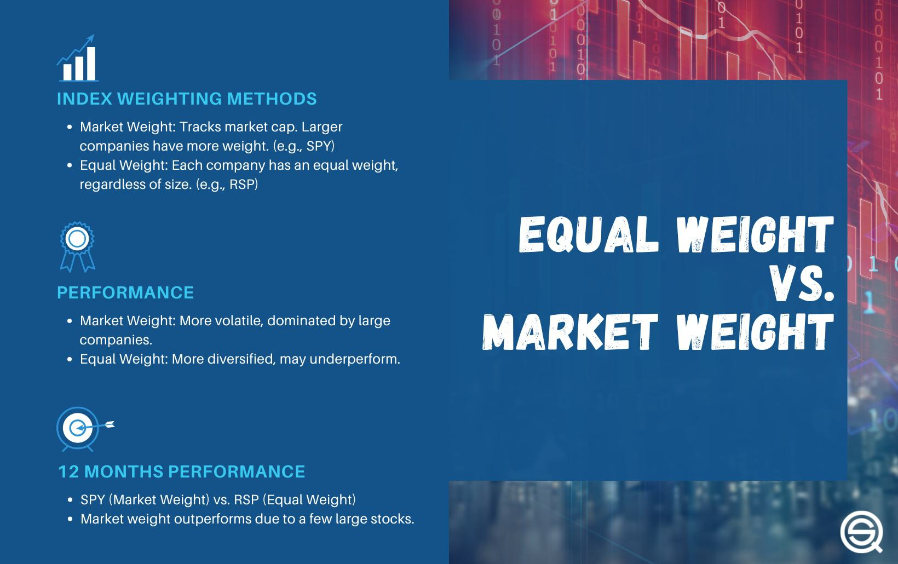

Understanding investment strategies and financial analysis is crucial for both individual and institutional investors. In the rapidly evolving financial landscape, the ability to make informed decisions is paramount for achieving long-term financial goals. This article focuses on the marketweight investment strategy and the role of algorithmic trading in enhancing financial decision-making.

The concept of marketweight is a central element in fixed-income investment strategies. It is used to evaluate the attractiveness of fixed-income instruments based on their credit spreads relative to prevailing market expectations. An investment is termed as marketweight if its credit spread aligns with the current market norms, suggesting that investors might maintain their existing holdings without significant adjustments. This approach guides investors in making decisions about whether to overweight, underweight, or hold their current investments.



On the other hand, algorithmic trading represents the forefront of automated investment strategies. This involves the use of complex algorithms to automate trading decisions based on predefined criteria and real-time data analysis. This type of trading leverages data-driven insights and is used extensively to capture market efficiencies, respond rapidly to market changes, and optimize portfolio performance.

Optimization of investment portfolios, risk mitigation, and harnessing market efficiencies are core objectives that can be achieved by applying both marketweight strategies and algorithmic trading. Marketweight provides investors a structured way to manage risk by aligning with market norms, while algorithmic trading enhances execution efficiency and performance. Together, these strategies empower investors to navigate the complexities of the financial markets with greater precision.

As financial markets become increasingly dynamic, the ability to evaluate and execute successful trades is augmented by robust financial analysis. Financial analysis involves assessing various risk factors, credit ratings, and other critical indicators to support informed investment decisions. The integration of technological advancements in financial analysis and trading has transformed the investment landscape.

Given the rise of technology and data science, understanding the implications and applications of marketweight and algorithmic strategies has never been more pertinent. This guide aims to provide insights into how these strategies can be utilized to enhance investment decisions, improve returns, and maintain a competitive edge in the financial markets.

## Table of Contents

## Understanding Marketweight Investment Strategy

Marketweight pertains to the evaluation of fixed-income instruments based on their current credit spreads relative to market expectations. This approach allows investors to gauge whether the yield offered by a particular bond or other fixed-income security is justified given its risk. A credit spread is essentially the difference in yield between a fixed-income security and a comparable risk-free benchmark, often a government bond. 

When a security is rated as marketweight, it suggests that its credit spread aligns with prevailing market norms. This implies that, according to the market's assessment, the instrument neither presents particular advantages nor disadvantages relative to comparable assets. Investors are typically advised to maintain their current holdings, unless other factors prompt a reassessment.

The marketweight ranking system, although subjective, provides investors with insights on whether to adjust their portfolio allocations. Determining whether to overweight or underweight particular assets is influenced by an investor's risk tolerance, return objectives, and broader market outlook. For instance, a significant deviation in the credit spread from market norms might prompt a decision to adjust the weighting, depending on whether the deviation signals increased risk or an opportunity for higher returns.

Marketweight rankings play a crucial role in portfolio management and investment decisions, especially within the fixed-income sector. They help investors navigate the complexities of credit markets by offering a benchmark against which to measure potential risk and return. This aids in ensuring that portfolios remain aligned with desired risk profiles and performance expectations.

In practice, financial analysts often use marketweight evaluations as part of broader financial analysis strategies, considering factors such as macroeconomic trends, issuer health, and changes in interest rates. This holistic approach helps in identifying securities that are appropriately priced relative to their risk levels, aiding in constructing balanced and resilient investment portfolios.

## Financial Analysis in Investment Strategies

Financial analysis is a cornerstone in assessing marketweight ratings and shaping investment strategies. It encompasses the examination of various financial indicators critical to determining the health and potential of investment opportunities. Key elements of this process include evaluating risk factors, credit ratings, yield, and maturity, among others.

Risk factors are fundamental in understanding the [volatility](/wiki/volatility-trading-strategies) and uncertainty associated with an investment. This involves analyzing historical data to predict future price movements and volatility levels, thereby forming the basis for investment decisions. Credit ratings, provided by agencies like Moody’s, S&P, and Fitch, offer insights into the creditworthiness of fixed-income securities, which are integral to marketweight evaluations. These ratings assess the probability of default, guiding investors on whether to hold or adjust their portfolios.

Yield analysis is essential for determining the return on investment (ROI) provided by a fixed-income instrument. It involves calculating the coupon payment relative to the market price of the bond. Yield to maturity (YTM) is a crucial metric, representing the total return an investor can expect if the bond is held until it matures. It's calculated using the formula:

$$

YTM = \frac{C + \frac{F-P}{n}}{\frac{F+P}{2}} 
$$

where:
- $C$ is the annual coupon payment,
- $F$ is the face value,
- $P$ is the price,
- $n$ is the number of years to maturity.

Maturity analysis aids in understanding the duration and [interest rate](/wiki/interest-rate-trading-strategies) exposure of an investment. Longer maturities typically indicate higher risk due to the uncertainty of future interest rates.

To support these analyses, various performance and risk metrics are employed. The Sharpe ratio, calculated as:

$$

\text{Sharpe Ratio} = \frac{R_p - R_f}{\sigma_p} 
$$

where:
- $R_p$ is the return of the portfolio,
- $R_f$ is the risk-free rate,
- $\sigma_p$ is the standard deviation of the portfolio’s excess return,

is used to measure the risk-adjusted return of an investment, providing a clearer view of return relative to risk.

The win rate, which quantifies the proportion of successful trades to total trades, serves as a measure of an investment strategy's effectiveness. A higher win rate indicates a higher probability of success in trading activities.

Drawdown analysis, capturing the peak-to-trough decline during a specific period, is vital in understanding a strategy's vulnerability to losses. It assists investors in gauging the risk level and potential capital erosion associated with investment strategies.

By integrating these methodologies and metrics, investors can perform comprehensive financial analyses, leading to informed decision-making and optimized investment strategies. This ensures that the alignments are made according to predefined risk thresholds and investment objectives, enhancing the potential for improved returns and managed risks.

## Algorithmic Trading: Enhancing Investment Decisions

Algorithmic trading utilizes advanced algorithms to automate trading decisions based on predefined criteria, offering significant enhancements to investment decision-making processes. This form of trading leverages various strategies designed to capitalize on data-driven insights, ultimately aiming to maximize returns.

One of the core strategies employed in [algorithmic trading](/wiki/algorithmic-trading) is [trend following](/wiki/trend-following), which identifies and takes advantage of ongoing market trends. By using historical data to forecast future price movements, trend-following algorithms execute trades in the direction of the prevailing market trend until the data indicates a reversal.

Mean reversion is another popular strategy wherein algorithms identify overextended price movements, projecting that prices will revert to their historical average over time. This strategy relies on the statistical belief that asset prices will oscillate around their long-term mean, allowing algorithms to profit from price corrections.

High-frequency trading ([HFT](/wiki/high-frequency-trading-strategies)) represents a distinct approach, characterized by the execution of a large number of trades at extremely high speeds, often in fractions of a second. HFT strategies exploit small price discrepancies and market inefficiencies, contributing to market [liquidity](/wiki/liquidity-risk-premium) and tighter bid-ask spreads.

Evaluating the efficiency of algorithmic trading strategies often involves key metrics such as profit [factor](/wiki/factor-investing) and average trade. The profit factor, calculated as the ratio of gross profits to gross losses, provides insight into the potential profitability of a strategy. An average trade metric assesses the expected return per trade, helping determine the effectiveness of the algorithm.

Incorporating these strategies into investment processes enhances decision-making by allowing for systematic, objective, and consistent execution of trades. Algorithms can swiftly process vast datasets and execute trades without the emotional biases that often affect human decision-making. Additionally, algorithms maintain performance standards during market volatility by quickly adapting to changing market conditions, thereby reducing exposure to risks.

Overall, algorithmic trading significantly improves investment decision-making by utilizing advanced data analytics and automation. These enhancements enable investors to respond efficiently to market dynamics and optimize their trading strategies, ultimately leading to improved financial outcomes.

## Integrating Marketweight Strategies with Algorithmic Trading

Combining marketweight strategies with algorithmic trading offers substantial benefits in enhancing investment decisions and optimizing trading performance. Marketweight strategies focus on the analysis of credit spreads of fixed-income instruments to determine their alignment with market expectations. This measurement can inform investors about whether to maintain, increase, or reduce their holdings in specific instruments. By integrating these insights with algorithmic trading, investors can create a more adaptive and responsive investment strategy.

Algorithmic trading utilizes complex algorithms to make data-driven decisions, automating trades based on predefined criteria. This efficiency can be significantly augmented by incorporating marketweight ratings, which provide timely insights into market conditions. For instance, if a particular bond's marketweight rating suggests maintaining the current holding, an algorithm can be designed to hold that position until the rating changes. Conversely, if the rating shifts to overweight or underweight, the algorithm can automatically adjust the investment position to capitalize on anticipated market movements.

Let's consider a simplified scenario where a marketweight model assesses bonds, providing a rating on a scale that indicates the advisability of holding, increasing, or decreasing holdings. A Python algorithm can be used to adjust a portfolio of bonds based on these ratings:

```python
def adjust_portfolio(portfolio, marketweight_ratings):
    for bond, rating in marketweight_ratings.items():
        if rating == 'overweight' and bond not in portfolio:
            portfolio.append(bond)  # Add bond to portfolio
        elif rating == 'underweight' and bond in portfolio:
            portfolio.remove(bond)  # Remove bond from portfolio
    return portfolio

# Example usage
current_portfolio = ['BondA', 'BondB', 'BondC']
marketweight_ratings = {'BondA': 'marketweight', 'BondB': 'underweight', 'BondD': 'overweight'}

new_portfolio = adjust_portfolio(current_portfolio, marketweight_ratings)
print(new_portfolio)  # Output: ['BondA', 'BondC', 'BondD']
```

Here, the algorithmic model efficiently realigns the portfolio based on marketweight ratings. This approach not only optimizes the portfolio in accordance with market predictions but also reduces the response time to shifting market conditions, which is critical in volatile markets.

The integration of marketweight strategies with algorithmic trading not only allows for enhanced precision in trade execution but also facilitates a continuous feedback loop where the algorithms learn from marketweight updates. Thus, investors can gain a competitive edge by employing data-driven strategies to dynamically adjust their portfolios, effectively managing both risk and return.

## Conclusion

In conclusion, a deep understanding of marketweight investment strategies alongside algorithmic trading offers investors significant avenues for improving returns while mitigating associated risks. The sophistication brought about by these methods hinges largely on their ability to adapt to ever-changing market conditions and optimize asset allocations in real-time. The marketweight strategy provides a framework for evaluating fixed-income securities, ensuring that investors maintain an equilibrium in their portfolios by aligning with current market trends and credit spreads. On the other hand, algorithmic trading, powered by robust data analytics, allows for precise execution of trades based on complex models and statistical analyses.

The constantly evolving landscape of financial technology underscores the importance of staying abreast of these advancements. As algorithms become more sophisticated and data collection methods improve, investors will have unprecedented access to insights that can inform more strategic decision-making. This includes harnessing big data to enhance the predictability of market movements and integrating diverse datasets to uncover hidden correlations.

Investors aiming to stay competitive in the financial markets must prioritize education and adaptation. Engaging with the latest tools and techniques in financial analysis, such as using algorithms to back-test strategies or employing [machine learning](/wiki/machine-learning) models to forecast market behaviors, is essential. The seamless blend of traditional investment strategies, like marketweight, with advanced computational techniques enables a nuanced approach to investing that is both proactive and reactive to market dynamics.

Ultimately, the intersection of marketweight investment strategies and algorithmic trading epitomizes the future of investment, where informed decision-making and technological integration coalesce to drive performance and safeguard against volatility. Keeping informed and embracing innovation are key strategies for investors seeking to navigate the complexities of modern financial markets successfully.

## References & Further Reading

[1]: Bergstra, J., Bardenet, R., Bengio, Y., & Kégl, B. (2011). ["Algorithms for Hyper-Parameter Optimization."](https://dl.acm.org/doi/10.5555/2986459.2986743) Advances in Neural Information Processing Systems 24.

[2]: ["Advances in Financial Machine Learning"](https://www.amazon.com/Advances-Financial-Machine-Learning-Marcos/dp/1119482089) by Marcos Lopez de Prado

[3]: ["Evidence-Based Technical Analysis: Applying the Scientific Method and Statistical Inference to Trading Signals"](https://www.amazon.com/Evidence-Based-Technical-Analysis-Scientific-Statistical/dp/0470008741) by David Aronson

[4]: ["Machine Learning for Algorithmic Trading"](https://github.com/stefan-jansen/machine-learning-for-trading) by Stefan Jansen

[5]: ["Quantitative Trading: How to Build Your Own Algorithmic Trading Business"](https://www.amazon.com/Quantitative-Trading-Build-Algorithmic-Business/dp/1119800064) by Ernest P. Chan