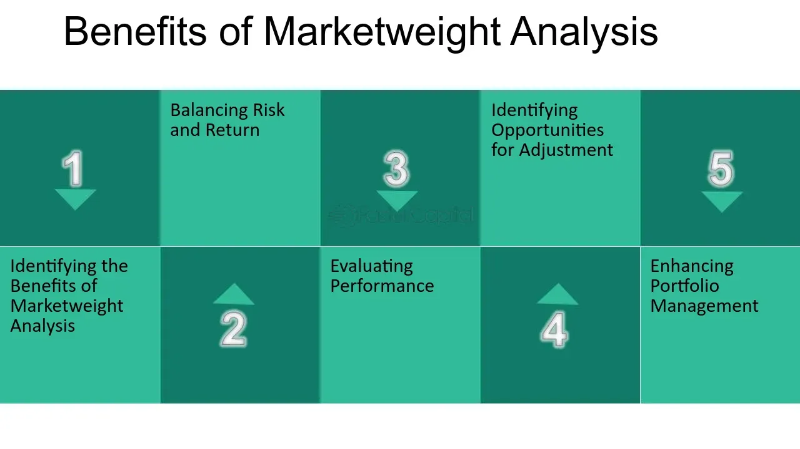

## Table of Contents

## What is the basic definition of marketweight?

Marketweight is a term used in investing to describe a stock or a sector that is expected to perform about the same as the overall market. When analysts or investment firms say a stock is marketweight, they mean it should be included in an investment portfolio in the same proportion as it exists in the market index, like the S&P 500. This suggests that the stock is not seen as a standout performer, but it's also not expected to underperform.

In practical terms, if you're managing a portfolio and you follow marketweight recommendations, you would hold the stock in the same percentage as it appears in the benchmark index. For example, if a company makes up 2% of the S&P 500, and you have a marketweight recommendation for that stock, you would aim to have 2% of your portfolio invested in that company. This approach helps investors maintain a balanced exposure to the market without overweighting or underweighting specific stocks or sectors.

## How does marketweight differ from overweight and underweight?

Marketweight, overweight, and underweight are terms used by analysts to tell investors how much of a stock or sector they should have in their portfolio compared to the market. Marketweight means you should have the same amount of a stock in your portfolio as it is in the market index, like the S&P 500. It's like saying the stock will do about the same as the market, so you don't need more or less of it.

Overweight means analysts think a stock or sector will do better than the market. So, they suggest you should have more of it in your portfolio than what's in the market index. If a stock is 2% of the S&P 500, but it's rated overweight, you might want to have more than 2% of your portfolio in that stock. Underweight is the opposite. It means the stock or sector is expected to do worse than the market, so you should have less of it in your portfolio than what's in the market index. If a stock is 2% of the S&P 500 and it's rated underweight, you might want to have less than 2% of your portfolio in that stock.

## What is the purpose of using marketweight in investment analysis?

The purpose of using marketweight in investment analysis is to help investors decide how much of a stock or sector they should have in their portfolio. When analysts say a stock is marketweight, they mean it should be in your portfolio in the same amount as it is in the market index, like the S&P 500. This helps investors keep their portfolio balanced and not put too much or too little money into any one stock or sector. It's a way to stay in line with the market's overall performance without trying to guess which stocks will do better or worse.

Using marketweight also makes investing simpler for people who might not want to spend a lot of time researching stocks. If an investor follows marketweight recommendations, they can build a portfolio that looks a lot like the market index. This approach can be less risky than trying to pick stocks that might beat the market, because it spreads the risk across many different stocks in the same way the market does.

## Can you explain how marketweight is determined by analysts?

Analysts determine if a stock should be marketweight by looking at lots of information about the stock and the market. They look at things like how the company is doing, how the economy is doing, and what other people think about the stock. They might also use numbers and charts to help them decide. If they think the stock will do about the same as the market, they will say it's marketweight. This means investors should have the same amount of the stock in their portfolio as it is in the market index.

When analysts are deciding if a stock should be marketweight, they also think about what other analysts are saying. They might read reports and listen to what other experts think. Sometimes they use computer programs that look at a lot of data quickly to help them make their decision. If most of the information they gather suggests the stock will perform like the market, they will recommend it as marketweight. This helps investors keep their portfolios balanced and not take too much risk.

## What are the common criteria used to assign a marketweight rating to a stock?

Analysts look at many things to decide if a stock should be marketweight. They check how the company is doing, like if it's making more money or losing money. They also look at the economy to see if it's growing or shrinking. They might use charts and numbers to help them understand how the stock has been doing compared to the market. If they think the stock will do about the same as the market, they'll call it marketweight. This means investors should have the same amount of the stock in their portfolio as it is in the market index.

Another thing analysts do is read reports and listen to what other experts say about the stock. They might use computer programs to look at a lot of data quickly. They want to see if most of the information they gather suggests the stock will perform like the market. If it does, they'll recommend it as marketweight. This helps investors keep their portfolios balanced and not take too much risk by having too much or too little of any one stock.

## How does marketweight affect portfolio management decisions?

Marketweight helps investors decide how much of a certain stock to put in their portfolio. If a stock is marketweight, it means the stock should be in the portfolio in the same amount as it is in the market index, like the S&P 500. This helps keep the portfolio balanced and not too risky. Investors who follow marketweight recommendations don't need to guess which stocks will do better or worse than the market. They can just match their portfolio to the market index, which makes investing simpler and less stressful.

Using marketweight can also make it easier for investors to manage their portfolios. If an investor hears that a stock is marketweight, they know they should have the same percentage of that stock in their portfolio as it is in the market. This way, they can spread their risk across many different stocks, just like the market does. It's a way to stay in line with the market's overall performance without spending a lot of time trying to pick the best stocks.

## What are the implications of a marketweight rating for investors?

When a stock gets a marketweight rating, it means investors should have the same amount of that stock in their portfolio as it is in the market index, like the S&P 500. This helps investors keep their portfolio balanced and not too risky. They don't need to guess which stocks will do better or worse than the market. Instead, they can just match their portfolio to the market index, which makes investing simpler and less stressful.

Using marketweight can also make it easier for investors to manage their portfolios. If an investor hears that a stock is marketweight, they know they should have the same percentage of that stock in their portfolio as it is in the market. This way, they can spread their risk across many different stocks, just like the market does. It's a way to stay in line with the market's overall performance without spending a lot of time trying to pick the best stocks.

## How do marketweight recommendations influence market trends?

Marketweight recommendations can influence market trends by guiding how investors put their money into stocks. When many investors follow marketweight advice, they buy or sell stocks to match the market index. This can make the market move in a certain way. For example, if a lot of stocks get marketweight ratings, investors might buy those stocks to keep their portfolios balanced. This can push up the prices of those stocks a bit, because more people are buying them.

On the other hand, marketweight recommendations can also help keep the market stable. If investors are following marketweight advice, they are not putting too much money into any one stock or sector. This means they are not making big bets on certain stocks doing better than others. Instead, they are spreading their money out across many stocks, which can help keep the market from swinging too much in one direction. So, marketweight recommendations can help the market stay balanced and not get too wild.

## What are the historical performance trends of stocks rated as marketweight?

Stocks that get a marketweight rating usually do about the same as the market. This means if the market goes up, these stocks will probably go up too, but not more than the market. If the market goes down, these stocks will likely go down too, but not less than the market. Over many years, studies have shown that stocks rated as marketweight don't usually beat the market, but they also don't do worse than the market. This is because marketweight stocks are expected to follow the market's overall performance.

Looking at past data, marketweight stocks have been a good choice for investors who want to keep their portfolios steady and not take too much risk. They are not the stars of the market, but they are reliable. Investors who follow marketweight recommendations often find that their portfolios grow at a steady pace, similar to how the market grows. This can be a good strategy for people who want to invest without spending a lot of time trying to pick the best stocks.

## How do different financial institutions interpret and apply the concept of marketweight?

Different financial institutions might use the term "marketweight" a bit differently, but the main idea is the same. They all agree that a marketweight rating means a stock should be in your portfolio in the same amount as it is in the market index, like the S&P 500. Some big banks and investment firms might have their own special ways of figuring out if a stock should be marketweight. They look at things like how the company is doing, what's happening in the economy, and what other experts think. But at the end of the day, they all say that a marketweight stock will do about the same as the market.

Even though the basic idea is the same, how financial institutions use marketweight can be a little different. Some might use it as a starting point and then adjust based on their own research. Others might stick very closely to the marketweight recommendation and not change it much. This can affect how investors build their portfolios. If an investor follows the advice from one bank, their portfolio might look a bit different than if they followed advice from another bank. But the goal is always to help investors keep their portfolios balanced and not take too much risk.

## What advanced metrics or models are used to refine marketweight assessments?

To make marketweight assessments more accurate, analysts use advanced metrics and models. They look at things like the price-to-earnings ratio, which compares a company's stock price to its earnings per share. They also use the price-to-book ratio, which compares the stock price to the company's book value. Another important metric is the dividend yield, which shows how much a company pays out in dividends compared to its stock price. These metrics help analysts understand if a stock is priced right compared to its earnings, assets, and dividends.

Analysts also use models like the discounted cash flow (DCF) model to predict how much a company's future cash flows are worth today. This helps them see if a stock is a good value. They might also use regression analysis to find patterns in how a stock has moved with the market in the past. By combining these metrics and models, analysts can make better guesses about whether a stock should be marketweight. This helps investors make smarter choices about how much of a stock to put in their portfolios.

## How does global economic policy impact the application of marketweight in different regions?

Global economic policies can change how analysts decide if a stock should be marketweight in different parts of the world. For example, if a country's government changes its interest rates or taxes, it can make companies in that country do better or worse. This might make analysts think that stocks in that country should be marketweight, overweight, or underweight compared to the global market. If a country's economy is doing well because of good policies, analysts might say more stocks from that country should be in investors' portfolios.

Even though the basic idea of marketweight is the same everywhere, how it's used can be different in each country. Analysts have to think about what's happening in the local economy and how global events might affect it. For instance, if there's a big trade deal between two countries, it could make stocks in those countries more important to investors. So, analysts might change their marketweight recommendations to help investors keep their portfolios balanced no matter where they are investing.

## What role does financial analysis play in investment strategies?

Financial analysis is a cornerstone in assessing marketweight ratings and shaping investment strategies. It encompasses the examination of various financial indicators critical to determining the health and potential of investment opportunities. Key elements of this process include evaluating risk factors, credit ratings, yield, and maturity, among others.

Risk factors are fundamental in understanding the [volatility](/wiki/volatility-trading-strategies) and uncertainty associated with an investment. This involves analyzing historical data to predict future price movements and volatility levels, thereby forming the basis for investment decisions. Credit ratings, provided by agencies like Moody’s, S&P, and Fitch, offer insights into the creditworthiness of fixed-income securities, which are integral to marketweight evaluations. These ratings assess the probability of default, guiding investors on whether to hold or adjust their portfolios.

Yield analysis is essential for determining the return on investment (ROI) provided by a fixed-income instrument. It involves calculating the coupon payment relative to the market price of the bond. Yield to maturity (YTM) is a crucial metric, representing the total return an investor can expect if the bond is held until it matures. It's calculated using the formula:

$$

YTM = \frac{C + \frac{F-P}{n}}{\frac{F+P}{2}} 
$$

where:
- $C$ is the annual coupon payment,
- $F$ is the face value,
- $P$ is the price,
- $n$ is the number of years to maturity.

Maturity analysis aids in understanding the duration and [interest rate](/wiki/interest-rate-trading-strategies) exposure of an investment. Longer maturities typically indicate higher risk due to the uncertainty of future interest rates.

To support these analyses, various performance and risk metrics are employed. The Sharpe ratio, calculated as:

$$

\text{Sharpe Ratio} = \frac{R_p - R_f}{\sigma_p} 
$$

where:
- $R_p$ is the return of the portfolio,
- $R_f$ is the risk-free rate,
- $\sigma_p$ is the standard deviation of the portfolio’s excess return,

is used to measure the risk-adjusted return of an investment, providing a clearer view of return relative to risk.

The win rate, which quantifies the proportion of successful trades to total trades, serves as a measure of an investment strategy's effectiveness. A higher win rate indicates a higher probability of success in trading activities.

Drawdown analysis, capturing the peak-to-trough decline during a specific period, is vital in understanding a strategy's vulnerability to losses. It assists investors in gauging the risk level and potential capital erosion associated with investment strategies.

By integrating these methodologies and metrics, investors can perform comprehensive financial analyses, leading to informed decision-making and optimized investment strategies. This ensures that the alignments are made according to predefined risk thresholds and investment objectives, enhancing the potential for improved returns and managed risks.

## References & Further Reading

[1]: Bergstra, J., Bardenet, R., Bengio, Y., & Kégl, B. (2011). ["Algorithms for Hyper-Parameter Optimization."](https://dl.acm.org/doi/10.5555/2986459.2986743) Advances in Neural Information Processing Systems 24.

[2]: ["Advances in Financial Machine Learning"](https://www.amazon.com/Advances-Financial-Machine-Learning-Marcos/dp/1119482089) by Marcos Lopez de Prado

[3]: ["Evidence-Based Technical Analysis: Applying the Scientific Method and Statistical Inference to Trading Signals"](https://www.amazon.com/Evidence-Based-Technical-Analysis-Scientific-Statistical/dp/0470008741) by David Aronson

[4]: ["Machine Learning for Algorithmic Trading"](https://github.com/stefan-jansen/machine-learning-for-trading) by Stefan Jansen

[5]: ["Quantitative Trading: How to Build Your Own Algorithmic Trading Business"](https://www.amazon.com/Quantitative-Trading-Build-Algorithmic-Business/dp/1119800064) by Ernest P. Chan