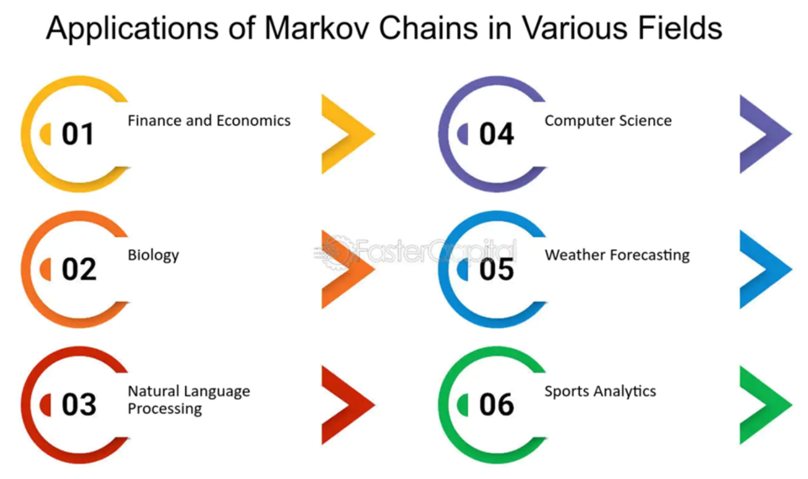

Stochastic processes are mathematical objects used to represent systems or phenomena that evolve over time with inherent randomness. These processes are fundamental to understanding financial markets, where variables such as stock prices, interest rates, and market indices, are subject to random fluctuations. Their analysis provides valuable insights into the probabilistic nature of market behavior and aids in the development of strategies to manage financial risk.

Markov analysis is a crucial component of stochastic processes, particularly valued for its utility in predictive modeling. Named after the Russian mathematician Andrey Markov, it postulates that the future state of a process is dependent only on its present state, not on the sequence of events that preceded it. This principle, known as the Markov property, simplifies the complexity involved in modeling stochastic processes by reducing the dependency to a single state transition.



In financial markets, Markov analysis finds prominent applications, notably within algorithmic trading. Algorithmic trading, characterized by the use of computer programs to execute trades at high speed, relies heavily on predictive models to inform trading decisions. Markov models use a sequence of observed states to forecast the likelihood of various future states, thus aiding in the anticipation of market movements and optimization of trading strategies.

Key concepts underpinning this analytic framework include Markov chains and Markov models. A Markov chain is a mathematical system that undergoes transitions from one state to another within a finite or countably infinite number of possible states. It is described by a transition matrix that contains the probabilities of moving from one state to another. A Markov model extends this concept by incorporating additional parameters to describe more complex processes, often involving hidden states.

Through this article, we will explore the foundational elements of stochastic processes and Markov analysis, their contributions to financial modeling, their specific applications in algorithmic trading, and the associated advantages and limitations of their use in trading strategies.

## Table of Contents

## Understanding Stochastic Processes and Markov Analysis

Stochastic processes are mathematical objects used to describe systems or phenomena that evolve over time with inherent randomness. In finance, these processes are crucial for modeling a variety of variables, including stock prices, interest rates, and market indices. A stochastic process can be thought of as a collection of random variables, indexed by time or space. In the context of finance, one common model is the Geometric Brownian Motion, which assumes continuous paths and is frequently used for modeling stock prices.

Markov analysis is a mathematical method derived from the study of stochastic processes. It focuses on processes where the future states depend only on the current state, known as the Markov property. This property can be mathematically expressed as:

$$
P(X_{n+1} = x | X_n = x_n, X_{n-1} = x_{n-1}, \dots, X_0 = x_0) = P(X_{n+1} = x | X_n = x_n)
$$

where $X_n$ represents the state at time $n$. Applying this principle allows simplification and tractable modeling of complex systems.

The origins of Markov analysis trace back to Russian mathematician Andrey Markov. Markov's work in the early 20th century laid the foundation for what we now refer to as Markov chains. He published his pioneering work on sequences of dependent trials, highly influential in subsequent developments in probability theory. Despite its significance in modern applications, Markov's initial analysis was primarily focused on literary texts, demonstrating statistical properties such as rhyme, rather than financial or physical processes.

A Markov chain is a type of stochastic process that satisfies the Markov property. It is characterized by a set of states and transition probabilities between states. For a finite state space, this can be depicted as a transition matrix $P$, where the element $P_{ij}$ represents the probability of transitioning from state $i$ to state $j$:

$$
P = \begin{bmatrix} 
P_{11} & P_{12} & \cdots & P_{1n} \\ 
P_{21} & P_{22} & \cdots & P_{2n} \\ 
\vdots & \vdots & \ddots & \vdots \\ 
P_{n1} & P_{n2} & \cdots & P_{nn} 
\end{bmatrix}
$$

Certain types of Markov chains, such as regular or absorbing Markov chains, have unique properties that can be exploited for modeling diverse phenomena. In finance, applications of Markov chains include predicting stock market trends and understanding credit ratings dynamics.

Markov chains are widely used due to their intuitive approach and minimal parameter requirements. They serve as the building blocks for more complex models, such as Hidden Markov Models (HMMs), where the system state is not directly observable but can be inferred from observed data. Understanding and applying these concepts allow analysts and traders to build predictive models that capture the probabilistic nature of financial markets.

## Markov Analysis in Financial Modeling

Markov analysis plays a significant role in financial modeling by providing a framework to analyze and predict the behavior of stock and option price movements. The foundation of this application lies in the Markov property, which assumes that the future state of a process is dependent solely on its present state, not its historical path. This property simplifies the complexity of financial models, making them both computationally efficient and effective for predictive analysis.

When applied to stock and option pricing, Markov models consider the prices of these financial instruments as a sequence of states. Each state represents a specific price level, and transitions between states are governed by a set of probabilities. This probabilistic approach is particularly beneficial in financial markets, which are characterized by uncertainty and [volatility](/wiki/volatility-trading-strategies). A simple Markov chain model might track whether the price of a stock is rising, falling, or remaining stable, along with the probabilities associated with each transition.

One of the main attractions of Markov models is their simplicity and the intuitive manner in which predictions can be made. For instance, the application of a basic Markov chain to forecast stock prices might compute the expected price at a future time point based on current data, which can be represented as:

$$
P(t+1) = P(t) \cdot T
$$

where $P(t)$ is the current state matrix, and $T$ is the transition matrix containing the probabilities of moving from one state to another. This model's predictions, while simplistic, can offer a certain level of accuracy by capturing the core statistical patterns present in historical price data.

Markov analysis can also be augmented with decision trees to enhance predictability and decision-making capabilities. Decision trees divide the progression of a financial process into conditional branches, each representing decisions based on specific criteria derived from the current state and observed transitions. By integrating Markov analysis with decision tree algorithms, financial models can manage more intricate pricing strategies or trading rules, reflecting both state probabilities and strategic decision points. In Python, frameworks such as Scikit-learn provide tools to implement decision trees which optimize trading strategies based on current and potential future states as indicated by a Markov chain.

Overall, the application of Markov analysis in financial modeling presents an effective approach for analyzing and predicting stock and option price movements. Its balance of simplicity and predictive accuracy makes it a valuable tool in the construction of financial models, particularly when combined with decision trees to refine prediction strategies and better navigate the complexities of financial markets.

## Applications of Markov Analysis in Algorithmic Trading

Algorithmic trading, a prominent feature in modern financial markets, relies heavily on predictive models to execute trades at high speeds and volumes. These models need to predict future market movements with a reasonable degree of accuracy, and Markov analysis is one of the tools that can be employed for this purpose. The core strength of Markov analysis in [algorithmic trading](/wiki/algorithmic-trading) lies in its ability to model the probabilistic transitions between different market states, thereby allowing traders to make informed decisions based on the historical state of the market.

Markov analysis finds its application in several aspects of algorithmic trading. One such use is in developing trading algorithms that anticipate the probability of a particular market state occurring after the current state. With this methodology, traders can forecast short-term market trends and adjust their portfolios accordingly. For instance, a Markov Chain, which is a sequence of possible events where the probability of each event depends only on the state attained in the previous event, can be used to model stock price movements. By considering n possible states of a stock or asset, the transition matrix used in Markov models allows traders to evaluate the likelihood of moving from one price level to another.

In addition to basic Markov models, Hidden Markov Models (HMMs) are an advanced derivative frequently used to predict market movements. HMMs incorporate both observable and hidden states, enabling traders to infer the hidden market conditions from observable price movements. The challenge with financial markets is that not all influencing factors are visible; thus HMMs provide a framework to model the latent (hidden) factors driving market behaviors.

The integration of Markov analysis in trading strategies has been validated through various case studies. For instance, consider a trading strategy that employs an HMM to predict stock prices. By identifying a pattern in historical price movements (observable states), the model can anticipate future trends (hidden states) with a quantifiable level of confidence. A practical example includes using HMMs to model the volatility of stock returns, where the hidden states can indicate different market conditions such as bull or bear phases.

A prominent case study demonstrating the use of Markov analysis is the prediction of currency market movements for constructing [forex](/wiki/forex-system) trading strategies. By applying a Markov model to historical currency exchange rates, traders can exploit patterns that are likely to persist in the short term, thereby optimizing entry and [exit](/wiki/exit-strategy) points for trades. Moreover, employing HMMs allows traders to capitalize on the cyclical nature of currency markets by predicting shifts in market phases, thus enhancing the overall effectiveness of the trading algorithm.

In summary, the application of Markov analysis, including advanced forms like HMMs, provides a robust framework for building predictive models in algorithmic trading. By modeling the probabilistic nature of financial markets, these tools aid traders in making data-driven decisions, thereby helping to improve trading efficiency and profitability.

## Advantages and Disadvantages of Markov Analysis in Trading

Markov analysis, grounded in the principles of stochastic processes, offers several advantages in trading, primarily due to its simplicity, computational efficiency, and predictive accuracy. By focusing on the current state rather than tracking all potential historical pathways, Markov models provide streamlined and effective predictions, which are particularly valuable in the fast-paced environment of financial markets.

### Key Benefits

#### Simplicity
One of the primary strengths of Markov analysis lies in its straightforward conceptual framework. It considers only current conditions to predict future states, thus reducing the complexity inherent in more elaborate models. This simplicity translates into ease of implementation and a lower barrier to entry for traders and financial analysts who may not have extensive mathematical backgrounds.

#### Computational Efficiency
Markov models are inherently well-suited for computational tasks. By limiting the scope to present states and probabilities, they require less computational power compared to models incorporating a vast array of historical data. This efficiency is crucial in algorithmic trading, where rapid execution can significantly impact profitability.

#### Predictive Accuracy
Despite their simplicity, Markov models often provide accurate predictions in financial contexts where the Markov property holds—i.e., future states depend solely on the current state and not on the sequence of events that preceded it. This attribute makes them effective in predicting short-term market movements where past behavior is less indicative of future outcomes.

### Limitations

#### Complexity of Financial Events
One significant drawback is the inability of Markov models to capture complex financial phenomena or account for external factors influencing markets. Financial events often depend on a web of intricate and dynamic variables that a simple Markov process might not adequately reflect, such as market sentiment, geopolitical events, and regulatory changes.

#### Violations of Markov Assumptions
Markov models rely heavily on the assumption that the future is conditionally independent of the past given the present state. This assumption can frequently be violated in real-world markets, where past trends and patterns have substantial influence on future events. For example, traders often look for patterns in historical price data to build strategies, which inherently conflicts with the Markovian perspective.

### Strategies to Improve Robustness

To address these limitations and enhance the robustness of Markov models, traders and analysts may consider employing several strategies:

- **Incorporating Historical Data**: While pure Markov processes do not utilize historical data, hybrid models can integrate historical trends to capture more complex dependencies. For instance, augmenting Markov models with machine learning techniques such as recursive neural networks could enhance their predictive capabilities.

- **Adjusting for External Variables**: Traders can include external variables into Markov models to account for factors like macroeconomic indicators or market news that influence financial markets. This inclusion can help align model predictions more closely with real-world scenarios.

- **Using Ensembles of Models**: By combining multiple models, including non-Markovian approaches, traders can offset the individual limitations of each model type. This ensemble approach allows for greater flexibility and an improved understanding of market dynamics.

In conclusion, while Markov analysis offers tangible benefits for trading due to its simplicity and efficiency, awareness of its limitations is crucial. By acknowledging and addressing these constraints, traders can enhance the applicability and accuracy of Markov-based strategies in financial markets.

## Examples and Case Studies

A detailed example of Markov analysis used by stock speculators illustrates the practical application of stochastic modeling in financial markets. Stock speculators often rely on predicting market trends by evaluating sequential states of stock prices. Markov analysis, through Markov chains, allows speculators to model these price states considering that the future state (price) relies solely on the current state, not on the sequence of events preceding it—known as the Markov property.

For instance, consider a simple stock market model where the stock price at a future time period is determined by whether it is currently in an upward trend or downward trend. This binary state model can be represented as a Markov chain with transition probabilities indicating the likelihood of the stock continuing in its current trend or reversing. By calculating these probabilities from historical data, speculators can develop stochastic models to estimate future price movements.

Real-life case studies have demonstrated that Markov analysis can enhance financial predictions. For example, when evaluating the price movements of a particular stock, analysts can use historical price data to establish a transition matrix of probabilities. This matrix aids in predicting the likelihood of price increases, decreases, or stability over the next trading period. Such models, when calibrated with large datasets, improve the ability to forecast market behavior accurately.

A practical application of Markov analysis can also be seen through Markov-based decision trees. These trees introduce structured decision-making processes by integrating Markov chains with condition-action rules. For example, using a decision tree, analysts might create a node structure where each node represents a decision point influenced by the current state of the market (modeled as a Markov chain state). The decisions at each node can include actions like buying, holding, or selling stocks, based on calculated transition probabilities and expected returns.

To illustrate a simple Markov-based decision tree in Python, consider the following code snippet, which demonstrates a tree where decisions are made based on a two-state Markov process (bullish or bearish market):

```python
class MarkovDecisionTree:
    def __init__(self, transition_matrix, states):
        self.transition_matrix = transition_matrix
        self.states = states

    def predict_next_state(self, current_state):
        import numpy as np
        return np.random.choice(self.states, p=self.transition_matrix[current_state])

    def make_decision(self, current_state):
        if current_state == 'bullish':
            return 'buy'
        elif current_state == 'bearish':
            return 'sell'

# Example usage

transition_matrix = {
    'bullish': [0.7, 0.3],  # 70% chance to remain bullish, 30% chance to switch to bearish
    'bearish': [0.4, 0.6]   # 40% chance to switch to bullish, 60% chance to remain bearish
}

states = ['bullish', 'bearish']
mdt = MarkovDecisionTree(transition_matrix, states)

current_state = 'bullish'
next_state = mdt.predict_next_state(current_state)
decision = mdt.make_decision(next_state)

print(f"Current State: {current_state}")
print(f"Predicted Next State: {next_state}")
print(f"Recommended Decision: {decision}")
```

This example outlines how stock speculators and traders might implement a basic Markov model to decide investment strategies based on probable market trends. The efficiency of Markov analysis in capturing dependencies over time makes it a valuable tool in algorithmic trading, providing traders with a probabilistic approach to forecast stock price movements amidst inherent market volatilities.

## Future Trends and Developments

The financial markets continue to evolve with the increasing integration of technology, and Markov analysis is playing a pivotal role in shaping this transformation. One of the notable emerging trends in algorithmic trading is the integration of [machine learning](/wiki/machine-learning) techniques with Markov models. This fusion allows for more complex and accurate predictive modeling, potentially improving trading performance and risk management. By harnessing the power of machine learning, traders can uncover hidden patterns in market data, enhancing the predictive capabilities of traditional Markov chains.

In addition to machine learning, there has been significant progress in developing more sophisticated Markov models, such as the incorporation of Hidden Markov Models (HMMs). HMMs provide a framework to account for hidden states in the market, offering a more nuanced understanding of market dynamics. This is particularly useful in environments where observable price signals alone do not provide complete information about the underlying market conditions.

Furthermore, quantum computing stands as a frontier with the potential to reshape the landscape of Markov analysis in finance. Quantum algorithms promise exponential speed-ups in computation, enabling the real-time processing of vast and complex datasets. This advancement could allow for more dynamic and responsive trading strategies, which is crucial in high-frequency trading environments where milliseconds can make a difference.

Lastly, the development of robust methods for dealing with non-stationary financial data is another critical area of innovation. Traditional Markov models often assume a level of stationarity in input data, which is not always the case in the volatile financial markets. Researchers are developing adaptive algorithms that can adjust to shifting market regimes, enhancing the robustness and accuracy of Markov-based predictions.

In summary, the future trends in Markov analysis within algorithmic trading involve interdisciplinary approaches that elevate its application. Integration with machine learning, advancements in HMMs, the budding potential of quantum computing, and adaptive techniques to handle non-stationarity are all paving the way for more sophisticated and effective trading strategies. Markov models remain integral in the evolving landscape of financial markets, enhancing both the depth and breadth of predictive capabilities available to traders.

## Conclusion

Stochastic processes and Markov analysis play a pivotal role in the financial trading landscape by offering mathematical frameworks to model random variables and predict future financial events. These methodologies enable traders to build predictive models that are essential for making informed decisions in complex markets. The Markov property, wherein the future state depends only on the present state and not on the sequence of events that preceded it, offers a simplified yet powerful approach to model seemingly chaotic market behaviors.

Markov models, including Markov chains and Hidden Markov Models (HMMs), offer numerous applications in trading strategies. Their strength lies in their simplicity and computational efficiency, making them particularly suitable for algorithmic trading, where real-time decision-making is crucial. Specifically, they provide a structured method to forecast price movements and identify optimal trading opportunities.

However, the limitations of Markov analysis cannot be overlooked. The assumption of state independence and the inability to capture long-range dependencies in financial data may reduce the applicability of Markov models in certain scenarios. These limitations necessitate a cautious approach when relying solely on Markov models for predictive accuracy, emphasizing the need for traders to augment them with other analytical techniques.

To mitigate these challenges, traders should consider blending Markov analysis with complementary strategies such as machine learning models and non-Markovian techniques. This hybrid approach can significantly enhance model robustness, enabling more accurate predictions and better risk management.

In conclusion, while Markov analysis provides a foundational tool for understanding and predicting market movements, it is imperative for traders to use it as part of a broader analytical framework. By integrating Markov models with diverse strategies, traders can create more reliable and effective trading systems capable of adapting to the dynamic nature of financial markets.

## References & Further Reading

[1]: Andrei N. Markov. ["The Theory of Algorithms."](https://link.springer.com/book/9789027727732) The Charles Babbage Research Centre, 1982.

[2]: "Introduction to Stochastic Processes with Applications to Biology" by Linda J.S. Allen. This book provides a comprehensive introduction to stochastic processes with a focus on applications.

[3]: "Advances in Financial Machine Learning" by Marcos Lopez de Prado. This book details techniques in machine learning for financial applications including predictive modeling.

[4]: "Algorithmic Trading and DMA: An introduction to direct access trading strategies" by Barry Johnson. This book covers the strategies involved in algorithmic trading.

[5]: [Ghahramani, Z. (2001). "An Introduction to Hidden Markov Models and Bayesian Networks."](https://i2pc.es/coss/Docencia/SignalProcessingReviews/Ghahramani2001.pdf) International Journal of Pattern Recognition and Artificial Intelligence, 15(01), 9-42.

[6]: "Quantitative Trading: How to Build Your Own Algorithmic Trading Business" by Ernest P. Chan. This book provides insight into developing algorithmic trading systems.

[7]: "Machine Learning for Algorithmic Trading" by Stefan Jansen. This book discusses using machine learning models for algorithmic trading strategies.

[8]: ["Evidence-Based Technical Analysis: Applying the Scientific Method and Statistical Inference to Trading Signals"](https://www.amazon.com/Evidence-Based-Technical-Analysis-Scientific-Statistical/dp/0470008741) by David Aronson. This resource explores technical analysis through the lens of statistical inference.