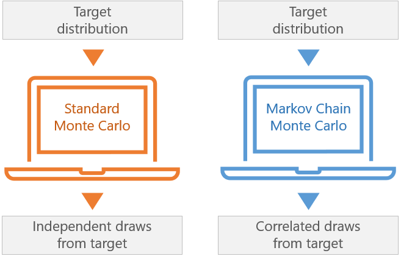

## Table of Contents

## What is Markov Chain Monte Carlo (MCMC) and why is it used in machine learning?

Markov Chain Monte Carlo (MCMC) is a method used to sample from a complex probability distribution by creating a sequence of random samples. Imagine you have a big jar of colored balls, but you can't see inside it. MCMC helps you figure out what colors are in the jar by taking balls out one at a time, looking at their color, and then putting them back in a specific way. This process is repeated many times, and over time, the colors you see start to represent what's actually in the jar. In math terms, MCMC uses a Markov chain, which means the next sample depends only on the current one, to explore the distribution.

In machine learning, MCMC is used because it helps solve problems where you need to understand a complicated probability distribution. For example, when training a model, you might need to find the best values for many parameters. MCMC can help by exploring all possible combinations of these parameters to find the ones that make the model work best. This is especially useful in Bayesian statistics, where you want to update your beliefs about the model's parameters as you get more data. By using MCMC, you can get a good estimate of these parameters without having to check every single possibility, which would be too time-consuming or even impossible with very complex models.

## How does the basic concept of a Markov chain relate to MCMC methods?

A Markov chain is like a path where each step you take depends only on where you are right now, not on how you got there. Imagine walking on a grid where the next square you step on is chosen based on the square you're currently standing on. This is the basic idea behind a Markov chain. In the context of MCMC, this concept is used to explore a probability distribution. You start at some point in the distribution and then move to new points based on rules that depend only on your current position. Over time, these moves help you understand the whole distribution better.

In MCMC methods, the Markov chain is used to generate samples from a complex distribution that would be hard to sample directly. For example, if you want to understand how likely different outcomes are in a model, you can use a Markov chain to move around the space of possible outcomes. Each move you make in the chain is like taking a sample from the distribution. By doing this many times, you build up a collection of samples that represent the distribution. This allows you to estimate properties of the distribution, like the average or the most likely outcome, even if you can't calculate them directly.

## What is the Metropolis-Hastings algorithm and how does it work?

The Metropolis-Hastings algorithm is a popular type of Markov Chain Monte Carlo (MCMC) method that helps you sample from a complicated probability distribution. Imagine you're trying to find your way around a big, foggy mountain. You can't see the whole mountain, but you can take steps and decide if you want to stay where you land or go back to where you were. In the Metropolis-Hastings algorithm, you start at some point on the mountain, take a step to a new point, and then decide whether to stay at the new point or go back to the old one based on how likely the new point is compared to the old one.

Here's how it works: You start at a point, let's call it $$x$$, and propose a move to a new point $$y$$ using a proposal distribution. This proposal distribution decides how you take your step on the mountain. Once you're at $$y$$, you calculate the ratio of the probabilities of being at $$y$$ versus $$x$$, which is called the acceptance probability. If the probability of being at $$y$$ is higher than at $$x$$, you move to $$y$$. If it's lower, you might still move to $$y$$, but with a probability equal to that ratio. If you don't move to $$y$$, you stay at $$x$$. By repeating this process many times, you explore the mountain and get a good idea of its shape, even though you can't see it all at once.

## Can you explain the acceptance probability in the Metropolis-Hastings algorithm?

The acceptance probability in the Metropolis-Hastings algorithm is like a decision-making tool that helps you decide whether to stay at a new point or go back to the old one. Imagine you're exploring a mountain and you take a step to a new spot. The acceptance probability tells you how likely it is that you'll stay at this new spot. It's calculated by comparing the probability of being at the new spot to the probability of being at the old spot. If the new spot is more likely, you'll definitely stay there. But if it's less likely, you might still stay there, but with a smaller chance.

The formula for the acceptance probability is $$ \alpha = \min\left(1, \frac{\pi(y) q(x|y)}{\pi(x) q(y|x)}\right) $$. Here, $$\pi(x)$$ and $$\pi(y)$$ are the probabilities of being at the old point $$x$$ and the new point $$y$$, respectively. The terms $$q(x|y)$$ and $$q(y|x)$$ come from the proposal distribution, which is how you decide to take your step. If the ratio of these probabilities is greater than 1, the acceptance probability is 1, meaning you'll definitely move to the new spot. If the ratio is less than 1, the acceptance probability is that ratio, meaning you'll move to the new spot with that probability. This way, the algorithm ensures that you explore the mountain thoroughly, spending more time in the more likely areas.

## What are some common applications of MCMC in machine learning?

MCMC is often used in [machine learning](/wiki/machine-learning) to help with something called Bayesian inference. Imagine you have a model and you want to figure out the best values for its settings, or parameters. These parameters can be tricky to find because they depend on the data you have. MCMC helps by exploring all possible values of these parameters, kind of like trying different combinations until you find the one that fits your data the best. This is especially useful in Bayesian methods where you update your guesses about the parameters as you get more data. By using MCMC, you can get a good idea of what these parameters might be without having to check every single possibility, which would take too long.

Another common use of MCMC in machine learning is for dealing with complex models that have lots of parts that all depend on each other. For example, in a model that tries to understand how different pieces of data are related, you might need to figure out many different things at the same time. MCMC can help by sampling from the whole set of possible ways these pieces could fit together. This way, you can understand the model better and make better predictions. It's like trying to solve a big puzzle where you move the pieces around until you see how they all fit together.

## How does reSGLD (reparameterized Stochastic Gradient Langevin Dynamics) differ from traditional MCMC methods?

reSGLD, or reparameterized Stochastic Gradient Langevin Dynamics, is a method that combines ideas from both MCMC and stochastic gradient descent. While traditional MCMC methods, like Metropolis-Hastings, focus on sampling from a distribution by exploring the whole space, reSGLD uses gradients to guide the sampling process. Imagine you're trying to find the best path down a mountain. Traditional MCMC might have you wander around to see all parts of the mountain, but reSGLD is like having a map that shows you the steepest slopes, helping you move more directly towards the bottom.

In reSGLD, the sampling process is influenced by the gradient of the log-posterior distribution, which makes the exploration more efficient. The formula for the update step in reSGLD is $$ x_{t+1} = x_t + \frac{\epsilon}{2} \nabla \log \pi(x_t) + \sqrt{\epsilon} \cdot \eta_t $$, where $$ \epsilon $$ is the step size, $$ \nabla \log \pi(x_t) $$ is the gradient of the log-posterior at the current point $$ x_t $$, and $$ \eta_t $$ is a random noise term. This approach can be particularly useful in high-dimensional spaces where traditional MCMC might get stuck or take too long to explore effectively. By using the gradient information, reSGLD can navigate the space more quickly and accurately, making it a powerful tool for certain machine learning applications.

## What are the advantages of using reSGLD over other MCMC techniques?

reSGLD, or reparameterized Stochastic Gradient Langevin Dynamics, has some key advantages over traditional MCMC methods. One big advantage is that it uses the gradient of the log-posterior to guide its steps. This means it can move more directly towards the parts of the space that are more likely, rather than just wandering around. Imagine you're looking for a treasure on a big island. Traditional MCMC might have you walk around the whole island randomly, but reSGLD is like having a map that shows you where the treasure might be, so you can head in the right direction faster. This can be especially helpful in high-dimensional spaces where traditional MCMC might take a long time to explore everything.

Another advantage of reSGLD is that it can handle big datasets better. Traditional MCMC methods might struggle with large amounts of data because they need to consider every piece of data in every step. But reSGLD can use mini-batches of data to calculate the gradient, which makes it faster and more scalable. This is like trying to find your way through a crowded room. Instead of looking at every person one by one, you can look at small groups at a time to get a sense of where to go next. By doing this, reSGLD can work more efficiently and handle bigger problems that might be too hard for other MCMC methods.

## Can you describe the CSGLD (Continuous Stochastic Gradient Langevin Dynamics) method and its applications?

CSGLD, or Continuous Stochastic Gradient Langevin Dynamics, is a method that helps you explore a probability distribution by following a path that changes smoothly over time. Imagine you're trying to find the best spot on a big, bumpy hill. Instead of jumping around randomly, CSGLD helps you move smoothly, like sliding down the hill while also feeling the bumps and adjusting your path. This method uses the gradient of the log-posterior to guide its movement, but it also adds a bit of randomness to make sure you explore different parts of the hill. The update rule for CSGLD is $$ dx_t = \frac{1}{2} \nabla \log \pi(x_t) dt + \sqrt{dt} \cdot dW_t $$, where $$ \nabla \log \pi(x_t) $$ is the gradient at the current position, $$ dt $$ is a small time step, and $$ dW_t $$ is a random noise term.

CSGLD is particularly useful in machine learning for tasks like training neural networks and other complex models. When you're trying to find the best settings for a model, you might need to explore a lot of different possibilities. CSGLD can help by moving smoothly through the space of possible settings, making it easier to find the best ones. This method is especially good for big datasets because it can use mini-batches of data to calculate the gradient, which makes it faster and more efficient. By using CSGLD, you can get a good understanding of your model and make better predictions, even when the model is very complicated.

## How do you assess the convergence of an MCMC algorithm?

Assessing the convergence of an MCMC algorithm is like checking if you've explored all the important parts of a big, foggy mountain. You want to make sure that the samples you've taken are a good representation of the whole mountain, not just one part. One way to do this is by looking at something called the trace plot. This is a graph that shows how your samples change over time. If the samples are jumping around a lot at first but then start to settle down and look more stable, it's a sign that your MCMC is converging. Another way is to use something called the autocorrelation plot, which shows how much each sample depends on the ones before it. If the autocorrelation drops off quickly, it means your samples are becoming more independent, which is good for convergence.

Another method to assess convergence is by using multiple chains. Imagine you send several people to explore the same mountain but they start from different places. If they all end up exploring similar parts of the mountain over time, it's a good sign that your MCMC has converged. You can use a statistic called the Gelman-Rubin statistic, often written as $$ \hat{R} $$, to check this. If $$ \hat{R} $$ is close to 1, it means the different chains are behaving similarly, suggesting that your MCMC has converged. Finally, you can also look at the effective sample size, which tells you how many independent samples you effectively have. A higher effective sample size means your MCMC is doing a good job of exploring the space and converging to the right distribution.

## What are the challenges and limitations of using MCMC in high-dimensional spaces?

Using MCMC in high-dimensional spaces can be really tricky. Imagine you're trying to explore a huge, complex maze where each turn leads to even more turns. In high dimensions, the space you need to explore grows very quickly, and it becomes hard for MCMC to visit all the important parts. This is known as the curse of dimensionality. Also, the paths that MCMC takes might get stuck in one part of the space and not explore other parts well, which is called getting trapped in local optima. This can happen because the moves that MCMC makes might not be big enough to jump out of these areas.

Another challenge is that it can take a very long time for MCMC to explore high-dimensional spaces well. You might need to run the algorithm for a lot of steps, which can be slow and use a lot of computer power. Also, checking if MCMC has explored the space well enough, or if it has converged, becomes harder in high dimensions. You might need special tools or methods to make sure you're getting good results. Despite these challenges, there are ways to make MCMC work better in high dimensions, like using smarter proposal distributions or methods like reSGLD and CSGLD that use gradients to guide the exploration.

## How can one optimize the performance of MCMC algorithms for complex models?

Optimizing the performance of MCMC algorithms for complex models can be tricky, but there are some smart ways to make it easier. One way is to use a better proposal distribution. This is like choosing a smarter way to take steps when exploring a mountain. Instead of jumping around randomly, you can use a proposal that helps you move to more likely spots faster. For example, you can use something called adaptive MCMC, where the proposal changes as you learn more about the mountain. Another way is to use parallel tempering, which is like having several people explore the mountain at the same time but at different temperatures. This helps them escape from tricky spots and explore more of the mountain.

Another approach to optimize MCMC for complex models is to use gradient-based methods like reSGLD and CSGLD. These methods use the gradient of the log-posterior to guide the steps, making it easier to find the best spots on the mountain. The update rule for reSGLD, for example, is $$ x_{t+1} = x_t + \frac{\epsilon}{2} \nabla \log \pi(x_t) + \sqrt{\epsilon} \cdot \eta_t $$. This formula helps you move in the direction that's more likely, while still adding some randomness to explore different parts. Also, using mini-batches of data can make these methods work faster, especially when dealing with big datasets. By combining these smart techniques, you can make MCMC work better even with very complex models.

## What advanced techniques exist for improving the efficiency of MCMC methods like Metropolis-Hastings, reSGLD, and CSGLD?

One way to make MCMC methods like Metropolis-Hastings, reSGLD, and CSGLD more efficient is by using smarter proposal distributions. For example, in Metropolis-Hastings, you can use adaptive MCMC, which adjusts the proposal distribution as you learn more about the space you're exploring. This is like changing your walking strategy on a mountain to find the best path more quickly. Another technique is parallel tempering, where you run multiple chains at different "temperatures." This helps the chains escape from tricky spots and explore more of the space, making the overall exploration more efficient. For reSGLD and CSGLD, you can use the gradient of the log-posterior to guide the steps, making it easier to move towards the more likely areas. The update rule for reSGLD, for instance, is $$ x_{t+1} = x_t + \frac{\epsilon}{2} \nabla \log \pi(x_t) + \sqrt{\epsilon} \cdot \eta_t $$, which combines the gradient with some randomness to explore effectively.

Another advanced technique to improve efficiency is using Hamiltonian Monte Carlo (HMC). HMC adds [momentum](/wiki/momentum) to the exploration, making it easier to move through high-dimensional spaces. It's like using a sled to slide down a mountain, allowing you to cover more ground quickly. HMC uses the Hamiltonian dynamics to propose new states, which can be more effective than random jumps. Additionally, using mini-batches of data can make these methods faster, especially when dealing with large datasets. By processing smaller chunks of data at a time, you can calculate the gradient more quickly and make the MCMC process more scalable. Combining these techniques can significantly enhance the performance of MCMC methods, even for very complex models.