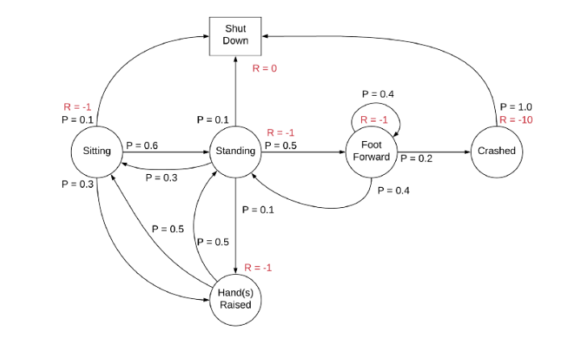

## Table of Contents

## What is a Markov Decision Process (MDP) and why is it important in machine learning?

A Markov Decision Process (MDP) is a mathematical framework used to model decision-making in situations where outcomes are partly random and partly under the control of a decision maker. In an MDP, the world is described by states, and the decision maker can take actions that move the system from one state to another. The transition between states depends on the current state and the action taken, and this is where the randomness comes in. The goal is to find a policy, which is a rule for choosing actions, that maximizes some notion of cumulative reward over time. The key idea is that the future state depends only on the current state and action, not on the sequence of events that preceded it, which is known as the Markov property.

MDPs are important in machine learning because they provide a structured way to solve complex decision-making problems, such as those found in reinforcement learning. In reinforcement learning, an agent learns to make decisions by interacting with an environment, and MDPs offer a clear framework for defining this environment and the agent's goals. By using MDPs, machine learning algorithms can learn optimal policies through trial and error, improving their performance over time. This makes MDPs crucial for applications like robotics, where an autonomous system needs to navigate and make decisions in a dynamic environment, or in game playing, where an AI needs to strategize to win.

## How does the Markov property apply to MDPs?

The Markov property in a Markov Decision Process (MDP) means that the future state of the system depends only on its current state and the action taken, not on how the system got to that state. Imagine you are playing a board game. Where you move next depends on where you are now and what you decide to do, not on all the moves you made before. This makes things simpler because you only need to think about the present situation to decide what to do next.

In an MDP, this property is important because it helps in calculating the best actions to take. If you know the current state and the possible actions, you can predict the next state and the rewards you might get. This is shown in the transition probability formula $$P(s'|s,a)$$, which tells you the chance of moving from state $$s$$ to state $$s'$$ when you take action $$a$$. By using this, you can plan ahead and find the best way to get the most reward over time.

## What are the key components of an MDP?

An MDP has four main parts: states, actions, rewards, and transition probabilities. States are like the different situations you can be in. Actions are the choices you can make in each state. Rewards tell you how good or bad it is to be in a certain state after taking an action. Transition probabilities, written as $$P(s'|s,a)$$, show the chance of moving from one state to another when you take an action.

The goal in an MDP is to find a policy, which is a rule for choosing actions that will give you the most reward over time. A policy tells you what action to take in each state. By using the transition probabilities and rewards, you can figure out the best policy. This is important in machine learning because it helps computers learn how to make good decisions in situations that change over time.

## Can you explain the difference between states, actions, and rewards in an MDP?

In an MDP, states are like the different situations you can be in. Imagine you're playing a game and you can be at different spots on the board. Each spot is a state. For example, if you're playing chess, each possible arrangement of pieces on the board is a state. The current state tells you everything you need to know about where you are right now, and it helps you decide what to do next.

Actions are the choices you can make in each state. If you're at a certain spot on the game board, an action is moving to another spot. In chess, an action would be moving a piece from one square to another. The action you take changes the state you're in, and it's up to you to pick the best action based on where you are and where you want to go.

Rewards are what you get for being in a certain state after taking an action. They tell you how good or bad it is to be where you are. In a game, you might get points for reaching certain spots or doing certain things. Rewards help you figure out which states are better to be in, and they guide you to choose actions that lead to higher rewards. In an MDP, the goal is to find a policy, a rule for choosing actions, that will give you the most reward over time. The reward for moving from state $$s$$ to state $$s'$$ by taking action $$a$$ is shown by the reward function $$R(s, a, s')$$.

## How is a policy defined in the context of an MDP?

In the context of an MDP, a policy is a rule that tells you which action to take when you're in a certain state. Imagine you're playing a game and you need to decide what to do next. The policy is like a guidebook that says, "If you're in this situation, do this." It helps you make choices that will lead to the best outcome, which means getting the most rewards over time. The goal is to find the best policy, one that makes the smartest decisions no matter where you are in the game.

A policy can be written as $$\pi(a|s)$$, which means the chance of taking action $$a$$ when you're in state $$s$$. If the policy always tells you to pick the same action in a certain state, it's called a deterministic policy. But if it gives you different choices, like rolling a dice to decide, it's called a stochastic policy. By using the policy, you can figure out how to move from one state to another and get the most rewards. This is really important in machine learning because it helps computers learn how to make good decisions in situations that change over time.

## What is the value function and how does it relate to the policy in an MDP?

The value function in an MDP tells you how good it is to be in a certain state. It's like a score that shows the total reward you can expect to get from that state onward, following a certain policy. If you're playing a game, the value function helps you understand which spots on the board are better to be in. The value of a state $$s$$ under a policy $$\pi$$ is written as $$V^\pi(s)$$. This value is calculated by adding up all the future rewards you might get, but since the future is uncertain, you use a discount factor to make rewards that are further away less important.

The value function is closely related to the policy because it helps you figure out the best policy. If you know the value of each state, you can choose actions that lead you to states with higher values, which means more rewards. The policy tells you what action to take in each state, and the value function helps you see if that policy is good or not. By improving the policy to get to states with higher values, you can make better decisions and get more rewards over time. This is why the value function is so important in reinforcement learning and MDPs.

## How do you calculate the expected return in an MDP?

In an MDP, the expected return is the total reward you can expect to get by following a policy over time. Imagine you're playing a game and you want to know how many points you might score in total. The expected return helps you figure that out. It takes into account all the rewards you might get in the future, but since the future is uncertain, you use a discount factor to make rewards that are further away less important. The discount factor, often written as $$\gamma$$, is a number between 0 and 1 that makes future rewards smaller the further away they are.

To calculate the expected return, you start from a state and follow the policy to see what actions you take and what states you end up in. For each step, you add up the immediate reward you get and the discounted expected return from the next state. The formula for the expected return from a state $$s$$ following a policy $$\pi$$ is $$G_t = R_{t+1} + \gamma R_{t+2} + \gamma^2 R_{t+3} + \ldots$$, where $$R_{t+1}$$ is the reward you get at the next time step, and $$\gamma$$ is the discount factor. By summing up all these discounted rewards, you get the expected return, which helps you decide if the policy is good or if you need to find a better one.

## What is the Bellman equation and how is it used in solving MDPs?

The Bellman equation is a way to break down the problem of finding the best policy in an MDP into smaller, easier pieces. It helps you understand the value of being in a certain state by looking at the immediate reward you get and the value of the next state you move to. The equation says that the value of a state is equal to the immediate reward you get from taking an action, plus the discounted value of the next state you end up in. If you write it out, it looks like this: $$V^\pi(s) = \sum_{a} \pi(a|s) \sum_{s', r} P(s', r | s, a) [r + \gamma V^\pi(s')]$$. This equation helps you figure out the best way to make decisions by working backwards from the end of the game to the beginning.

In solving MDPs, the Bellman equation is really useful because it lets you update your guesses about the value of states step by step. You start with some guesses about how good each state is, and then you use the Bellman equation to make those guesses better. By doing this over and over, you can find the true value of each state and the best policy to follow. This process is called value iteration or policy iteration, and it's a big part of reinforcement learning. By using the Bellman equation, you can teach a computer to make smart decisions in games or other situations where the future is uncertain.

## Can you describe the difference between value iteration and policy iteration methods for solving MDPs?

Value iteration and policy iteration are two methods for solving Markov Decision Processes (MDPs) to find the best policy. Value iteration works by starting with a guess about how good each state is and then updating these guesses over and over using the Bellman equation. The Bellman equation helps you figure out the value of a state by looking at the immediate reward and the value of the next state. You keep updating the values until they stop changing much, which means you've found the true values. Once you know the values, you can figure out the best action to take in each state, which gives you the best policy.

Policy iteration, on the other hand, starts with a guess about the best policy and then improves it step by step. You begin with any policy and use it to find out the value of each state under that policy. Then, you look at each state and see if there's a better action you could take to get more reward. If you find a better action, you change the policy to use that action instead. You keep doing this until the policy stops changing, which means you've found the best policy. Both methods use the Bellman equation, but they approach the problem differently: value iteration focuses on getting the values right first, while policy iteration focuses on improving the policy directly.

## How does the concept of exploration vs. exploitation apply to MDPs?

In an MDP, the idea of exploration vs. exploitation is about how you make choices between trying new things and sticking with what you know works. Imagine you're playing a game and you have a few moves you know will get you some points. Exploitation means you keep doing those moves because you know they're good. But what if there's a better move out there that you haven't tried yet? Exploration means you try different moves to see if you can find something even better. Balancing these two ideas is important because if you only exploit, you might miss out on better options, and if you only explore, you might not get as many points right away.

In reinforcement learning, which uses MDPs to help computers learn, this balance is crucial. The computer needs to explore to learn about the game or environment it's in, but it also needs to exploit what it knows to get the most rewards. One way to balance this is by using something called an epsilon-greedy strategy. With this strategy, most of the time the computer will choose the best move it knows (exploit), but sometimes it will choose a random move (explore). The chance of exploring is set by a number called epsilon, which can change over time. This way, the computer can learn about new moves while still using what it knows to do well.

## What are some advanced techniques for handling large state spaces in MDPs?

When you're dealing with MDPs that have a lot of states, it can be hard to find the best policy because there's so much to think about. One way to handle this is by using function approximation. Instead of keeping track of the value of every single state, you use a function to guess the value of states you haven't seen yet. This function can be something simple like a linear equation, or it can be more complex like a neural network. By using function approximation, you can handle big state spaces without needing to remember every detail. For example, in reinforcement learning, you might use a neural network to learn the value function $$V(s)$$ or the action-value function $$Q(s, a)$$, which helps you make good decisions even when there are too many states to keep track of.

Another technique is called Monte Carlo Tree Search (MCTS). MCTS is like playing the game many times in your head to see what might happen. It's really useful in games like Go or chess, where there are so many possible moves that it's hard to plan everything out. MCTS builds a tree of possible moves and outcomes, and it keeps track of which moves seem to work best. By using this tree, you can explore the game and figure out good moves without having to think about every single state. MCTS is great for handling large state spaces because it focuses on the most important parts of the game and learns from playing many different scenarios.

## How can MDPs be extended to partially observable environments, and what challenges does this present?

In partially observable environments, MDPs can be extended to Partially Observable Markov Decision Processes (POMDPs). In a POMDP, you don't know the exact state you're in; instead, you get some clues about it. Imagine playing a game where you can't see the whole board, but you get hints about where you are. To handle this, you keep track of a belief state, which is like a guess about where you might be based on the clues you've seen. The goal is still to find the best policy, but now you have to make decisions based on your belief about the state, not the state itself. The belief state updates as you get more clues, and you use it to choose actions that will help you learn more and get more rewards.

The main challenge with POMDPs is that they're much harder to solve than regular MDPs. Because you're not sure about the state, you need to think about a lot more possibilities. This makes the problem bigger and more complex. Another challenge is that you need to balance exploring to get more information with exploiting what you already know to get rewards. This is trickier because you're always working with guesses instead of facts. Solving POMDPs often requires more advanced algorithms and more computing power, which can make it difficult to use them in real-time situations like robotics or game playing. Despite these challenges, POMDPs are important for handling real-world problems where full information is rarely available.