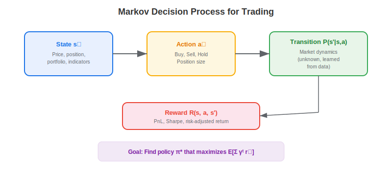
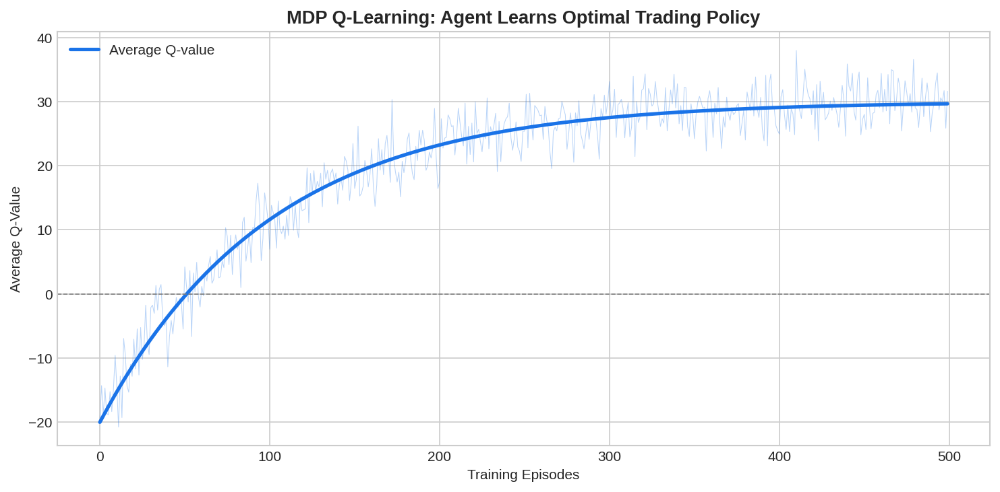

A **Markov Decision Process (MDP)** is the mathematical framework that formalizes sequential decision-making under uncertainty. In trading, an MDP models the problem of choosing actions (buy, sell, hold) based on observable market states to maximize cumulative risk-adjusted returns. MDPs are the theoretical foundation of all reinforcement learning approaches to trading — understanding the MDP formulation is essential for designing effective RL-based [trading strategies](https://paperswithbacktest.com/wiki/systematic-trading-strategies).

## The MDP Formulation for Trading

An MDP is defined by the tuple $(S, A, P, R, \gamma)$:

- **State space** $S$: market observations — prices, returns, indicators, portfolio holdings
- **Action space** $A$: trading decisions — buy, sell, hold, or continuous position sizes
- **Transition function** $P(s' \mid s, a)$: probability of reaching state $s'$ given current state $s$ and action $a$
- **Reward function** $R(s, a, s')$: immediate reward (PnL, risk-adjusted return)
- **Discount factor** $\gamma \in [0, 1]$: how much future rewards are valued vs immediate rewards

The goal is to find the optimal policy $\pi^*$ that maximizes the expected discounted cumulative reward:

$$\pi^* = \arg\max_\pi \mathbb{E}\left[\sum_{t=0}^{T} \gamma^t R(s_t, a_t, s_{t+1}) \mid \pi\right]$$



## Solving the Trading MDP

| Method | Approach | Best For |
|--------|----------|----------|
| Q-Learning | Learn action-value function Q(s,a) | Discrete actions (buy/sell/hold) |
| Deep Q-Network (DQN) | Neural network approximates Q | High-dimensional states |
| Policy Gradient (PPO, A2C) | Directly optimize the policy | Continuous actions (position sizing) |
| Dynamic Programming | Exact solution via Bellman equation | Small state/action spaces |

## Python Implementation: Q-Learning Trading Agent

```python
import numpy as np

class QLearningTrader:
    """Simple Q-learning agent for discrete trading actions."""
    
    def __init__(self, n_states=20, n_actions=3, lr=0.1, gamma=0.95, epsilon=0.1):
        self.Q = np.zeros((n_states, n_actions))  # Q-table
        self.lr = lr
        self.gamma = gamma
        self.epsilon = epsilon
        self.actions = [-1, 0, 1]  # short, flat, long
    
    def discretize_state(self, returns_window):
        """Map continuous returns to discrete state index."""
        mean_ret = np.mean(returns_window)
        vol = np.std(returns_window)
        # Simple discretization: momentum x volatility grid
        mom_bin = min(int((mean_ret + 0.02) / 0.004 * 4), 3)
        vol_bin = min(int(vol / 0.005 * 4), 4)
        return np.clip(mom_bin * 5 + vol_bin, 0, 19)
    
    def choose_action(self, state):
        if np.random.rand() < self.epsilon:
            return np.random.randint(3)
        return np.argmax(self.Q[state])
    
    def update(self, state, action, reward, next_state):
        best_next = np.max(self.Q[next_state])
        td_target = reward + self.gamma * best_next
        self.Q[state, action] += self.lr * (td_target - self.Q[state, action])

# Training
np.random.seed(42)
returns = np.random.normal(0.0003, 0.012, 2000)
agent = QLearningTrader()
window = 20

total_rewards = []
for episode in range(50):
    ep_reward = 0
    for t in range(window, len(returns) - 1):
        state = agent.discretize_state(returns[t-window:t])
        action_idx = agent.choose_action(state)
        action = agent.actions[action_idx]
        reward = action * returns[t+1]
        next_state = agent.discretize_state(returns[t-window+1:t+1])
        agent.update(state, action_idx, reward, next_state)
        ep_reward += reward
    total_rewards.append(ep_reward)

print(f"Episode 1 reward:  {total_rewards[0]:.4f}")
print(f"Episode 50 reward: {total_rewards[-1]:.4f}")
print(f"Improvement: {(total_rewards[-1] - total_rewards[0]):.4f}")
```



## Design Choices for Trading MDPs

**State representation** matters enormously. Include enough information for the Markov property to approximately hold — recent returns, volatility, current position, and portfolio value. **Reward shaping** is critical: use differential Sharpe ratio or log returns with drawdown penalties rather than raw PnL. The **discount factor** $\gamma$ should be close to 1 (0.95-0.999) for trading since future rewards are important.

## Limitations and Risks

Financial markets violate the Markov assumption — future returns depend on information not captured in any finite state representation. The state space is effectively infinite, requiring function approximation that introduces its own errors. The stationarity assumption fails as market dynamics evolve. MDPs with realistic market features are computationally challenging to solve.

## Conclusion

Markov Decision Processes provide the rigorous mathematical foundation for formulating trading as a sequential decision problem. Understanding MDPs — states, actions, transitions, rewards, and policies — is essential for anyone applying [reinforcement learning to portfolio management](https://paperswithbacktest.com/wiki/reinforcement-learning-portfolio-management) or building [model-based trading agents](https://paperswithbacktest.com/wiki/model-based-reinforcement-learning-trading). The MDP framework clarifies the design choices that determine whether an RL strategy succeeds or fails.

---

**Explore further on PapersWithBacktest:**
- Browse [backtested RL strategies](https://paperswithbacktest.com/strategies) with Python code and performance metrics
- Access [clean historical market data](https://paperswithbacktest.com/datasets) for equities, crypto, and futures
- Take the [algo trading course](https://paperswithbacktest.com/course) — 60+ video lessons and notebooks
- Related wiki pages: [Systematic Trading Strategies](https://paperswithbacktest.com/wiki/systematic-trading-strategies) · [Neural Networks in Quantitative Trading](https://paperswithbacktest.com/wiki/how-are-neural-networks-used-in-quantitative-trading) · [Game Theory in Trading](https://paperswithbacktest.com/wiki/game-theory-strategies-decision-making)
