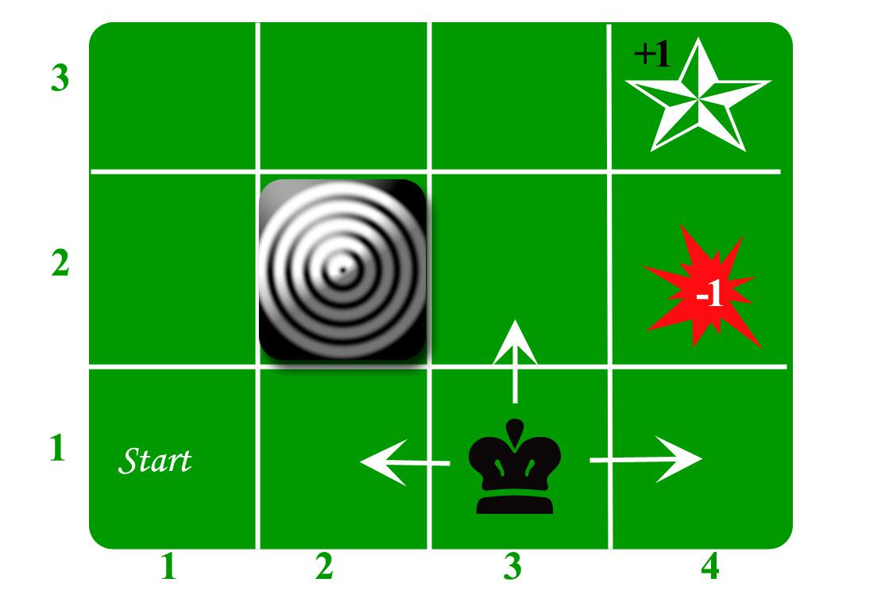

The application of Markov Decision Processes (MDPs) in algorithmic trading has garnered significant attention due to their ability to enhance predictive accuracy and optimize trading strategies. MDPs provide a robust framework for modeling market dynamics by focusing on current states rather than historical sequences, thereby allowing traders to make more informed and timely decisions. The Markov property, a fundamental aspect of MDPs, asserts that the future state of a process depends solely on the present state and not on the sequence of events that preceded it. This property simplifies the modeling process by reducing the complexity inherent in tracking historical data, thus making MDPs particularly suitable for fast-paced trading environments.

The mathematical foundations of MDPs offer a structured approach to decision-making in stochastic environments, wherein outcomes are partly random and partly under the control of the decision-maker. By integrating MDPs into trading algorithms, traders can efficiently handle the probabilistic nature of market behavior and develop strategies that account for uncertainty. The goal is to equip traders and analysts with the necessary insights to leverage MDPs for optimizing decision-making in financial markets.



This article will explore the advantages of employing Markov-based models in trading, including their ability to streamline data requirements and reduce computational complexity. Additionally, it will address the challenges associated with these models, such as assumptions of market stationarity and capturing long-memory processes. The future prospects of MDPs in trading, in light of technological advancements, will also be considered. By the end of this discussion, readers should have a comprehensive understanding of the role MDPs play in enhancing algorithmic trading strategies.

## Table of Contents

## Understanding Markov Decision Processes

Markov Decision Processes (MDPs) offer a systematic approach to model decision-making situations where outcomes arise from both randomness and the decisions made by an agent. A critical aspect of MDPs is the Markov property, which asserts that the system's future state depends solely on the current state and the action taken, without regard to the sequence of past states. This property significantly simplifies the modeling of decision processes by focusing only on the present state to predict future states, eliminating the necessity to track historical states.

Mathematically, an MDP is described by a tuple $(S, A, P, R, \gamma)$, where:
- $S$ represents the set of all possible states.
- $A$ denotes the set of actions available to the decision-maker.
- $P(s'|s, a)$ is the state transition probability, describing the probability of moving to state $s'$ from state $s$ after action $a$ is taken.
- $R(s, a)$ is the reward function, which provides the expected reward received after taking action $a$ in state $s$.
- $\gamma$ is the discount factor, a value between 0 and 1, representing the present value of future rewards.

MDPs are often solved by determining a policy $\pi(s)$ that specifies the best action to take in each state, aiming to maximize the expected sum of discounted future rewards. The value function $V(s)$ represents the expected return starting from state $s$ and following policy $\pi$. In contrast, the action-value function $Q(s, a)$ represents the expected return of taking action $a$ in state $s$ and thereafter following policy $\pi$.

The Bellman equation provides the backbone for solving MDPs by establishing a recursive relationship for the value function:
$$
V(s) = \max_{a} \left[ R(s, a) + \gamma \sum_{s'} P(s'|s, a)V(s') \right]
$$

In the context of [algorithmic trading](/wiki/algorithmic-trading), MDPs simplify complex financial systems by reducing the dependency on extensive historical data, focusing instead on current market states and obtainable actions. This characteristic makes MDPs particularly advantageous because it aligns with the dynamic and often volatile nature of financial markets, where current conditions provide the most salient indicators for future trends.

Implementing MDPs effectively in trading algorithms involves understanding their theoretical underpinnings and the environment-specific adjustments that may need to be made, such as calibrating the transition probabilities or reward functions to accurately capture market dynamics. This foundation allows traders to develop robust strategies that can efficiently navigate the stochastic elements inherent in financial markets.

## Application of MDPs in Algorithmic Trading

Algorithmic trading capitalizes on Markov Decision Processes (MDPs) to enhance the prediction of future price movements by evaluating the present market conditions. MDPs serve as a robust method for modeling the inherently probabilistic nature of trading environments, incorporating randomness in market behaviors and decisions controlled by traders.

Within trading algorithms, MDPs are implemented through several strategies, notably Markov chains and Hidden Markov Models (HMMs). Markov Chains provide a simplified perspective by representing sequences of state transitions with defined probabilities. This approach is efficient in capturing the essence of market movements without necessitating cumbersome historical data. Hidden Markov Models extend this concept by accommodating latent (unobserved) states, making them suitable for identifying market trends and regime changes that are not directly observable.

An MDP is typically characterized by a tuple $(S, A, P, R, \gamma)$ where:
- $S$ is the set of states representing different market conditions,
- $A$ is the set of actions available to the trader,
- $P$ denotes the state transition probabilities $P(s', r | s, a)$ which define the likelihood of moving to state $s'$ with reward $r$ after taking action $a$ in state $s$,
- $R$ represents the reward function,
- $\gamma$ is the discount factor for future rewards.

MDP-based models operate under specific assumptions, such as memorylessness—often referred to as the Markov property—which posits that future states depend solely on the present state, not on the path taken to reach it. Another critical assumption is that of stationarity, which assumes that the probabilistic rules governing state transitions remain constant over time. These assumptions influence trading performance by streamlining modeling processes and providing clearer insights into real-time market dynamics.

Real-world applications of MDPs in trading include designing algorithms that adaptively manage portfolio risks by rebalancing asset allocations based on the Markov process's current state assessment. For instance, employing HMMs to detect shifts in market regimes allows traders to anticipate and react to significant market trends, such as bull or bear markets. Python libraries like `hmmlearn` can be utilized to implement HMMs in a trading context, facilitating the construction and calibration of models with historical market data.

The following Python snippet demonstrates a basic setup using `hmmlearn` to fit an HMM to market data:

```python
from hmmlearn import hmm
import numpy as np

# Simulated market data where we assume each observation is in one of the hidden states
data = np.column_stack([np.random.choice([0, 1], size=(100,)),
                        np.random.randn(100)])

# Create and fit the model
model = hmm.GaussianHMM(n_components=2, covariance_type="full")
model.fit(data)

# Predict the hidden states corresponding to the observations
hidden_states = model.predict(data)
```

Such implementations of MDPs showcase their power in enhancing the responsiveness and accuracy of algorithmic trading systems, thereby optimizing decision-making processes while managing the complexity and uncertainty inherent in financial markets.

## Benefits of MDPs in Trading Models

Markov Decision Processes (MDPs) significantly enhance the efficiency and effectiveness of trading models by simplifying data requirements and minimizing computational complexity. At the heart of this simplification is the Markov property, which asserts that future states depend solely on the present state, making it a crucial tool in high-frequency trading environments where decisions need to be made swiftly and accurately. By narrowing the focus to the current market state, MDPs facilitate faster decision-making processes crucial for seizing fleeting market opportunities.

MDPs achieve efficiency gains by reducing the need to account for extensive historical data. Traditional models often require tracking a multitude of past states to predict future market behaviors, a process that can be both time-consuming and computationally demanding. In contrast, MDPs streamline the modeling process by concentrating on the present, thereby decreasing data storage and processing requirements. This simplification reduces the likelihood of overfitting, a common issue where models become excessively complex and fail to perform well on new data sets. Instead, MDPs hone predictive accuracy through a balance of model simplicity and robustness.

The application of MDPs in trading models enables capturing essential market dynamics without the exhaustive need for historical analysis. For instance, by modeling market conditions as state transitions, MDPs can adeptly adapt to new data inputs and market fluctuations. In practice, this adaptability allows traders to react promptly to real-time market changes, improving the overall outcome of trading strategies.

Moreover, as traders seek to optimize their strategies in a fast-paced environment, the reduced complexity associated with MDPs translates to less intensive computational demands. This not only facilitates quicker execution of trading algorithms but also allows for the allocation of computational resources to other critical areas, such as risk management and regulatory compliance.

In conclusion, the integration of MDPs into trading models provides a means to encapsulate market dynamics efficiently, enhance predictive accuracy, and reduce the risk of overfitting, all while requiring fewer data inputs. By utilizing the Markov property to focus on the present market state, MDPs streamline decision-making processes that are vital for success in high-frequency trading scenarios.

## Limitations and Challenges of MDPs

Markov Decision Processes (MDPs) present a structured framework for modeling decision-making in stochastic environments, such as financial markets. Despite their robustness and efficacy, MDPs come with inherent limitations that must be considered when used in trading models.

### Assumptions and Limitations

One key limitation of MDPs is the assumption of market stationarity—a condition where statistical properties like mean and variance remain constant over time. Financial markets, however, are often subject to fluctuations driven by economic cycles, policy changes, and unforeseen events, which violate stationarity. This presents a challenge for MDPs as they may not accurately capture the dynamics of non-stationary environments, potentially leading to suboptimal decision-making.

Another constraint is their inability to capture long-memory processes. MDPs are built on the Markov property, where the current state encapsulates all necessary information, making historical data irrelevant for future predictions. However, financial markets may exhibit long-memory behaviors, where historical data significantly influences future market dynamics. Ignoring such dependencies can reduce the effectiveness of MDPs in predicting market movements.

### Non-Markovian Behaviors

The presence of non-Markovian behaviors further complicates MDP application in trading. Market anomalies—deviations from expected market behavior—and external economic impacts can disrupt the assumed simplicity of MDPs. These factors introduce additional variables that are not accounted for in a straightforward Markovian framework, thus affecting the reliability of the models in capturing comprehensive market dynamics.

### Strategic Enhancements

To address these limitations, integrating MDPs with other modeling techniques can enhance their robustness. Machine learning, for example, offers tools to identify patterns within complex datasets, potentially compensating for the lack of long-memory considerations inherent in standard MDPs. By incorporating [machine learning](/wiki/machine-learning), models can adaptively learn from a broader set of data, improving the predictive accuracy of trading algorithms.

### Regular Evaluation

Regular evaluation and reassessment of model assumptions are vital for maintaining model performance in volatile markets. Traders and analysts should consistently validate the assumptions of stationarity and non-Markovian behavior to update the models accordingly. This practice ensures that MDPs remain aligned with current market conditions, allowing for timely adjustments and the deployment of complementary strategies when necessary.

In conclusion, while MDPs offer valuable frameworks for trading algorithms, acknowledging and addressing their limitations through strategic augmentation and regular model evaluation is crucial for their effective application in financial markets.

## Case Studies and Examples

Various case studies underscore the efficacy of Markov Decision Processes (MDPs) and their applications, such as Hidden Markov Models (HMMs), in algorithmic trading, showcasing their potential to enhance market predictions. 

One notable example involves the use of HMMs to detect market trends and regime shifts. HMMs have been employed due to their ability to handle time series data where the underlying states are hidden, yet observations are visible. By modeling market prices as a sequence of observations, HMMs can infer the underlying market states—such as bull or bear markets—which are crucial for framing trading strategies.

Consider a trading scenario where the price movements can be categorized into three hidden states: upward trend, downward trend, and sideways movement. The HMM is defined by the tuple $(S, \pi, A, B)$, where:
- $S$ denotes the set of hidden states.
- $\pi$ represents the initial state probability distribution.
- $A$ is the state transition probability matrix.
- $B$ is the observation probability matrix.

The primary task involves estimating the most probable sequence of hidden states $\mathbf{Q}$ given the observation sequence $\mathbf{O}$. The Viterbi algorithm is utilized for this inference, providing traders with an optimized prediction model based on the current market conditions.

```python
import numpy as np

def viterbi(observation_sequences, states, start_prob, trans_prob, emit_prob):
    n_observations = len(observation_sequences)
    n_states = len(states)

    V = np.zeros((n_states, n_observations))
    path = np.zeros((n_states, n_observations), dtype=int)

    V[:, 0] = start_prob * emit_prob[:, observation_sequences[0]]

    for t in range(1, n_observations):
        for s in range(n_states):
            prob = V[:, t-1] * trans_prob[:, s] * emit_prob[s, observation_sequences[t]]
            V[s, t] = np.max(prob)
            path[s, t] = np.argmax(prob)

    best_path_prob = np.max(V[:, n_observations - 1])
    best_path_pointer = np.argmax(V[:, n_observations - 1])
    best_path = np.zeros(n_observations, dtype=int)

    for t in reversed(range(n_observations)):
        best_path[t] = best_path_pointer
        best_path_pointer = path[best_path_pointer, t]

    return best_path, best_path_prob

# Example parameters for a simple HMM
states = [0, 1, 2]  # Representing upward, downward, sideways trends
start_prob = np.array([0.3, 0.4, 0.3])
trans_prob = np.array([[0.7, 0.2, 0.1],
                       [0.2, 0.6, 0.2],
                       [0.1, 0.3, 0.6]])
emit_prob = np.array([[0.5, 0.4, 0.1],
                      [0.1, 0.3, 0.6],
                      [0.3, 0.3, 0.4]])

observations = [0, 1, 2, 0, 2, 1, 0]  # Hypothetical observation sequence
best_path, best_path_prob = viterbi(observations, states, start_prob, trans_prob, emit_prob)
```

These examples demonstrate the power of HMMS in inferring market regimes. However, challenges exist, such as the assumption of stationarity and difficulties in capturing long-memory processes, which may affect prediction accuracy.

Instances where MDPs failed typically involve assumptions of fixed transition probabilities that do not adapt to rapid market changes. Addressing these challenges involves dynamically updating model parameters or integrating machine learning techniques to enhance model adaptability and accuracy.

Lessons from these studies underscore the value of continuously evaluating model assumptions and integrating complementary approaches, thereby guiding future implementations of MDPs for more robust algorithmic trading strategies.

## Future Trends and Developments

The application of Markov Decision Processes (MDPs) in algorithmic trading is expected to undergo significant transformation due to advances in big data and computational resources. High-performance computing combined with machine learning techniques paves the way for more sophisticated MDP models that can operate effectively in real-time trading environments. The capability of these models to process large volumes of data swiftly enhances their predictive accuracy and decision-making efficiency.

The integration of [artificial intelligence](/wiki/ai-artificial-intelligence) with MDPs represents a promising development. AI allows MDP models to adaptively learn and recognize complex market patterns, thus improving their ability to make informed trading decisions. Machine learning algorithms, specifically [reinforcement learning](/wiki/reinforcement-learning), can be employed to fine-tune MDP parameters continuously, allowing models to adjust to market changes dynamically.

Emerging technologies such as quantum computing and blockchain are poised to further revolutionize the computational and data handling aspects of MDP-based models. Quantum computing offers new possibilities for processing complex mathematical computations at unprecedented speeds, which could significantly enhance the execution of MDPs in trading scenarios. Blockchain, with its decentralized and secure nature, can provide reliable data feeds essential for real-time market analysis, thereby ensuring the integrity and accuracy of the information used by MDP algorithms.

For traders and analysts, staying informed about these technological advancements is crucial. Engaging with cutting-edge developments allows them to harness the full potential of MDPs in their trading strategies. By understanding and leveraging these innovations, financial professionals can maintain a competitive edge, utilizing enhanced MDP models to navigate the complexities of modern financial markets effectively.

## Conclusion

Markov Decision Processes (MDPs) provide an innovative framework for refining algorithmic trading models, primarily through the use of efficient state-based analysis. By focusing on the present state, MDPs streamline predictive modeling, which allows traders to make informed decisions rapidly in fast-paced trading environments. The Markov property, which ensures that the next state depends solely on the current state, simplifies the complexity of market predictions by negating the necessity of extensive historical data. This approach enhances computational efficiency, which is crucial for high-frequency trading where speed is paramount.

Nonetheless, realizing the full potential of MDPs requires a comprehensive understanding of both their advantages and limitations. MDPs offer significant benefits, such as reduced computational complexity and the ability to focus on pertinent market dynamics. However, challenges like assumptions of stationarity and difficulty in capturing non-Markovian behavior, such as market anomalies, must be acknowledged. These limitations can be mitigated by integrating MDPs with other modeling techniques, such as machine learning algorithms, which can address these deficiencies and enhance the robustness of trading strategies.

The future of MDPs in trading is promising, supported by ongoing technological developments. Advancements in big data analytics, high-performance computing, and artificial intelligence present new opportunities for enhancing MDP frameworks. In particular, the integration of machine learning can enable MDPs to adaptively learn and predict market patterns, thereby improving trading outcomes. Moreover, emerging technologies like quantum computing could potentially transform the data processing capabilities of MDP models, offering unprecedented computational speed and efficiency.

In conclusion, MDPs will continue to play a significant role in algorithmic trading, driven by technological advancements and innovative applications. Traders and analysts who effectively harness these methods will likely achieve a competitive edge in the financial markets. A balanced approach, combining MDPs with other complementary techniques, is recommended to develop robust and adaptive trading strategies that can thrive in the dynamic landscape of modern finance.

## References & Further Reading

[1]: Puterman, M. L. (1994). ["Markov Decision Processes: Discrete Stochastic Dynamic Programming."](https://onlinelibrary.wiley.com/doi/book/10.1002/9780470316887) John Wiley & Sons.

[2]: Tsay, R. S. (2010). ["Analysis of Financial Time Series"](https://onlinelibrary.wiley.com/doi/book/10.1002/9780470644560) (3rd ed.). John Wiley & Sons.

[3]: Sutton, R. S., & Barto, A. G. (2018). ["Reinforcement Learning: An Introduction"](https://web.stanford.edu/class/psych209/Readings/SuttonBartoIPRLBook2ndEd.pdf) (2nd ed.). MIT Press.

[4]: Elliott, R. J., Aggoun, L., & Moore, J. B. (1995). ["Hidden Markov Models: Estimation and Control."](https://link.springer.com/book/10.1007/978-0-387-84854-9) Springer.

[5]: Lopez de Prado, M. (2018). ["Advances in Financial Machine Learning"](https://www.amazon.com/Advances-Financial-Machine-Learning-Marcos/dp/1119482089). Wiley.

[6]: Chan, E. P. (2009). ["Quantitative Trading: How to Build Your Own Algorithmic Trading Business"](https://github.com/egorpe/EPChan-QuantitativeTrading/blob/master/example7_6.m) Wiley.

[7]: Murphy, K. P. (2012). ["Machine Learning: A Probabilistic Perspective"](https://www.cs.ubc.ca/~murphyk/MLbook/pml-toc-1may12.pdf) MIT Press.

[8]: ["Reinforcement Learning in Trading"](https://medium.com/funny-ai-quant/deep-reinforcement-learning-in-algorithmic-trading-a-step-by-step-guide-197f39a8be9a) - A survey paper on the applications of reinforcement learning techniques to financial trading.