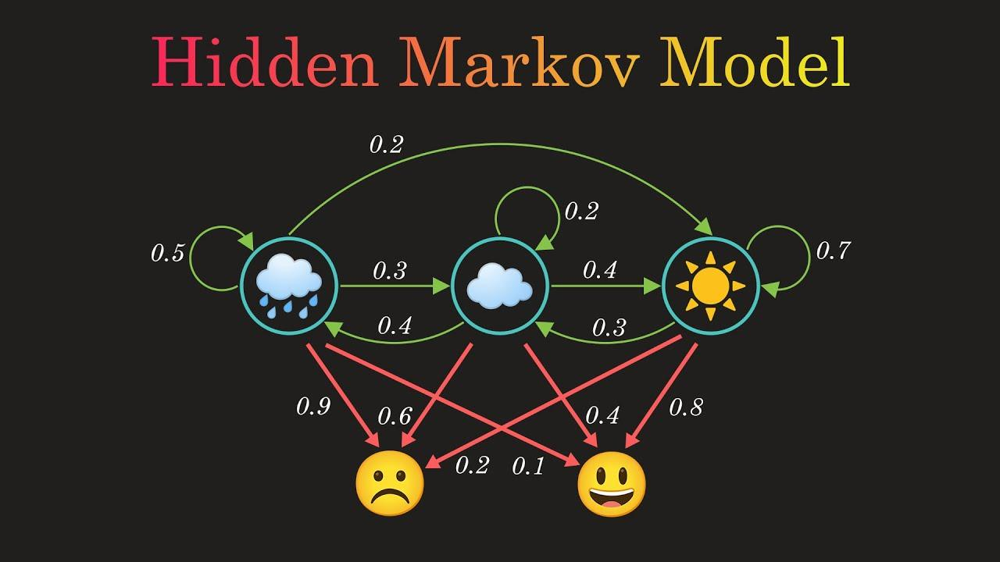

## Table of Contents

## What is a Markov model?

A Markov model is a type of math tool that helps predict what might happen next based on what's happening now. It's like guessing the next word in a sentence by looking at the word before it. The key idea is that the future depends only on the present, not on the past. This makes things simpler because we don't need to remember everything that happened before.

These models are used in many areas, like weather forecasting, where we predict tomorrow's weather based on today's. They're also used in speech recognition, where the computer guesses the next sound based on the current sound. Markov models are handy because they make complex predictions easier by focusing on the present moment.

## What is a Hidden Markov Model (HMM)?

A Hidden Markov Model, or HMM, is a special type of Markov model where we can't see the states directly. Imagine you're trying to guess what the weather is like outside, but you're only allowed to look at the clothes people are wearing. You can't see the actual weather, but you can make educated guesses based on what you observe. In an HMM, the actual states (like sunny or rainy) are hidden, and we only get to see the results or outputs (like umbrellas or sunglasses).

HMMs are really useful in situations where we have to deal with incomplete information. For example, they're used a lot in speech recognition. When you speak, the actual words you're saying are the hidden states, and the sounds that come out are what we observe. By using an HMM, a computer can guess what words you're saying by analyzing the sounds it hears. This makes HMMs powerful tools for understanding and predicting things in the real world, even when we can't see everything clearly.

## What are the main components of a Hidden Markov Model?

A Hidden Markov Model has three main parts: states, observations, and transition probabilities. The states are like secret steps in a process that we can't see directly. For example, in weather forecasting, the states could be "sunny," "rainy," or "cloudy." The observations are what we can see or measure, like the clothes people wear or the amount of rainfall. These observations give us clues about the hidden states. The transition probabilities tell us how likely it is to move from one state to another. For instance, if it's sunny today, there's a certain chance it might be sunny again tomorrow or switch to rainy.

The other important part of an HMM is the emission probabilities. These tell us how likely it is to see a particular observation given a specific state. For example, if it's raining, there's a high chance you'll see people with umbrellas. By combining the transition and emission probabilities, an HMM can predict future states and observations. This makes HMMs useful for things like speech recognition, where the hidden states are the words you're saying, and the observations are the sounds you make. By understanding these components, we can use HMMs to make sense of complex, hidden processes in the world around us.

## How does the Markov property apply to Hidden Markov Models?

The Markov property is a simple rule that says the future only depends on the present, not on the past. In a Hidden Markov Model, this means that the next hidden state only depends on the current hidden state, not on any states before that. Imagine you're trying to guess tomorrow's weather. If you know it's sunny today, the Markov property says you only need to think about today's weather to predict tomorrow's, not the weather from last week or last month.

In an HMM, even though we can't see the hidden states directly, the Markov property still applies. We use the current hidden state to predict what the next hidden state might be. The observations we see, like umbrellas or sunglasses, give us clues about these hidden states. But when we're trying to guess what will happen next, we focus on the current hidden state and ignore everything that came before it. This makes predicting the future simpler, even when we're dealing with hidden information.

## What are some common applications of Hidden Markov Models?

Hidden Markov Models are used a lot in speech recognition. When you talk to your phone or a smart speaker, it uses an HMM to figure out what you're saying. The words you want to say are the hidden states, and the sounds you make are the observations. The model guesses the words by looking at the sounds and using the rules of how words usually follow each other. This helps the device understand you better, even if you have an accent or if there's background noise.

HMMs are also important in bioinformatics, especially for figuring out the structure of genes in DNA. The actual genes are hidden, but we can see the sequence of DNA bases. An HMM can help predict where the genes start and stop by looking at these sequences. This is useful for understanding how genes work and how they might be related to diseases. By using HMMs, scientists can make better guesses about the hidden parts of DNA.

Another common use of HMMs is in finance, for predicting stock prices or market trends. The hidden states could be different market conditions, like a bull market or a bear market. The observations might be the daily stock prices or trading volumes. By using an HMM, analysts can try to predict future market conditions based on what they see happening now. This helps them make smarter investment decisions.

## How do you train a Hidden Markov Model?

Training a Hidden Markov Model means teaching it to understand the hidden states and observations. You do this by showing the model a lot of examples. For instance, if you're using an HMM for speech recognition, you'd give it many recordings of people speaking and tell it what words they said. The model looks at these examples to figure out how likely it is to move from one hidden state to another (transition probabilities) and how likely it is to see a certain observation from a specific state (emission probabilities). This is called the learning phase, where the model adjusts its guesses to match the examples as closely as possible.

There are different ways to train an HMM, but one common method is called the Baum-Welch algorithm. This is a type of [machine learning](/wiki/machine-learning) that helps the model improve its guesses over time. It's like a game where the model keeps trying to get better at predicting the hidden states and observations. The Baum-Welch algorithm uses the examples you give it to tweak the transition and emission probabilities until they fit the data well. Once the model is trained, it can be used to predict future observations or hidden states based on what it learned.

## What is the difference between a Markov chain and a Hidden Markov Model?

A Markov chain is like a simple game where you move from one place to another based on certain rules. Each place you can be in is called a state, and the rules tell you how likely it is to go from one state to another. The key idea is that where you go next only depends on where you are now, not on where you've been before. This makes Markov chains useful for predicting things like the weather, where knowing today's weather helps you guess tomorrow's.

A Hidden Markov Model, or HMM, is a bit more complicated. It's like a Markov chain, but you can't see the states directly. Instead, you only see clues or observations that give you hints about the hidden states. For example, if you're trying to guess the weather, you might only see what people are wearing, not the actual weather itself. HMMs are useful when you have to deal with incomplete information, like in speech recognition, where the words you're saying are hidden, and the sounds you make are what you can observe.

## What algorithms are used for inference in Hidden Markov Models?

There are a few main algorithms used for figuring things out in Hidden Markov Models, or HMMs. One popular one is the Forward-Backward algorithm. It's like looking at a puzzle from both the beginning and the end to understand the whole picture. This algorithm helps you guess what the hidden states might be by looking at the observations you can see. It does this by moving forward through the observations and then backward, adjusting its guesses to make them as accurate as possible.

Another important algorithm is the Viterbi algorithm. This one is all about finding the best path through the hidden states. Imagine you're trying to find the quickest way to walk through a maze. The Viterbi algorithm helps you find the most likely sequence of hidden states that led to the observations you saw. It's really useful when you need to make a clear prediction about what happened in the past based on what you can observe now.

Lastly, there's the Baum-Welch algorithm, which is used for training HMMs. It's like teaching the model to get better at guessing the hidden states and observations. The Baum-Welch algorithm looks at a lot of examples and adjusts the model's rules to make its predictions more accurate. This helps the HMM learn from the data and improve over time, making it a powerful tool for understanding complex, hidden processes.

## How do you evaluate the performance of a Hidden Markov Model?

To evaluate how well a Hidden Markov Model is doing, you can use something called the log-likelihood score. This score tells you how well the model matches the data you give it. Imagine you're trying to guess the weather based on what people are wearing. If your guesses match the actual weather a lot, your log-likelihood score will be high, meaning your model is doing a good job. If your guesses are often wrong, the score will be low, showing that your model needs to improve. You can calculate this score by running your observations through the model and seeing how likely it thinks those observations are.

Another way to check the performance of an HMM is by using cross-validation. This means you split your data into different parts and use some parts to train the model and other parts to test it. It's like practicing with some questions and then taking a test with different questions to see how well you learned. If the model does well on the test data, it's a good sign that it's learned the hidden states and observations well. By trying different ways of splitting the data and seeing how the model performs each time, you can get a good idea of how reliable your HMM is.

## What are the limitations of Hidden Markov Models?

Hidden Markov Models have some limitations that you should know about. One big problem is that they assume the future only depends on the present, not on the past. This is called the Markov property. But in real life, the past can sometimes affect the future in ways that an HMM can't capture. For example, if you're trying to predict the weather, knowing it rained for the past three days might be important, but an HMM only looks at today's weather to guess tomorrow's. This can make the model less accurate if the past really matters.

Another limitation is that HMMs assume the hidden states and observations follow certain rules, like being in one state at a time. But sometimes, things in the real world are more complicated. For instance, in speech recognition, a person might start saying one word and then change their mind halfway through. An HMM might have trouble figuring out what's happening because it expects clear, separate states. Also, training an HMM needs a lot of data, and if you don't have enough examples, the model might not learn well. This can make it hard to use HMMs in situations where data is limited.

## How can Hidden Markov Models be extended or combined with other models?

Hidden Markov Models can be made better by combining them with other types of models. One way to do this is by using them with neural networks. Neural networks are good at finding patterns in data, and when you combine them with an HMM, you get a model that can handle more complicated situations. For example, in speech recognition, a [neural network](/wiki/neural-network) can help the HMM understand different accents or background noise better. This makes the model more accurate and useful in the real world.

Another way to extend HMMs is by using them in a bigger model called a Dynamic Bayesian Network. This type of model can handle situations where things change over time in more complex ways. For instance, if you're trying to predict the stock market, a Dynamic Bayesian Network can consider more factors than just the current market condition. By adding more layers and connections, these models can capture how different parts of a system affect each other over time, making them more powerful than a simple HMM.

## What are some advanced techniques for optimizing Hidden Markov Models?

One way to make Hidden Markov Models better is by using something called parameter tying. This means you group similar states together and make them share the same rules. Imagine you're trying to guess the weather, and you know that sunny days and clear days are pretty similar. By tying these states together, you can make your model simpler and more accurate. This helps when you don't have a lot of data because it makes the model learn faster and work better with less information.

Another advanced technique is using smoothing methods. These help the model deal with situations where it hasn't seen a certain combination of states and observations before. For example, if you're using an HMM for speech recognition and someone says a rare word, the model might not know what to do. Smoothing methods, like adding a tiny bit of probability to every possible state and observation, make sure the model can still make a good guess. This makes the model more flexible and able to handle new or unusual situations.

## References & Further Reading

[1]: Rabiner, L. R. (1989). ["A Tutorial on Hidden Markov Models and Selected Applications in Speech Recognition."](https://ieeexplore.ieee.org/document/18626/?arnumber=18626) Proceedings of the IEEE.

[2]: Hamilton, J. D. (1994). ["Time Series Analysis."](https://press.princeton.edu/books/hardcover/9780691042893/time-series-analysis) Princeton University Press.

[3]: Lopez de Prado, M. (2018). ["Advances in Financial Machine Learning."](https://www.amazon.com/Advances-Financial-Machine-Learning-Marcos/dp/1119482089) Wiley.

[4]: Stefan, J. (2020). ["Machine Learning for Algorithmic Trading."](https://github.com/stefan-jansen/machine-learning-for-trading) Packt Publishing.

[5]: Chan, E. P. (2009). ["Quantitative Trading: How to Build Your Own Algorithmic Trading Business."](https://github.com/ftvision/quant_trading_echan_book) Wiley Trading.

[6]: Bengio, Y., Frasconi, P., & Simard, P. Y. (1993). ["The Problem of Learning Long-Term Dependencies in Recurrent Networks."](https://www.semanticscholar.org/paper/The-problem-of-learning-long-term-dependencies-in-Bengio-Frasconi/3f1d04f57e420f0f1b2cd059deab309bc7073ca1) IEEE International Conference on Neural Networks.

[7]: Murphy, K. P. (2002). ["Dynamic Bayesian Networks: Representation, Inference and Learning."](https://www.semanticscholar.org/paper/Dynamic-bayesian-networks%3A-representation%2C-and-Murphy-Russell/5e86e17d83c97dafa3413d1d0dae219bd527ed61) PhD Thesis, University of California, Berkeley.