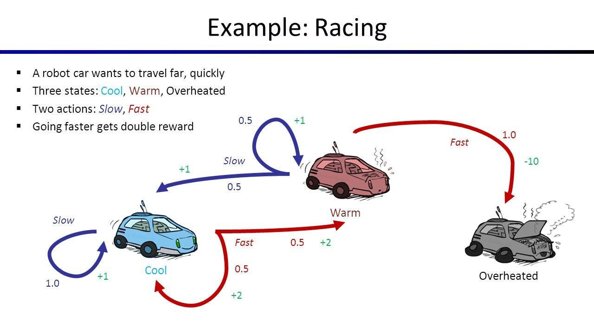

## Table of Contents

## What is a Markov Process?

A Markov Process is a type of mathematical model used to predict the future based on the current state. It's named after a Russian mathematician named Andrey Markov. The key idea is that the future state depends only on the present state and not on how we got there. Imagine you're playing a board game and you're on a certain square. Where you go next depends only on where you are now, not on all the moves you made before.

In simpler terms, think of a Markov Process like the weather. If it's raining today, the chance it will rain tomorrow depends on today's weather, not on what happened last week. This makes Markov Processes useful in many fields, like finance for predicting stock prices, or in technology for things like speech recognition. They help us make predictions by focusing on what's happening right now.

## What are the key components of a Markov Process?

A Markov Process has a few main parts that make it work. First, there are states. These are like different situations or places you can be in. For example, in a weather model, states could be "sunny," "rainy," or "cloudy." The important thing is that at any moment, you're in one of these states. Next, there are transitions. These are the rules that say how you move from one state to another. Each transition has a probability, which is a number that tells you how likely it is to move from one state to another. So, if it's sunny today, there might be a 30% chance it will be rainy tomorrow.

Another key part is the initial state. This is where you start. In our weather example, you might start on a sunny day. From there, the process uses the transition probabilities to move from state to state over time. The last important piece is the memoryless property. This means that to predict the future, you only need to know the current state. You don't need to remember all the past states. This makes Markov Processes simpler and easier to work with because they focus on the present to predict what comes next.

## How does the Markov Property work?

The Markov Property is a simple but powerful idea. It says that what happens next depends only on where you are right now, not on how you got there. Imagine you're playing a board game. If you're on square 5, the next move you make depends only on being on square 5, not on all the moves you made before. This is what the Markov Property is about - the future depends only on the present state.

In real life, this can be seen in things like weather forecasts. If it's raining today, the chance it will rain tomorrow depends on today's weather, not on what the weather was like last week. This makes predicting the future easier because you don't need to keep track of everything that happened before. You just focus on now to guess what's coming next.

## What is the difference between a discrete-time and continuous-time Markov Process?

A discrete-time Markov Process is like taking steps on a staircase. You move from one state to another at specific times, like every day or every hour. Imagine checking the weather every morning. If it's sunny today, you look at the chances it will be sunny, rainy, or cloudy tomorrow. You only move to a new state at these set times, and nothing happens in between. This makes it easier to predict what will happen next because you know exactly when to look at the probabilities.

On the other hand, a continuous-time Markov Process is more like walking up a ramp. You can move from one state to another at any time, not just at set intervals. Think of a light bulb that can burn out at any moment. If it's working now, it might stop working at any time, not just at specific times like every hour. This makes it trickier to predict because you have to consider that something could happen at any moment. But it's useful for things like modeling how long something might last or how often something might happen.

## Can you explain the concept of state transitions in Markov Processes?

State transitions in Markov Processes are like moving from one place to another. Imagine you're in a board game and you're on a certain square. The rules of the game tell you how likely it is to move to another square from where you are now. These rules are called transition probabilities. If you're on a sunny square, there might be a 70% chance you'll stay sunny, a 20% chance you'll move to a cloudy square, and a 10% chance you'll go to a rainy square. These chances are what help you figure out where you might end up next.

The key thing about state transitions is that they depend only on where you are right now. It doesn't matter how you got to the sunny square; what matters is that you're there. So, if you're on the sunny square, you use the same set of probabilities to figure out your next move, no matter what happened before. This makes predicting the future simpler because you only need to focus on the current state to know what might happen next.

## What is a Markov Chain and how does it relate to Markov Processes?

A Markov Chain is a special type of Markov Process. It's a way to predict what will happen next based on where you are right now. Imagine you're playing a board game and you're on a certain square. A Markov Chain tells you the chances of moving to different squares from where you are. These chances are called transition probabilities. For example, if you're on a sunny square, there might be a 70% chance you'll stay sunny, a 20% chance you'll move to a cloudy square, and a 10% chance you'll go to a rainy square. The important thing is that these chances depend only on where you are now, not on how you got there.

Markov Chains are a bit simpler than general Markov Processes because they only look at what happens at specific times, like every day or every hour. This is called a discrete-time Markov Process. In our board game, you move to a new square at set times, and nothing happens in between. General Markov Processes, on the other hand, can also look at what happens at any time, not just at set times. This is called a continuous-time Markov Process. So, Markov Chains are a type of Markov Process that focus on discrete times, making them easier to understand and use for things like weather forecasts or predicting stock prices.

## How are transition probabilities calculated in a Markov Process?

Transition probabilities in a Markov Process are the chances of moving from one state to another. Imagine you're on a sunny day and want to know the chance it will rain tomorrow. You look at past data or observations to see how often it rained after a sunny day. If it rained 20 out of 100 times after a sunny day, the transition probability from sunny to rainy would be 20%. These probabilities are often shown in a table or a diagram called a transition matrix, which lists all the possible moves and their chances.

Calculating these probabilities can be done in different ways depending on what you're trying to predict. Sometimes, you might use historical data to count how often certain transitions happen. Other times, you might use math formulas to estimate these probabilities based on what you know about the system. The key is that these probabilities should add up to 100% for each state, because you have to move somewhere next. This makes sure that the model can always tell you where you might go next based on where you are now.

## What are absorbing states and how do they affect a Markov Process?

Absorbing states are special states in a Markov Process where once you get there, you can't leave. Imagine playing a board game where one square is a "win" square. If you land on it, the game ends and you can't move anymore. That's an absorbing state. In real life, an example might be retirement in a job model. Once you retire, you don't go back to working.

These states change how a Markov Process works because they create an end point. Once you reach an absorbing state, the process stops, and you stay there forever. This means that over time, more and more of the system will end up in these absorbing states. For example, in a model of a game where the goal is to reach the "win" square, everyone will eventually win and stop playing. This makes absorbing states important for understanding what will happen in the long run in a Markov Process.

## How can Markov Processes be used to model real-world systems?

Markov Processes are super useful for understanding how things change over time in the real world. Imagine you want to predict the weather. You can use a Markov Process to look at today's weather and guess what it might be like tomorrow. Each day is a state, like sunny, cloudy, or rainy, and you use past data to figure out the chances of moving from one state to another. This helps weather forecasters make better predictions by focusing on what's happening right now, not on all the weather changes from last month.

Another cool use is in finance, where Markov Processes help predict stock prices. If you know a stock's price today, you can use a Markov Process to guess where it might go next. It's like playing a game where each move depends on where you are now, not on all the moves you made before. This makes it easier to make decisions about buying or selling stocks because you're only looking at the current price to predict the future. So, whether it's for weather, finance, or even figuring out how long a machine might last before it breaks, Markov Processes help us make sense of the world by focusing on what's happening right now.

## What are some common applications of Markov Processes in different fields?

Markov Processes are used in many different areas because they help predict what will happen next based on what's happening right now. In finance, they're used to guess where stock prices might go. Imagine you're looking at a stock's price today. A Markov Process helps you figure out the chances of it going up, staying the same, or going down tomorrow. This makes it easier for people to decide when to buy or sell stocks because they only need to look at today's price to make a guess about the future. It's like playing a game where each move depends on where you are now, not on all the moves you made before.

Another common use is in weather forecasting. If it's sunny today, a Markov Process can help predict if it will be sunny, cloudy, or rainy tomorrow. Weather forecasters look at past data to figure out how often the weather changes from one state to another. This helps them make better guesses about what the weather will be like in the future by focusing on what's happening right now, not on all the weather changes from last month. So, whether it's for predicting stock prices or guessing the weather, Markov Processes make it easier to understand and predict what might happen next by keeping things simple and focusing on the present.

## How do you solve a Markov Process to find steady-state probabilities?

To find steady-state probabilities in a Markov Process, you need to figure out what happens after a long time. Imagine you're playing a board game where you keep moving from square to square. Over many moves, you'll start to see a pattern where you spend a certain amount of time on each square. These patterns are the steady-state probabilities. To find them, you set up equations based on the transition probabilities, which are the chances of moving from one square to another. You then solve these equations to find out how much time, in the long run, you'll spend on each square.

Solving these equations can be a bit tricky, but the basic idea is to make sure that the total time spent on all squares adds up to 100%. This means that if you keep playing the game forever, you'll eventually spend a certain percentage of your time on each square. For example, if you have three squares, and you find that you spend 50% of your time on the first square, 30% on the second, and 20% on the third, those are your steady-state probabilities. These numbers help you understand what the game will look like after playing it for a very long time, and they're useful for predicting what will happen in the future based on the current rules of the game.

## What advanced techniques exist for analyzing complex Markov Processes?

When Markov Processes get really complicated, there are some advanced ways to figure them out. One way is to use something called Monte Carlo simulations. Imagine you're playing a game over and over again, but each time you play, you write down where you end up. By doing this many times, you can start to see patterns and guess where you'll end up in the long run. This method is great for understanding how things might change over time, especially when there are a lot of different states and transitions.

Another advanced technique is called the Kolmogorov Forward and Backward Equations. These are fancy math formulas that help you predict what will happen in the future or understand what happened in the past. They're like a super-powered way to look at all the possible moves in a game and figure out the chances of ending up in different places. These equations can be tricky to solve, but they're really helpful for making sense of complex systems where things can change at any time, not just at set intervals.

## What is the understanding of Markov Processes?

Markov Processes, named after the Russian mathematician Andrey Markov, refer to mathematical models used to describe systems that transition from one state to another in a probabilistic manner. These processes are characterized by the Markov Property, which states that the future state of a process is independent of its past states, given its present state. This key property enables the simplification of complex systems into manageable probabilistic models.

### Characteristics of Markov Processes

A Markov Process possesses several defining characteristics. The state space is a critical element, representing the set of all possible states the system can occupy. Additionally, transitions between these states are determined by transition probabilities, which are the probabilities of moving from one state to another in a given time step.

Mathematically, Markov Chains, a type of Markov Process, can be described by:

$$
P(X_{n+1} = x \mid X_0 = x_0, X_1 = x_1, \ldots, X_n = x_n) = P(X_{n+1} = x \mid X_n = x_n)
$$

This equation succinctly captures the Markov Property, emphasizing that the prediction for the next state depends solely on the current state, not the sequence of events that preceded it.

### Key Concepts

1. **State Space**: This set encompasses all the possible outcomes or conditions of the system. State spaces can be finite, consisting of a limited number of states, or infinite, allowing for continuous transitions.

2. **Transition Probabilities**: These probabilities dictate the likelihood of moving from one state to another and are often represented in a matrix form for discrete Markov processes, known as the transition matrix. Each entry $P_{ij}$ in this matrix represents the probability of transitioning from state $i$ to state $j$.

3. **Markov Property**: Central to Markov Processes, this property implies that the system's future development is independent of its past, contingent solely upon its current state. This allows for simplifications that make analyzing such systems feasible.

### Real-world Examples of Markov Processes

Markov Processes are prevalent in various domains beyond financial trading:

- **Queueing Systems**: In operations research, Markov models are used to analyze service systems where queues form, such as customer lines in banks or computing resources in cloud services.

- **Speech Recognition**: Hidden Markov models (HMMs) are utilized in speech recognition technology. These models predict phoneme sequences, allowing for the interpretation of spoken language.

- **Climate Modeling**: Transition probabilities are used to model weather systems, providing predictions about future weather conditions based on current state observations.

- **Biological Systems**: Population dynamics in ecology often leverage Markov Processes to model species interactions and their probabilistic transitions among different population states.

In summary, Markov Processes offer a potent framework for modeling systems governed by probabilistic transitions. By focusing on crucial elements such as state space, transition probabilities, and adhering to the Markov Property, these processes provide valuable insights into diverse fields, from queueing theory and speech recognition to ecological modeling and beyond.

## What are Mathematical Models in Trading?

Mathematical models play an essential role in developing [algorithmic trading](/wiki/algorithmic-trading) strategies by providing a structured framework for analyzing and predicting market behavior. These models leverage mathematical techniques to simulate and anticipate price movements, aiding traders in making informed decisions. Markov Processes, renowned for their versatility and robustness, are particularly significant in this context. They serve as a foundation for constructing predictive models capable of capturing the stochastic nature of financial markets.

Markov Processes are applied in trading algorithms primarily through their ability to model random processes that depend solely on the present state, not on the sequence of events that preceded it. This property, known as the Markov property, allows traders to focus on current market conditions to anticipate future movements, simplifying the complexity involved in decision-making processes. 

In practical applications, Markov Models are implemented in trading strategies by defining a state space that encapsulates possible market conditions such as price levels, [volatility](/wiki/volatility-trading-strategies), or [momentum](/wiki/momentum) indicators. Transition probabilities between these states are then established based on historical data and market analysis. For instance, if a Markov Process is defined by states representing various price levels of a stock, the transition probabilities would indicate the likelihood of the stock moving from one price level to another in a given time frame.

A canonical example is the Hidden Markov Model (HMM), where the market states are unobservable, and the model computes the most probable sequence of hidden states based on observed market data such as price or [volume](/wiki/volume-trading-strategy). The Baum-Welch algorithm is often employed to estimate the parameters of HMMs, while the Viterbi algorithm can be used to determine the most likely sequence of hidden states.

Mathematically, the transition probabilities $P$ can be represented in a matrix form where each element $p_{ij}$ represents the probability of transitioning from state $i$ to state $j$. An illustrative example is:

$$
P = \begin{bmatrix}
0.7 & 0.3 \\
0.4 & 0.6 
\end{bmatrix}
$$

This matrix suggests that if the system is currently in State 1, there is a 70% probability it will remain there and a 30% probability of transitioning to State 2. Conversely, if in State 2, the system has a 40% chance of moving back to State 1 and a 60% chance of staying in State 2.

In the context of algorithmic trading, Python is commonly used to implement these models due to its robust libraries for statistical analysis and [machine learning](/wiki/machine-learning). A basic example of a Markov Chain implementation in Python might include defining states and transition probabilities, then simulating the chain to predict future states, as shown below:

```python
import numpy as np

# Define the states and transition matrix
states = ['Bull', 'Bear']
transition_matrix = np.array([[0.7, 0.3], [0.4, 0.6]])

# Simulate the chain for a given number of steps
def simulate_markov_chain(start_state, steps):
    current_state = start_state
    state_sequence = [current_state]

    for _ in range(steps):
        current_state = np.random.choice(states, p=transition_matrix[states.index(current_state)])
        state_sequence.append(current_state)

    return state_sequence

# Run simulation
initial_state = 'Bull'
predicted_states = simulate_markov_chain(initial_state, 10)
print(predicted_states)
```

The capability of Markov Processes to model uncertainty and stochastic behavior in markets makes them an invaluable tool for traders. By incorporating these models, algorithmic trading systems can achieve heightened precision in predicting market trends, leading to increased profitability and more effective risk management.

## References & Further Reading

[1]: Gagniuc, P. A. (2017). ["Markov Chains: From Theory to Implementation and Experimentation."](https://www.wiley.com/en-us/Markov+Chains%3A+From+Theory+to+Implementation+and+Experimentation-p-9781119387558) John Wiley & Sons.

[2]: Shreve, S. E. (2004). ["Stochastic Calculus for Finance I: The Binomial Asset Pricing Model."](https://link.springer.com/book/10.1007/978-0-387-22527-2) Springer.

[3]: Chan, E. P. (2009). ["Quantitative Trading: How to Build Your Own Algorithmic Trading Business."](https://github.com/egorpe/EPChan-QuantitativeTrading/blob/master/example7_6.m) Wiley.

[4]: Johnson, B. (2010). ["Algorithmic Trading & DMA: An Introduction to Direct Access Trading Strategies."](https://archive.org/details/algorithmictradi0000john) 4Myeloma Press.

[5]: Bishop, C. (2006). ["Pattern Recognition and Machine Learning."](https://link.springer.com/book/9780387310732) Springer.

[6]: Rabiner, L. R. (1989). ["A tutorial on hidden Markov models and selected applications in speech recognition."](https://ieeexplore.ieee.org/document/18626/?arnumber=18626) Proceedings of the IEEE, 77(2), 257-286.

[7]: López de Prado, M. (2018). ["Advances in Financial Machine Learning."](https://archive.org/download/massimo_motta_competition_policy_theory_and_prabookfi-org/Marcos%20Lopez%20de%20Prado%20-%20Advances%20in%20Financial%20Machine%20Learning-Wiley%20%282018%29.pdf) Wiley.

[8]: Feinleib, D. (2007). ["Hidden Markov models in finance."](https://link.springer.com/book/10.1007/0-387-71163-5) Mathematical Programming Sound & Vision.