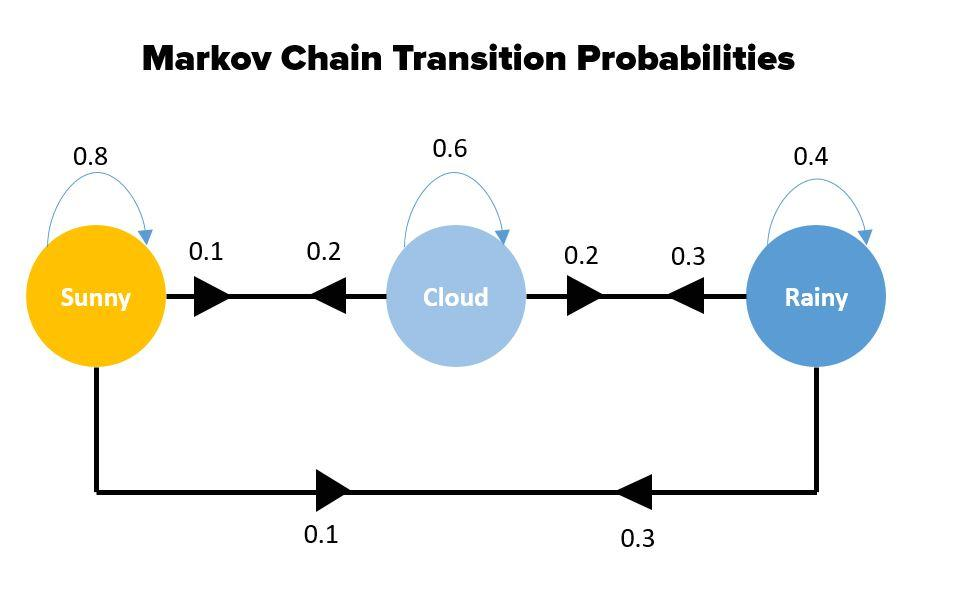

## Table of Contents

## What is the Markov Property in the context of machine learning?

The Markov Property is a concept used in machine learning, especially in models that deal with sequences or time series data. It says that the future state of a process depends only on its current state, not on the sequence of events that preceded it. Think of it like this: if you're trying to predict the weather for tomorrow, you only need to know today's weather, not the weather from the entire past week. This idea makes things simpler because it reduces the amount of data you need to consider for making predictions.

In machine learning, the Markov Property is often used in models like Markov Chains and Hidden Markov Models (HMMs). For example, in a Markov Chain, the probability of moving from one state to another depends only on the current state. If you have a model that predicts stock prices, and it uses the Markov Property, it will look at today's price to predict tomorrow's price, not the prices from the last month. This property helps make these models more efficient and easier to work with, as they don't need to keep track of long histories of data.

## How does the Markov Property relate to probability theory?

The Markov Property is a key concept in probability theory that simplifies how we understand and model the behavior of random processes over time. It states that the future state of a process depends only on its current state, and not on the sequence of events that preceded it. This idea can be expressed mathematically as $$P(X_{n+1} | X_n, X_{n-1}, \ldots, X_0) = P(X_{n+1} | X_n)$$, where $X_n$ represents the state at time $n$. This equation means that the probability of moving to the next state $X_{n+1}$ depends only on the current state $X_n$, and not on any previous states.

In practical terms, the Markov Property makes it easier to work with and predict the behavior of systems that change over time. For example, if you're modeling the movement of a person walking randomly on a grid, you only need to know their current position to predict where they might go next. You don't need to keep track of every step they've taken before. This simplification is very useful in fields like finance, where stock prices might be modeled as a Markov process, or in weather forecasting, where today's weather conditions are used to predict tomorrow's weather, without needing to consider the entire historical weather data.

## Can you explain the concept of a Markov chain and its relevance to machine learning?

A Markov chain is a type of mathematical system that can help us understand how things change over time. It's based on the Markov Property, which says that the next step in a process depends only on where you are now, not on how you got there. Imagine you're playing a board game where you can move from one square to another. In a Markov chain, the chance of moving to the next square only depends on which square you're on right now. This idea can be written as $$P(X_{n+1} | X_n, X_{n-1}, \ldots, X_0) = P(X_{n+1} | X_n)$$, where $X_n$ is your position at step $n$.

In [machine learning](/wiki/machine-learning), Markov chains are really useful because they help us model and predict things that change over time. For example, if you're trying to predict the weather, a Markov chain can help by looking at today's weather to guess what it might be like tomorrow. Or if you're working on a language model, Markov chains can help predict the next word in a sentence based on the current word. This makes them great for tasks like speech recognition, text generation, and even stock market predictions. By simplifying the problem to focus only on the current state, Markov chains make it easier to build and train models that can handle complex sequences of data.

## What are some common applications of the Markov Property in machine learning algorithms?

The Markov Property is widely used in machine learning algorithms, especially when dealing with sequences or time-series data. One common application is in Hidden Markov Models (HMMs), which are used for tasks like speech recognition and language translation. In speech recognition, an HMM can model how sounds change over time by only considering the current sound to predict the next one. This makes it easier to process and understand spoken language because the model doesn't need to keep track of the entire history of sounds.

Another important application is in natural language processing, where Markov chains help predict the next word in a sentence based on the current word. This is useful for tasks like text generation or autocomplete features in search engines and text editors. By focusing on the current word, the model can quickly generate coherent text without needing to consider the entire history of the sentence.

Markov chains are also used in [reinforcement learning](/wiki/reinforcement-learning), where an agent learns to make decisions based on its current state. For example, in a game like chess, a Markov chain can help the agent decide its next move by only considering the current position on the board. This simplifies the decision-making process and helps the agent learn more efficiently. Overall, the Markov Property's focus on the current state makes it a powerful tool in machine learning for handling complex sequential data.

## How does the Markov Property simplify the modeling of complex systems?

The Markov Property makes modeling complex systems easier by focusing only on the current state of a system to predict what will happen next. Imagine you're trying to guess where a ball will roll next on a bumpy surface. Instead of needing to know every bump it has hit before, you only need to know where it is right now. This idea is shown in the formula $$P(X_{n+1} | X_n, X_{n-1}, \ldots, X_0) = P(X_{n+1} | X_n)$$, which means the chance of the next step depends only on the current step. By not having to keep track of the whole history, we can build simpler and faster models that still work well.

This simplification is really helpful in many areas, like predicting the weather or figuring out what someone will say next. For example, if you're trying to guess the weather for tomorrow, you only need to know today's weather, not the weather from the whole past week. This makes it easier to build computer models that can handle big, complicated data sets. By using the Markov Property, we can create models that are easier to understand and work with, making it possible to predict the future of complex systems more accurately and efficiently.

## What is the difference between first-order and higher-order Markov models?

A first-order Markov model is the simplest type of Markov model where the future state depends only on the current state. This means that to predict what will happen next, you only need to know where you are right now. For example, if you're trying to predict the weather for tomorrow, you just look at today's weather. In math, this is shown as $$P(X_{n+1} | X_n, X_{n-1}, \ldots, X_0) = P(X_{n+1} | X_n)$$. This makes first-order models easy to understand and work with because they don't need a lot of past information.

Higher-order Markov models, on the other hand, consider more than just the current state to predict the future. They might look at the last two or three states, or even more, to make their predictions. For instance, to predict tomorrow's weather, a second-order Markov model would consider both today's and yesterday's weather. This can be written as $$P(X_{n+1} | X_n, X_{n-1}, \ldots, X_0) = P(X_{n+1} | X_n, X_{n-1})$$. While these models can be more accurate because they use more information, they are also more complex and harder to work with. They need more data and can be trickier to set up and understand.

## How can the Markov Property be used in reinforcement learning?

In reinforcement learning, the Markov Property helps by making it easier for an agent to learn how to make decisions. Imagine you're playing a game where you need to move from one spot to another. Instead of remembering every move you've made, you only need to know where you are right now to decide your next move. This idea is called the Markov Property and it's shown in the formula $$P(X_{n+1} | X_n, X_{n-1}, \ldots, X_0) = P(X_{n+1} | X_n)$$. By focusing only on the current state, the agent can learn faster and make better choices without needing to keep track of a long history of actions.

This simplification is really helpful in reinforcement learning because it makes the learning process more efficient. For example, in a game like chess, a Markov model can help the computer decide its next move by only looking at the current position on the board. This means the computer doesn't need to remember every move that led to the current situation. By using the Markov Property, reinforcement learning algorithms can handle complex tasks more easily, leading to better performance and quicker learning.

## What are the limitations of using the Markov Property in machine learning models?

One limitation of using the Markov Property in machine learning models is that it can oversimplify complex systems. By only considering the current state to predict the future, these models might miss important patterns or dependencies that are spread out over time. For example, if you're trying to predict stock prices, a model that only looks at today's price might not capture long-term trends or seasonal patterns that could be important for making accurate predictions. This can lead to less accurate models because they don't have enough information to make good guesses about what will happen next.

Another limitation is that Markov models can become very complex when you need to consider more than just the current state. If you want to use a higher-order Markov model, which looks at the last few states instead of just the current one, the model can get much harder to work with. For instance, a second-order Markov model, where you consider the last two states, would be shown as $$P(X_{n+1} | X_n, X_{n-1}, \ldots, X_0) = P(X_{n+1} | X_n, X_{n-1})$$. This can make the model more accurate but also increases the amount of data needed and makes it more difficult to train and understand. So, while the Markov Property can simplify things, it can also limit how well a model can handle complex, real-world situations.

## How does the Markov Property affect the design of Hidden Markov Models (HMMs)?

The Markov Property plays a big role in how Hidden Markov Models (HMMs) are designed. In an HMM, you have two layers: one layer you can see, called the "observations," and another layer you can't see, called the "hidden states." The Markov Property says that the next hidden state only depends on the current hidden state, not on any past states. This is shown as $$P(X_{n+1} | X_n, X_{n-1}, \ldots, X_0) = P(X_{n+1} | X_n)$$. Because of this, when you're building an HMM, you only need to set up rules for moving from one hidden state to another based on the current hidden state. This makes the model simpler because you don't have to keep track of long histories of states.

However, the Markov Property also affects how HMMs handle the observations. Each observation depends only on the current hidden state, not on any past observations or hidden states. This means that when you're designing an HMM, you need to define how each hidden state can produce different observations. For example, if you're using an HMM for speech recognition, each hidden state might represent a different sound, and the observations would be the actual sounds you hear. By focusing only on the current hidden state, HMMs can efficiently model sequences of data, but they might miss out on long-term patterns or dependencies that could be important for understanding complex systems.

## Can you discuss any advanced techniques that extend the basic Markov Property in machine learning?

One advanced technique that extends the basic Markov Property is the use of higher-order Markov models. In a first-order Markov model, the future state depends only on the current state, as shown by $$P(X_{n+1} | X_n, X_{n-1}, \ldots, X_0) = P(X_{n+1} | X_n)$$. However, higher-order models consider more than just the current state. For example, a second-order Markov model would look at the last two states to predict the next one, represented as $$P(X_{n+1} | X_n, X_{n-1}, \ldots, X_0) = P(X_{n+1} | X_n, X_{n-1})$$. This can help capture more complex patterns in data, like long-term dependencies or seasonal trends, which a first-order model might miss. However, these models are more complex to build and require more data to train effectively.

Another technique is the use of Conditional Random Fields (CRFs), which extend the Markov Property by allowing dependencies between states to depend on the entire observation sequence. Unlike HMMs, which assume that the observations depend only on the current hidden state, CRFs can model how the entire sequence of observations influences the transitions between states. This makes CRFs particularly useful for tasks like named entity recognition in natural language processing, where understanding the context of a whole sentence can help identify specific entities more accurately. While CRFs are more flexible and can capture more nuanced relationships in data, they are also more computationally intensive and require more sophisticated algorithms to train and use effectively.

## How do you validate that a system adheres to the Markov Property?

To check if a system follows the Markov Property, you need to see if the future depends only on the present, not on the past. Imagine you're playing a board game where you move from one square to another. If the chance of moving to the next square depends only on where you are now, and not on how you got there, then the game follows the Markov Property. You can test this by looking at lots of data from the game and seeing if knowing the past moves helps predict the next move better than just knowing the current position. If it doesn't, then the system likely adheres to the Markov Property.

In more technical terms, you can use statistical tests to validate the Markov Property. One common method is to compare the probabilities of the next state given different histories. If $$P(X_{n+1} | X_n, X_{n-1}, \ldots, X_0) = P(X_{n+1} | X_n)$$ holds true, then the system follows the Markov Property. You can use statistical tools to see if these probabilities are the same within a certain level of confidence. If they are, then you can say that the system adheres to the Markov Property.

## What are the current research trends involving the Markov Property in machine learning?

One of the current research trends involving the Markov Property in machine learning is the development of more advanced models that can capture long-term dependencies while still benefiting from the simplicity of the Markov Property. Researchers are exploring higher-order Markov models, which consider more than just the current state to predict the future. For example, a second-order Markov model looks at the last two states to predict the next one, represented as $$P(X_{n+1} | X_n, X_{n-1}, \ldots, X_0) = P(X_{n+1} | X_n, X_{n-1})$$. These models can better capture patterns like seasonal trends or long-term dependencies that first-order models might miss. However, they are more complex and require more data to train effectively, so researchers are working on ways to balance complexity and performance.

Another trend is the integration of the Markov Property into more sophisticated machine learning frameworks like [deep learning](/wiki/deep-learning) and reinforcement learning. For example, in reinforcement learning, researchers are using the Markov Property to simplify the decision-making process for [agents](/wiki/agents). By focusing only on the current state, agents can learn faster and make better decisions without needing to keep track of long histories of actions. In deep learning, researchers are combining the Markov Property with neural networks to create models like Recurrent Neural Networks (RNNs) and Long Short-Term Memory (LSTM) networks. These models use the Markov Property to handle sequences of data more efficiently, allowing them to predict future states based on the current state while still capturing complex patterns in the data.

## References & Further Reading

[1]: Murphy, K. P. (2012). ["Machine Learning: A Probabilistic Perspective."](https://www.cs.ubc.ca/~murphyk/MLbook/pml-toc-1may12.pdf) MIT Press.

[2]: Rabiner, L. R. (1989). ["A Tutorial on Hidden Markov Models and Selected Applications in Speech Recognition."](https://ieeexplore.ieee.org/document/18626/?arnumber=18626) Proceedings of the IEEE.

[3]: Bishop, C. M. (2006). ["Pattern Recognition and Machine Learning."](https://www.cs.uoi.gr/~arly/courses/ml/tmp/Bishop_book.pdf) Springer-Verlag.

[4]: Sutton, R. S., & Barto, A. G. (2018). ["Reinforcement Learning: An Introduction."](https://web.stanford.edu/class/psych209/Readings/SuttonBartoIPRLBook2ndEd.pdf) MIT Press.

[5]: Norris, J. R. (1997). ["Markov Chains."](https://www.cambridge.org/core/books/markov-chains/A3F966B10633A32C8F06F37158031739) Cambridge University Press.

[6]: Koller, D., & Friedman, N. (2009). ["Probabilistic Graphical Models: Principles and Techniques."](http://mcb111.org/w06/KollerFriedman.pdf) MIT Press.

[7]: Collins, M. (2002). ["Discriminative Training Methods for Hidden Markov Models: Theory and Experiments with Perceptron Algorithms."](https://aclanthology.org/W02-1001/) Proceedings of the 2002 Conference on Empirical Methods in Natural Language Processing.