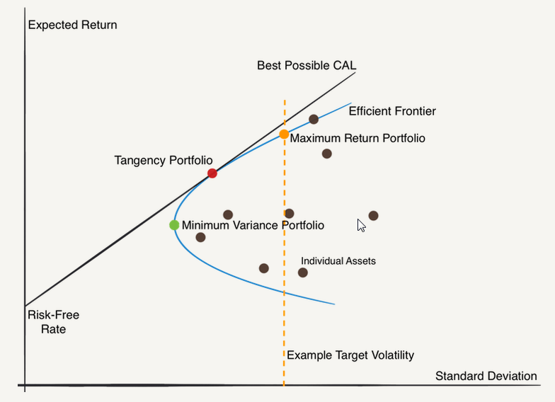

The Markowitz Efficient Set, a concept originating from the groundbreaking work of Harry Markowitz, represents a cornerstone of modern portfolio theory. Introduced in his seminal 1952 paper, Markowitz's efficient set or efficient frontier provides a systematic approach to portfolio diversification by illustrating the optimal trade-offs between risk and return. The model demonstrates how rational investors can construct portfolios to achieve a desired level of return with the minimum possible risk, a balance that is crucial in effective investment strategy formulation. 

Markowitz's approach evaluates portfolios by analyzing variance and covariance, enabling the identification of combinations of assets that lie along the efficient frontier. These portfolios are said to be efficient because they offer the maximum expected return for a given level of risk. Conversely, any portfolio not on this frontier is considered inefficient, as it can be outperformed by one that resides on the frontier at the same level of risk.



In today's financial landscape, the significance of achieving an optimal risk-return balance cannot be overstated. Investors, whether institutional or individual, strive to align their portfolios along this efficient frontier, leveraging diversification to mitigate risks associated with specific investments. The application of the Markowitz model extends beyond traditional portfolio management, increasingly influencing investment strategies in areas such as algorithmic trading. Here, algorithms are employed to continuously optimize portfolio composition, adapting swiftly to market changes and seeking the ideal combinations of risk and reward.

The efficient frontier framework forms the foundation for making informed investment decisions, guiding investors towards portfolios that best reflect their risk tolerance and return objectives. By emphasizing variance reduction through diversification, the Markowitz Efficient Set equips both professionals and individual investors with the tools needed to navigate the complexities of the financial markets, ultimately facilitating the pursuit of higher returns while maintaining manageable risk levels.

## Table of Contents

## Understanding the Markowitz Efficient Set

Harry Markowitz's Efficient Set, commonly known as the efficient frontier, represents a landmark concept in the field of modern finance. The efficient frontier encapsulates the trade-off between risk and return that investors encounter when constructing portfolios. In essence, it is a graphical representation of optimal portfolios that offer the highest expected return for a defined level of risk, or conversely, the lowest risk for a given level of expected return.

The formulation of the efficient frontier is grounded in Markowitz's seminal 1952 work, which introduced the concept of portfolio optimization through variance and covariance metrics. Markowitz's framework involves calculating the expected return and variance (risk) for all possible portfolio combinations of given assets using the following formulas:

- **Expected Portfolio Return**:
$$
  E(R_p) = \sum_{i=1}^n w_i E(R_i)

$$
  where $E(R_p)$ is the expected return of the portfolio, $w_i$ is the weight of asset $i$ in the portfolio, and $E(R_i)$ is the expected return of asset $i$.

- **Portfolio Variance**:
$$
  \sigma_p^2 = \sum_{i=1}^n \sum_{j=1}^n w_i w_j \sigma_{ij}

$$
  where $\sigma_p^2$ is the variance of the portfolio, $w_i$ and $w_j$ are the weights of assets $i$ and $j$ respectively, and $\sigma_{ij}$ is the covariance between the returns of assets $i$ and $j$.

By optimizing these equations, investors can identify a set of portfolios that form the efficient frontier on a risk-return graph. Each point on this frontier represents a portfolio that is considered 'efficient'; there is no other portfolio that provides a higher expected return with the same level of risk, or lower risk with the same level of return.

Key components of Markowitz's theory involve diversification, variance, and risk assessment. Diversification, a central tenet, implies not putting all investment capital into a single asset but spread across various assets to reduce unsystematic risk. The efficient frontier quantifies how diversification can enhance the return-risk profile of an investment by lowering the overall portfolio variance and exploiting low or negative correlations between asset returns.

To visualize the efficient frontier and understand its implications, investors and financial analysts often employ graphs to plot the expected returns against the level of risk for various portfolio combinations. A curve is then formed representing the optimized portfolios, while the area below the curve represents inefficient portfolios that do not utilize assets to their full potential in terms of risk-adjusted returns.

In practice, understanding and applying the concept of the efficient frontier allows investors to make informed decisions about asset allocation that align with their risk tolerance and return aspirations. The framework set forth by Markowitz continues to be a cornerstone of modern portfolio management, offering insights and methodologies that shape investment strategies worldwide.

## Implementing the Markowitz Efficient Set

Implementing the Markowitz Efficient Set involves constructing portfolios that align with the efficient frontier, which represents optimal portfolios offering the maximum expected return for a given level of risk. This practical application requires a methodical approach to identify asset combinations that best meet an investor's risk-return goals.

### Step-by-Step Methodology

1. **Define the Portfolio Universe**: Begin by selecting a broad range of assets, such as stocks, bonds, or other investment vehicles. This forms the universe from which optimal portfolios will be derived.

2. **Calculate Expected Returns and Risks**: For each asset, estimate the expected return and calculate the standard deviation of returns, which represents the asset's risk. Expected returns $E(R_i)$ can often be estimated using historical averages.

3. **Estimate Covariance Between Assets**: Determine the covariance $Cov(R_i, R_j)$ between asset pairs. This measure quantifies how two asset returns move in relation to each other and is crucial for understanding diversification benefits.

4. **Construct the Efficient Frontier**: Using the data obtained, employ optimization techniques to find the portfolios that offer the highest expected return for specific levels of risk. This typically involves solving a quadratic optimization problem where the objective function is the portfolio variance:
$$
   \min \frac{1}{2} x^T \Sigma x

$$

   where $x$ is a vector of asset weights and $\Sigma$ is the covariance matrix. The constraints include:

   - $\sum x_i = 1$ (total investment sums to 100%)
   - $x_i \geq 0$ (no short selling, if applicable)
   - Specified target return or risk level.

5. **Understand Risk Tolerance**: Investors should assess their risk tolerance to select an appropriate point on the efficient frontier. Individuals with higher risk tolerance may opt for portfolios on the higher end of the risk-return spectrum.

### Use of Computational Tools

Implementing these calculations manually is complex, especially with large asset pools. Thus, computational tools and languages such as Python are invaluable. Using libraries like NumPy for numerical calculations and optimization modules such as `scipy.optimize`, investors can efficiently compute the optimal portfolios.

```python
import numpy as np
from scipy.optimize import minimize

# Define expected returns, covariance matrix, and risk-free rate
expected_returns = np.array([0.12, 0.08, 0.10])  # Example returns
cov_matrix = np.array([[0.0025, 0.0001, 0.0002],
                       [0.0001, 0.0016, 0.0001],
                       [0.0002, 0.0001, 0.0020]])  # Example covariance matrix

def portfolio_variance(weights):
    return weights.T @ cov_matrix @ weights

# Constraints: sum of weights = 1
constraints = {'type': 'eq', 'fun': lambda x: np.sum(x) - 1}

# Bounds for each weight
bounds = [(0, 1) for _ in range(len(expected_returns))]

# Minimize portfolio variance
result = minimize(portfolio_variance, x0=np.array([1/3, 1/3, 1/3]), constraints=constraints, bounds=bounds)
optimal_weights = result.x
```

### Dynamic Adjustments

Market dynamics continuously evolve, necessitating ongoing adjustments to portfolio compositions. Regular [backtesting](/wiki/backtesting), where portfolios are tested against historical data, helps in refining strategies and ensuring they adapt to changing market conditions. Tools and platforms that automate these processes can significantly aid in maintaining an optimal investment strategy.

Adjustments should also account for changes in an investor's risk preferences or financial goals, ensuring that the selected portfolio remains aligned with their overarching strategy. By keeping these aspects in check, investors can effectively employ the Markowitz Efficient Set to achieve optimal asset allocation and maximize their investment potential.

## Diversification in the Markowitz Efficient Set

Diversification is a foundational component of the Markowitz Efficient Set, strategically employed to reduce overall portfolio risk. By varying investments across different asset classes, diversification mitigates risks associated with specific securities or sectors. This is rooted in the concept that the returns of various assets are not perfectly correlated, allowing for a reduction in total portfolio [volatility](/wiki/volatility-trading-strategies) when combined judiciously.

The core principle of diversification is to allocate capital among a broad array of investments so that the unsystematic risk—specific risks associated with individual investments—can be minimized. This is in contrast to systematic risk, which is inherent to the entire market or a particular segment and cannot be eliminated through diversification alone. Consequently, diversification works as a buffer, preventing significant investment value depreciation resulting from the adverse performance of a single asset or asset class.

Understanding correlations between asset returns is crucial in effective diversification. When constructing a diversified portfolio, an investor evaluates the correlation coefficient, denoted as $\rho$, which measures how two assets move in relation to each other. Correlations range from -1 to +1, where -1 indicates perfect negative correlation, +1 indicates perfect positive correlation, and 0 indicates no correlation. Ideally, combining assets with low or negative correlations can lead to a more stable portfolio as losses in one asset class could be offset by gains in another.

The role of diversification is further highlighted in achieving stable returns across varied market environments. During periods of market volatility or economic downturns, a well-diversified portfolio tends to exhibit lower volatility compared to non-diversified portfolios. This stability is advantageous for investors seeking consistent returns while managing risk exposure.

Several case studies underscore the efficacy of diversification strategies. For instance, during the 2008 financial crisis, portfolios diversified with a mix of asset classes including government bonds, hedge funds, and commodities performed relatively better than those heavily concentrated in equities. Another real-world demonstration can be seen through the strategic allocation of assets in global markets. By incorporating emerging market stocks with developed market stocks and various fixed-income securities, investors have often navigated volatility while capturing growth opportunities in different regions.

To quantify the benefits of diversification, consider a Python implementation that simulates portfolio optimization using historical asset return data:

```python
import numpy as np
import pandas as pd
from scipy.optimize import minimize

# Simulated asset return data
returns = np.random.normal(0.01, 0.05, (1000, 4))  # 1000 samples of 4 assets

# mean returns and covariance matrix
mean_returns = returns.mean(axis=0)
cov_matrix = np.cov(returns.T)

def portfolio_volatility(weights):
    return np.sqrt(np.dot(weights.T, np.dot(cov_matrix, weights)))

# Constraints and boundaries
constraints = ({'type': 'eq', 'fun': lambda x: np.sum(x) - 1})
boundaries = tuple((0, 1) for _ in range(4))

# Initial guess
weights_init = [0.25] * 4

# Minimize the volatility for efficient diversification
optimized = minimize(portfolio_volatility, weights_init, method='SLSQP', bounds=boundaries, constraints=constraints)

print("Optimal Weights for Diversification:", optimized.x)
print("Portfolio Volatility:", portfolio_volatility(optimized.x))
```

In conclusion, diversification within the Markowitz Efficient Set is essential for risk management. It leverages the variance and covariance of asset returns to create a balanced portfolio that not only seeks to maximize returns for a given level of risk but also provides a robust defense against market volatility. Through strategically diversified portfolios, investors can achieve efficient frontiers where optimal risk-reward combinations are realized.

## Algorithmic Trading and the Markowitz Model

Algorithmic trading leverages the Markowitz model to automate portfolio optimization processes by systematically balancing risk and return. At its core, the Markowitz model determines the efficient frontier—a graphical representation of optimal portfolios that offer the maximum expected return for a given level of risk—by using historical data to estimate returns, variances, and covariances of asset returns. This data-centric approach is where [algorithmic trading](/wiki/algorithmic-trading) finds its synergy, as algorithms can process vast datasets swiftly and identify optimal asset combinations that lie on or near the efficient frontier.

A key aspect of integrating the Markowitz model into algorithmic trading is the utilization of historical data to forecast future market behaviors. Algorithms are programmed to analyze historical asset prices, variances, and covariances to project potential portfolio outcomes. These predictive models often incorporate [machine learning](/wiki/machine-learning) techniques to enhance accuracy by adapting to new data patterns over time, thus improving the data-driven decision-making process. 

Moreover, risk management strategies inherent in the Markowitz model are crucial to algorithmic trading platforms. These strategies involve setting constraints on portfolio variance or employing Value-at-Risk (VaR) measures to ensure portfolios maintain acceptable risk levels. By doing so, trading algorithms can make calculated decisions that align with predefined risk tolerance levels, ensuring that portfolios adhere to investors' risk-return profiles.

However, implementing the Markowitz model in algorithmic trading, especially in high-frequency trading ([HFT](/wiki/high-frequency-trading-strategies)), presents challenges. HFT demands rapid execution of trades based on fleeting market signals, which requires low-latency systems capable of real-time data processing and decision-making. The rebalancing needs and the computational load of frequently updating portfolio compositions to remain on the efficient frontier can be taxing. Nonetheless, advancements in technology, such as faster processors and enhanced parallel computation, address these challenges by enabling more efficient data handling and execution speeds.

The integration of algorithmic trading with the Markowitz model offers notable benefits. Primarily, it enhances risk-adjusted returns by ensuring portfolios are consistently optimal as per the latest market data. Algorithms also allow for swift adaptation to market changes, offering flexibility and responsiveness that manual trading cannot match. This capability is particularly advantageous in volatile markets, where timely adjustments can protect against downside risks or seize opportunities for gains.

In summary, the combination of algorithmic trading and the Markowitz model represents a powerful tool in modern finance. By automating complex calculations and adapting to real-time data, this integration facilitates refined portfolio management strategies that adeptly balance risk and reward.

## Challenges and Limitations of the Markowitz Model

The Markowitz model, while a cornerstone of modern portfolio theory, is not without its challenges and limitations. A primary concern is its sensitivity to the accuracy of its input data. The model’s reliance on historical data to estimate expected returns, variances, and covariances means that inaccuracies in these estimations can significantly impact portfolio optimization. The model assumes that the future will resemble past data, which is often not the case due to unforeseen market events and shifts in economic conditions.

One critical issue is the estimation of expected returns and covariances. Expected returns are notoriously difficult to predict accurately, as they are influenced by numerous external factors not accounted for in historical data. Covariance estimates, which measure the degree to which two assets move in relation to each other, can fluctuate due to changes in correlation patterns over time. This variability makes portfolios sensitive to input inaccuracies, posing a significant risk for investors relying on the model for decision-making.

The computational complexities associated with the Markowitz model present another limitation. As the number of assets in a portfolio increases, the size and dimensionality of the covariance matrix also increase, leading to substantial computational demands. This necessitates large-scale data processing capabilities and can limit the model’s practicality for real-time decisions or extensive asset universes without significant computational resources.

Furthermore, real-world adaptability is a pressing concern. Markets are dynamic and subject to unforeseen events that can disrupt historical patterns and relationships between assets. The model does not inherently account for such disruptions, which can lead to suboptimal portfolio configurations when conditions deviate from expected norms. For example, during financial crises, correlations between asset classes often converge, reducing the benefits of diversification, a fundamental premise of the model.

Emerging criticisms also highlight the need for improvements in the Markowitz model. Alternatives such as robust optimization and Black-Litterman models attempt to address some of these challenges by incorporating additional factors or adjusting reliance on estimated parameters. These approaches can offer more stable solutions under conditions of uncertainty and are increasingly considered in academic and professional circles.

In summary, while the Markowitz model provides a foundational framework for understanding risk-return trade-offs, its practical application is hampered by sensitivity to input precision, computational demands, and adaptability issues. Continuous advancements in computational techniques and a deeper integration of real-time data analysis are necessary to bolster the model's efficacy in today’s rapidly evolving financial landscapes.

## Conclusion

The Markowitz Efficient Set remains a crucial instrument in the field of portfolio management and algorithmic trading. By focusing on diversification and risk management, it has had a significant and lasting impact on investment strategies worldwide. The fundamental principle of achieving an optimal risk-return balance underpins decisions that investors and portfolio managers make, guiding them towards combinations of assets that promise maximum expected returns for a given level of risk.

Even though the model presents certain practical limitations, such as sensitivity to input changes and computational complexities, advancements in technology and investment methodologies continue to bolster its application. As computational power and data processing capabilities improve, the ability to model more complex financial dynamics becomes increasingly feasible. Furthermore, algorithmic trading systems have integrated the Markowitz principles to automate portfolio optimization, showcasing the model's adaptability to modern financial environments.

Looking forward, ongoing research is pivotal to addressing these challenges and integrating innovative solutions from data science. Machine learning techniques, for instance, offer promising avenues to enhance the estimation of expected returns and covariance matrices, thereby refining the precision of the model. As financial markets evolve, the flexibility to incorporate real-time data analytics and adaptation strategies will become ever more critical.

In summary, despite its challenges, the Markowitz model continues to serve as a timeless framework for investors seeking to balance risk and reward effectively within the ever-changing landscape of investments. Its enduring relevance in financial theory and practice underscores its foundational role in guiding investment decision-making processes.

## References & Further Reading

[1]: Markowitz, H. (1952). ["Portfolio Selection"](https://onlinelibrary.wiley.com/doi/abs/10.1111/j.1540-6261.1952.tb01525.x). The Journal of Finance, 7(1), 77-91.

[2]: Fabozzi, F. J., Gupta, F., & Markowitz, H. M. (2002). ["The Legacy of Modern Portfolio Theory"](https://www.semanticscholar.org/paper/The-Legacy-of-Modern-Portfolio-Theory-Fabozzi-Gupta/6619eebc6957d7c101112a041942c4df61783616). The Journal of Investing, 11(3), 7-22.

[3]: ["Modern Portfolio Theory and Investment Analysis"](https://books.google.com/books/about/Modern_Portfolio_Theory_and_Investment_A.html?id=181CEAAAQBAJ) by Edwin J. Elton, Martin J. Gruber, Stephen J. Brown, and William N. Goetzmann

[4]: Bodie, Z., Kane, A., & Marcus, A. J. ["Investments"](https://www.mheducation.com/highered/product/Investments-Bodie.html) (11th Edition), McGraw-Hill Education.

[5]: Elton, E. J., & Gruber, M. J. (1997). ["Modern Portfolio Theory, 1950 to Date"](https://www.sciencedirect.com/science/article/pii/S0378426697000484). Journal of Banking & Finance, 21(11-12), 1743-1759.