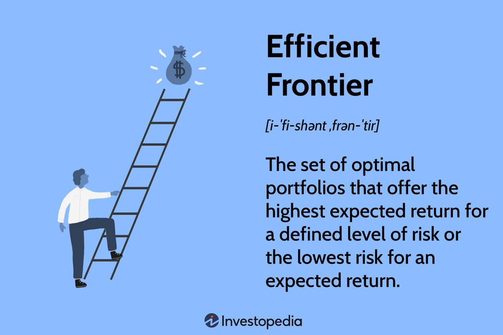

## Table of Contents

## What is the Markowitz Efficient Set?

The Markowitz Efficient Set, also known as the efficient frontier, is a concept in modern portfolio theory developed by Harry Markowitz. It represents a set of portfolios that offer the highest expected return for a given level of risk, or the lowest risk for a given level of expected return. This set is plotted on a graph where the x-axis shows the risk (usually measured as standard deviation) and the y-axis shows the expected return. By choosing a portfolio on the efficient frontier, investors can maximize their returns for the level of risk they are willing to take.

In simpler terms, imagine you have different baskets of investments, and each basket has a different mix of stocks, bonds, or other assets. The Markowitz Efficient Set helps you find the best baskets where you get the most reward for the amount of risk you're comfortable with. If a basket is not on this set, it means there's another basket that either gives you more return for the same risk or less risk for the same return. This idea helps investors make smarter choices about where to put their money.

## Who is Harry Markowitz and what is his contribution to portfolio theory?

Harry Markowitz is a famous economist and a Nobel Prize winner. He was born in 1927 and came up with a big idea in the world of investing. This idea is called Modern Portfolio Theory, and it changed how people think about putting their money into different investments.

His main contribution to portfolio theory is the idea of diversification. Markowitz showed that by spreading your money across different types of investments, you can lower your risk without losing out on potential gains. He created a way to figure out the best mix of investments, which he called the efficient frontier. This helps investors pick a set of investments that gives them the best possible return for the amount of risk they are willing to take. His work has helped many people make smarter choices with their money.

## How does the Markowitz Efficient Set relate to the concept of diversification?

The Markowitz Efficient Set is closely tied to the concept of diversification. Diversification is all about spreading your investments across different assets to reduce risk. Harry Markowitz showed that by doing this, you can lower the chance of losing money while still aiming for good returns. The idea is that not all investments will go up or down at the same time, so having a mix can smooth out the bumps in your investment journey.

The Markowitz Efficient Set helps you find the best way to diversify your investments. It's like a map that shows you the best combinations of investments. When you pick a portfolio on this set, you're choosing a mix that gives you the highest return for the risk you're willing to take. So, by following the efficient set, you're using diversification in the smartest way possible to balance risk and reward.

## What are the key assumptions behind the Markowitz model?

The Markowitz model, or Modern Portfolio Theory, makes some important guesses about how the world of investing works. One big guess is that investors care about two things: how much money they might make and how much risk they might take. The model says that investors want to get the most return for the least amount of risk. It also assumes that investors can figure out how much risk and return they might get from different investments. This means they can use numbers like expected returns and standard deviations to make their choices.

Another key assumption is that investors can mix and match different investments to create a portfolio that fits their needs. The model believes that the risk of a whole portfolio isn't just the sum of the risks of each investment. Instead, it's about how the investments move together, which is called correlation. If you pick investments that don't all go up or down at the same time, you can lower the overall risk of your portfolio. This idea of diversification is at the heart of the Markowitz model.

Lastly, the model assumes that markets are efficient, meaning all the information that could affect an investment's price is already known by everyone. This means that prices reflect all available information, and investors can't easily beat the market just by knowing something others don't. These assumptions help the Markowitz model guide investors in making smart choices about where to put their money.

## How is the efficient frontier calculated in the Markowitz model?

To calculate the efficient frontier in the Markowitz model, you start by gathering data about different investments. This data includes the expected return and the risk, measured as the standard deviation, for each investment. You also need to know how these investments move together, which is called their correlation. With this information, you can figure out the expected return and risk for different combinations of these investments.

Once you have the data, you use math to find the best mix of investments. This involves looking at many different portfolios and calculating their expected return and risk. The efficient frontier is made up of the portfolios that give you the highest return for a given level of risk, or the lowest risk for a given level of return. By plotting these portfolios on a graph with risk on the x-axis and return on the y-axis, you can see the curve that represents the efficient frontier. This curve helps investors pick the best portfolio that matches their risk and return goals.

## What is the difference between the efficient frontier and the Markowitz Efficient Set?

The efficient frontier and the Markowitz Efficient Set are actually the same thing, just different names for the same idea. They both come from Harry Markowitz's work on Modern Portfolio Theory. The efficient frontier is a line on a graph that shows the best portfolios you can make. These portfolios give you the highest return for the amount of risk you're willing to take, or the lowest risk for the return you want. It's like a map that helps you see where to put your money to get the best balance of risk and reward.

In simple terms, if you're looking at a bunch of different ways to invest your money, the efficient frontier helps you pick the best ones. It shows you which mixes of investments will give you the most bang for your buck, considering how much risk you're okay with. So, whether you call it the efficient frontier or the Markowitz Efficient Set, it's all about finding the smartest way to invest your money.

## Can you explain the role of risk and return in the Markowitz Efficient Set?

In the Markowitz Efficient Set, risk and return are the two main things that help you pick the best way to invest your money. Risk is how much your investments might go up or down, and it's usually measured by something called standard deviation. Return is how much money you might make from your investments. The idea is to find a mix of investments that gives you the highest return for the amount of risk you're okay with, or the lowest risk for the return you want.

The Markowitz Efficient Set shows you a line on a graph where each point on the line is a different mix of investments. This line is called the efficient frontier. If you pick a point on this line, you're choosing a portfolio that's the best you can get for your level of risk. Any point below this line means you're not getting the best deal because there's another mix of investments that can give you more return for the same risk, or less risk for the same return. So, the efficient set helps you make smart choices by balancing risk and return in the best way possible.

## How do investors use the Markowitz Efficient Set to optimize their portfolios?

Investors use the Markowitz Efficient Set to find the best mix of investments for their money. They start by looking at different investments and figuring out how much risk and return each one might bring. Then, they use the efficient frontier, which is a line on a graph that shows the best combinations of investments. By picking a point on this line, investors can choose a portfolio that gives them the highest return for the amount of risk they're willing to take, or the lowest risk for the return they want. This helps them make smart choices about where to put their money.

For example, if an investor is okay with a certain level of risk, they can look at the efficient frontier to see which portfolio gives them the best return for that risk. If they want to lower their risk, they can move along the line to find a portfolio that still gives a good return but with less risk. By using the Markowitz Efficient Set, investors can balance their need for making money with their comfort level for taking risks, helping them build a portfolio that fits their goals.

## What are the limitations of the Markowitz model in practical application?

One big problem with the Markowitz model is that it makes some guesses about the world that aren't always true. For example, it thinks that investors can predict how much money they'll make and how much risk they'll take. But in real life, it's really hard to know these things for sure. The model also assumes that all the important information about investments is already known by everyone, which isn't always the case. So, when you use the model, you might end up with numbers that don't match what actually happens in the market.

Another limitation is that the Markowitz model can be hard to use in real life because it needs a lot of data and math. You need to know the expected return, risk, and how different investments move together. Getting all this right can be tough and might take a lot of time and work. Plus, the model doesn't take into account things like taxes, how easy it is to buy or sell investments, or how much it costs to trade. These things can make a big difference in how well your investments do, so leaving them out can make the model less useful in the real world.

## How does the inclusion of different asset classes affect the Markowitz Efficient Set?

When you add different types of investments, like stocks, bonds, and real estate, to your portfolio, it can change the Markowitz Efficient Set. This set shows the best mix of investments that give you the highest return for the risk you're willing to take. By including different asset classes, you can spread out your risk because these investments don't all go up or down at the same time. For example, when stocks go down, bonds might go up, which can help balance out your portfolio. This means the efficient frontier might move up and to the left on the graph, showing that you can get more return for less risk.

However, adding more types of investments also makes things more complicated. You need to know how each type of investment might perform and how they move together. This can be hard to figure out and might need a lot of data and math. If you don't get it right, the efficient frontier you come up with might not be as helpful in real life. But if you do it well, including different asset classes can help you find a better mix of investments that fits your goals for risk and return.

## What advanced techniques can be used to enhance the Markowitz model's performance?

One way to make the Markowitz model work better is by using something called "Black-Litterman" model. This model helps fix a problem with the Markowitz model where it's hard to guess how much money you might make from your investments. The Black-Litterman model lets you add your own guesses about how investments will do, mixing them with what the market thinks. This can give you a more realistic picture of what might happen and help you pick a better mix of investments.

Another way to improve the Markowitz model is by using "Monte Carlo simulations." These simulations use a computer to try out thousands of different ways your investments might go. By looking at all these different possibilities, you can see how your portfolio might do in lots of different situations. This can help you understand the risks better and pick a portfolio that's more likely to meet your goals.

Lastly, you can use "factor models" to make the Markowitz model better. Factor models look at different things that can affect how your investments do, like how the whole market is doing or how certain industries are doing. By understanding these factors, you can make smarter guesses about how your investments might perform. This can help you build a portfolio that's more likely to give you the return you want for the risk you're willing to take.

## How has the Markowitz Efficient Set evolved with modern portfolio theory and new financial instruments?

The Markowitz Efficient Set, which is a key part of modern portfolio theory, has changed a lot over time. When Harry Markowitz first came up with the idea, it was all about picking the best mix of stocks and bonds to balance risk and return. But as the world of investing grew, new types of investments like real estate, commodities, and even cryptocurrencies came into play. These new financial instruments have made the Markowitz model more complicated but also more useful. By including these different kinds of investments, investors can spread out their risk even more and find new ways to make money. This means the efficient frontier can shift, showing new possibilities for balancing risk and return.

Modern portfolio theory has also gotten help from new math and computer tools. Techniques like the Black-Litterman model and Monte Carlo simulations let investors make better guesses about how their investments might do. These tools help fix some of the problems with the original Markowitz model, like the difficulty of predicting returns and risks. By using these advanced methods, investors can create portfolios that are more likely to meet their goals. Even though the basic idea of the Markowitz Efficient Set is still the same, these new tools and investments have made it more powerful and adaptable to today's financial world.

## What is the Understanding of the Markowitz Efficient Set?

Harry Markowitz's Efficient Set, commonly known as the efficient frontier, represents a landmark concept in the field of modern finance. The efficient frontier encapsulates the trade-off between risk and return that investors encounter when constructing portfolios. In essence, it is a graphical representation of optimal portfolios that offer the highest expected return for a defined level of risk, or conversely, the lowest risk for a given level of expected return.

The formulation of the efficient frontier is grounded in Markowitz's seminal 1952 work, which introduced the concept of portfolio optimization through variance and covariance metrics. Markowitz's framework involves calculating the expected return and variance (risk) for all possible portfolio combinations of given assets using the following formulas:

- **Expected Portfolio Return**:
$$
  E(R_p) = \sum_{i=1}^n w_i E(R_i)

$$
  where $E(R_p)$ is the expected return of the portfolio, $w_i$ is the weight of asset $i$ in the portfolio, and $E(R_i)$ is the expected return of asset $i$.

- **Portfolio Variance**:
$$
  \sigma_p^2 = \sum_{i=1}^n \sum_{j=1}^n w_i w_j \sigma_{ij}

$$
  where $\sigma_p^2$ is the variance of the portfolio, $w_i$ and $w_j$ are the weights of assets $i$ and $j$ respectively, and $\sigma_{ij}$ is the covariance between the returns of assets $i$ and $j$.

By optimizing these equations, investors can identify a set of portfolios that form the efficient frontier on a risk-return graph. Each point on this frontier represents a portfolio that is considered 'efficient'; there is no other portfolio that provides a higher expected return with the same level of risk, or lower risk with the same level of return.

Key components of Markowitz's theory involve diversification, variance, and risk assessment. Diversification, a central tenet, implies not putting all investment capital into a single asset but spread across various assets to reduce unsystematic risk. The efficient frontier quantifies how diversification can enhance the return-risk profile of an investment by lowering the overall portfolio variance and exploiting low or negative correlations between asset returns.

To visualize the efficient frontier and understand its implications, investors and financial analysts often employ graphs to plot the expected returns against the level of risk for various portfolio combinations. A curve is then formed representing the optimized portfolios, while the area below the curve represents inefficient portfolios that do not utilize assets to their full potential in terms of risk-adjusted returns.

In practice, understanding and applying the concept of the efficient frontier allows investors to make informed decisions about asset allocation that align with their risk tolerance and return aspirations. The framework set forth by Markowitz continues to be a cornerstone of modern portfolio management, offering insights and methodologies that shape investment strategies worldwide.

## How can one implement the Markowitz Efficient Set?

Implementing the Markowitz Efficient Set involves constructing portfolios that align with the efficient frontier, which represents optimal portfolios offering the maximum expected return for a given level of risk. This practical application requires a methodical approach to identify asset combinations that best meet an investor's risk-return goals.

### Step-by-Step Methodology

1. **Define the Portfolio Universe**: Begin by selecting a broad range of assets, such as stocks, bonds, or other investment vehicles. This forms the universe from which optimal portfolios will be derived.

2. **Calculate Expected Returns and Risks**: For each asset, estimate the expected return and calculate the standard deviation of returns, which represents the asset's risk. Expected returns $E(R_i)$ can often be estimated using historical averages.

3. **Estimate Covariance Between Assets**: Determine the covariance $Cov(R_i, R_j)$ between asset pairs. This measure quantifies how two asset returns move in relation to each other and is crucial for understanding diversification benefits.

4. **Construct the Efficient Frontier**: Using the data obtained, employ optimization techniques to find the portfolios that offer the highest expected return for specific levels of risk. This typically involves solving a quadratic optimization problem where the objective function is the portfolio variance:
$$
   \min \frac{1}{2} x^T \Sigma x

$$

   where $x$ is a vector of asset weights and $\Sigma$ is the covariance matrix. The constraints include:

   - $\sum x_i = 1$ (total investment sums to 100%)
   - $x_i \geq 0$ (no short selling, if applicable)
   - Specified target return or risk level.

5. **Understand Risk Tolerance**: Investors should assess their risk tolerance to select an appropriate point on the efficient frontier. Individuals with higher risk tolerance may opt for portfolios on the higher end of the risk-return spectrum.

### Use of Computational Tools

Implementing these calculations manually is complex, especially with large asset pools. Thus, computational tools and languages such as Python are invaluable. Using libraries like NumPy for numerical calculations and optimization modules such as `scipy.optimize`, investors can efficiently compute the optimal portfolios.

```python
import numpy as np
from scipy.optimize import minimize

# Define expected returns, covariance matrix, and risk-free rate
expected_returns = np.array([0.12, 0.08, 0.10])  # Example returns
cov_matrix = np.array([[0.0025, 0.0001, 0.0002],
                       [0.0001, 0.0016, 0.0001],
                       [0.0002, 0.0001, 0.0020]])  # Example covariance matrix

def portfolio_variance(weights):
    return weights.T @ cov_matrix @ weights

# Constraints: sum of weights = 1
constraints = {'type': 'eq', 'fun': lambda x: np.sum(x) - 1}

# Bounds for each weight
bounds = [(0, 1) for _ in range(len(expected_returns))]

# Minimize portfolio variance
result = minimize(portfolio_variance, x0=np.array([1/3, 1/3, 1/3]), constraints=constraints, bounds=bounds)
optimal_weights = result.x
```

### Dynamic Adjustments

Market dynamics continuously evolve, necessitating ongoing adjustments to portfolio compositions. Regular [backtesting](/wiki/backtesting), where portfolios are tested against historical data, helps in refining strategies and ensuring they adapt to changing market conditions. Tools and platforms that automate these processes can significantly aid in maintaining an optimal investment strategy.

Adjustments should also account for changes in an investor's risk preferences or financial goals, ensuring that the selected portfolio remains aligned with their overarching strategy. By keeping these aspects in check, investors can effectively employ the Markowitz Efficient Set to achieve optimal asset allocation and maximize their investment potential.

## References & Further Reading

[1]: Markowitz, H. (1952). ["Portfolio Selection"](https://onlinelibrary.wiley.com/doi/abs/10.1111/j.1540-6261.1952.tb01525.x). The Journal of Finance, 7(1), 77-91.

[2]: Fabozzi, F. J., Gupta, F., & Markowitz, H. M. (2002). ["The Legacy of Modern Portfolio Theory"](https://www.semanticscholar.org/paper/The-Legacy-of-Modern-Portfolio-Theory-Fabozzi-Gupta/6619eebc6957d7c101112a041942c4df61783616). The Journal of Investing, 11(3), 7-22.

[3]: ["Modern Portfolio Theory and Investment Analysis"](https://books.google.com/books/about/Modern_Portfolio_Theory_and_Investment_A.html?id=181CEAAAQBAJ) by Edwin J. Elton, Martin J. Gruber, Stephen J. Brown, and William N. Goetzmann

[4]: Bodie, Z., Kane, A., & Marcus, A. J. ["Investments"](https://www.mheducation.com/highered/product/Investments-Bodie.html) (11th Edition), McGraw-Hill Education.

[5]: Elton, E. J., & Gruber, M. J. (1997). ["Modern Portfolio Theory, 1950 to Date"](https://www.sciencedirect.com/science/article/pii/S0378426697000484). Journal of Banking & Finance, 21(11-12), 1743-1759.