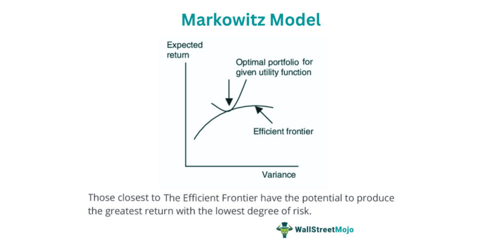

## Table of Contents

## What is the Markowitz model?

The Markowitz model, also known as Modern Portfolio Theory (MPT), is a way to choose investments that helps you balance the risk and reward. It was created by Harry Markowitz in the 1950s. The main idea is to spread your money across different investments, like stocks and bonds, to lower the risk. By doing this, you can make a portfolio that gives you the best return for the amount of risk you are willing to take.

In the Markowitz model, you look at how different investments move together. If two investments tend to go up and down at the same time, they are correlated. If they move in opposite directions, they are not correlated. By choosing investments that are not correlated, you can reduce the overall risk of your portfolio. The model uses math to find the best mix of investments that will give you the highest return for a certain level of risk, or the lowest risk for a certain level of return. This helps you make smarter choices about where to put your money.

## Who developed the Markowitz model and when?

The Markowitz model was developed by Harry Markowitz. He came up with this idea in the 1950s. Harry Markowitz is an economist and a Nobel Prize winner. He wanted to help people make better choices about their investments.

The model is also called Modern Portfolio Theory, or MPT for short. It helps people figure out how to spread their money across different investments to lower risk and get better returns. By using the Markowitz model, people can make smarter decisions about where to put their money.

## What is the main goal of the Markowitz model?

The main goal of the Markowitz model is to help people make smarter choices about their investments by balancing risk and reward. It does this by showing how to spread your money across different investments, like stocks and bonds, to lower the risk. This is called diversification. By choosing a mix of investments, you can create a portfolio that gives you the best return for the amount of risk you are willing to take.

The Markowitz model looks at how different investments move together. If two investments go up and down at the same time, they are correlated. If they move in opposite directions, they are not correlated. By choosing investments that are not correlated, you can reduce the overall risk of your portfolio. The model uses math to find the best mix of investments that will give you the highest return for a certain level of risk, or the lowest risk for a certain level of return. This helps you make better decisions about where to put your money.

## How does the Markowitz model define risk?

The Markowitz model defines risk as the chance that your investments might not give you the returns you expect. It looks at how much the value of your investments might go up and down. This is called [volatility](/wiki/volatility-trading-strategies). If an investment's value changes a lot, it is considered more risky. The model measures this risk using something called standard deviation, which tells you how much the returns of an investment might differ from what you expect.

The Markowitz model also considers how different investments move together, which is called correlation. If two investments tend to go up and down at the same time, they are correlated. If they move in opposite directions, they are not correlated. By choosing investments that are not correlated, you can reduce the overall risk of your portfolio. This helps you build a portfolio that balances the risk and reward in a way that works best for you.

## What is a portfolio in the context of the Markowitz model?

In the Markowitz model, a portfolio is a collection of different investments, like stocks and bonds, that you put your money into. The idea is to spread your money across these different investments to lower the risk. This is called diversification. By having a mix of investments, you can balance the risk and reward in a way that works best for you.

The Markowitz model helps you figure out the best mix of investments for your portfolio. It looks at how much the value of each investment might go up and down, which is called volatility. It also considers how different investments move together, known as correlation. By choosing investments that don't move in the same way, you can reduce the overall risk of your portfolio. This way, you can get the best return for the amount of risk you are willing to take.

## What is the efficient frontier according to the Markowitz model?

The efficient frontier is a key idea in the Markowitz model. It's a line on a graph that shows the best mix of investments you can have. This line helps you see which portfolios give you the highest return for the amount of risk you are willing to take. Any portfolio that falls on the efficient frontier is considered the best choice because it offers the highest return for a given level of risk.

Imagine you have a graph where the x-axis shows risk and the y-axis shows return. The efficient frontier is the curve that forms the top edge of all the possible portfolios you could make. Portfolios that are below this line are not as good because they either have too much risk for the return they offer or too little return for the risk they [carry](/wiki/carry-trading). By choosing a portfolio on the efficient frontier, you can make the smartest decision about where to put your money.

## How do you calculate expected return in the Markowitz model?

In the Markowitz model, the expected return of a portfolio is calculated by looking at the expected returns of each investment in the portfolio and how much of your money is in each one. You multiply the expected return of each investment by the fraction of your portfolio that is invested in it. Then, you add up all these numbers to get the total expected return for your portfolio.

For example, if you have two investments in your portfolio, one with an expected return of 10% and the other with an expected return of 5%, and you put 60% of your money in the first investment and 40% in the second, you would calculate the expected return like this: (0.60 * 10%) + (0.40 * 5%) = 6% + 2% = 8%. So, the expected return for your portfolio would be 8%. This way, you can figure out how much money you might make from your investments based on how much you put into each one.

## What role does diversification play in the Markowitz model?

Diversification is a big part of the Markowitz model. It means spreading your money across different kinds of investments, like stocks and bonds. The idea is to not put all your eggs in one basket. By doing this, you can lower the risk of losing a lot of money if one investment does badly. The Markowitz model looks at how different investments move together. If you pick investments that don't go up and down at the same time, you can make your whole portfolio less risky.

When you diversify, you're trying to get the best return for the amount of risk you're willing to take. The Markowitz model uses math to find the best mix of investments for your portfolio. It thinks about how much each investment might go up or down and how they relate to each other. By choosing a good mix, you can build a portfolio that balances risk and reward in a way that works best for you. This helps you make smarter choices about where to put your money.

## How do you construct an optimal portfolio using the Markowitz model?

To construct an optimal portfolio using the Markowitz model, you start by figuring out the expected return and risk of each investment you're thinking about. The expected return is how much money you think you might make from each investment. The risk is how much the value of each investment might go up and down. You also need to know how these investments move together, which is called correlation. If two investments tend to go up and down at the same time, they are correlated. If they move in opposite directions, they are not correlated. By choosing investments that are not correlated, you can lower the overall risk of your portfolio.

Next, you use math to find the best mix of investments. This mix should give you the highest return for the amount of risk you're willing to take, or the lowest risk for the return you want. You can do this by plotting all possible portfolios on a graph where the x-axis shows risk and the y-axis shows return. The top edge of all these points is called the efficient frontier. Any portfolio on this line is the best choice because it offers the highest return for a given level of risk. By choosing a portfolio on the efficient frontier, you can make the smartest decision about where to put your money.

## What are the limitations of the Markowitz model?

The Markowitz model is a helpful way to choose investments, but it has some problems. One big problem is that it needs a lot of information about how investments will do in the future. This information, like expected returns and how investments move together, is hard to know for sure. If you guess wrong, your portfolio might not be as good as you hoped. Also, the model thinks that how investments move together stays the same all the time, but in real life, this can change a lot.

Another issue is that the Markowitz model looks at risk as how much an investment's value might go up and down. But there are other kinds of risk, like the chance that a company might go bankrupt or that the whole market might crash. The model doesn't think about these risks, so it might not protect you from them. Also, the math in the model can be hard to use because it needs a lot of calculations. This can make it tough for regular people to use without special tools or help from experts.

## How can the Markowitz model be applied in modern portfolio management?

In modern portfolio management, the Markowitz model helps investors make smart choices about where to put their money. By using the model, people can figure out the best mix of investments, like stocks and bonds, to lower risk and get better returns. This is called diversification. The model looks at how different investments move together and uses math to find the best balance of risk and reward. This way, investors can build a portfolio that fits their goals and how much risk they are willing to take.

Even though the Markowitz model is useful, it can be hard to use without special tools or help from experts. The model needs a lot of information about how investments will do in the future, which is hard to know for sure. Also, the model only looks at one kind of risk, which is how much an investment's value might go up and down. It doesn't think about other risks, like a company going bankrupt or the whole market crashing. Still, many portfolio managers use the Markowitz model as a starting point and then add other ways to manage risk and pick investments.

## What advanced techniques can enhance the Markowitz model's performance?

To make the Markowitz model work better, people use something called the Black-Litterman model. This model starts with the idea that the whole market is already balanced. Then, it lets you add your own guesses about how investments will do in the future. This way, it mixes what you think with what the market thinks. The Black-Litterman model can give you more accurate guesses about returns and risks, so your portfolio can be better at balancing risk and reward.

Another way to improve the Markowitz model is by using something called Monte Carlo simulations. These are like playing out many different futures for your investments on a computer. By running these simulations, you can see how your portfolio might do under different situations. This helps you understand the risks better and make smarter choices about where to put your money. Both of these methods can help you build a portfolio that fits your goals and how much risk you're willing to take.

## What is the Markowitz Model and how can it be understood?

The Markowitz Model, often referred to as the mean-variance model, is cornerstone in modern finance for its mathematical approach to portfolio optimization. Central to this model is the balance it strikes between expected returns and the associated risks or standard deviation. This balancing act is crucial in helping investors make informed decisions about the composition of their investment portfolios.

At its core, the Markowitz Model operates on the premise that investors are risk-averse and rational in behavior. This implies that while investors seek to maximize their returns, they are equally focused on minimizing exposure to risk. The model assumes that risks can be quantified in the form of standard deviation of portfolio returns, and by doing so, it enables decisions based on empirical data rather than intuition or speculation.

Moreover, the model simplifies investment analysis to a single-period perspective, which is critical in understanding its application. The single-period analysis means that investments are evaluated for their performance over one identical time segment. Under this paradigm, the primary objective is to either maximize expected returns for a given level of risk or to minimize risk for an expected level of return. Mathematically, the model defines a portfolio's expected return as a weighted sum of the expected returns of individual assets:

$$
E(R_p) = \sum_{i=1}^{n} w_i \cdot E(R_i)
$$

Where:
- $E(R_p)$ is the expected return of the portfolio.
- $w_i$ represents the weight of asset $i$ in the portfolio.
- $E(R_i)$ is the expected return of asset $i$.

Simultaneously, the risk or volatility of the portfolio is determined by the variance or standard deviation of these returns. It is calculated as follows:

$$
\sigma_p^2 = \sum_{i=1}^{n} \sum_{j=1}^{n} w_i \cdot w_j \cdot \text{Cov}(R_i, R_j)
$$

Where:
- $\sigma_p^2$ is the variance of the portfolio's return.
- $\text{Cov}(R_i, R_j)$ is the covariance between the returns of assets $i$ and $j$.

These tools allow investors to construct a portfolio that achieves the greatest return per unit of risk, embodying the model's core philosophy of efficient diversification. Through diversification, portfolio risk is mitigated by spreading exposure across a range of uncorrelated or negatively correlated assets.

The Markowitz Model’s systematic approach laid the foundational principles upon which modern portfolio theory (MPT) has developed, emphasizing that calculating and understanding the interplay between risk and return is essential for any rational investment strategy.

## What is the Methodology of the Markowitz Model?

The Markowitz model, a cornerstone of modern portfolio theory, provides a structured approach to constructing an efficient portfolio that optimizes the trade-off between risk and return. The process begins with the assessment of a wide range of potential asset combinations to determine which portfolios offer the most desirable balance of risk and reward.

The first step in this process is to quantify the potential risk and return for various asset classes or individual investments. For each combination of assets, the expected return is usually calculated as a weighted average of the expected returns of the individual assets. The risk is typically represented by the standard deviation of the portfolio's returns, which considers not only the variances of individual assets but also the covariances between them. Mathematically, the expected return $E(R_p)$ of a portfolio is given by:

$$
E(R_p) = \sum_{i=1}^{n} w_i E(R_i)
$$

where $w_i$ is the weight of asset $i$ in the portfolio, and $E(R_i)$ is the expected return of asset $i$.

The next phase involves plotting these potential portfolios in a risk-return space to visualize the different combinations. The curve that forms the upper boundary of this plot is known as the Efficient Frontier. Portfolios located on this frontier provide the highest expected return for a given level of risk or, conversely, the lowest risk for a given level of return. The significance of the Efficient Frontier lies in its role as a decision-making tool for portfolio selection. By focusing on only those portfolios on the frontier, investors can avoid suboptimal choices.

Investors select their optimal portfolio from the Efficient Frontier based on their individual risk-return preferences, which can be represented by indifference curves. These curves represent levels of utility, wherein an investor derives the same level of satisfaction from different combinations of risk and return. The indifference curve that is tangent to the Efficient Frontier identifies the optimal portfolio for an investor, as it aligns the investor's risk tolerance with the most efficient portfolio available.

Python code can be employed to derive the Efficient Frontier, allowing for computational efficiency and precision. For example, by using libraries like NumPy and Matplotlib, one can simulate asset returns, calculate expected returns, variances, and covariances, and plot the Efficient Frontier.

Here is a basic Python example for plotting the Efficient Frontier:

```python
import numpy as np
import matplotlib.pyplot as plt

# Simulated returns and covariances
returns = np.array([0.10, 0.12, 0.15])
cov_matrix = np.array([[0.005, -0.010, 0.004],
                      [-0.010, 0.040, -0.002],
                      [0.004, -0.002, 0.023]])

# Portfolio weights
def portfolio_performance(weights, returns, cov_matrix):
    portfolio_return = np.dot(weights, returns)
    portfolio_std = np.sqrt(np.dot(weights.T, np.dot(cov_matrix, weights)))
    return portfolio_return, portfolio_std

# Efficient Frontier
results = []
for i in range(5000):
    weights = np.random.random(3)
    weights /= np.sum(weights)
    results.append(portfolio_performance(weights, returns, cov_matrix))

results = np.array(results)

# Plotting
plt.scatter(results[:,1], results[:,0], c=results[:,0]/results[:,1], marker='o')
plt.xlabel('Portfolio Risk')
plt.ylabel('Portfolio Return')
plt.title('Efficient Frontier')
plt.show()
```

This code simulates random portfolios, calculates their return and risk, and visualizes possible portfolios, highlighting the efficient ones. The process and tools outlined underscore the Markowitz model's strategic approach to portfolio optimization, guiding investors toward informed and efficient investment decisions aligned with their individual financial goals.

## References & Further Reading

[1]: Markowitz, H. (1952). ["Portfolio Selection."](https://onlinelibrary.wiley.com/doi/abs/10.1111/j.1540-6261.1952.tb01525.x) The Journal of Finance, 7(1), 77–91.

[2]: Merton, R. C. (1972). ["An Analytic Derivation of the Efficient Portfolio Frontier."](http://www.stat.ucla.edu/~nchristo/statistics_c183_c283/analytic_derivation_frontier.pdf) Journal of Financial and Quantitative Analysis, 7(4), 1851–1872.

[3]: Bodie, Z., Kane, A., & Marcus, A. J. (2014). ["Investments."](https://www.mheducation.com/highered/product/investments-bodie-kane/M9781264412662.html) McGraw-Hill Education.

[4]: Luenberger, D. G. (1997). ["Investment Science."](https://www.amazon.com/Investment-Science-David-G-Luenberger/dp/0199740089) Oxford University Press.

[5]: Sharpe, W. F. (1994). ["The Sharpe Ratio."](https://web.stanford.edu/~wfsharpe/art/sr/SR.htm) The Journal of Portfolio Management, 21(1), 49-58.

[6]: Elton, E. J., Gruber, M. J., Brown, S. J., & Goetzmann, W. N. (2014). ["Modern Portfolio Theory and Investment Analysis."](https://books.google.com/books/about/Modern_Portfolio_Theory_and_Investment_A.html?id=181CEAAAQBAJ) Wiley.

[7]: Fabozzi, F. J., Kolm, P. N., Pachamanova, D. A., & Focardi, S. M. (2007). ["Robust Portfolio Optimization and Management."](https://onlinelibrary.wiley.com/doi/book/10.1002/9781119202172) Wiley.