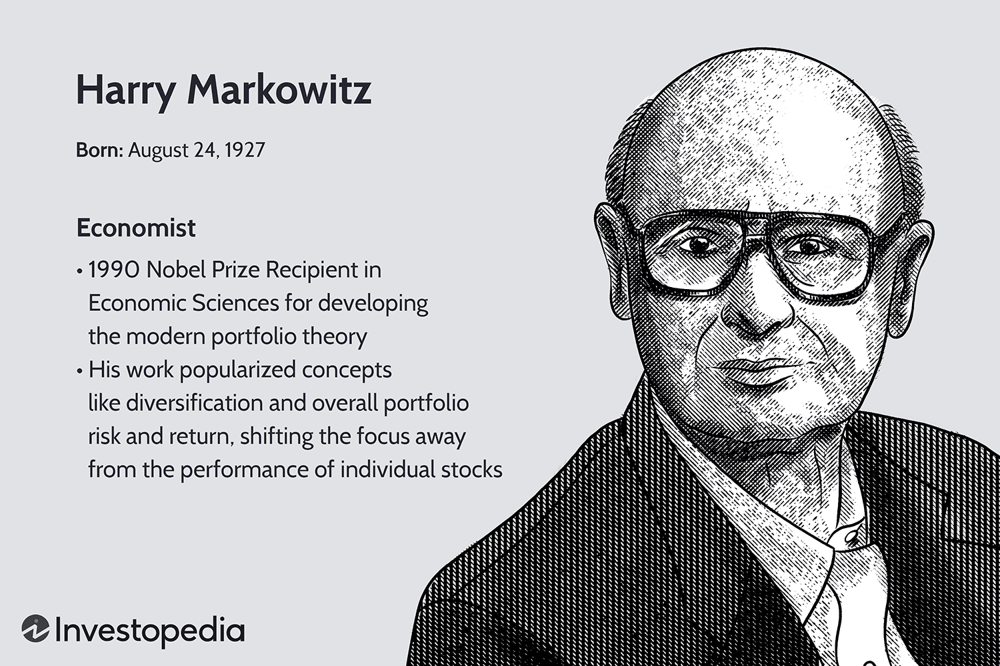

Algorithmic trading refers to the use of computer algorithms to automate the process of trading financial instruments. By employing algorithms, traders can process vast amounts of market data at speeds and efficiencies far beyond human capability. This approach has become increasingly vital as financial markets grow in complexity and volume, allowing for the execution of high-frequency trades and sophisticated strategies that leverage quantitative measures and predictive analytics.

Central to the foundation of algorithmic trading is the incorporation of financial theories that optimize trading strategies. One such seminal input is Harry Markowitz's Modern Portfolio Theory (MPT), introduced in 1952. MPT presents a framework that emphasizes the optimization of an investment portfolio by balancing risk against return. It proposes the diversification of assets to minimize risk while achieving an expected level of return. The concept of the Efficient Frontier, a key component of MPT, illustrates the set of optimal portfolios that offer the highest expected return for a defined level of risk. Mathematically, MPT seeks to maximize the portfolio expected return for a given amount of portfolio risk, or equivalently minimize risk for a given level of expected return, using the formula:



$$

\text{Risk ($\sigma_p$)} = \left( \sum_{i=1}^{N} \sum_{j=1}^{N} w_i w_j \sigma_{ij} \right)^{1/2}
$$

where $w_i$ and $w_j$ represent the weight of asset $i$ and $j$ in the portfolio, and $\sigma_{ij}$ is the covariance between these assets.

The integration of Markowitz's Modern Portfolio Theory into algorithmic trading strategies allows for enhanced portfolio management through the systematic rebalancing of assets. This provides an immediate context in which algorithmic models can dynamically adjust holdings to maintain an optimal risk-return trade-off.

As market dynamics and data proliferation surge, the convergence of MPT with [machine learning](/wiki/machine-learning) represents a frontier in [algorithmic trading](/wiki/algorithmic-trading). The focus of this article is precisely this integration: enhancing MPT principles with machine learning technologies to craft advanced algorithms capable of more robust, predictive, and adaptable trading strategies. Machine learning's capability to process and identify patterns in extensive datasets complements MPT’s quantitative insights, potentially revolutionizing the speed and accuracy of trading decisions. By exploring the intersection of these methodologies, traders and financial engineers can advance towards more sophisticated and intelligent trading systems.

## Table of Contents

## Understanding Modern Portfolio Theory

Modern Portfolio Theory (MPT) is a foundational framework in finance formulated by Harry Markowitz in the early 1950s. It revolutionizes investment strategy by emphasizing the benefits of diversification and the quantification of risk relative to expected return. MPT posits that an investor can construct a portfolio of multiple assets that will maximize returns for a given level of risk, or equivalently minimize risk for a given level of expected return.

**Central Concepts of MPT: Risk, Return, and Diversification**

The theory is built upon several key pillars: risk, return, and diversification. 

- **Return** is the gain or loss an investment generates over a period, typically expressed as a percentage. In MPT, the expected return of a portfolio is a weighted sum of the expected returns of the individual assets. 

- **Risk** is the uncertainty associated with an investment's return, often measured by the standard deviation or variance of returns. MPT primarily examines two types of risk: systematic (market) risk and unsystematic (specific) risk. Diversification reduces unsystematic risk but not systematic risk.

- **Diversification** refers to the practice of spreading investments across various assets to reduce exposure to any single asset or risk. By doing so, investors can achieve a more stable overall return, as errors or downturns in individual investments are mitigated by potentially better performance in others.

**Efficient Frontier and Portfolio Optimization**

One of the core components of MPT is the concept of the Efficient Frontier. This represents the set of optimal portfolios that offer the highest expected return for a given level of risk, or the lowest risk for a given level of return. Portfolios that lie on the Efficient Frontier are considered efficient, as no additional return can be achieved without increasing risk.

Mathematically, MPT leverages quadratic programming to identify these optimal portfolios. For a portfolio with n assets, the expected return $E(R_p)$ is calculated as:

$$
E(R_p) = \sum_{i=1}^{n} w_i E(R_i)
$$

where $w_i$ is the weight of asset $i$ in the portfolio, and $E(R_i)$ is the expected return of asset $i$.

The risk (standard deviation) of the portfolio $\sigma_p$ is given by:

$$
\sigma_p = \sqrt{\sum_{i=1}^{n} \sum_{j=1}^{n} w_i w_j \sigma_{ij}}
$$

where $\sigma_{ij}$ is the covariance between the returns of assets $i$ and $j$.

Investors aim to select portfolios that maximize the Sharpe Ratio, defined as the portfolio's excess return (over the risk-free rate) per unit of risk:

$$
\text{Sharpe Ratio} = \frac{E(R_p) - R_f}{\sigma_p}
$$

where $R_f$ is the risk-free rate. 

By aligning investments along this frontier and considering individual risk tolerance, investors can theoretically achieve the most efficient use of their capital. MPT remains a fundamental approach in portfolio management and continues to influence modern financial strategies.

## The Role of MPT in Algorithmic Trading

Modern Portfolio Theory (MPT), developed by Harry Markowitz in the 1950s, provides a robust framework that can be effectively integrated into algorithmic trading strategies. At its core, MPT revolves around creating portfolios that maximize returns for a given level of risk, leveraging diversification to achieve a more stable investment performance over time. This theoretical foundation is invaluable in the design of trading algorithms, where decisions must be made rapidly and adaptively.

In algorithmic trading, MPT's principles can be applied to develop algorithms that automatically rebalance portfolios to maintain optimal diversification. This process involves continuously adjusting the asset weights in a portfolio to ensure they reflect the desired balance of risk and return. The automatic rebalancing feature of MPT-based algorithms ensures that portfolios remain aligned with investor goals in real-time, reacting to market changes with precision that is difficult to achieve manually.

Mathematical models from MPT are pivotal in creating trading algorithms focused on risk management versus return optimization. The Efficient Frontier, a key concept in MPT, illustrates the set of optimal portfolios that offer the maximum expected return for a defined level of risk. By utilizing this concept, trading algorithms can be programmed to identify portfolios that lie on the Efficient Frontier, thus ensuring the best possible risk-adjusted returns.

Consider the formula for expected portfolio return:

$$

E(R_p) = \sum_{i=1}^{n} w_i E(R_i) 
$$

where $E(R_p)$ is the expected return of the portfolio, $w_i$ represents the weight of each asset, and $E(R_i)$ is the expected return of each individual asset. Similarly, portfolio risk is assessed using the variance-covariance matrix, calculated as:

$$

\sigma^2_p = \sum_{i=1}^{n} \sum_{j=1}^{n} w_i w_j \sigma_{ij} 
$$

where $\sigma^2_p$ denotes the portfolio variance, $\sigma_{ij}$ is the covariance between asset i and asset j. These formulas are embedded within algorithms to evaluate and adjust portfolios continually, ensuring that risk is managed effectively in different market conditions.

In summary, by applying MPT to algorithmic trading, investors can achieve automated, data-driven strategies that not only balance risk and return efficiently but also dynamically adjust to market fluctuations to maximize investment performance.

## Integrating Machine Learning with MPT in Algo Trading

Algorithmic trading traditionally relied on timing and selection methods, which involve predicting the best times to enter or [exit](/wiki/exit-strategy) trades and selecting the optimal assets for investment. These methods often utilized statistical analysis and rule-based systems. However, they are limited in processing and interpreting vast amounts of data simultaneously and adapting to rapidly changing market conditions. This is where machine learning offers significant improvements. 

Machine learning can complement Modern Portfolio Theory (MPT) by analyzing and identifying patterns within large datasets that are beyond human capability or traditional methods. MPT, introduced by Harry Markowitz, is focused on constructing a portfolio that aims to achieve maximum expected return for a given level of risk by means of diversification. However, MPT traditionally does not account for the dynamic nature of markets where data continuously evolves. Machine learning algorithms, such as neural networks, decision trees, and clustering algorithms, can process and learn from this extensive data input, allowing for more adaptive and robust trading strategies.

By integrating machine learning with MPT, predictive accuracy and efficiency of trading strategies are significantly enhanced. Machine learning models can predict asset returns and volatilities better by using historical data to recognize complex patterns and relationships that are not immediately obvious. This prediction capability can feed into MPT's framework to dynamically adjust portfolios, optimizing for a constantly evolving efficient frontier—the set of optimal portfolios offering the highest expected return for a defined level of risk.

For instance, a machine learning model could be trained to forecast future prices based on numerous inputs such as past prices, trading volumes, market news, and economic indicators. Using these predictions, one can calculate expected returns and covariances for different assets, which are fundamental in deriving the weights of a portfolio according to MPT. The integration of these technologies allows for frequent rebalancing of portfolios in alignment with changing predictions, minimizing risk exposure while maximizing returns.

In practice, Python code can be employed to facilitate this integration. Consider using libraries such as TensorFlow for machine learning tasks and NumPy for numerical computations underlining portfolio optimization. Here is a simplified Python example illustrating how one might begin combining these approaches:

```python
import numpy as np
from sklearn.ensemble import RandomForestRegressor

# Example features and labels from historical data
features = np.array([...])  # market indicators
labels = np.array([...])    # asset returns

# Initialize and train a machine learning model
model = RandomForestRegressor(n_estimators=100)
model.fit(features, labels)

# Predict future returns using the trained model
predicted_returns = model.predict(features)

# Calculate expected returns and covariances for MPT
expected_returns = np.mean(predicted_returns, axis=0)
cov_matrix = np.cov(predicted_returns, rowvar=False)

# Use MPT to optimize portfolio
def optimize_portfolio(expected_returns, cov_matrix):
    num_assets = len(expected_returns)
    weights = np.random.random(num_assets)
    weights /= np.sum(weights)
    # Further optimization code would go here
    return weights

optimized_weights = optimize_portfolio(expected_returns, cov_matrix)

print("Optimized Portfolio Weights:", optimized_weights)
```

This simple integration highlights how machine learning can effectively augment MPT by enhancing predictions and enabling more dynamic portfolio management, catering to the nuances of modern financial markets. The synergy between these technologies represents a significant advancement in trading strategy development.

## Case Study: Portfolio Optimization with MPT and Machine Learning

A practical case study was conducted to compare the effectiveness of Modern Portfolio Theory (MPT) with a machine learning-based approach for portfolio optimization. The objective was to evaluate how these methodologies could enhance the ability to assess and mitigate risk while maximizing returns.

### Methodology

**Historical Data Retrieval:** The study utilized a large dataset containing daily stock prices from major global indexes over the last 10 years. The data was sourced from reliable financial databases such as Bloomberg and Yahoo Finance. This historical data was essential for simulating both MPT and machine learning approaches in realistic market conditions.

**Performance Metrics:** The primary metrics used to evaluate the portfolio performance were the Sharpe Ratio, Maximum Drawdown, and Annualized Return. The Sharpe Ratio is used to understand the return of a portfolio relative to its risk. Maximum Drawdown measures the largest drop from a peak to a trough, indicating risk exposure. Annualized Return provides an average return per year, enabling straightforward comparisons.

**Simulations:** For the MPT approach, Markowitz's Efficient Frontier was computed, generating portfolios with the optimal risk-reward trade-off. The machine learning approach employed a neural network trained to predict stock returns. This model aimed to identify patterns and trends that classical statistical models might overlook. Both strategies were tested on the same dataset, ensuring comparable conditions.

### Results and Analysis

**MPT Approach:** The traditional MPT approach successfully optimized portfolios along the Efficient Frontier, demonstrating a solid balance between risk and return. However, it assumed normally distributed returns and relied on historical correlations, which may not always hold true.

**Machine Learning Approach:** The machine learning model showed improved predictive accuracy in non-linear relationships within the data, resulting in portfolios that, in some cases, achieved higher Sharpe Ratios compared to those based solely on MPT. The ability to adapt to changing market conditions dynamically was a notable advantage of the machine learning method. However, it required significant computational resources and was sensitive to overfitting.

**Advantages and Limitations:** Integrating machine learning with MPT provided marked improvements in some portfolios' risk-adjusted returns, illustrating the potential benefits of combining these approaches. However, the machine learning model's complexity and data dependency posed challenges. The traditional MPT approach, with its simplicity and transparency, remained robust, particularly when market conditions aligned with its assumptions.

### Conclusion

This case study highlights the potential of combining machine learning with MPT to optimize portfolio performance. While machine learning offers adaptive and predictive insights, the straightforward elegance of MPT ensures stability and reliability in certain market scenarios. Balancing these methodologies presents a promising avenue for future research in enhancing trading strategies.

## Challenges and Considerations

Integrating Modern Portfolio Theory (MPT) with machine learning in algorithmic trading presents several challenges that need careful consideration. One of the primary issues is computational complexity. MPT involves solving optimization problems that can become computationally intensive, especially as the number of assets in a portfolio increases. Machine learning techniques, particularly [deep learning](/wiki/deep-learning) models, can compound this complexity due to their inherent demands for processing power and large datasets.

Another significant challenge is data quality. Machine learning models are highly sensitive to the quality of data they are trained on. Any noise, missing values, or inaccuracies in financial data can lead to poor model performance and unreliable trading strategies. Thus, ensuring high-quality, clean data is a crucial step in successful integration. It often involves preprocessing steps like normalization, outlier detection, and dealing with missing data.

Algorithm developers must also consider effective blending of MPT and machine learning methodologies. This involves selecting the right machine learning model that complements MPT principles while addressing specific financial market scenarios. Developers need to balance between model complexity and interpretability, as overly complex models may not only be computationally expensive but also difficult to interpret and validate, which is critical in financial decision-making.

Continuous evaluation and adaptation are essential due to rapidly changing market conditions. Financial markets are influenced by a myriad of factors that can evolve unpredictably. As such, trading algorithms need to be flexible enough to adapt to new patterns and trends. This requires ongoing monitoring, [backtesting](/wiki/backtesting), and re-calibration of both the MPT frameworks and machine learning models to ensure they remain aligned with current market dynamics.

Overall, the integration of MPT with machine learning in algorithmic trading holds the potential to revolutionize financial strategies. However, it requires careful handling of computational demands and data integrity, thoughtful blending of techniques, and constant attention to changes in market conditions to achieve the desired outcomes.

## Conclusion

The integration of Harry Markowitz’s Modern Portfolio Theory (MPT) with algorithmic trading and machine learning represents a significant evolution in financial markets. MPT provides a robust framework for optimizing the risk-return trade-off by emphasizing diversification and efficient portfolio allocation. Algorithmic trading enhances this framework by implementing these strategies in an automated and systematic manner, allowing for real-time rebalancing and risk management.

Machine learning further extends the capabilities of traditional MPT, offering tools to analyze vast datasets and uncover hidden patterns, ultimately improving prediction accuracy and operational efficiency. This synergy addresses the limitations of conventional methods, enabling more sophisticated trading strategies.

As financial markets continue to evolve with the advent of AI and big data technologies, the potential to refine and combine Markowitz’s theories with modern innovations is vast. This approach not only supports the development of smarter trading algorithms but also encourages the continuous adaptation necessary in dynamic market environments.

To fully realize the benefits of these advanced methodologies, ongoing research and experimentation are crucial. The challenges, such as computational demands and data integrity, need careful management. There remains significant opportunity for further advancements in the field, with the promise of achieving more robust and responsive trading systems, echoing the foundations laid by MPT while leveraging cutting-edge technological advancements.

## References & Further Reading

[1]: Markowitz, H. (1952). ["Portfolio Selection."](https://onlinelibrary.wiley.com/doi/abs/10.1111/j.1540-6261.1952.tb01525.x) The Journal of Finance, 7(1), 77-91.

[2]: Bodie, Z., Kane, A., & Marcus, A. J. (2020). "Investments." McGraw-Hill Education. 

[3]: Lopez de Prado, M. (2018). ["Advances in Financial Machine Learning."](https://books.google.com/books/about/Advances_in_Financial_Machine_Learning.html?id=oU9KDwAAQBAJ) John Wiley & Sons.

[4]: Jansen, S. (2018). ["Machine Learning for Algorithmic Trading."](https://github.com/stefan-jansen/machine-learning-for-trading) Packt Publishing.

[5]: Chan, E. P. (2009). ["Quantitative Trading: How to Build Your Own Algorithmic Trading Business."](https://github.com/ftvision/quant_trading_echan_book) John Wiley & Sons. 

[6]: Aronson, D. R. (2007). ["Evidence-Based Technical Analysis: Applying the Scientific Method and Statistical Inference to Trading Signals."](https://onlinelibrary.wiley.com/doi/book/10.1002/9781118268315) Wiley.