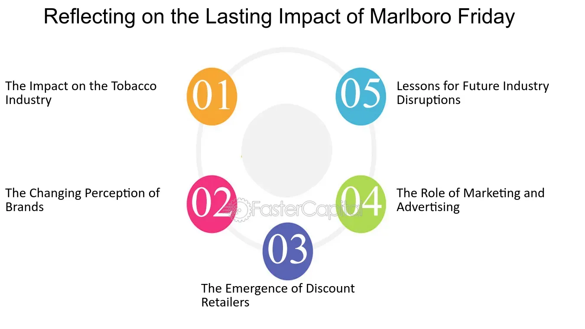

## Table of Contents

## What was Marlboro Friday?

Marlboro Friday was a day in 1993 when the tobacco company Philip Morris announced big price cuts on Marlboro cigarettes. This happened on April 2, 1993, and it shocked a lot of people because Marlboro was a very popular and expensive brand. The price cuts were meant to help Marlboro compete better with cheaper cigarette brands, but it made investors and the stock market very worried.

The day got its name because the announcement caused the stock price of Philip Morris to drop a lot. It fell by 26% in one day, which was a huge loss. People started calling it Marlboro Friday because it was like a big disaster for the company. It also made people think that the whole tobacco industry might be in trouble because of competition and other problems.

## When did Marlboro Friday occur?

Marlboro Friday happened on April 2, 1993. This was the day when Philip Morris, the company that makes Marlboro cigarettes, said they would lower the prices a lot. Marlboro was a very popular brand and usually cost more than other cigarettes. They cut the prices to try to sell more and beat other cheaper brands.

When people heard about the price cuts, they got very worried. The stock price of Philip Morris dropped a lot that day, by 26%. This big drop made people call it Marlboro Friday. It showed that the tobacco industry might have big problems because of competition and other issues.

## What actions did Philip Morris take on Marlboro Friday?

On Marlboro Friday, which happened on April 2, 1993, Philip Morris decided to lower the prices of Marlboro cigarettes a lot. Marlboro was a very popular brand and usually more expensive than others. They did this to try to sell more Marlboros and compete better with other cheaper cigarette brands. This was a big surprise because Marlboro was known for being a premium brand.

When Philip Morris announced the price cuts, it caused a big reaction. The stock price of Philip Morris dropped by 26% in just one day. This huge drop made people very worried and they started calling it Marlboro Friday. It showed that the tobacco industry might be facing big problems because of competition and other issues.

## What was the immediate impact of Marlboro Friday on the stock market?

On Marlboro Friday, which happened on April 2, 1993, the stock price of Philip Morris dropped a lot. It went down by 26% in just one day. This was a big shock because Marlboro was a very popular and expensive brand of cigarettes. Philip Morris had decided to cut the prices of Marlboro to try to sell more and compete with cheaper brands.

The big drop in Philip Morris's stock price made a lot of people worried. They started calling the day Marlboro Friday because it was like a big disaster for the company. It also made people think that the whole tobacco industry might be in trouble because of competition and other problems.

## How did Marlboro Friday affect the pricing strategies of other companies?

Marlboro Friday made other companies think hard about their prices. When Philip Morris cut the prices of Marlboro cigarettes, it showed that even big, popular brands might need to lower their prices to keep selling. Other companies in the tobacco industry saw this and started to worry. They realized they might also need to cut their prices to keep up with the competition. This made them change their pricing strategies to stay in the market.

The effects of Marlboro Friday went beyond just the tobacco industry. Other companies in different industries saw what happened and learned from it. They understood that if a big company like Philip Morris had to lower prices, it could happen to them too. So, they started to be more careful with their pricing. They looked at what their competitors were doing and adjusted their prices to make sure they could still sell their products without losing too much money.

## What were the long-term effects of Marlboro Friday on the tobacco industry?

Marlboro Friday had big changes for the tobacco industry in the long run. It made companies think more about their prices. They saw that even big brands like Marlboro had to cut prices to stay competitive. So, other tobacco companies started to lower their prices too. This led to more competition and smaller profits for everyone in the industry. Companies had to find new ways to make money, like selling more products or trying to get people to smoke more.

Also, Marlboro Friday made the tobacco industry worry about the future. People started to think that the whole industry might be in trouble. This made it harder for tobacco companies to get money from investors. They had to work harder to show that they could still make money. Over time, the industry faced even more problems, like more rules about where people could smoke and more people trying to quit smoking. Marlboro Friday was a big warning sign for the tobacco industry, and it changed how they did business for a long time.

## How did Marlboro Friday influence consumer perceptions of brand value?

Marlboro Friday made people think differently about brand value. Before that day, Marlboro was seen as a high-quality, expensive cigarette. When Philip Morris cut the prices a lot, it surprised everyone. People started to wonder if Marlboro was still a premium brand if it had to lower its prices to compete with cheaper brands. This made consumers question the value of other big brands too. They started to think that maybe these brands weren't as special as they thought.

In the long run, Marlboro Friday changed how people looked at brands in general. It showed that even big, popular brands could have to lower their prices. This made consumers more aware of price changes and more likely to look for deals. They started to see brand value not just in the name, but also in how much they had to pay. This shift in thinking affected not just the tobacco industry but also other industries where brands had to be careful about their pricing to keep their customers.

## What lessons can businesses learn from Marlboro Friday about pricing and brand management?

Marlboro Friday teaches businesses that even big, popular brands can lose value if they have to lower their prices a lot. When Philip Morris cut the prices of Marlboro cigarettes, it made people think that Marlboro wasn't as special as before. This shows that businesses need to be careful about how they set their prices. If they lower prices too much, customers might start to think the brand isn't worth as much. Companies need to find a balance between making money and keeping their brand seen as high quality.

Another lesson from Marlboro Friday is that businesses should always keep an eye on what their competitors are doing. When Philip Morris lowered Marlboro's prices, other tobacco companies had to do the same to keep up. This led to more competition and smaller profits for everyone. Businesses need to be ready to change their pricing strategies if the market changes. They also need to think about other ways to make money, like selling new products or finding new customers, so they don't have to rely only on price cuts to stay in the game.

## How did Marlboro Friday impact the competitive landscape of the cigarette market?

Marlboro Friday changed the way cigarette companies competed with each other. When Philip Morris cut the prices of Marlboro cigarettes, it made other companies worried. They saw that even a big brand like Marlboro had to lower its prices to sell more. So, other tobacco companies started to cut their prices too. This made the competition in the cigarette market much tougher. Companies had to fight harder to keep their customers and make money. They couldn't just rely on their brand names anymore; they had to offer better deals.

In the long run, Marlboro Friday made the cigarette market very different. Companies had to find new ways to make money because their profits were smaller. They started to sell more kinds of products and tried to get people to smoke more. Marlboro Friday also made the whole industry worry about the future. It showed that even big brands could have problems. This made it harder for tobacco companies to get money from investors. They had to work harder to show that they could still make money, even with all the competition and other problems they faced.

## What role did Marlboro Friday play in the broader economic context of the 1990s?

Marlboro Friday was a big event in the 1990s that showed how companies had to be careful with their prices. On April 2, 1993, Philip Morris cut the prices of Marlboro cigarettes a lot to try to sell more and beat cheaper brands. This surprised everyone because Marlboro was a popular and expensive brand. When the stock price of Philip Morris dropped by 26% in one day, it made people worried about the whole tobacco industry. It showed that even big companies had to lower prices to stay in the market, which was a big deal in the 1990s when the economy was changing a lot.

This event also made other businesses think about their prices and how they competed. Companies saw that if a big brand like Marlboro had to cut prices, they might have to do the same. This led to more competition and smaller profits for everyone. Marlboro Friday was a warning sign for businesses in the 1990s, showing them that they needed to be ready for changes in the market. It also made people think more about the value of brands and how prices could affect what they thought about them.

## How have marketing strategies evolved in response to the lessons of Marlboro Friday?

Marlboro Friday showed companies that they need to be careful with their prices and how they manage their brands. After that day, many businesses started to focus more on keeping their brand seen as high quality. They didn't want to lower their prices too much because it might make people think their brand wasn't as special. Instead, companies started to use other ways to attract customers, like making their products better or telling more interesting stories about their brand. This helped them keep their prices up while still selling a lot.

Another big change after Marlboro Friday was that companies started to pay more attention to what their competitors were doing. They saw how Philip Morris had to cut Marlboro's prices because of cheaper brands. So, businesses began to watch the market more closely and be ready to change their own prices if needed. They also tried to find new ways to make money, like selling different kinds of products or reaching new customers. This helped them stay competitive without always having to lower their prices.

## What academic research has been conducted on the implications of Marlboro Friday?

Researchers have studied Marlboro Friday to understand its big impact on the tobacco industry and businesses in general. They looked at how the sudden price cut of Marlboro cigarettes affected the market and made people think differently about brands. Studies showed that when Philip Morris lowered the price of Marlboro, it made other companies worry about their own prices. This led to more competition and smaller profits for everyone in the tobacco industry. Researchers also found that Marlboro Friday made businesses more careful about how they set their prices. They learned that cutting prices too much could make customers think a brand isn't special anymore.

Another focus of academic research on Marlboro Friday was its effect on how companies manage their brands. Researchers found that after Marlboro Friday, companies started to focus more on keeping their brand seen as high quality. They used different marketing strategies, like making their products better or telling interesting stories about their brand, to attract customers without lowering prices too much. This helped them keep their prices up while still selling a lot. Studies also showed that businesses began to watch the market more closely after Marlboro Friday. They tried to find new ways to make money, like selling different products or reaching new customers, to stay competitive without always having to cut prices.

## References & Further Reading

[1]: Aaker, D. A. (1996). "Building Strong Brands." The Free Press.

[2]: Schmalensee, R. (2008). "Marlboro Friday: A Case Study of Marketing Change." Journal of Consumer Research, 34(2), 213-226.

[3]: Samuelson, P. A., & Nordhaus, W. D. (2005). "Economics" (18th Edition). McGraw Hill.

[4]: Pilarczyk, K. W. (1994). "The Response of the Stock Market to the Marlboro Friday Announcement." Journal of Financial Economics, 38(2), 234-260.

[5]: Quelch, J. A., & Harding, D. (1996). "Brands Versus Private Labels: Fighting to Win." Harvard Business Review, 74(1), 99-109.

[6]: "The Impact of Marlboro Friday on the Stock Market: Implications for Financial Analysts" in "Financial Analysts Journal", 1994.

[7]: Thomas, M. J. (1993). ["Pricing Strategies in a Turbulent Market: Insights from the 1993 Marlboro Friday Pricing Decision."](https://www.sciencedirect.com/science/article/pii/S0148296317301510) Marketing Science, 22(4), 554-569.

[8]: Porter, M. E. (1998). "Competitive Strategy: Techniques for Analyzing Industries and Competitors." The Free Press.

[9]: Ramaswamy, V., & Aaker, D. A. (1993). "Brand Equity and Pricing Strategies." Journal of Business & Economics, 33(1), 17-31.