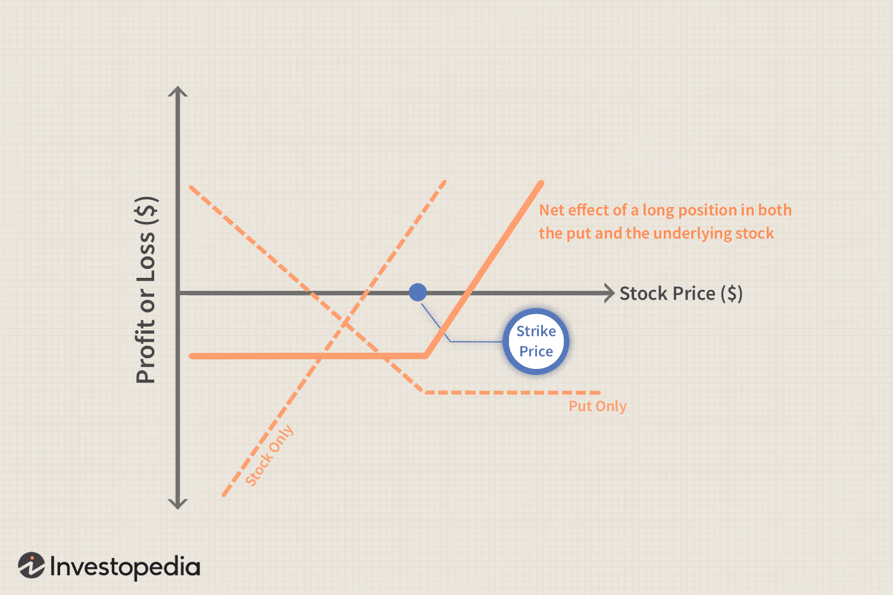

## Table of Contents

## What is a Married Put Strategy?

A Married Put Strategy is a way to invest in stocks while also protecting yourself from big losses. When you use this strategy, you buy a stock and at the same time, you buy a put option for that stock. A put option gives you the right to sell the stock at a certain price, called the strike price, before the option expires. This can help limit how much money you could lose if the stock's price goes down a lot.

For example, let's say you buy a stock for $50 and also buy a put option with a strike price of $45. If the stock's price drops below $45, you can use the put option to sell the stock for $45, even if the market price is lower. This way, the most you would lose is the difference between what you paid for the stock ($50) and the strike price ($45), plus the cost of the put option. This strategy can be useful if you think the stock might go up but you want to be safe just in case it goes down.

## How does a Married Put Strategy work?

A Married Put Strategy is like buying insurance for a stock you own. When you use this strategy, you buy a stock and at the same time, you buy a put option for that stock. A put option is like a safety net that gives you the right to sell the stock at a specific price, called the strike price, before the option expires. This can help protect you from big losses if the stock's price drops a lot.

For example, imagine you buy a stock for $50 and also buy a put option with a strike price of $45. If the stock's price falls below $45, you can use the put option to sell the stock for $45, even if the market price is lower. This means the most you would lose is the difference between what you paid for the stock ($50) and the strike price ($45), plus the cost of the put option. This strategy is useful if you think the stock might go up but you want to be safe just in case it goes down.

## What are the key components of a Married Put Strategy?

The main parts of a Married Put Strategy are buying a stock and buying a put option at the same time. The stock is what you think might go up in value, and the put option is like insurance that protects you if the stock's price goes down. When you buy the put option, you pick a strike price, which is the price you can sell the stock for if you need to.

The put option has an expiration date, which means you have to use it before that date or it becomes worthless. The cost of the put option is called the premium, and it's what you pay to have this protection. If the stock's price stays above the strike price, you don't need to use the put option and you can keep the stock or sell it at a profit. But if the stock's price drops below the strike price, you can use the put option to sell the stock at the strike price, limiting your losses.

## What are the benefits of using a Married Put Strategy?

Using a Married Put Strategy can help you feel safer when you invest in stocks. When you buy a stock and a put option at the same time, you are protecting yourself from big losses. If the stock's price goes down a lot, the put option lets you sell the stock at a higher price than the market price. This means the most you can lose is the difference between what you paid for the stock and the strike price of the put option, plus the cost of the put option itself. This can give you peace of mind, knowing you have a safety net.

Another benefit is that you can still make money if the stock's price goes up. You get to keep the stock and any profits it makes above the price you paid for it. The put option is like insurance, so you only use it if you need to. If the stock does well, you don't have to use the put option, and you can enjoy the gains from the stock. This way, you can try to grow your money while still having protection in case things don't go as planned.

## What are the potential risks and drawbacks of a Married Put Strategy?

Using a Married Put Strategy means you have to pay for the put option, which is like an insurance premium. This cost can lower your overall profits if the stock does well. For example, if you buy a stock for $50 and a put option for $2, you need the stock to go up more than $2 just to break even on the put option cost. So, even if the stock goes up, you might not make as much money as you would without the put option.

Another risk is that the put option has an expiration date. If the stock's price drops after the put option expires, you won't be protected anymore. You'd have to buy another put option, which costs more money. This means you need to keep an eye on the stock and the put option, deciding when to buy new options or when to let them expire.

Also, if the stock's price stays the same or only goes up a little, the put option might not be worth the cost. You're paying for protection you don't need, which can feel like a waste of money. It's important to think about how likely the stock is to go down and if the cost of the put option is worth it for the protection it gives.

## How does a Married Put Strategy differ from other options strategies?

A Married Put Strategy is different from other options strategies because it's all about protection. When you use this strategy, you buy a stock and a put option at the same time. The put option acts like insurance, letting you sell the stock at a set price if it goes down a lot. This means you can still try to make money if the stock goes up, but you have a safety net if things go wrong. Other strategies might focus more on making money from the options themselves, like selling options or using combinations of calls and puts to bet on the stock's price moving in certain ways.

Another way a Married Put Strategy differs is that it's simpler and more straightforward than some other strategies. For example, a Covered Call Strategy involves buying a stock and selling a call option, hoping to make extra money from the option's premium. But this strategy can limit your gains if the stock's price goes up a lot. A Married Put Strategy, on the other hand, doesn't limit your potential gains; it just protects your downside. Strategies like Straddles or Strangles, which use both call and put options, are more complex and are used when you think the stock's price will move a lot but you're not sure which way. A Married Put Strategy is easier to understand and manage because it's focused on one goal: protecting your investment.

## What are the steps to implement a Married Put Strategy?

To start using a Married Put Strategy, first you need to pick a stock that you think might go up in value. Once you've chosen your stock, you buy it at the current market price. At the same time, you need to buy a put option for that stock. A put option gives you the right to sell the stock at a certain price, called the strike price, before the option expires. You need to decide on the strike price and the expiration date of the put option. The strike price should be lower than the price you paid for the stock, and the expiration date should be far enough in the future to give you enough time to see if the stock's price goes up or down.

After you've bought the stock and the put option, you need to keep an eye on the stock's price. If the stock's price goes up, you can keep the stock and enjoy any profits it makes. You don't have to use the put option if the stock does well. But if the stock's price drops below the strike price of the put option, you can use the put option to sell the stock at the strike price, even if the market price is lower. This limits your losses to the difference between what you paid for the stock and the strike price, plus the cost of the put option. Remember, the put option has an expiration date, so if the stock's price drops after the option expires, you won't be protected anymore. You might need to buy another put option if you want to keep the protection going.

## How can one determine the right time to use a Married Put Strategy?

You might want to use a Married Put Strategy when you're thinking about buying a stock but you're worried it might go down in value. This strategy is good if you believe the stock has a chance to go up, but you want to be safe just in case it doesn't. It's like buying insurance for your stock. If you're not sure about the stock's future but you still want to invest, a Married Put Strategy can give you peace of mind. It's especially useful during times when the market might be shaky or if there's news that could affect the stock's price.

The best time to use this strategy is when you think the stock could go up but you want protection against big drops. For example, if you're buying a stock before a big company announcement or earnings report, a Married Put can protect you if the news is bad. Also, if you see that the stock market is going through a rough patch, using a Married Put Strategy can help you feel more secure about your investment. Just remember, you have to pay for the put option, so think about whether the cost is worth the protection it gives you.

## What are the tax implications of using a Married Put Strategy?

Using a Married Put Strategy can affect your taxes in a few ways. When you buy a stock and a put option at the same time, the put option is seen as a hedge, not a separate investment. This means that if you sell the stock at a profit, you'll have to pay capital gains tax on that profit. The cost of the put option can be used to reduce the amount of profit you made from the stock, which might lower your tax bill a bit. But if you use the put option to sell the stock at a loss, you can use that loss to offset other gains you might have made, which can help reduce your taxes.

It's also important to know that the tax treatment can change depending on how long you hold the stock and the put option. If you hold the stock for more than a year before selling it, any profit you make might be taxed at the lower long-term capital gains rate. But if you hold it for less than a year, it's taxed at the higher short-term capital gains rate, which is the same as your regular income tax rate. The put option itself is usually treated as a short-term capital gain or loss, no matter how long you hold it. Always talk to a tax professional to make sure you understand how a Married Put Strategy will affect your taxes.

## How can the effectiveness of a Married Put Strategy be measured?

The effectiveness of a Married Put Strategy can be measured by looking at how well it protects your investment and how it affects your potential profits. If the stock's price goes down a lot, the put option lets you sell the stock at a higher price than the market price. This means you lose less money than you would if you didn't have the put option. To see if the strategy worked, you can compare the money you lost with the put option to the money you would have lost without it. If the put option saved you more money than it cost, then it was effective.

On the other hand, you also need to think about how the put option affects your profits if the stock's price goes up. The cost of the put option can lower your overall profits because you have to pay for it. To measure the effectiveness in this case, you can look at the stock's price increase and subtract the cost of the put option. If the stock's price goes up enough to cover the cost of the put option and still give you a good profit, then the strategy was worth it. But if the stock's price doesn't go up much, the put option might not be worth the cost, and the strategy might not be as effective.

## What advanced techniques can be used to optimize a Married Put Strategy?

To make a Married Put Strategy work better, you can try adjusting the strike price and expiration date of the put option. If you think the stock might go down a little but not a lot, you can choose a strike price that's closer to the stock's current price. This makes the put option cheaper, so you don't have to pay as much for protection. You can also pick an expiration date that's further away if you want the protection to last longer. This gives you more time to see if the stock goes up or down, but it also makes the put option more expensive. By playing around with these choices, you can find a balance that fits your needs and budget.

Another way to optimize a Married Put Strategy is to use it as part of a bigger plan. For example, you can use the strategy for part of your stock holdings and leave the rest unprotected. This way, you can still try to make money from the unprotected stocks if they go up, while keeping some of your investment safe. You can also keep an eye on the stock's price and the put option's value, and sell the put option if it becomes more valuable. This can help you make some money back from the cost of the put option. By thinking about how the Married Put Strategy fits into your overall investment plan, you can use it more effectively.

## Can you provide a case study or example of a successful Married Put Strategy?

Imagine you bought 100 shares of a tech company's stock at $50 per share because you thought it had a good future. But you were a bit worried about the stock market being shaky, so you also bought a put option with a strike price of $45 and an expiration date three months away. The put option cost you $2 per share, so you paid $200 for it. A few weeks later, bad news came out about the company, and the stock's price dropped to $40. You used your put option to sell the stock at $45 per share, even though the market price was lower. This meant you lost $5 per share on the stock ($50 - $45) plus the $2 per share you paid for the put option, so your total loss was $7 per share, or $700 total. Without the put option, you would have lost $10 per share, or $1,000 total. The put option saved you $300.

After selling the stock at $45, you decided to wait and see what happened next. A month later, the company released a new product that did really well, and the stock's price went back up to $55. You bought the stock again at $55 per share, and this time you didn't buy a put option because you felt more confident about the company's future. Over the next few months, the stock's price kept going up, and you sold it at $60 per share. You made a profit of $5 per share ($60 - $55), or $500 total. Even though you lost $700 the first time, the put option helped you limit your losses. And by buying the stock again when it was doing better, you were able to make some of that money back. This shows how a Married Put Strategy can help you protect your investment and still try to make money when the time is right.

## What is a Practical Example of a Married Put?

A married put strategy involves buying a stock and a corresponding at-the-money put option. This setup acts as a hedge, limiting potential losses while allowing for profit if the stock price rises. To illustrate, let's consider a practical example involving a technology company, TechCorp.

### Background
Suppose TechCorp's stock is currently trading at $100. As an investor, you purchase 100 shares, totaling $10,000. To protect your investment, you decide to buy a put option with a strike price of $100, set to expire in three months. The premium for this put option is $3 per share, or $300 total (100 shares x $3).

### Cost Calculation
Your total initial investment will be the cost of the shares plus the cost of the put option:

$$
\text{Total Cost} = (\text{Stock Price} \times \text{Number of Shares}) + (\text{Put Premium} \times \text{Number of Shares})
$$

$$
\text{Total Cost} = (100 \times 100) + (3 \times 100) = \$10,300
$$

### Potential Outcomes

1. **Stock Price Rises:** If TechCorp's stock price increases to $120 by the expiration date, the put option will expire worthless. However, you benefit from the increase in the stock value. Your profit can be calculated as:

   \[ \text{Profit} = (\text{Final Stock Price} - \text{Purchase Price} - \text{Put Premium}) \times \text{Number of Shares}
$$

   \[ \text{Profit} = (120 - 100 - 3) \times 100 = \$1,700
$$

2. **Stock Price Falls:** Suppose the stock price falls to $85. You can exercise the put option to sell your shares at the strike price of $100, limiting your loss. The loss calculation is:

   \[ \text{Loss} = (\text{Purchase Price} - \text{Strike Price} + \text{Put Premium}) \times \text{Number of Shares}
$$

   \[ \text{Loss} = (100 - 100 + 3) \times 100 = \$300
$$

   The put effectively caps your downside risk to the put premium paid.

### Breakeven Analysis
The breakeven stock price for this married put strategy is the sum of the initial stock purchase price and the put premium paid. Therefore, TechCorp's stock must rise to at least:

$$
\text{Breakeven Price} = \text{Stock Purchase Price} + \text{Put Premium}
$$

$$
\text{Breakeven Price} = 100 + 3 = \$103
$$

For the strategy to be profitable at expiration, TechCorp's stock price must exceed $103.

### Real Market Impact

This example underscores how the married put strategy provides insurance against significant declines in stock value, while allowing for profit if the stock appreciates. It is particularly useful in volatile markets where the likelihood of price swings is high. By analyzing costs, potential profits, and losses, investors can better understand the risk-return profile of implementing a married put strategy in live markets.

## References & Further Reading

[1]: Cottle, S., Murray, R. D., & Block, F. E. (1988). ["Graham and Dodd's Security Analysis"](https://www.amazon.com/Graham-Dodds-Security-Analysis-Fifth/dp/0070132372). McGraw-Hill.

[2]: Hull, J. C. (2017). ["Options, Futures, and Other Derivatives"](https://www.semanticscholar.org/paper/Options%2C-Futures%2C-and-Other-Derivatives-Hull/89bdee500c8623864fc9eb7a471546aa713acc44). Pearson.

[3]: Natenberg, S. (1994). ["Option Volatility and Pricing: Advanced Trading Strategies and Techniques"](https://www.amazon.com/Option-Volatility-Pricing-Strategies-Techniques/dp/0071818774). McGraw-Hill.

[4]: Mack, A., & Burnell, J. (2019). ["Married Put Strategy: A Detailed Guide to Trading"](https://www.reddit.com/r/Daytrading/comments/c8bb7b/macks_price_action_trading_system_viability/). ResearchGate.

[5]: Clark, K. (2021). ["Guide to Algorithmic Trading"](https://www.amazon.com/Algorithmic-Trading-Beginners-Fundamentals-Strategies/dp/1080981101). Investopedia.