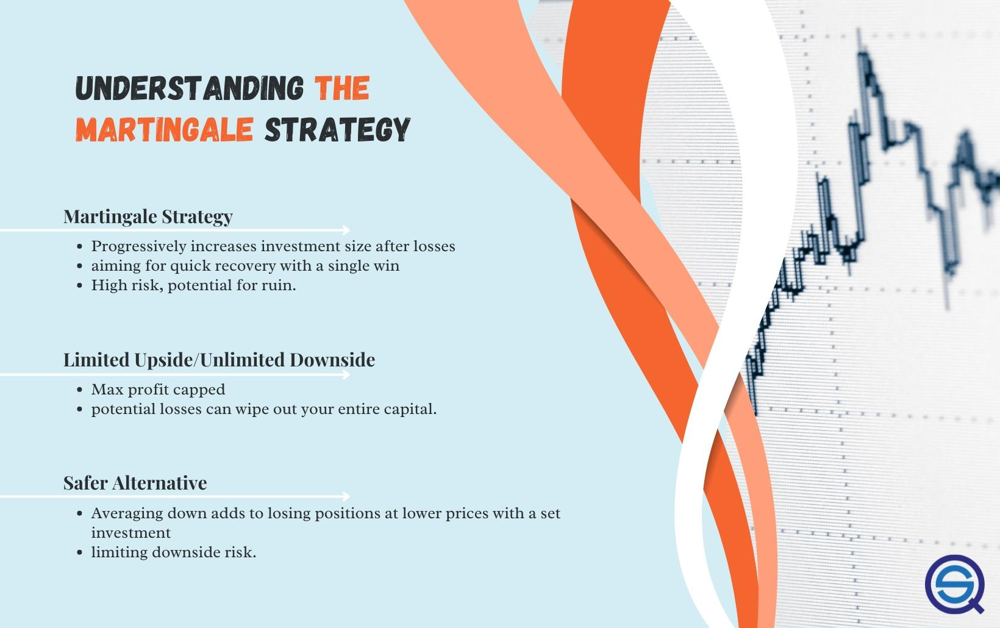

The Martingale strategy, with its roots tracing back to the 18th century, has established itself as a significant trading technique, particularly within the forex market. Originating from a fundamental concept in probability theory, the Martingale strategy seeks to recover losses by doubling the stake on losing trades until a winning outcome occurs. This systematic approach is built on the premise that a sequence of losses will eventually be overturned by a win, thus recouping all previous losses and generating a profit equivalent to the initial stake.

Applied to forex algorithmic trading, the strategy offers a structured method for managing trades, emphasizing potential recovery and profit within specific market conditions. It integrates with automated systems, enabling precise execution of trades according to predefined criteria. The application of the Martingale strategy in this context presents both opportunities and challenges, given the dynamic nature of forex markets.



This article examines the foundational aspects of the Martingale strategy in forex algo trading, assessing its potential advantages and inherent risks. Key practical considerations for traders utilizing this strategy are discussed to provide a comprehensive understanding. Moreover, the article introduces the anti-Martingale method, a strategic variation where traders increase their stake following a successful trade, contrary to the Martingale approach. This variation can capitalize on favorable market movements while reducing the risk associated with continuous doubling during downturns.

Understanding these strategies equips traders with critical insights necessary for informed decision-making in forex trading, considering both the potential for high returns and the significant risk exposure. Such knowledge is vital to strategically navigate the complexities of the forex market and manage financial exposure effectively.

## Table of Contents

## What is the Martingale Strategy?

The Martingale strategy is a financial strategy that involves doubling an investment after each losing trade in order to recover all previous losses and secure a profit once a successful trade is achieved. The strategy has its roots in probability theory and was introduced by the French mathematician Paul Pierre Lévy. It was further examined and developed by American mathematician Joseph Leo Doob, who studied its properties and effects.

Originally applied in gambling, the principle of the Martingale strategy is based on "doubling down" until a win occurs, thereby resetting the sequence of bets. The underlying assumption is that a win is inevitable if one has an infinite amount of capital. In the context of forex trading, this strategy is used to manage positions by lowering the average entry price of trades. By doing so, traders aim for a quicker recovery from losses on the assumption that market trends will eventually reverse in their favor.

However, the strategy carries significant risks. It assumes that traders have access to limitless capital, which is unrealistic for most, and that markets will always eventually cycle back, which may not occur in strongly trending markets. A series of consecutive losses can lead to exponential growth in the required investment, significantly increasing the risk of capital depletion. To illustrate, consider a simple example using Python to model potential outcomes:

```python
def martingale_strategy(initial_bet, bankroll, loss_streak):
    current_bet = initial_bet
    total_loss = 0

    for _ in range(loss_streak):
        total_loss += current_bet
        if total_loss > bankroll:
            return "Bankrupt"  # Exceeded available bankroll
        current_bet *= 2

    return total_loss + current_bet  # Total needed for next win to recover losses

initial_bet = 10  # Initial bet size
bankroll = 1000  # Total available capital
loss_streak = 5  # Number of consecutive losses

result = martingale_strategy(initial_bet, bankroll, loss_streak)
```

In this example, should the consecutive losses persist, the strategy would require an exponentially increasing commitment from the trader, risking significant capital loss. Consequently, this approach requires careful consideration of both capital limits and market conditions. While the potential for reversing losses quickly might appear appealing, the Martingale strategy is not without its perils, particularly during extended losing streaks, underscoring the necessity for cautious application.

## Forex Trading Example

Forex traders often employ the Martingale strategy to manage risk by increasing their position size in the event of a loss. The basic principle involves doubling the trade size after each losing trade until a winning trade offsets the accumulated losses. For example, consider a trader who initiates a trade with one lot of EUR/USD. Should the market move unfavorably, the trader doubles the position to two lots on the subsequent trade. This practice continues, doubling the position size each time the market moves against them, until a trade results in a profit.

This strategy can effectively lower the average entry price, which is the weighted average price of all entries. This calculation is critical, as it can facilitate breakeven or profitability faster once the market reverses. Mathematically, if $P_n$ denotes the price of the $n^{th}$ trade, and $W_n$ denotes the weight or lot size of that trade, the average entry price is given by:

$$
\text{Average Entry Price} = \frac{\sum_{i=1}^{n} W_i \cdot P_i}{\sum_{i=1}^{n} W_i}
$$

In the Martingale strategy, with each successive trade, $W_i$ doubles, thus lowering the average entry price when the market eventually rebounds.

However, a major caveat of employing the Martingale strategy is the necessity for substantial capital reserves. The exponential growth in position sizing can rapidly escalate the required investment, posing significant risks of capital depletion during extended losing streaks. For example, an initial position of one lot that increases to 32 lots over five losing trades demands significant investment. An inherent risk arises as traders may exhaust their financial resources before a market turnaround occurs, potentially leading to total loss of invested capital.

This underscores the importance of prudent capital management when implementing the Martingale strategy. Forex traders must ensure they possess adequate funds to sustain multiple iterations of increased trades. Furthermore, setting predetermined limits on trade exposure can mitigate severe financial repercussions, allowing traders to strategically [exit](/wiki/exit-strategy) positions and re-evaluate their approach. In sum, while the Martingale strategy offers potential quick recovery of losses, it requires careful consideration of capital allocation and market trends, emphasizing the overarching necessity for disciplined financial management.

## Advantages and Risks of the Martingale Strategy

The Martingale strategy in [forex](/wiki/forex-system) trading offers distinct advantages but also carries significant risks. One primary advantage is its potential to quickly recover losses and potentially generate profits, particularly in ranging or sideways markets. This is because the strategy aims to lower the average entry price by doubling the investment size after each loss, thereby requiring fewer winning trades to offset prior losses. This systematic approach can be particularly effective in markets that are trending sideways because currency pairs within such markets tend to fluctuate within predictable boundaries.

Forex trading presents unique benefits for the Martingale strategy. Unlike stocks, currencies are unlikely to fall to zero, providing an inherent stability not found in equity markets. Furthermore, traders might benefit from interest income accruing on the currency positions they hold, potentially offsetting part of the losses sustained during the prolonged execution of the strategy.

However, the Martingale strategy is inherently risky due to its requirement for potentially unlimited capital. The continuous doubling of investment following losses can rapidly deplete a trader's funds. In markets experiencing strong directional trends against the trader’s positions, the risk escalates significantly. The compounding nature of the Martingale strategy can lead to enormous positions that amplify losses, potentially resulting in bankruptcy if the market does not reverse in time.

To mitigate the risks associated with the Martingale strategy, traders must possess a deep understanding of market conditions. Setting clear limits on trade exposure is essential. This includes establishing maximum allowable losses and using stop-loss orders or other risk management techniques to prevent excessive capital depletion. 

Ultimately, while the Martingale strategy can be attractive for its promise of profit recovery, its application requires diligent risk management and careful capital allocation. Traders should continuously assess their risk tolerance and financial capacity to endure potential losses, thus ensuring the strategy can be a sustainable part of their broader forex trading approach.

## Why the Martingale Strategy is Popular in Forex Trading

Forex trading attracts many traders due to its inherent characteristics, which make it a fertile ground for the application of the Martingale strategy. One of the primary reasons for its popularity is the availability of leverage, which allows traders to control larger positions with a relatively small amount of capital. This facilitates the execution of the Martingale strategy, as traders can enlarge their positions by doubling down on losses without requiring proportionately large amounts of upfront capital. However, this also amplifies the potential risks, as losses can quickly accumulate.

Moreover, currency pairs often demonstrate range-bound behavior, making Martingale an attractive option for traders seeking to benefit from these fluctuations. Historically, such pairs have exhibited a tendency to revert to mean values, thus providing traders with the opportunity to anticipate price corrections and apply the Martingale strategy effectively. This context of mean reversion is particularly advantageous when the market lacks significant trends or shows neutral sentiment.

Interest rate differentials also contribute to the appeal of the Martingale strategy in forex trading. Traders may simultaneously engage in [carry](/wiki/carry-trading) trades, where they profit from differences in interest rates between two currencies. By incorporating the Martingale approach, traders can potentially offset currency rate risks through gains in interest rates, effectively cushioning their overall position.

The allure of potentially consistent returns lures many traders to consider the Martingale strategy. The notion is appealing: a structured method to ride out [volatility](/wiki/volatility-trading-strategies) and capitalize on market disparities. This appeal grows stronger for those with substantial capital reserves, as they possess the financial ability to endure prolonged losing streaks before a successful trade occurs. However, the strategy demands a meticulous approach to risk management, acknowledging the potential for significant losses.

Successful application of the Martingale strategy requires an astute comprehension of forex market dynamics, careful capital allocation, and stringent risk management guidelines. Traders must balance the strategy's promises of profitability against the peril it poses, always ensuring they do not exceed their capital limits. Ultimately, for those who can navigate its demands, the Martingale strategy represents a fascinating approach to forex trading, promising reward but not without risk.

## Exploring the Anti-Martingale Method

The anti-Martingale strategy is an adaptation of the traditional Martingale approach that offers a different risk profile. Instead of increasing trade sizes after a loss, the anti-Martingale method involves escalating positions following a win. This method leverages the concept of capitalizing on favorable trends and extends gains when trades are successful.

By employing this strategy, traders aim to maximize gains during expansive growth phases of the market. The logic is that winning trades suggest a persistently favorable market condition that can be further exploited. For instance, if a trader starts with an initial position size of one lot and encounters a successful trade, they might increase their position size to two lots on the next trade, continuing to adjust upwards with successive wins. 

One distinct advantage of the anti-Martingale strategy is its ability to mitigate the risk associated with continuous capital injections during losing streaks. In essence, traders only allocate additional capital when the market conditions appear favorable, thereby preserving capital during downturns. This contrasts sharply with the traditional Martingale strategy, which requires substantial capital reserves to sustain doubled positions in adverse market conditions.

Traders must, however, be vigilant in monitoring market trends. Successfully implementing the anti-Martingale method requires an acute awareness of market volatility and the ability to predict when growth phases might ebb. High volatility periods represent significant opportunities for this strategy, as they allow positions to expand rapidly with the market movement.

Despite its potential, this approach demands a thorough comprehension of market cycles to time entries and exits effectively. It is better suited for traders who have a robust understanding of market dynamics and can adapt quickly to changing market conditions. Employing tools such as technical analyses and trend indicators can support the decision-making process, helping traders determine optimal points for altering trade sizes.

Overall, while the anti-Martingale strategy can be lucrative, traders must balance the potential rewards with the inherent risks involved, ensuring that their financial resources can endure periods of high risk associated with increased trade sizes during winning streaks.

## The Bottom Line

The Martingale strategy presents a clearly defined methodology for traders aiming to recoup losses in forex markets; however, it encompasses a significant degree of risk. It does not guarantee profit and should be approached with caution, particularly by those who lack extensive trading experience. One primary consideration is the necessity of establishing firm financial boundaries. Without explicit limits on trade size or loss thresholds, the probability of experiencing devastating financial loss escalates dramatically, especially in scenarios where market conditions do not favor rapid reversals.

Comprehending prevailing market conditions is equally vital—certain market environments, such as trending markets, can amplify risks, while range-bound or mean-reverting markets offer more conducive conditions for this strategy. Integrating the Martingale strategy with other risk management practices can mitigate some potential pitfalls. Strategies such as setting stop-loss orders or incorporating diverse trading techniques may help safeguard against excessive capital erosion.

For traders with substantial financial resources, the Martingale approach might contribute constructively to a more extensive trading strategy. In particular, scenarios where currency pairs exhibit strong tendencies to revert to the mean could provide lucrative opportunities. Nevertheless, prudence is essential, and traders must evaluate their risk tolerance and capital limits comprehensively. Balancing potential returns against the inherent risks of the Martingale or its variant, the anti-Martingale strategy, is crucial before deciding on implementation. In doing so, traders position themselves to make sound decisions that align with their broader financial goals and risk profiles.

## References & Further Reading

[1]: "The Random Character of Stock Market Prices" by Paul Cootner - This book discusses the foundational aspects of financial markets and includes perspectives on strategies similar to the Martingale.

[2]: Doob, J.L. (1953). ["Stochastic Processes"](https://books.google.com/books/about/Stochastic_Processes.html?id=KvJQAAAAMAAJ) - A foundational text on probability theory, relevant for understanding the mathematical basis of the Martingale strategy.

[3]: ["A Non-Random Walk Down Wall Street"](https://www.jstor.org/stable/j.ctt7tccx) by Andrew W. Lo and A. Craig MacKinlay - This book offers insights into the behavior of financial markets, which is essential for strategies like Martingale.

[4]: Pardo, R. (2011). ["The Evaluation and Optimization of Trading Strategies"](https://books.google.com/books/about/The_Evaluation_and_Optimization_of_Tradi.html?id=FXXOvV57mKcC) - Discusses methods for developing and testing trading strategies, including risk management considerations.

[5]: Tharp, V.K. (2008). ["Trade Your Way to Financial Freedom"](https://www.amazon.com/Trade-Your-Way-Financial-Freedom/dp/007147871X) - Covers various trading strategies including risk management and system design, relevant for traders considering the Martingale approach.

[6]: Taleb, N.N. (2001). ["Fooled by Randomness: The Hidden Role of Chance in Life and in the Markets"](https://www.amazon.com/Fooled-Randomness-Hidden-Markets-Incerto/dp/0812975219) - Provides insight into how randomness affects markets and strategies, useful for understanding inherent risks in strategies like Martingale.

[7]: Grandin, G. (2022). ["Algorithmic and High-Frequency Trading"](https://assets.cambridge.org/97811070/91146/frontmatter/9781107091146_frontmatter.pdf) - Explores algorithmic trading strategies and technologies, relevant for applying the Martingale strategy in automated systems.