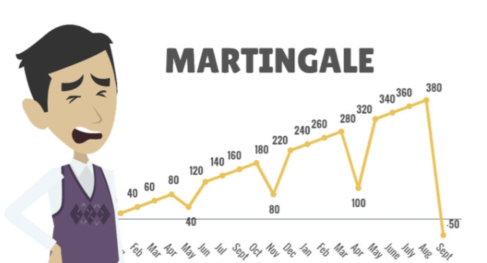
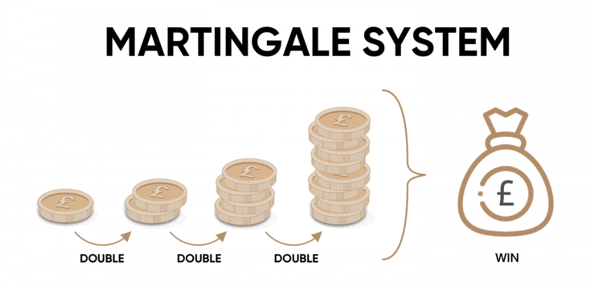
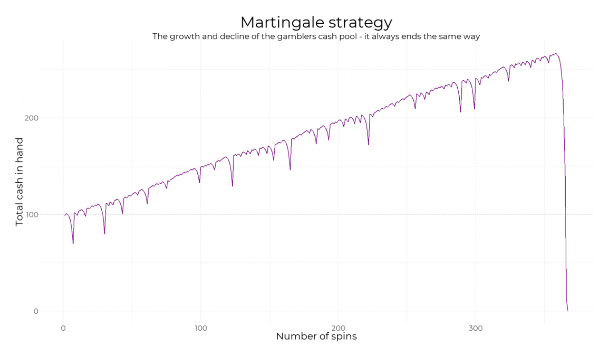
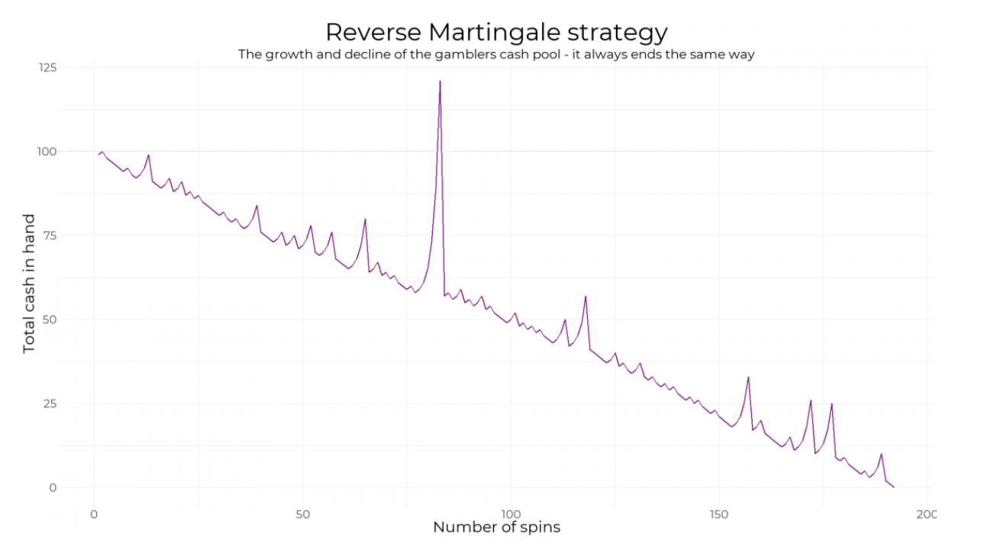
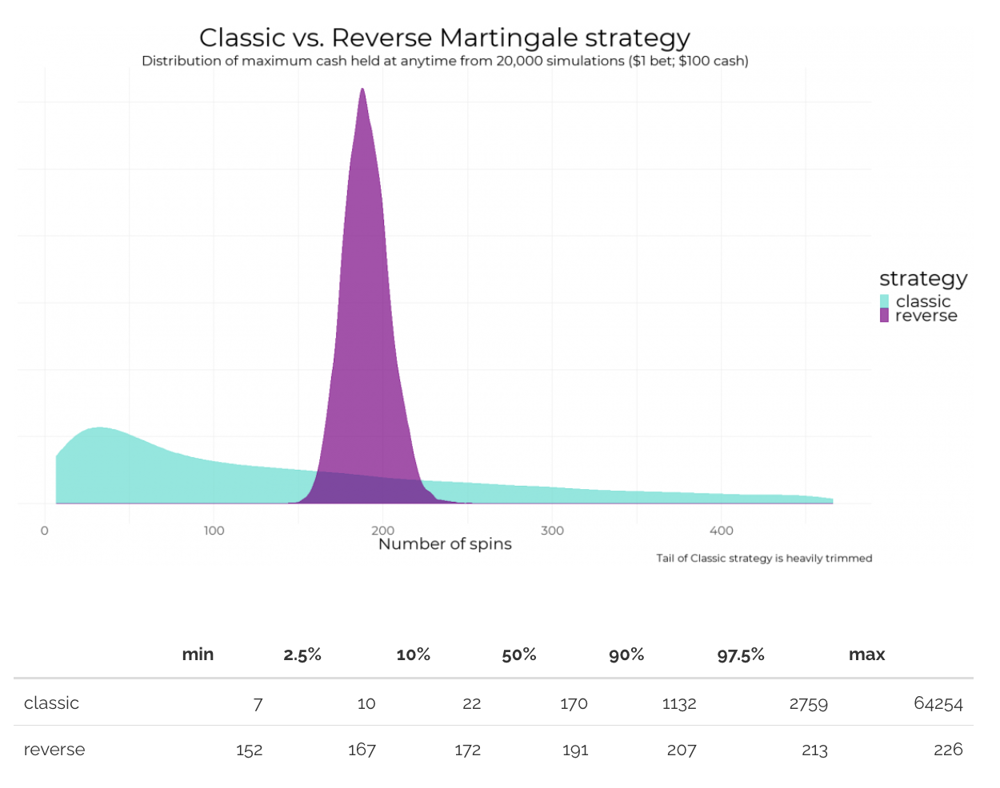

## Table of Contents


## What is the martingale strategy in simple terms?

The martingale strategy is a betting or trading method where you double your stake after every loss, with the goal of recovering all previous losses and making a small profit once you finally win. In simple terms, it’s like saying, “If I keep doubling my bet each time I lose, I’ll eventually win back everything and come out ahead.” For example, if you bet \$10 and lose, you bet \$20 next time. If you lose again, you bet \$40, and so on—until you win, at which point you cover all your losses and gain a profit equal to your original bet. It sounds straightforward, but it relies on having enough money to keep doubling and no limits on how much you can bet, which isn’t always realistic.

## Where did the martingale strategy originate historically?


The martingale strategy traces its roots back to 18th-century France, emerging from the world of gambling. The term "martingale" itself is believed to come from the French town of Martigues, near Marseille, where locals were known for risky gambling habits—or possibly from a slang term "martengalo," meaning to play recklessly. It was first formalized as a system by gamblers trying to outsmart games of chance, like coin tosses or roulette, where outcomes seemed simple and predictable.

The concept gained traction in the 1700s among mathematicians and gamblers in European salons, especially as probability theory was developing. Figures like mathematician Jean le Rond d’Alembert indirectly influenced its popularity by exploring betting systems, though the martingale itself wasn’t rigorously studied until later. By the 19th century, it had become a well-known (and often criticized) approach in casinos, eventually spreading to other fields like finance as people saw parallels in risk-taking behavior. Despite its origins in gambling folklore, it’s now a textbook example in probability and economic discussions.

## How does the martingale strategy work in betting or gambling?



In betting or gambling, the martingale strategy is a straightforward system designed to recover losses and secure a profit by doubling your bet after each loss until you win. Here’s how it works step-by-step:

You start by placing a small initial bet on an even-money outcome—like betting on red in roulette, heads in a coin toss, or black in blackjack—where the payout is 1:1 (you win the same amount you bet). Let’s say you bet \$10. If you win, great—you pocket \$10 in profit and start over with another \$10 bet. But if you lose, you double your next bet to \$20. If you lose again, you double it to \$40, then \$80, and so on. The idea is that when you eventually win, the payout covers all your previous losses plus gives you a profit equal to your original \$10 bet.

For example:  
- Bet 1: \$10 on red, lose (total loss: \$10).  
- Bet 2: \$20 on red, lose (total loss: \$30).  
- Bet 3: \$40 on red, win (payout: \$40).  
- You spent \$10 + \$20 + \$40 = \$70, but won \$40 + \$40 = \$80 on the third bet, so you’re up \$10 overall.

The strategy hinges on the belief that a win is inevitable if you keep going, and it works best in games with close to 50/50 odds. But it assumes you have unlimited money and no betting limits—two things casinos and real life don’t guarantee. One long losing streak, and you could run out of cash or hit the table’s maximum bet, wiping out the plan. It’s simple in theory but dicey in practice.

## What is the basic idea behind doubling your bet after a loss?

The basic idea behind doubling your bet after a loss in the martingale strategy is to ensure that when you finally win, you recover all your previous losses and still come out with a profit equal to your original bet. It’s built on the logic that a win has to happen eventually in a game with roughly even odds, like a coin flip, and by increasing your bet each time, you tilt the payout in your favor to erase the deficit.

Think of it like this: every loss adds to a running tab of money you’re “owed,” and doubling your bet is a way to catch up in one swoop. If you lose \$10, then bet \$20 and lose again, you’re down \$30 total. Betting \$40 next and winning gets you \$40, which pays back the \$30 you lost and leaves you with \$10 extra—your starting bet’s profit. The doubling keeps scaling up the bet to match the growing losses, so the first win wipes the slate clean and puts you ahead.

It’s a recovery tactic, not a way to beat the odds long-term—it assumes you can keep going until luck turns, banking on persistence rather than probability. The catch is you need deep pockets and no ceiling on bets, or the whole thing collapses under its own weight.

## Can you give a simple example of the martingale strategy in action?

Sure, here’s a simple example of the martingale strategy in action using a coin toss game where you bet on heads, and the payout is even money (1:1).

You start with a \$5 bet:  
- **Round 1**: You bet \$5 on heads. The coin lands on tails, so you lose \$5. Total loss: \$5.  
- **Round 2**: You double your bet to \$10 and bet on heads again. It’s tails again, so you lose \$10. Total loss: \$15 (\$5 + \$10).  
- **Round 3**: You double again to \$20 and bet on heads. This time, it’s tails once more, so you lose \$20. Total loss: \$35 (\$15 + \$20).  
- **Round 4**: You double to \$40 and bet on heads. Finally, the coin lands on heads! You win \$40.  

Now, let’s break it down:  
- Total money spent: \$5 + \$10 + \$20 + \$40 = \$75.  
- Total won: \$40 (from the winning bet, which pays \$40 since it’s 1:1).  
- Net result: \$40 won - \$75 spent = -\$35, but after the win, you’ve recouped all losses (\$5 + \$10 + \$20 = \$35) and gained \$5 profit (the size of your original bet).

So, after three losses and one win, you’re up \$5 overall. The strategy worked here because you had enough money to keep doubling (\$75 total) and eventually hit a win. But if the losses kept piling up—say, seven or eight tails in a row—you’d need \$635 or \$1,275 to keep going, showing how fast it can escalate!

## What types of games or scenarios is the martingale strategy commonly applied to?

The martingale strategy is commonly applied to games or scenarios with near-even odds—where the chance of winning is close to 50/50—and where payouts are 1:1, meaning you win back your bet plus an equal amount. It’s most popular in situations where you can keep betting until a win, at least in theory. Here are the main types of games and scenarios it shows up in:

### Gambling Games
1. **Roulette**: Betting on red or black, odd or even, or high (19-36) vs. low (1-18). These options offer close to 50/50 odds (slightly less due to the zero or double zero, depending on the version).  
2. **Coin Toss**: A classic example, like betting on heads or tails, with a true 50% chance of winning.  
3. **Blackjack**: When played conservatively (e.g., just hitting or standing without complex strategies), the odds can hover near 50/50, though the house edge tweaks it.  
4. **Baccarat**: Betting on the player or banker hand, both of which have odds close to even (though banker has a slight edge and a commission).  
5. **Craps**: Betting on the pass or don’t pass line, where the probability is nearly balanced after the come-out roll.

### Beyond Gambling
6. **Financial Trading**: In forex, stocks, or crypto, some traders use a martingale-like approach by doubling their investment after a losing trade—say, buying more of a currency pair if it drops, expecting it to rebound.  
7. **Binary Options**: Here, traders predict if an asset’s price will rise or fall, with fixed payouts resembling even-money bets, making it a natural fit for martingale.  
8. **Sports Betting**: Betting on outcomes with close odds (e.g., a team with a -110 line in American odds), though it’s less pure due to varying probabilities and bookie margins.

The strategy shines in games with short-term, binary outcomes—win or lose—and no memory (each round is independent). It’s less suited to games like poker or slots, where odds shift dramatically or payouts aren’t 1:1. Even in ideal scenarios, though, casinos often impose table limits, and trading has margin calls, which can derail the doubling plan fast.

## Is the martingale strategy legal to use in casinos or trading platforms?


Yes, the martingale strategy is perfectly legal to use in both casinos and trading platforms—it’s just a betting or investment method, not a form of cheating or manipulation. However, there are practical hurdles that can limit its use, and some places might frown on it without banning it outright.

### In Casinos
There’s no law or rule prohibiting the martingale strategy in casinos, whether physical or online. It’s simply a way of managing your bets, like choosing how much to wager on a slot machine. You’re not tampering with the game, counting cards (which can get you kicked out in blackjack), or colluding with others. That said, casinos aren’t oblivious—they set table limits (e.g., \$5 minimum, \$500 maximum on roulette) to cap how far you can double your bets. After a few losses—say, six or seven in a row—your next bet might exceed the max, stopping the strategy cold. Plus, if staff notice you’re systematically doubling bets and suspect you’re trying to “game the system,” they might watch you closely or ask you to leave (private businesses can refuse service), though that’s rare for martingale alone.

### In Trading Platforms
In financial markets—like forex, stocks, or crypto—the martingale strategy is also legal. It’s just a personal risk management tactic, akin to deciding how much to invest after a dip. Brokers don’t care if you double your position after a loss, as long as you’ve got the funds or margin to cover it. Regulators like the SEC or CFTC don’t ban it either; it’s not market manipulation or insider trading. The catch? Trading platforms often have margin requirements or leverage limits. If you keep doubling and a losing streak drains your account, you’ll hit a margin call—where the broker demands more cash or liquidates your positions—long before you “win” big.

So, it’s legal everywhere it’s applied, but its effectiveness is curbed by built-in restrictions like betting caps or account limits. No one’s going to arrest you for trying it—just don’t expect the house or the market to let you double forever!

## What are the potential rewards of using the martingale strategy?



The martingale strategy is a betting system where you double your wager after every loss, with the idea that when you eventually win, you’ll recover all previous losses and make a profit equal to your original stake. It’s most commonly associated with games like roulette, where you might bet on red or black, which offers roughly a 50/50 shot (ignoring the house edge for a moment). Let’s break down the potential rewards.

The primary reward is straightforward: if you have enough money to keep doubling your bet and you hit a win before running out of cash or hitting a table limit, you’ll come out ahead by the amount of your initial bet. For example, say you start with \$10 on red. If you lose, you bet \$20. Lose again, you bet \$40. If you win on the third try, you get \$80 back (assuming even-money payout), covering your total \$70 wagered (\$10 + \$20 + \$40) and leaving you with a \$10 profit. The allure is that, in theory, a win is inevitable as long as you can keep playing.

Another potential reward is psychological—it feels like a sure thing. The streak of losses needed to wipe you out seems unlikely in small doses, so it can give a sense of control or inevitability to someone who likes structured approaches. If you’re in a short session and get lucky early, you could walk away with consistent small gains, which might feel like a reliable system.

That’s where the rewards taper off, though. The strategy doesn’t change the game’s odds—it’s still a coin flip with a slight tilt against you in most casino settings due to the house edge (like the zero in roulette). The payoff is capped at your original bet no matter how much you risk, so the reward doesn’t scale with the escalating stakes. It’s a high-risk, low-reward setup masquerading as a clever hack. People who swear by it tend to highlight those early wins, but the math doesn’t care about your hot streak.

## What are the key assumptions the martingale strategy relies on?

The martingale strategy hinges on a few critical assumptions that need to hold for it to work as intended. Here’s what it’s built on:

First, it assumes you have an unlimited bankroll. The whole system relies on doubling your bet after every loss, and that can spiral fast—\$10 becomes \$20, then \$40, \$80, \$160, and so on. If you hit a losing streak (say, 10 in a row), you’d need over \$10,000 just to cover the next bet starting from that \$10 base. In reality, most people don’t have infinite cash, so this is a practical breaking point.

Second, it assumes there’s no betting limit. Casinos and betting platforms often cap how much you can wager on a single play—maybe \$500 or \$1,000 at a table. If you’re on a losing streak and your next bet needs to be \$1,280 to keep the strategy alive, but the limit’s \$1,000, you’re stuck. The system falls apart when you can’t double anymore.

Third, it assumes the game has a 50/50 chance of winning each round. The martingale is designed for even-money bets like red or black in roulette, heads or tails in a coin flip. But in practice, games like roulette have a house edge—zeros tip the odds slightly against you (around 47.37% win chance in American roulette). Over time, that edge erodes the “inevitable win” promise.

Finally, it assumes you’re willing and able to keep playing indefinitely. A win only recovers losses plus the original stake if you stick it out, but a long losing streak could drain your patience or time before your money even runs dry. It’s a test of endurance as much as anything else.

These assumptions sound reasonable in a vacuum—sure, a win’s gotta come eventually, right? But real-world constraints like finite funds, table limits, and skewed odds are what make it more of a gambler’s fairy tale than a reliable plan.

## Why do people say the martingale strategy is risky?

People call the martingale strategy risky because it’s a house of cards waiting for a gust of wind—its flaws hit hard and fast when reality kicks in. The big issue is the exponential growth of your bets. You double after every loss, so a short string of bad luck can obliterate your bankroll. Start with \$10, lose five times in a row (not rare in a 50/50 game), and your next bet’s \$320. That’s \$630 wagered total to chase a \$10 profit. Most folks don’t have that kind of cash lying around, and even if they do, it’s a insane risk-reward ratio.

Then there’s the table limit problem. Casinos aren’t dumb—they set caps, say \$1,000. If your doubling hits that ceiling (like going from \$640 to \$1,280), you can’t keep the strategy going. You’re left eating massive losses without a chance to recover. It’s like climbing a ladder that suddenly ends mid-air.

The house edge adds another layer. In games like roulette, the odds aren’t truly 50/50—zeros tilt it to about 47.37% in American versions. That means losing streaks are slightly more likely than you’d think, and the martingale doesn’t account for that grind-down effect. You’re not just fighting random chance; you’re fighting a system rigged to bleed you over time.

People also miss how common losing streaks are. Flip a coin five times, and there’s about a 3% chance it’s all tails—not crazy unlikely. Stretch that to 10 losses, and it’s still a 0.1% shot, which happens more than you’d expect over many tries. Gamblers overestimate their luck and underestimate how fast the math catches up.

It’s risky because it’s a bluff against reality—you’re betting on perfect conditions (infinite money, no limits, pure odds) that don’t exist. When it fails, it doesn’t just sting; it wipes you out. That’s why it’s a cautionary tale more than a strategy.

## How does bankroll size affect the success of the martingale strategy?

Bankroll size is the lifeblood of the martingale strategy—it determines how long you can ride out losing streaks before the system either pays off or collapses. The bigger your bankroll, the more losses you can absorb while doubling your bets, which directly impacts your chances of hitting that eventual win to recoup everything.

Here’s how it plays out: the martingale requires you to double your wager after each loss, starting from your base bet. Say you begin with \$10. After one loss, it’s \$20; two losses, \$40; three, \$80; and so on. By the fifth loss, you’ve wagered \$310 total, and your next bet is \$320. If your bankroll is only \$500, you’re toast after five losses—no cash left to double again. But with a \$5,000 bankroll, you could handle nine losses (\$5,110 total wagered) and still have room to bet \$5,120 on the tenth round. More money means more runway.

The catch is exponential growth. Each additional loss doesn’t just add to your costs—it multiplies them. A small bankroll gets eaten up fast because losing streaks aren’t as rare as people assume. In a 50/50 game, the chance of losing five times in a row is about 3.1%; ten times, 0.1%. Those odds sound slim, but over enough bets, they hit eventually. A tiny bankroll—say, \$100—might only survive three losses (\$70 total, next bet \$80), while a \$10,000 one could weather 11 or 12, vastly increasing your odds of seeing a win before busting.

That said, a bigger bankroll doesn’t guarantee success—it just delays the inevitable if luck doesn’t turn. You’re still capped by table limits (e.g., \$1,000 max bet) or the house edge in real games, which a fat wallet can’t overcome forever. A \$1 million bankroll sounds invincible, but lose 20 times in a row (a 0.0001% chance, not impossible), and you’re betting over \$5 million next. Even billionaires hit walls eventually.

So, a larger bankroll boosts your survival rate by letting you double longer, but it’s not a golden ticket. It’s like buying more lottery tickets—better odds, same gamble. Success hinges on dodging long streaks, and no bankroll’s big enough to outrun math forever.

## What happens if you hit a betting limit while using the martingale strategy?

Hitting a betting limit while using the martingale strategy is like running into a brick wall at full speed—it stops you cold and leaves you in a hole. The strategy relies on doubling your bet after every loss to eventually recover everything plus your original stake. When you hit a limit, you can’t double anymore, and the whole plan unravels.

Here’s what happens: say you start with \$10 on a 50/50 bet like roulette. You lose, so you bet \$20. Lose again, \$40. Then \$80, \$160, \$320, and so on. By the sixth loss, you’ve wagered \$630 total, and your next bet needs to be \$640 to keep going. But if the table’s max is \$500, you’re stuck—you can’t place the \$640. Even if you bet the max \$500 and win, you get \$1,000 back, which sounds nice until you realize it’s short of the \$1,130 you’ve sunk in so far (\$630 + \$500). You’re still down \$130, and the streak resets you to square one without fully recovering.

It gets uglier the longer you’ve been doubling. If you’re 10 losses deep (\$10,230 wagered) and the limit’s \$1,000, your next bet should be \$5,120. Capped at \$1,000, a win nets you \$2,000, nowhere near the \$11,230 you’ve bet total. You’re out over \$9,000, and no amount of grit gets that back in one play. The martingale’s promise—full recovery plus profit—dies right there.

Worse, you might keep betting the max hoping to chip away at losses, but that’s no longer martingale; it’s desperation with worse odds. The limit doesn’t just halt progress—it locks in your losses up to that point, and since the strategy bets big to win small, those losses are brutal. It’s why casinos set limits in the first place—they know this is the kryptonite. You’re left broke or limping, and the “inevitable win” turns into an inevitable bust.

## How does the martingale strategy differ from other betting systems like Fibonacci or D’Alembert?

The martingale strategy stands out from other betting systems like Fibonacci or D’Alembert in how aggressively it chases losses and what it demands from your bankroll and nerves. Each system has its own flavor—martingale’s all about brute force, while the others take a slower, less reckless approach.

Martingale is the simplest and most intense. You double your bet after every loss, aiming to wipe out all prior losses and snag a profit equal to your starting bet when you win. Lose \$10, bet \$20; lose that, bet \$40. Win at \$40, you get \$80, covering the \$70 total wagered and leaving \$10 profit. It’s fast and furious, betting big to recover quick, but it assumes you’ve got deep pockets and no betting caps. One long losing streak, and you’re toast.

Fibonacci, on the other hand, is more gradual. It uses the famous sequence—1, 1, 2, 3, 5, 8, 13, etc.—where each bet is the sum of the two before it. After a loss, you move one step up the sequence; after a win, you step back two. Start with \$10, lose, bet \$10 again (1+1=2 in units, but let’s say \$10 base). Lose, bet \$20 (2+1=3). Lose, \$30 (3+2=5). Win at \$30, you’re up \$60, covering \$70 wagered so far, then drop back to \$10. It’s less explosive than martingale—your bets grow slower, so it’s kinder to a smaller bankroll—but it takes more wins to recover fully, and a bad run still stings.

D’Alembert is even tamer. You increase your bet by one unit after a loss and decrease by one after a win, aiming for balance over time. Start with \$10, lose, bet \$20. Lose, bet \$30. Win, get \$60 (covering \$60 total wagered so far), then drop to \$20. It’s a flat grind, assuming wins and losses even out eventually. Unlike martingale’s all-or-nothing doubling, D’Alembert spreads the risk, but the payoff’s smaller and slower—less a jackpot chase, more a patient slog.

The big differences? Martingale’s high stakes and speed—it’s a sprint to recover everything in one blow, risking ruin fast. Fibonacci’s a middle ground, pacing itself but still escalating. D’Alembert’s cautious, betting on long-term equilibrium rather than big swings. Martingale needs infinite cash and no limits; the others can limp along with less, though none beat the house edge. It’s aggression versus restraint—martingale’s a gambler’s adrenaline rush, while Fibonacci and D’Alembert play it cooler.

## Can the martingale strategy be applied to financial markets, like forex or stocks?

Yeah, the martingale strategy can be applied to financial markets like forex or stocks, but it’s a different beast outside the casino, and the risks morph in some nasty ways. The core idea—doubling down after a loss to recover everything plus a profit—still holds, but markets aren’t as tidy as a roulette table.

In forex, traders sometimes use it with position sizing. Say you buy 1 lot of EUR/USD at \$1.2000, betting it’ll rise. It drops to \$1.1950, you’re down \$50 (assuming a \$50/pip move). Instead of cutting losses, you double to 2 lots at \$1.1950. If it bounces to \$1.2000, you make \$100 on the second trade, covering the \$50 loss and pocketing \$50 profit. Sounds familiar, right? But forex isn’t 50/50—price moves are driven by trends, news, and sentiment, not coin flips. You’re not guaranteed a quick reversal, and leverage (common in forex) amps up the damage. A 100-pip slide could wipe your account before you double again.

Stocks are trickier. Say you buy 100 shares of a \$10 stock, it drops to \$9, you’re down \$100. You double down, buying 200 more at \$9. If it climbs back to \$10, you’re up \$200 on the second buy, netting \$100 overall. But stocks don’t bounce on command—companies tank, trends drag on, and you’re tying up more cash each time. Unlike casino bets, you’re not cashing out instantly; you’re holding an asset that might keep bleeding. And if it’s a dud, no amount of doubling saves you from zero.

The upsides? Markets can trend in your favor, unlike roulette’s fixed odds. Catch a reversal, and you could profit more than your initial “bet” since price swings aren’t capped at even money. In forex, tight stop-losses or hedging might tweak it into something less suicidal. Some traders swear by scaled-up versions, like averaging down in a dip, claiming it’s martingale lite.

The downsides dwarf that. Your bankroll (account) isn’t infinite—margin calls in forex or cash limits in stocks cap your doubling. Markets have no table limit, sure, but they’ve got volatility and black swans—think flash crashes or gaps that skip your recovery zone entirely. Transaction costs (spreads, commissions) pile up with each trade, eating into the math. And there’s no “eventual win” promise—currencies and stocks can trend against you for months or years, not just a few spins.

It’s been tried. Some hedge funds and gamblers-turned-traders tweak it with risk management, but pure martingale in markets is a flameout waiting to happen. Casinos have house edges; markets have unpredictability. Both kill it eventually, just with different knives.

## What are some real-world examples of the martingale strategy failing?

Real-world examples of the martingale strategy failing tend to pop up in gambling and trading, where its seductive logic meets harsh reality. Here are a few notable cases that show how it crumbles under pressure.

One classic gambling example comes from the Monte Carlo Casino in 1913—not a single person, but a famous event tied to the strategy’s flaws. On August 18, the roulette wheel landed on black 26 times in a row. Players, likely including martingale fans, kept doubling bets on red, expecting it to “correct.” A \$10 start would’ve hit \$167 million by the 26th spin—way beyond any bankroll or table limit. The casino raked in fortunes as gamblers busted, proving even rare streaks (odds of 1 in 136 million for 26 blacks) can and do happen. It’s dubbed the "Gambler’s Fallacy" poster child, and martingale took a beating.

In trading, look at Victor Niederhoffer, a hedge fund manager in the ‘90s. He didn’t explicitly call it martingale, but his style—doubling down on losing positions—echoed it. In 1997, betting big on Thai baht and U.S. stock puts, he got crushed when the Asian financial crisis tanked markets beyond his recovery point. His fund lost over \$100 million, blew up, and shut down. The market didn’t snap back like a roulette win; it kept sliding, and his capital couldn’t keep up.

Another forex trader tale floats around forums—an anonymous guy in 2015 on a platform like MetaTrader. He bragged about martingale on GBP/USD, starting with a \$1,000 account. He doubled lots after losses, turning 0.1 to 0.2, 0.4, and so on. Worked for weeks, netting small gains. Then a Brexit rumor spiked volatility; the pair dropped 200 pips in hours. His \$1,000 couldn’t cover the next 12.8-lot trade (needing maybe \$50,000 in margin). Account wiped, lesson learned: markets don’t care about your doubling plan.

Even big players like Long-Term Capital Management (LTCM) in 1998 flirt with martingale vibes. They didn’t use it outright but piled into losing bond trades expecting convergence. When Russia defaulted, spreads blew out, and their \$4 billion fund needed a bailout. Doubling down didn’t save them—liquidity and market chaos did them in.

These flops highlight the same culprits: finite cash, no guaranteed reversal, and limits (table or margin). Martingale’s failures are loud—gamblers broke in Monaco, traders margin-called into oblivion. It’s a strategy that shines until it implodes, and history’s littered with the wreckage.

## How does probability theory explain the limitations of the martingale strategy?

Probability theory cuts through the martingale strategy’s promises like a scalpel, exposing why it’s a shaky bet despite its “can’t lose” vibe. It’s all about expected value, random walks, and the brutal reality of finite resources meeting infinite possibilities.

First, expected value (EV) shows the strategy’s long-term flaw. In a fair 50/50 game—like a coin flip with no house edge—your EV per bet is zero: half the time you win your stake, half you lose it. Martingale doesn’t change that. Double after losses all you want; each bet’s still a wash on average. Add a house edge (say, 2.7% in European roulette), and EV turns negative—about -\$0.027 per \$1 bet. Over many rounds, you’re bleeding, no matter how big your wins feel. The strategy’s profit (your initial stake) doesn’t scale with the escalating risk, so probability says you’re just delaying a net loss.

Then there’s the random walk problem. Martingale assumes a win’s “due” after losses, but probability theory treats each bet as independent—past results don’t nudge future odds. In a fair coin flip, the chance of 10 losses in a row is (1/2)^10, or 0.1%. Tiny, but not zero. Stretch it to 20 losses, it’s 0.0001%. These streaks are rare but inevitable over enough tries, and when they hit, your bet size explodes—\$10 becomes \$5.24 million after 20 doubles. Probability doesn’t promise a quick save; it guarantees only that extremes happen eventually.

The gambler’s ruin theorem ties it together. It says if you’ve got a finite bankroll (everyone does) and face an opponent with more (casino, market), you’ll go broke before they do in an even-odds game. Martingale speeds this up—doubling accelerates your cash burn. Say you’ve got \$1,000 and start at \$10. Ten losses (\$1,230 total) bust you, and that’s a 0.1% chance per 10-bet run. Play 1,000 sequences, and you’ll see it a few times. With a house edge, ruin’s even faster—negative EV grinds you down while streaks spike the pain.

Finally, the law of large numbers seals it. Over infinite bets, your results match the EV—zero in a fair game, negative with an edge. Martingale’s short-term wins (recovering losses plus \$10) get swamped by the rare, massive flops. Probability doesn’t bend to your doubling; it just watches your bankroll vanish when the math catches up.

So, the strategy’s limits? No edge in odds, no control over streaks, and no escaping finite cash. Probability theory says it’s a mirage—looks like a winner until the numbers prove it’s a loser.

## What role does variance play in the long-term outcomes of the martingale strategy?

Variance is the wild card that shapes the martingale strategy’s long-term outcomes, driving the rollercoaster of short-term wins and catastrophic busts. In probability terms, it measures how much results bounce around the expected value—low variance means steady outcomes, high variance means big swings. For martingale, variance is the engine behind its boom-and-bust nature, even if the average outcome stays grim.

In a 50/50 game like a fair coin flip, variance is straightforward. Each bet’s outcome (win or lose your stake) has a standard deviation tied to the bet size—say, \$10 gives a variance of \$100 per flip (calculated as the spread of outcomes around zero EV). Martingale cranks this up by doubling bets after losses. First bet’s \$10, variance \$100. Second’s \$20, variance \$400. Fifth’s \$160, variance \$25,600. The strategy doesn’t just raise stakes—it amplifies volatility exponentially. Small losing streaks turn into massive cash swings, making your bankroll a punching bag.

Short term, high variance can be a friend. Most runs won’t hit long streaks—say, 70% of 10-bet sequences have fewer than 4 losses in a row. You win your initial \$10 often, pocketing small gains while dodging the big hits. Variance creates this illusion of success; the results scatter enough that you’re usually up before disaster strikes. It’s why gamblers swear by it—they see the upside, not the cliff.

Long term, though, variance is the executioner. Those rare streaks (5, 10, 20 losses) have low odds—3.1%, 0.1%, 0.0001%—but huge impact. A \$10 start needs \$1,270 after 7 losses, \$5.24 million after 20. Variance ensures these outliers happen eventually, and when they do, they wipe you out unless your bankroll’s infinite (it’s not). The law of large numbers kicks in—play enough, and your average outcome hugs the expected value (zero in a fair game, negative with a house edge). High variance doesn’t change that average; it just makes the ride wilder and the crashes harder.

Add a house edge—like 2.7% in roulette—and variance still drives the swings, but the negative EV tilts the floor downward. You might ride a lucky streak to +\$100, then crash -\$1,000 in one bad run. Variance stretches the timeline to ruin, letting you float longer before the inevitable drop.

So, variance gives martingale its seductive short-term buzz—frequent small wins—but guarantees long-term doom by amplifying rare, bankroll-killing losses. It’s the math behind the thrill and the trap.

## How can you modify the martingale strategy to reduce risk (e.g., anti-martingale or partial martingale)?

Modifying the martingale strategy to reduce risk means tweaking its core doubling-after-losses approach to avoid the bankroll blowouts and runaway bets. Two popular spins are the anti-martingale and partial martingale—each flips or softens the original’s aggression, aiming for survival over reckless recovery.

The **anti-martingale** (or reverse martingale) flips the script: you double your bet after a *win*, not a loss, and reset to your base bet after a loss. Say you start with \$10 on a 50/50 game. Win, you get \$20, then bet \$20. Win again, \$40, bet \$40. Lose, drop back to \$10. The idea is to ride hot streaks—variance’s upside—while capping losses during slumps. If you hit three wins (\$10 → \$20 → \$40), you’re up \$70 total, way more than martingale’s fixed \$10 profit. Risk shrinks because you’re not chasing losses with bigger bets; a losing streak just costs your base unit each time. Downside? No recovery mechanism—losses pile up steadily if luck sours, and you need to know when to cash out a streak.



The **partial martingale** dials back the doubling. Instead of 2x after a loss, you increase by a smaller factor—say, 1.5x—or a fixed amount, like \$5. Start with \$10, lose, bet \$15. Lose, \$22.50. Win, you get \$45, covering \$47.50 wagered, so you’re down \$2.50, not wiped out. Or with a +\$5 step: \$10, \$15, \$20—third win nets \$40 against \$45 spent, a \$5 loss. It’s slower, so your bankroll lasts longer against streaks—\$1,000 survives 10 losses at +\$5 (\$10 → \$55, \$595 total) versus martingale’s \$1,230 bust. Risk drops because bet growth isn’t exponential, but recovery’s partial too; you might not claw back all losses in one win.

Other tweaks exist. A **capped martingale** sets a max bet—say, stop doubling at \$100. Lose \$10, \$20, \$40, \$80, then stick at \$100. Five losses cost \$350; a \$100 win nets \$200, cutting your hole to \$150. It avoids table limits or total ruin but sacrifices full recovery. A **stop-loss martingale** quits after a set loss—like \$500—preserving capital for another day. Both trade the “inevitable win” for damage control.

These mods reduce risk by dodging martingale’s all-in spiral. Anti-martingale bets on winning runs, partial martingale softens the blow, and caps or stops limit exposure. None beat the house edge long-term—EV’s still zero or negative—but they stretch your playtime and cushion the crash. It’s less a fix, more a compromise with probability’s grind.

## What mathematical models or simulations can test the effectiveness of the martingale strategy?

Testing the martingale strategy’s effectiveness with mathematical models or simulations means leaning on tools that mimic its mechanics—bet doubling, win/loss streaks, and bankroll limits—while letting probability play out. Here are some solid approaches to crunch the numbers and see where it holds or folds.



### Mathematical Models
1. **Expected Value (EV) Analysis**  
   Start simple: calculate the EV per bet. For a fair 50/50 game (no edge), EV = (0.5 × win amount) + (0.5 × -bet amount). With \$10, it’s (0.5 × \$10) + (0.5 × -\$10) = 0. Add a house edge—like 2.7% in roulette—and EV dips negative: (0.4865 × \$10) + (0.5135 × -\$10) ≈ -\$0.27 per \$10 bet. Martingale doesn’t shift this; it just stacks bets. Model total EV over *n* rounds, factoring bet growth (2^n × initial bet after *n* losses), and you’ll see losses scale with playtime despite short-term wins.

2. **Gambler’s Ruin Problem**  
   This classic fits martingale perfectly. Define *B* as your bankroll, *T* as the target profit (say, \$10), and *p* as win probability (0.5 fair, 0.4865 with edge). The ruin probability is 1 - (B / (B + T)) in a fair game, trending to 1 with an edge. For \$1,000 and \$10 profit, ruin’s near-certain long-term against an infinite house. Plug in bet doubling, and ruin hits faster—calculate steps to bust (e.g., log2(B / initial bet) losses). It shows why finite cash kills it.

3. **Markov Chain Model**  
   Treat each bet as a state: bankroll *B* after *k* losses needs 2^k × initial bet. Transition probabilities are *p* (win, reset to profit) or 1-*p* (lose, double). Compute absorbing states—win (+\$10) or bust (\$0). For \$1,000 and \$10 start, bust comes at 2^10 = \$10,240 (10 losses), a 0.1% chance per run but rising with trials. This maps the strategy’s path to ruin or rare success.

### Simulations
1. **Monte Carlo Simulation**  
   This is the go-to. Code a loop (Python, R, etc.): start with bankroll *B* (e.g., \$1,000), bet *b* (\$10), double after loss, reset after win, cap at table limit (say, \$500) or bust. Run 10,000 trials, each with 100 bets, using a random 50/50 generator (or 48.65/51.35 for roulette). Track outcomes: wins, losses, bust rate. You’ll see most trials profit early (70-80% up \$10 quick), but 5-10% hit 7+ loss streaks, busting hard. Tweak *B*, limits, or odds to test mods like partial martingale.

   Sample Python snippet:
   ```python
   import random
   bankroll, bet, max_bet = 1000, 10, 500
   trials, rounds = 10000, 100
   busts = 0
   for _ in range(trials):
       cash = bankroll
       current_bet = bet
       for _ in range(rounds):
           if cash < current_bet:
               busts += 1; break
           if random.random() < 0.5:  # Win
               cash += current_bet; current_bet = bet
           else:  # Lose
               cash -= current_bet; current_bet = min(current_bet * 2, max_bet)
               if cash <= 0: busts += 1; break
   print(f"Bust rate: {busts / trials * 100}%")
   ```

2. **Discrete Event Simulation**  
   Model each bet as an event with time steps. Set rules: double after loss, cap at limit, stop at bust or profit goal. Use a binomial distribution for wins/losses (n trials, p = 0.5 or adjusted). Run 1,000 players, each with \$1,000, over 1,000 bets. Plot bankroll trajectories—most flatline at \$0 after streaks (e.g., 7 losses, 0.78% chance, eats \$1,270). It visualizes variance’s role: tight gains, then sharp drops.

3. **Stochastic Process (Random Walk)**  
   Simulate a random walk with bet sizes as steps. Win = +bet, lose = -bet, doubling after losses. Use a geometric progression for bets (2^n × \$10). Run 10,000 walks, cap at bankroll (\$1,000) or limit (\$500). Count how often you hit +\$10 versus \$0. Results mirror ruin theory—small wins dominate early, but walks to zero spike as variance unleashes 10+ loss runs (0.1% per, but frequent over trials).

### Key Insights
- **EV models** prove no long-term edge—zero or negative.
- **Ruin and Markov** quantify bust inevitability with finite cash.
- **Simulations** reveal variance’s trap: frequent small wins (60-80% success in 10 bets) mask rare wipes (5-10% bust rate spikes with 7-10 losses).
- Test mods (anti-martingale, partial) by adjusting rules—anti doubles on wins, partial scales slower (e.g., 1.5x). Sims show they delay ruin but don’t beat odds.

These tools strip martingale bare: it’s a short-term mirage, undone by streaks and limits. Run the numbers, and the math doesn’t lie—variance and EV always win.

## Why do experts often warn against relying on the martingale strategy for consistent profits?

Experts warn against relying on the martingale strategy for consistent profits because it’s a mathematical house of cards—seductive in theory, disastrous in practice. They point to a few key flaws that shred its promise of steady gains, rooted in probability, resource limits, and real-world mechanics.

First, the strategy doesn’t beat the odds—it just rearranges them. In a fair 50/50 game, your expected value per bet is zero; with a house edge (like 2.7% in roulette), it’s negative. Doubling after losses sounds like a recovery plan, but it doesn’t flip the math. You’re still losing a sliver on average—say, -\$0.27 per \$10 bet. Over time, that grinds you down, and martingale’s “profit” (your initial stake) stays tiny while risks balloon. Experts stress this: no betting system overcomes a negative EV, and martingale’s no exception.

Second, it’s a bankroll killer. The doubling escalates fast—\$10 becomes \$1,270 after seven losses (a 0.78% chance in 50/50). Most people don’t have thousands to chase a \$10 win, and even if they do, table limits (say, \$500) or margin caps stop the sequence cold. You’re left with massive losses and no way to double again. Pros like statistician Joseph Granville have called it a “surefire way to go broke” because finite cash meets infinite streaks—probability doesn’t care about your wallet.

Third, variance is a double-edged sword. Experts highlight how martingale thrives on short-term luck—win early, and you’re up \$10 often—but those rare losing streaks (5, 10, 20 in a row) are baked into the math. A 10-loss run (0.1% chance) isn’t “if” but “when” over enough bets, and it wipes you out. Finance gurus like Nassim Taleb warn about these “black swan” risks—low-probability, high-impact events that martingale ignores until they hit.

Finally, real-world friction kills it. In casinos, house edges and limits rig the game. In markets, spreads, commissions, and trending (not 50/50) behavior eat gains. Economist Paul Samuelson trashed martingale as “a fallacy for suckers,” noting it assumes perfect conditions—unlimited funds, no costs, instant wins—that don’t exist. Even modified versions (anti-martingale, partial) just delay the bleed, not reverse it.

Experts see it as a gambler’s trap: it feels consistent until it isn’t, and the crash is total. Consistent profits need an edge—martingale’s just a bet on not running out of luck first.

## What is the mathematical foundation of the martingale strategy?

The mathematical foundation of the Martingale Strategy is rooted in probability theory. The strategy relies on the premise that for an event with an expected outcome of 50/50, such as a coin toss, the probability of the same outcome (heads or tails) occurring consecutively decreases exponentially with each event.

The expected value of each round of betting, when using the Martingale Strategy, is theoretically zero, assuming an outcome with even odds and no house edge. This is because the gains from a win after a series of losses would be offset by the amount spent to achieve the win. In mathematical terms, the expected value $EV$ can be expressed as:

$EV = (p \times W) - (q \times L)$

where $p$ is the probability of winning, $W$ is the amount won, $q$ is the probability of losing, and $L$ is the amount lost.

However, in practice, the presence of bet limits and finite bankrolls skews the expected value into negative territory, as the ability to continuously double bets is limited. Furthermore, the Martingale Strategy assumes no house edge, which is not the case in most gambling scenarios, where the house edge further reduces the $EV$.

The risk of ruin in the Martingale Strategy is significant. Mathematically, the risk of ruin is not zero, and it increases as the number of rounds increases, which contradicts the gambler's fallacy—the erroneous belief that past events can influence the likelihood of future independent events. The probability of eventual bankruptcy is calculated by:

$P(\text{Ruin}) = \left( \frac{q}{p} \right) ^ b$

where $b$ is the number of bets the gambler can afford to lose.

The gambler's fallacy often lures individuals into believing that a win is "due" after a streak of losses, not understanding that each bet is an independent event.

The mathematical dissection of multiple rounds of the Martingale Strategy reveals an increasing risk with each bet. Even with an infinite bankroll, the imposition of betting limits by casinos ensures the impracticality of the Martingale Strategy as a sustainable approach.

For a mathematical exploration of the Martingale Strategy's underpinnings, including formulas and proofs, "Beat the Odds in Forex Trading: How to Identify and Profit from High Percentage Market Patterns" by I. R. Toshchakov provides detailed analysis and discussion on the application and limitations of the strategy in financial markets.


## References & Further Reading

[1]: [Martingale (betting system)](https://en.wikipedia.org/wiki/Martingale_%28betting_system%29) - Wikipedia

[2]: [Forex Trading the Martingale Way](https://www.investopedia.com/articles/forex/06/martingale.asp) - Investopedia

[3]: [Martingale Strategy](https://corporatefinanceinstitute.com/resources/career-map/sell-side/capital-markets/martingale-strategy/) - Corporate Finance Institute

[4]: [Martingale System](https://www.investopedia.com/terms/m/martingalesystem.asp) - Investopedia

[5]: [Martingale (probability theory)](https://en.wikipedia.org/wiki/Martingale_%28probability_theory%29) - Wikipedia

[6]: [The Martingale Strategy](https://ofpfunding.com/the-martingale-strategy/) - OFP Funding

[7]: [Martingale Strategy for Roulette Explained](https://www.casino.org/roulette/strategy/martingale/) - Casino.org

[8]: [Martingale System Explained](https://readwrite.com/gambling/guides/martingale-system/) - ReadWrite

[9]: [Martingale Betting System Explained](https://www.techopedia.com/gambling-guides/martingale-betting-system) - Techopedia

[10]: [Martingale Trading Strategy](https://realtrading.com/trading-blog/an-introduction-to-the-martingale-trading-strategy/) - Real Trading

[11]: [Mathematical analysis of martingale strategy](http://www.thecasinologist.com/content/article/math-analysis-martingale) - The Casinologist

[12]: [On Martingale betting system](https://math.stackexchange.com/questions/83904/on-martingale-betting-system) - Mathematics Stack Exchange

[13]: [Game Theory and the Martingale System](https://fastercapital.com/content/Game-theory--Game-Theory-and-the-Martingale-System--A-Winning-Combination.html) - FasterCapital

[14]: [Martingales Concepts & Applications](https://www.studysmarter.co.uk/explanations/math/probability-and-statistics/martingales/) - StudySmarter

[15]: [The Martingale Strategy](https://www.geeksforgeeks.org/the-martingale-strategy/) - GeeksforGeeks

[16]: [Modified Martingale system](https://wizardofvegas.com/forum/gambling/betting-systems/25125-modified-martingale-system-for-even-money-betting-on-roulette/) - Wizard of Vegas

[17]: [Martingale System in Financial Markets](https://www.daytrading.com/martingale-system) - DayTrading.com