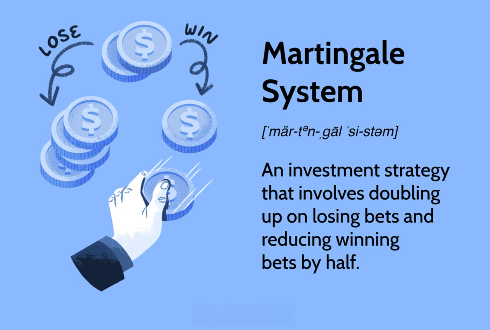

## Table of Contents

## What is the Martingale System and how does it apply to investing?

The Martingale System is a betting strategy that originated in 18th century France. It's simple: if you lose a bet, you double your next bet until you win. The idea is that when you finally win, you'll recover all your previous losses plus a profit equal to your original bet. People often use this system in games like roulette or blackjack, where the odds are even.

In investing, some people try to use the Martingale System, but it's risky. The idea is similar: if an investment goes down, you buy more of it, hoping that when the price goes back up, you'll make a profit. However, investing is not like gambling because the market can be unpredictable and there's no guarantee that the price will go back up. If the price keeps falling, you could lose a lot of money. That's why most experts advise against using the Martingale System for investing.

## How does the Martingale System work in the context of stock market investments?

In the stock market, the Martingale System means that if you buy a stock and its price goes down, you buy more of the same stock. The idea is to keep buying more shares each time the price drops, so when the price finally goes up, you'll make enough money to cover all your losses and make a profit. For example, if you buy a stock at $10 and it drops to $5, you buy twice as many shares at $5. If it drops to $2.50, you buy four times as many shares, and so on. The hope is that when the stock price rises again, you'll sell all your shares and make money.

However, using the Martingale System in the stock market is very risky. Unlike gambling, where you might have a 50/50 chance of winning, the stock market can be unpredictable. A stock's price can keep falling, and you might run out of money before it goes back up. Also, you need a lot of money to keep doubling your investment, and there's no guarantee that the stock will ever recover. That's why most financial experts warn against using the Martingale System for investing in stocks.

## What are the basic principles behind the Martingale System?

The Martingale System is a betting strategy that started a long time ago. The main idea is simple: if you lose a bet, you double the amount you bet next time. You keep doing this until you win. When you finally win, you get back all the money you lost before, plus a little extra. People often use this system in games like roulette, where you bet on something that has a 50/50 chance of happening, like red or black.

In the stock market, people sometimes try to use the Martingale System too. If they buy a stock and it goes down, they buy more of it. They keep buying more each time the price drops, hoping that when the price goes up again, they'll make enough money to cover all their losses and make a profit. But this is very risky because the stock market can be unpredictable. The price might keep going down, and you could lose a lot of money before it goes back up. That's why most experts say not to use the Martingale System for investing.

## Can you explain the origin of the Martingale System and its initial use?

The Martingale System started a long time ago in France, around the 18th century. People used it as a way to bet on games like coin tosses or roulette. The idea was simple: if you lost a bet, you would double the amount you bet the next time. You kept doing this until you won. When you finally won, you would get back all the money you lost before, plus a little extra. It was popular because it seemed like a sure way to make money if you had enough to keep betting.

People first used the Martingale System in casinos, especially for games where you had a 50/50 chance of winning, like betting on red or black in roulette. The system got its name from a group of people in France who liked to use it. They were called "martingales." The system seemed easy to follow, but it was risky because you needed a lot of money to keep doubling your bets. If you ran out of money before you won, you would lose everything.

## What are the potential risks of using the Martingale System in investing?

Using the Martingale System in investing can be very risky. The main problem is that the stock market can be unpredictable. If you keep buying more of a stock every time its price goes down, you might run out of money before the price goes back up. If the stock keeps dropping, you could lose a lot of money. Unlike gambling, where you might have a 50/50 chance of winning, the stock market doesn't work that way. There's no guarantee that the stock will ever recover, and you could end up losing everything you invested.

Another risk is that you need a lot of money to keep doubling your investment. If you start with a small amount and the stock price keeps falling, you'll need more and more money to keep up with the Martingale System. Most people don't have enough money to do this for a long time. Also, if you're using borrowed money, like a margin account, the risks are even higher. If the stock price drops too much, you might get a margin call and have to sell your stocks at a loss. That's why most experts say not to use the Martingale System for investing in stocks.

## How can the Martingale System be adapted for different types of investments?

The Martingale System can be adapted for different types of investments, but it's important to understand that it's very risky no matter how you use it. For example, in the stock market, you might buy more of a stock every time its price goes down, hoping it will eventually go back up. In real estate, you could keep buying more properties if their values drop, thinking they'll rise again later. In cryptocurrency, you might buy more of a certain coin if its price falls, expecting a future increase. The basic idea is the same: keep doubling your investment after a loss until you make a profit.

However, adapting the Martingale System to these different types of investments comes with big risks. In the stock market, a stock might keep going down, and you could run out of money before it goes back up. Real estate can be even trickier because properties can take a long time to sell, and their values might not recover quickly. Cryptocurrencies are very volatile, and their prices can drop a lot before going up again, if they ever do. No matter what type of investment you're using the Martingale System for, you need a lot of money to keep doubling your bets, and there's no guarantee you'll ever make your money back. That's why most experts advise against using this system for any kind of investing.

## What are some real-world examples of the Martingale System being used in investing?

One real-world example of the Martingale System in investing happened during the dot-com bubble in the late 1990s. Some investors bought tech stocks thinking they would keep going up. When the bubble burst and stock prices started falling, some people used the Martingale System. They bought more of the same stocks every time the prices dropped, hoping the market would recover. But many of these investors lost a lot of money because the prices kept going down, and they ran out of money before the market went back up.

Another example is in the housing market before the 2008 financial crisis. Some investors bought houses thinking their values would keep rising. When the housing bubble burst and house prices started to fall, a few investors tried the Martingale System. They bought more houses every time the prices dropped, hoping to make a big profit when the market recovered. But the housing market kept falling, and many of these investors ended up losing a lot of money because they couldn't keep buying more houses and the prices didn't go back up quickly enough.

## How does the Martingale System compare to other investment strategies?

The Martingale System is different from other investment strategies because it focuses on doubling down on losses. Most other strategies, like dollar-cost averaging or value investing, spread out risk or look for undervalued assets. With the Martingale System, if you lose money on an investment, you buy more of it, hoping the price will go back up. But this can be very risky because the price might keep going down, and you could lose a lot of money. Other strategies try to manage risk better by not putting all your money into one investment that's already losing value.

For example, dollar-cost averaging involves investing a fixed amount of money at regular intervals, no matter what the market is doing. This helps to smooth out the ups and downs of the market and reduces the risk of investing a large amount at the wrong time. Value investing, on the other hand, looks for companies that are undervalued by the market and have strong fundamentals. Investors using this strategy aim to buy low and sell high, but they do it based on the company's value rather than just hoping the price will go up. Unlike the Martingale System, these strategies don't rely on doubling down on losses and are generally seen as safer ways to invest.

## What are the psychological impacts of using the Martingale System on investors?

Using the Martingale System can be very stressful for investors. Every time you see your investment go down, you have to decide if you should buy more. This can make you feel worried and anxious because you're always hoping the price will go back up. If the price keeps falling, you might feel more and more pressure to keep investing more money. This can lead to a lot of stress and even make you feel scared about losing all your money.

Another big impact is that the Martingale System can make you feel overconfident. When it works and you make a profit, you might think you're really good at investing. But this can be dangerous because it's not a good strategy for the long term. It might make you take bigger risks, thinking you can always win back your money. But if the market doesn't go your way, you could end up feeling disappointed and frustrated because the system doesn't always work out.

## How can an investor mitigate the risks associated with the Martingale System?

To lower the risks of using the Martingale System, an investor should start with a small amount of money they can afford to lose. This way, if the price keeps going down and they have to keep buying more, they won't lose everything. It's also important to set a limit on how much money they're willing to spend. If the price keeps falling and they reach their limit, they should stop buying more and not try to keep going.

Another way to reduce the risks is to do a lot of research before using the Martingale System. Investors should pick investments that they think have a good chance of going back up. They should also keep an eye on the market and be ready to change their plan if things don't go as expected. It's also a good idea to talk to a financial advisor who can help them understand the risks and maybe suggest safer ways to invest their money.

## What advanced techniques can be used to optimize the Martingale System in investing?

One way to make the Martingale System work better in investing is to use something called "stop-loss orders." A stop-loss order is like a safety net. It tells your broker to sell your investment if it drops to a certain price. This can help you not lose too much money if the price keeps going down. Another technique is to use "position sizing," which means deciding how much money to put into each investment. By not putting all your money into one investment, you can spread out the risk and maybe lose less if things go wrong.

Another advanced technique is to mix the Martingale System with other investing strategies. For example, you could use "trend analysis" to see if the market is going up or down. If the market looks like it's going up, you might feel more confident about using the Martingale System. You could also use "diversification," which means investing in different types of things, like stocks, bonds, and real estate. This way, if one investment goes down, you might still make money from the others. By combining these techniques, you might be able to make the Martingale System a bit safer, but it's still very risky and not something most experts would recommend.

## Are there any regulatory considerations or limitations when applying the Martingale System in different markets?

When using the Martingale System in different markets, there are some rules and limits you need to know about. In the stock market, if you're using borrowed money through a margin account, there are rules about how much you can borrow. If your investments lose too much value, you might get a "margin call," which means you have to put in more money or sell your stocks. This can make the Martingale System even riskier because you might have to sell at a loss before you can double down.

In the gambling world, like casinos, there are also limits that can affect the Martingale System. Many casinos have a maximum bet limit, which means you can't keep doubling your bet forever. If you hit this limit and you're still losing, you can't use the system anymore. This is why the Martingale System doesn't always work in real life, even in gambling where it started.

## What is a Basic Example of the Martingale Strategy?

To understand the Martingale strategy, consider a foundational example using a coin flip game. This scenario simplifies the concept, making it more accessible for individuals interested in the basic mechanics of the strategy. In this game, the participant wagers on a binary outcome—say, betting $1 on the coin landing on heads. If the result is tails, the player loses the initial $1 wager. According to the Martingale system, the player would then double the bet to $2 on the next flip, hoping for heads once again.

Should the coin land on tails again, the player stands to lose the $2 wager as well, prompting another doubling of the bet to $4 on the next attempt. This process continues, with each consecutive loss necessitating a doubling of the previous bet: $1, $2, $4, $8, and so forth. The exponential formula for this betting pattern can be generally expressed as:

$$

B_n = 2^{(n-1)} \times B_0 
$$

Where:
- $B_n$ represents the bet after n losses,
- $B_0$ is the initial wager (e.g., $1).

The strategy's core premise is that a win would eventually occur, ideally before running out of capital. When that win happens, it will recover all previous losses and deliver a net gain equivalent to the initial bet ($1 in this case).

This simple example underlines two crucial aspects of the Martingale system. First, the potential for exponential growth in bet size can be daunting. Each successive loss necessitates a larger investment, which, while mathematically sound in a theoretically infinite scenario, does not account for the real-world constraints of finite capital and betting limits. Second, the strategy demands strong psychological commitment and resource resilience from its user. The participant must possess a willingness to continue increasing their investment in the face of accumulating losses, with the belief that a win is inevitable and sufficient to recover past setbacks.

## What is a Martingale in Forex Markets?

Forex trading presents a unique environment for the application of the Martingale system, offering certain advantages over equities or gambling. Currency markets are characterized by their [liquidity](/wiki/liquidity-risk-premium), high trading volumes, and continuous operation, creating multiple opportunities for implementing Martingale strategies.

One of the primary benefits of employing the Martingale system in [forex](/wiki/forex-system) markets is the lower risk of currencies dropping to zero compared to stocks. While companies can potentially go bankrupt, rendering their stock worthless, major currencies are less prone to such drastic value declines due to economic and governmental support. This intrinsic stability provides a safer framework for the strategy, as the likelihood of total loss is minimized.

Furthermore, the forex market enables traders to exploit [interest rate](/wiki/interest-rate-trading-strategies) differentials through a process known as the [carry](/wiki/carry-trading) trade. By going long on a currency pair with a higher interest rate differential, traders can earn positive interest while holding positions. This interest accumulation can offset some of the losses incurred as prices fluctuate during the execution of the Martingale strategy. For example, if a trader goes long on a currency pair where the base currency has a higher interest rate than the quote currency, they can potentially earn interest overnight, known as the swap rate, which can be calculated using formulas like:

$$
\text{Interest} = \left( \frac{\text{Notional amount} \times (\text{Interest rate}_{\text{base}} - \text{Interest rate}_{\text{quote}})}{365} \right) \times \text{Days}
$$

The environmental suitability in forex also lies in the leverage typically available. Forex brokers often offer substantial leverage, allowing traders to control a large position with a relatively small amount of capital. While this amplifies potential gains, it also increases the risks associated with the Martingale approach, especially if the market moves unfavorably for an extended period.

Despite these advantages, implementing a Martingale system in forex trading is not without its risks. The potential for catastrophic losses remains if currency prices do not revert to favorable levels within the trader's financial tolerance. It is crucial for traders to assess their risk management strategies diligently, considering factors such as leverage, margin requirements, and stop-loss orders to mitigate potential drawdowns. 

Ultimately, while the forex market offers some structural benefits for the Martingale system, traders must remain vigilant, ensuring they balance the strategy's potential advantages with its inherent risks.

## References & Further Reading

[1]: Thorp, E. O. (1960). ["The Mathematics of Gambling."](https://archive.org/details/mathematicsofgam0000thor) A book that explores mathematical systems including the Martingale.

[2]: Samuelson, P. A. (1973). ["Proof That Properly Anticipated Prices Fluctuate Randomly."](https://worldscientific.com/doi/abs/10.1142/9789814566926_0002) Industrial Management Review, 6(2), 41-49.

[3]: Fortune, P. (1996). ["Random Walks and Market Efficiency."](https://papers.ssrn.com/sol3/papers.cfm?abstract_id=986626) New England Economic Review.

[4]: Evans, M. (2002). ["Mean Reversion in the Spot Exchange Rate: A Case Study of German Hyperinflation."](https://en.wikipedia.org/wiki/The_Edge) The Review of Economics and Statistics, 84(3), 628-639.

[5]: Taleb, N. N. (2005). ["Fooled by Randomness: The Hidden Role of Chance in Life and in the Markets."](https://archive.org/details/fooledbyrandomne00tale) A book providing insights on the impact of randomness in markets.

[6]: Peters, E. E. (1994). ["Fractal Market Analysis: Applying Chaos Theory to Investment and Economics."](https://www.semanticscholar.org/paper/Fractal-Market-Analysis%3A-Applying-Chaos-Theory-to-Peters/db949ef0b6a4422f1d63b4825c76b1ee5e009200) A book discussing market behavior and mean reversion concepts.