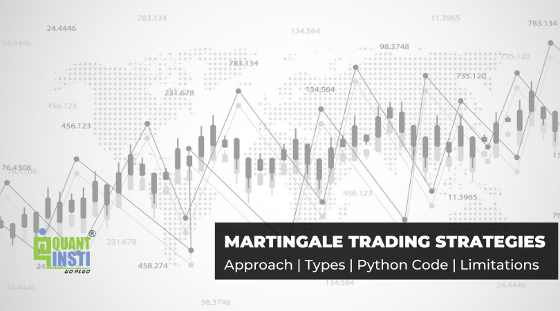

The Martingale strategy is a concept that has found its application in both gambling and trading domains due to its straightforward approach to handling losses. Its primary principle involves doubling the size of a trade following each loss, with the expectation that a subsequent win will offset all previous losses. This system assumes a probability theory framework where outcomes eventually average out, thus creating opportunities to reclaim lost capital in trading.

This article will explore how the Martingale strategy can be adapted for algorithmic trading, where automated systems can exploit programmed rules and historical data analysis to apply this strategy effectively. It will examine the potential benefits, such as the possibility of systematic recovery in volatile markets, and inherent risks, including the peril of severe financial loss if market trends do not reverse as anticipated.



Moreover, insights into implementing the Martingale strategy in a manner that reduces exposure to significant losses will be provided. This involves outlining steps traders can take to set definite parameters and risk controls, which may include strategic use of stop-loss and take-profit orders. In exploring alternatives, the strategy will be compared with the anti-martingale approach, where instead of increasing trade size following a loss, the position is increased after a win to capitalize on favorable conditions.

The discussion will also cover common pitfalls traders face with the Martingale strategy, such as overextension of capital and inadequate risk management. Guidance on prudent application in financial markets will emphasize the importance of a comprehensive trading plan that considers diverse strategies and risk management practices.

## Table of Contents

## Understanding the Martingale Strategy

The Martingale strategy is a centuries-old concept that originated in 18th-century France, initially applied to betting systems. This strategy is fundamentally rooted in probability theory, which suggests that over time, outcomes should average out to their statistical expectations. Specifically, in the context of gambling or trading, the Martingale strategy operates on the premise that losses and wins will eventually balance, theoretically leading to a financial recovery after a series of consecutive losses.

In trading, the Martingale strategy manifests as an approach where the trader increases the position size following each loss, motivated by the anticipation of a forthcoming market reversal. This is grounded in the belief that markets are mean-reverting, meaning prices tend to return to their average value over time. Thus, if a trade initially results in a loss, incrementally increasing the stake on subsequent trades might eventually capture the anticipated market movement.

Despite its theoretical foundation, the Martingale strategy poses significant risks. The primary danger lies in the assumption that a market reversal will occur within a reasonable timeframe, an assumption that may not always hold true. Markets can sustain trends for prolonged periods, and failure to reverse as anticipated can lead to compounded losses. This potential for continuous market movement in one direction means that, theoretically, the strategy could lead to unlimited losses.

A successful application of the Martingale strategy demands substantial capital reserves. This is due to the exponential increase in trade size necessary to recover losses with each iteration. For example, in a simple form, if a trade incurs a loss of $100, the subsequent trade would involve $200, assuming the same probability of success. Should this trade also result in a loss, the next would require a $400 investment, and so on. Mathematically, the growth of trade size can be modeled as a geometric series where the position size $P$ after $n$ losses is given by:
$$
P_n = P_0 \times 2^n
$$
where $P_0$ is the initial trade size.

In practice, this rapid increase in necessary capital can quickly become unmanageable, especially for traders who are not equipped with large financial resources. The financial commitment required to maintain this strategy until a market reversal occurs can be overwhelming, making the Martingale a strategy suited only for those with substantial risk capital and the tolerance for significant financial [volatility](/wiki/volatility-trading-strategies).

## How the Martingale Strategy Works in Algorithmic Trading

In [algorithmic trading](/wiki/algorithmic-trading), the Martingale strategy is applied by automating the process of adjusting position sizes based on predefined rules. The fundamental concept involves doubling the position size after a loss, with the expectation that a future win will recoup previous losses. By automating this process, traders can efficiently manage trades and execute the strategy with precision.

Initially, the strategy is programmed into an algorithmic system that can execute trades without human intervention. This system relies on historical data to backtest the strategy, allowing traders to assess its effectiveness across different market conditions. Backtesting is crucial as it provides insights into how the Martingale strategy would have performed in varying scenarios, thereby helping traders gauge potential profitability and risk exposure.

A major consideration when implementing the Martingale strategy algorithmically is the definition of clear entry and [exit](/wiki/exit-strategy) signals. These signals are determined through comprehensive market analysis, which may include technical indicators, price patterns, and other quantitative metrics. By establishing precise entry and exit criteria, traders ensure the strategy operates with consistency and discipline.

Risk management is paramount in the application of the Martingale strategy. To this end, incorporating stop-loss orders and take-profit levels within the algorithm is essential. Stop-loss orders limit potential losses by closing a position if the market moves unfavorably, while take-profit levels secure gains by closing a position once a predetermined profit is achieved. This disciplined approach mitigates risk and prevents excessive drawdowns, which are inherent to the Martingale strategy.

The success of the Martingale strategy in algorithmic trading is heavily reliant on managing market volatility and meticulously calibrating strategy parameters. This involves adjusting factors such as leverage, position sizes, and the frequency of trade execution in response to changing market conditions. For instance, lower volatility might warrant smaller position sizes to reduce risk, while higher volatility might present opportunities for strategic scaling.

In summary, when applied in algorithmic trading, the Martingale strategy requires rigorous testing, clear strategy rules, and stringent risk management measures. By leveraging algorithmic systems, traders can optimize the strategy’s deployment, enhancing the potential for profit while carefully controlling exposure to risk.

## Drawbacks and Risks of the Martingale Strategy

The Martingale strategy, while theoretically appealing due to its straightforward doubling approach, presents significant drawbacks and risks that must be carefully considered by traders. The foremost concern is the strategy's inherently high risk-to-reward ratio. This approach presupposes that a future win will not only occur but will occur before the trader faces the limits of their capital or margin, which can lead to rapid accumulation of losses if confronted with a prolonged adverse market trend. Such adverse trends, especially in volatile markets, do not guarantee timely reversals necessary for recovering increasing losses.

Transaction costs present additional financial burdens. In high-frequency trading environments, such as the [forex](/wiki/forex-system) market, these costs can significantly impact the bottom line. As positions are doubled, the transaction costs also multiply, potentially leading to a scenario where even a successful trade may not recover these accumulated costs, exacerbating overall losses.

The Martingale strategy can also impose a substantial psychological toll on traders. The stress of enduring a sequence of losses before achieving a potentially winning trade can lead to poor decision-making and emotional trading. This pressure to maintain composure under mounting financial strain makes the strategy unsuitable for traders lacking significant psychological resilience.

Relying excessively on the Martingale strategy can provoke overexposure to market fluctuations. Instead of diversifying, traders might find themselves significantly leveraged in a single direction of the market, thus destabilizing their portfolio upon market shifts. This lack of diversification increases vulnerability to systemic market risks, further endangering portfolio stability.

Given these challenges, the Martingale strategy is generally discouraged for traders with limited capital. Such traders are at risk of depleting their funds before achieving the necessary recovery trade, amplifying the potential for total financial ruin. The strategy is better suited for those with substantial capital reserves and a higher risk tolerance, ensuring they can withstand extended unfavorable conditions without facing immediate liquidation.

In conclusion, while the Martingale strategy offers a tantalizing promise of eventual recovery, its practical implementation demands careful consideration of the associated risks and an understanding of its potential impacts on both finances and psychological fortitude.

## Best Practices for Implementing the Martingale Strategy

Before adopting the Martingale strategy, traders should clearly define their risk appetite and determine the maximum loss they are willing to absorb from their trades. This foundational step is critical in setting realistic expectations and protecting the trader's capital from excessive drawdowns inherent in the strategy's aggressive approach.

It is advisable to limit the number of consecutive trade doublings. This cap helps prevent runaway losses that can lead to financial ruin, especially when the market does not reverse as anticipated. For example, a trader might decide to double their position no more than five times, essentially putting a boundary on the potential loss exposure.

Applying Martingale selectively in a diversified trading strategy can reduce overall risk while still leveraging the strategy's potential benefits. Diversification involves mixing the Martingale approach with other strategies to spread risk and achieve a more balanced portfolio performance. This can cushion the impact of consecutive losses resulting from the Martingale method alone.

Traders should employ robust risk management tools, such as hedging and appropriate leverage settings, to safeguard against significant drawdowns. Hedging allows traders to offset potential losses by taking an opposite position in a related asset, while careful leverage management ensures that the amplification of gains does not equally translate to magnified losses. For instance, using lower leverage ratios can control the risk per trade, making adverse movements less detrimental to the portfolio.

Continuous monitoring and adjustment of the algorithmic strategy are necessary to refine performance and maintain alignment with changing market conditions. Markets are inherently dynamic, and the parameters used in the Martingale strategy should reflect this. Adjustments in volatility thresholds, entry and exit signals, and doubling limits should be periodically reviewed and adapted as needed.

In Python, implementing these practices could involve setting constraints within an algorithm, ensuring these checks are automated. Here's a simplistic pseudo-code illustrating these principles:

```python
class MartingaleStrategy:
    def __init__(self, max_doublings=5, initial_risk=0.01, max_loss=0.1):
        self.max_doublings = max_doublings
        self.initial_risk = initial_risk
        self.max_loss = max_loss
        self.current_loss = 0
        self.current_doublings = 0

    def execute_trade(self, market_data):
        if self.current_loss > self.max_loss:
            print("Loss limit reached. Adjust positions.")
            return
        position_size = self.initial_risk * (2 ** self.current_doublings)
        # Example trade execution logic
        if market_data['signal'] == 'buy':
            self.buy(position_size)
        elif market_data['signal'] == 'sell':
            self.sell(position_size)

    def buy(self, size):
        # Logic to execute buy
        pass

    def sell(self, size):
        # Logic to execute sell
        pass

    def evaluate_trade_outcome(self, outcome):
        if outcome == 'loss':
            self.current_doublings += 1
            self.current_loss += self.initial_risk * (2 ** self.current_doublings)
            if self.current_doublings >= self.max_doublings:
                print("Max doublings reached. Re-evaluate strategy.")
                self.current_doublings = 0
        else:
            self.current_loss = 0
            self.current_doublings = 0
```

By adhering to these best practices, traders can navigate the Martingale strategy's challenges more effectively, turning its potential pitfalls into opportunities for potentially profitable trades.

## Summary and Conclusion

The exploration of the Martingale strategy in algorithmic trading reveals a complex interplay between potential profitability and substantial risk. This strategy is designed to capitalize on market volatility, yet its application requires traders to possess not only significant financial resources but also the psychological resilience to withstand potential losses that may arise from prolonged adverse market conditions. The necessity for a large capital reserve stems from the core principle of the Martingale strategy, which involves doubling the position size after each loss. This practice aims to recover all preceding losses with a single future win, but it can lead to rapid accumulation of losses if the market continuously trends unfavorably.

Technological innovations have transformed the way this strategy is implemented. Through automation, traders can enhance the precision of strategy execution and performance monitoring. Algorithmic trading systems enable [backtesting](/wiki/backtesting) of the Martingale strategy over historical data, allowing for the calibration of parameters to suit varying market conditions. This adaptability is crucial, as it helps refine strategy dynamics in response to ongoing market shifts, ensuring that traders can make more informed decisions about entry and exit points.

The judicious deployment of the Martingale strategy hinges upon a thorough understanding of its risks and benefits. This understanding allows traders to transform the perceived risks into opportunities by effectively calibrating the strategy in line with their financial capacity and market conditions. The transformation of risk into a calculated chance at profit is a nuanced process, reliant on continuous monitoring and adjustment to stay aligned with both current trends and unexpected market movements.

To optimize the potential of the Martingale strategy, it should be integrated within a broader trading plan that encompasses comprehensive risk management techniques and alternative strategies. Employing robust risk management tools, such as stop-loss and take-profit orders, as well as diversifying trading strategies, can mitigate the inherent risks of the Martingale approach. By doing so, traders can leverage the method's potential benefits while safeguarding against crippling losses, ensuring that their trading endeavors remain sustainable and, ultimately, profitable.

## References & Further Reading

[1]: Kaggle. ["Martingale Strategy for Algorithmic Trading"](https://medium.com/kaggle-blog/meet-the-winner-of-the-algo-trading-challenge-an-interview-with-ildefons-magrans-417d6a68c271) 

[2]: Bergstra, J., Bardenet, R., Bengio, Y., & Kégl, B. (2011). ["Algorithms for Hyper-Parameter Optimization."](https://dl.acm.org/doi/10.5555/2986459.2986743) Advances in Neural Information Processing Systems 24.

[3]: ["Advances in Financial Machine Learning"](https://www.amazon.com/Advances-Financial-Machine-Learning-Marcos/dp/1119482089) by Marcos Lopez de Prado

[4]: Tharp, Van K. (1998). ["Trade Your Way to Financial Freedom"](https://www.amazon.com/Trade-Your-Way-Financial-Freedom/dp/007147871X) McGraw-Hill Education.

[5]: Tsokos, Chris P., & Xenos, Michael N. (2009). ["Probability and Statistics with Applications: A Problem Solving Text"](https://www.sciencedirect.com/book/9780124171138/mathematical-statistics-with-applications-in-r) Elsevier Academic Press.

[6]: ["Machine Learning for Algorithmic Trading"](https://github.com/stefan-jansen/machine-learning-for-trading) by Stefan Jansen

[7]: ["Quantitative Trading: How to Build Your Own Algorithmic Trading Business"](https://www.amazon.com/Quantitative-Trading-Build-Algorithmic-Business/dp/1119800064) by Ernest P. Chan