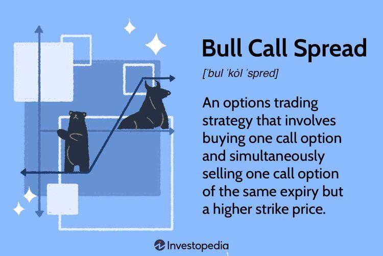

Algorithmic trading has profoundly transformed financial markets, offering unprecedented opportunities for profit maximization. By automating trade execution based on pre-defined criteria, algorithmic trading eliminates human error, enhances speed, and allows access to lucrative opportunities that manual trading might miss. In this landscape of automated trading, several methodologies and strategies have achieved prominence due to their effectiveness and innovation.

One such influential name in the trading world is the 'Pitbull Investor'. Recognized for employing sophisticated algorithmic techniques, the Pitbull Investor leverages advanced mathematical models and data analysis to execute trades. This entity has gained a reputation for its strategic acumen and effectiveness, standing out among its contemporaries in algorithmic trading.



The purpose of this article is to provide a thorough review of the Pitbull Investor's approach to algorithmic trading. This includes an evaluation of the strategies they employ, their efficiency, and their overall impact on automated trading practices. By examining the Pitbull Investor's methodologies, this article seeks to offer valuable insights into the potential and complexity of algorithmic trading in modern financial markets.

## Table of Contents

## Who is the Pitbull Investor?

The Pitbull Investor is a moniker that signifies a trading entity or individual known for their assertive and calculated approach in the financial markets. Drawing inspiration from the renowned trader Marty Schwartz, famously known as "Pit Bull," the Pitbull Investor utilizes algorithmic strategies to transact in markets efficiently. Schwartz's success in trading futures, options, and equity positions with an aggressive style and robust risk management has evidently influenced the trading practices associated with the Pitbull Investor.

The Pitbull Investor is recognized for deploying data-driven strategies, meaning they rely heavily on quantitative data and statistical analysis to guide their trading decisions. This approach allows for swift decision-making, a crucial component when dealing in markets where conditions can change rapidly. The efficacy of their strategy is amplified by leveraging algorithmic solutions, enabling the execution of trades at speeds far surpassing human capabilities, while simultaneously minimizing errors.

Their process typically involves substantial market analysis, which encompasses the examination of historical price data, trading volumes, and other financial indicators to uncover patterns and exploit market inefficiencies. This analysis can include complex models and machine learning algorithms designed to predict market movements and identify promising opportunities.

Understanding the background and trading methodology of the Pitbull Investor presents valuable lessons for traders, particularly those interested in [algorithmic trading](/wiki/algorithmic-trading). By studying their strategic use of data, disciplined approach, and innovative use of technology, other traders can learn to enhance their own trading systems to achieve consistent success in the markets. This emphasizes the importance of integrating technological advancements with traditional trading wisdom to adapt to modern financial environments.

## Pitbull Investor’s Trading Philosophy

The Pitbull Investor underscores the necessity of having a well-defined trading plan and strategic approach in algorithmic trading. This philosophy aligns closely with the ideologies of Marty Schwartz, a renowned trader, who emphasized the importance of developing methodologies that suit one's personal trading style. Just as Schwartz advocated for a tailored approach to trading, the Pitbull Investor believes that a trading strategy should uniquely reflect the trader's psychological makeup and risk appetite. 

Central to their trading philosophy is the notion that continuous learning and adaptation to market conditions are pivotal. The financial markets are inherently dynamic, with variables and trends that can shift rapidly. Consequently, the Pitbull Investor encourages traders to remain agile, constantly refining their strategies based on evolving market data. This involves not only a keen understanding of current market conditions but also a willingness to adapt one’s strategy in response to new information and technological advancements.

Discipline and risk management are cornerstones of successful trading according to the Pitbull Investor. Maintaining discipline means adhering to the pre-established trading plan and avoiding impulsive decisions driven by temporary market fluctuations or emotional reactions. Discipline ensures that trading decisions are rational and based on comprehensive analyses rather than short-term emotional responses. 

Moreover, risk management is a fundamental aspect of the Pitbull Investor’s philosophy, highlighting the importance of identifying, assessing, and mitigating potential risks before they can impact trading outcomes. Effective risk management strategies might include diversifying investments, setting stop-loss limits, and continually reassessing the risk-reward ratio of trades.

Finally, a strong psychological framework is vital for sustained success in trading. This involves not only controlling emotions such as fear and greed but also maintaining a positive mindset in the face of potential losses. The Pitbull Investor teaches that understanding one’s emotional responses and developing strategies to manage them are critical for long-term trading success. By fostering discipline, managing risks effectively, and cultivating psychological resilience, traders can position themselves to successfully navigate the complexities of the financial markets.

## Algorithmic Strategies Employed by the Pitbull Investor

The Pitbull Investor is noted for applying a variety of algorithmic strategies to analyze and predict market behaviors. Among these, trend-following is a significant focus. This involves identifying and capitalizing on market trends, guided by the belief that prices are more likely to continue in the same direction for a period rather than reverse. Trend-following algorithms use indicators such as moving averages, support and resistance levels, and [momentum](/wiki/momentum) indicators.

Statistical [arbitrage](/wiki/arbitrage) is another cornerstone strategy employed by the Pitbull Investor. This strategy uses statistical models to identify price inefficiencies between correlated financial instruments. By leveraging mean-reversion principles, [statistical arbitrage](/wiki/statistical-arbitrage) algorithms anticipate price convergence and execute trades to exploit these opportunities.

To enhance the accuracy of predictions and real-time strategy adjustments, these trading strategies often incorporate [machine learning](/wiki/machine-learning) methods. Machine learning models, such as neural networks and decision trees, can process vast amounts of data to discern patterns and predict future price movements. For example, a simple Python implementation of a trend-following strategy in algorithmic trading might look like:

```python
import numpy as np
import pandas as pd

# Sample data
data = pd.read_csv('market_data.csv')
price = data['Close']

# Calculate moving average
window = 20
moving_average = price.rolling(window=window).mean()

# Define trend-following strategy
signal = np.where(price > moving_average, 1, -1)  # 1 for buy, -1 for sell

data['Signal'] = signal
```

This code snippet utilizes moving averages to generate buy or sell signals based on current price movements relative to their historical average.

The efficacy of these sophisticated algorithms is evidenced by consistent performance metrics and the ability to scale operations efficiently. Scalability is crucial in algorithmic trading as it dictates the capability to handle increased transaction volumes without compromising performance. The adaptability of these strategies to evolving market conditions is integral to maintaining a competitive edge, ensuring resilience even amidst financial market fluctuations. By balancing automated precision with strategic foresight, the Pitbull Investor sets a benchmark for successful algorithmic trading endeavors.

## Challenges and Criticisms

Algorithmic trading, while groundbreaking in its potential, is fraught with challenges and criticisms that investors must carefully navigate. The Pitbull Investor, known for their aggressive trading techniques using algorithmic strategies, is no stranger to these issues.

One major criticism of algorithmic trading is the potential for over-reliance on algorithms. While algorithms can process vast amounts of data and execute trades at speeds beyond human capability, they can sometimes falter during unpredictable market events. This was evident with incidents like the 2010 Flash Crash, where the Dow Jones Industrial Average plummeted nearly 1,000 points within minutes due to automated trading systems reacting to erratic market signals. Such events highlight the risk that algorithms, which are typically trained on historical data, might not always anticipate sudden market shifts.

The complexity involved in maintaining and updating trading algorithms presents another significant challenge. Algorithms require regular tuning to adapt to evolving market conditions and to incorporate new data inputs. This process demands significant technological expertise and resources. Developing an algorithm involves extensive [backtesting](/wiki/backtesting) and validation to ensure performance accuracy, but even well-tested systems can become obsolete as market dynamics change. Therefore, successful algorithmic trading relies on continuous development and risk assessment, requiring a dedicated team of specialists to manage and innovate.

Despite these challenges, the Pitbull Investor exemplifies resilience and adaptability in the fast-changing environments of financial markets. By employing a combination of advanced machine learning techniques and comprehensive market analysis, the Pitbull Investor can adjust strategies in real-time to mitigate risks. For instance, incorporating real-time data feed analysis and integrating sentiment analysis from news sources can enhance predictive models, providing a buffer against sudden market changes.

A practical example of such adaptability can be seen in the implementation of Python scripts that leverage libraries like Scikit-learn for predictive analytics. Algorithms can be designed to detect anomalies or unusual trading patterns through Python code snippets like the following:

```python
from sklearn.ensemble import RandomForestClassifier
import numpy as np

# Sample market data features and labels
X = np.array([[market_data_features]])
y = np.array([market_labels])

# Initialize a Random Forest classifier
model = RandomForestClassifier(n_estimators=100, random_state=42)

# Fit the model
model.fit(X, y)

# Predict future trends
predictions = model.predict(new_market_data)
```

This approach allows traders like the Pitbull Investor to maintain a competitive edge by dynamically adjusting their models based on live market feedback. Despite the inherent challenges, the agility demonstrated by such algorithmic strategies enables the Pitbull Investor to exploit opportunities while mitigating potential risks, underscoring the robustness and versatility essential to success in algorithmic trading.

## Key Takeaways and Recommendations

Aspiring algorithmic traders can draw significant insights from the approaches adopted by the Pitbull Investor. A pivotal aspect of their success lies in having a robust trading plan alongside psychological preparedness. This implies crafting strategies that not only rely on technical prowess but account for emotional resilience in facing market [volatility](/wiki/volatility-trading-strategies).

A key lesson is the emphasis on continuous improvement and learning. The financial markets are dynamic, necessitating that successful traders stay abreast of new strategies and technologies. With developments in machine learning and data analytics, traders are presented with unprecedented opportunities to refine their methodologies. Algorithms should be treated as evolving entities, where iterative enhancements based on tested hypotheses and backtesting data optimize performance metrics like Sharpe Ratio and Maximum Drawdown.

Data-driven strategies are most effective when combined with human insight. While algorithms excel at processing vast datasets for patterns and anomalies, human intuition and understanding of macroeconomic factors can provide context that machines might overlook. Data informs decision-making, but it is the strategic interpretation of this data that distinguishes exceptional trading strategies. For example, while an algorithm might identify a statistical arbitrage opportunity, a trader equipped with industry knowledge can assess additional factors like geopolitical risks that algorithms might not capture.

Ultimately, traders should aim for a harmonious blend of automation and strategic flexibility. Automation provides speed and precision, essential in high-frequency trading scenarios. However, markets can behave irrationally, necessitating a flexible approach that can pivot strategies when faced with unforeseen market conditions. By fostering a culture of adaptability and openness to integrating new techniques, traders can better navigate the complexities of today's financial environments. In essence, the Pitbull Investor exemplifies how merging robust algorithms with strategic acumen leads to sustained success in algorithmic trading.

## Conclusion

The Pitbull Investor exemplifies a successful figure in the field of algorithmic trading, drawing inspiration from legendary figures like Marty Schwartz. Much like these pioneering traders, the Pitbull Investor employs sophisticated algorithms that underscore the transformative potential of technology in financial markets. These strategies offer traders a glimpse into the intricate processes that algorithms can navigate, providing a competitive edge that is challenging to achieve through traditional trading methodologies.

Understanding the methodologies employed by the Pitbull Investor allows other traders to enhance their trading strategies. This improvement is founded on a thorough comprehension of market dynamics and a commitment to continuously refining algorithmic models. By adopting such data-driven approaches, traders can significantly increase their chances of achieving and maintaining profitability in volatile markets.

Despite the inherent challenges associated with algorithmic trading, the opportunities it presents are vast and compelling. These challenges include the need for continuous adaptation and the risk of algorithms faltering in unpredictable conditions. However, the ability to process and analyze large datasets swiftly and accurately, coupled with a strong strategic framework, makes algorithmic trading an exciting and potentially rewarding frontier for investors seeking to leverage technology for financial gain.

Algorithmic trading continues to evolve, reflecting advancements in technology and market conditions. Traders who are willing to invest time in learning and adapting to these changes stand to benefit significantly. Therefore, the journey of the Pitbull Investor serves as an instructive example of how a disciplined approach, combined with cutting-edge technology, can create significant opportunities in the ever-evolving financial markets.

## References & Further Reading

[1]: ["Pit Bull: Lessons from Wall Street's Champion Day Trader"](https://www.amazon.com/Pit-Bull-Lessons-Streets-Champion/dp/0887309569) by Martin "Buzzy" Schwartz

[2]: ["Algorithmic Trading: Winning Strategies and Their Rationale"](https://www.wiley.com/en-us/Algorithmic+Trading%3A+Winning+Strategies+and+Their+Rationale-p-9781118460146) by Ernest P. Chan

[3]: ["High-Frequency Trading: A Practical Guide to Algorithmic Strategies and Trading Systems"](https://www.wiley.com/en-us/High+Frequency+Trading%3A+A+Practical+Guide+to+Algorithmic+Strategies+and+Trading+Systems%2C+2nd+Edition-p-9781118343500) by Irene Aldridge

[4]: ["The Flash Crash: The Impact of High Frequency Trading on an Electronic Market"](https://www.cftc.gov/sites/default/files/idc/groups/public/@economicanalysis/documents/file/oce_flashcrash0314.pdf) by Kirilenko, A. A., Kyle, A. S., Samadi, M., & Tuzun, T. (Management Science)

[5]: ["Python for Finance: Analyze Big Financial Data"](https://books.google.com/books/about/Python_for_Finance.html?id=E93SBQAAQBAJ) by Yves Hilpisch