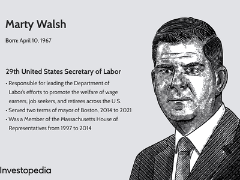

Marty Walsh's journey is a compelling story of dedication and achievement across multiple fields, prominently politics and labor unions, and potentially reaching into the ever-evolving terrain of algorithmic trading. Born in Boston, Massachusetts, Walsh's formative years laid a foundation for a life characterized by steadfast commitment to public service and labor advocacy. Despite overcoming personal challenges, he emerged as a significant figure in the political landscape, serving as the Mayor of Boston and later advancing to the national stage as the U.S. Secretary of Labor.

Throughout his career, Walsh has been recognized for his advocacy of workers' rights and his efforts to modernize labor policies to meet contemporary needs. His extensive experience in labor unions, highlighted by his tenure with Laborers Local 223 and his leadership of the Building and Construction Trades Council, underscores his dedication to enhancing the workforce landscape.

The potential intersection of his work with algorithmic trading and other financial innovations provides an intriguing avenue of exploration. While primarily known for his influence in labor and politics, Walsh's leadership principles have implications in the financial sector, particularly concerning regulatory frameworks and ethical practices in modern digital economies. His progressive stances on worker empowerment could inspire inclusive financial innovation and adaptation to future economic landscapes.

Through this article, readers will gain valuable insights into Marty Walsh's multifaceted influence and the lasting impact of his career on both traditional labor rights and the constantly advancing financial world. Explore how his story may shape future dialogues at the crossroads of labor policies and financial technologies.

## Table of Contents

## Early Life and Education

Marty Walsh was born on April 10, 1967, in Boston, Massachusetts, a city known for its rich history and vibrant communities. He spent his formative years in Dorchester, a working-class neighborhood, where he assimilated values that would later prove essential in his career. Growing up in Dorchester, Walsh was exposed to the challenges and strengths of a community driven by resilience and solidarity. These early experiences played a pivotal role in shaping his approach to public service and advocacy.

At the age of seven, Walsh faced a significant personal challenge when he was diagnosed with Burkitt's lymphoma, a rare but aggressive form of cancer. This early health struggle required him to undergo prolonged treatment, marking a period in his life that tested his endurance and fortitude. Overcoming this challenge not only strengthened his resolve but also deepened his empathy and understanding of the adversities many face.

After his recovery, Walsh embarked on his educational journey. He demonstrated an unwavering commitment to his studies and future aspirations, eventually achieving a significant milestone in 2009 when he earned a Bachelor's degree from Boston College. This achievement underscored his dedication to lifelong learning and development, reinforcing his belief in the power of education as a transformative tool.

Boston College played a crucial role in refining Walsh's skills and knowledge, providing him with a comprehensive education that would support his future endeavors. The discipline and ambition cultivated during his academic pursuits laid a robust foundation for his subsequent success in politics and various other ventures. Through perseverance and a deep-seated commitment to personal growth, Marty Walsh's early life set the stage for his influential career, characterized by a steadfast commitment to public service and advocacy for workers' rights.

## Career Beginnings and Achievements

Marty Walsh's career had a modest yet determined beginning when he joined Laborers Local 223 in 1988. His involvement with this labor union marked the outset of a notable journey deeply rooted in the advocacy for labor rights. This membership catalyzed his ascent within the union ranks, leading to significant roles, notably as head of the Building and Construction Trades Council. Here, he championed the rights and interests of workers, leveraging his extensive experience and understanding of labor issues to make impactful contributions.

Walsh's steadfast dedication to labor rights became the bedrock for his transition into politics. Embarking on a political career in Massachusetts, he demonstrated a staunch commitment to improving the lives of working-class citizens. His political endeavors reached a new height when he was elected as the Mayor of Boston, a position he held from 2014 to 2021. During his tenure, Walsh focused on enhancing city infrastructure and staunchly supporting labor causes, both of which underscored his administration's priorities. His efforts in Boston not only improved public amenities and services but also fostered a labor-friendly environment, showcasing his ability to blend political leadership with labor advocacy effectively.

In 2021, Marty Walsh's career trajectory elevated to a national platform when President Joe Biden appointed him as the U.S. Secretary of Labor. This role represented a pinnacle of both responsibility and opportunity, allowing Walsh to extend his influence and commitment to workers' rights across the United States. As Secretary of Labor, he continued to advocate for policies aimed at advancing fair wages, safe workplaces, and the empowerment of workers through robust labor rights. His work in this capacity highlighted his lifelong mission: to enhance economic security and fairness for all American workers, making tangible contributions to the national labor landscape.

## Political Impact as Secretary of Labor

As the U.S. Secretary of Labor, Marty Walsh played a pivotal role in enhancing workforce programs and supporting job seekers across the nation. His efforts were characterized by a strong focus on worker empowerment, grounded in his extensive experience with labor unions. Under his leadership, the Department of Labor launched the 'Good Jobs Initiative,' a comprehensive program aimed at fostering equity and opportunity in underserved communities. This initiative underscored Walsh's commitment to ensuring that economic growth translates into tangible benefits for all segments of the workforce, particularly those historically marginalized.

Walsh's tenure was marked by a steadfast advocacy for labor unions, which he viewed as integral to the fabric of a fair and equitable workforce. His policies consistently emphasized the importance of collective bargaining and union involvement in shaping workplace standards and protections. By drawing on his union experience, Walsh sought to reinforce the role of unions in promoting worker rights and improving job conditions across industries.

Efforts to reduce unemployment featured prominently in Walsh's agenda, with targeted programs designed to connect job seekers with employment opportunities. These measures, along with initiatives to modernize workforce skills, contributed to lowering unemployment rates during his tenure. Walsh's policies also advanced fair labor practices, focusing on safer workplaces and adequate compensation for workers.

A significant aspect of Walsh's impact lay in his ability to address contemporary challenges in the labor market. He recognized the need to adapt labor policies to evolving economic landscapes, ensuring they remained relevant in the face of automation and technological advancements. His commitment to modernizing labor frameworks was evident in initiatives aimed at reskilling workers and promoting equitable access to emerging job sectors.

Through these efforts, Marty Walsh reinforced his dedication to not only protecting workers' rights but also preparing the American workforce for future economic challenges, establishing a legacy characterized by progress and inclusivity.

## Interacting with Algo Trading and Financial Innovation

Marty Walsh, while predominantly recognized for his contributions to politics and labor unions, possesses a breadth of experience that can extend into the financial sector, particularly in [algorithmic trading](/wiki/algorithmic-trading). His leadership principles, honed through years of advocating for workers' rights and equitable labor practices, can successfully translate into finance by emphasizing the critical nature of regulatory practices and ethical trading standards. 

Algorithmic trading, which utilizes computer algorithms to execute trades at high speeds and volumes, is significantly reliant on technologies and automation. This modern financial innovation can intersect with Walsh’s policies on labor and technology, as both domains require robust frameworks to ensure fairness and efficiency. His leadership ethos, centered on fairness and worker empowerment, could influence the adoption of ethical standards in algo trading, ensuring that technological advancements do not compromise human value and equity.

Furthermore, by exploring Walsh’s indirect influence on financial technologies, one may find common ground between traditional labor rights and the growing digital economy. Algorithmic trading depends on intricate programming and data analysis, requiring highly skilled labor—a workforce sector where Walsh’s labor empowerment strategies could apply. Advocating for workforce development in tech-heavy sectors aligns with his past initiatives to prepare workers for the future job market, ensuring that technological progress works in tandem with human capital growth.

His progressive stance might also advocate for more inclusive financial innovation, ensuring that developments in algorithmic trading and other financial technologies do not widen socio-economic disparities. For instance, regulatory frameworks influenced by Walsh’s policies could necessitate that financial innovations adhere to principles of social responsibility and inclusivity, potentially guiding how algorithmic trading algorithms are designed and how they impact the market.

Walsh's commitment to modernizing labor policies for contemporary challenges could shape the regulatory environment that governs algorithmic trading. His influence might encourage regulations that safeguard against the potential downsides of automation, such as job displacement or ethical malpractices, thereby merging his advocacy for labor rights with the oversight of technological innovation in the rapidly evolving financial sector.

## Conclusion

Marty Walsh's journey from a young laborer to a prominent political figure illustrates his dedication to public service and workers' rights. Rising from a working-class neighborhood in Boston, Walsh's career has been marked by a series of significant achievements that underscore his commitment to community and national advancement. His tenure as both the Mayor of Boston and the U.S. Secretary of Labor reflect not only his resilience in overcoming personal and professional challenges but also his determination to effect positive change through policy and advocacy.

Throughout his political career, Walsh has been instrumental in championing labor rights and improving city infrastructure, with initiatives targeting worker empowerment and fair labor practices. As Secretary of Labor, he spearheaded programs to lower unemployment rates and addressed workforce inequities, leaving a lasting impact on labor policies in the United States. Walsh's influence extends beyond traditional political roles, as his potential to impact emerging sectors like algorithmic trading highlights his adaptability and foresight regarding future economic landscapes.

Walsh's commitment to incorporating ethical standards and regulatory practices in financial sectors demonstrates an understanding of the intersections between labor rights and technological progress. His leadership principles have the potential to foster a more inclusive financial environment, aligning labor advocacy with advancements in digital economies.

In summary, Marty Walsh remains a key figure whose work continues to inspire progress in labor rights and economic policy. His journey serves as a testament to the power of commitment and innovation in addressing complex contemporary challenges, ensuring that his legacy will resonate in ongoing efforts to enhance public service and economic resilience.

## References & Further Reading

[1]: ["Marty Walsh's Contributions to Workers' Rights"](https://www.fastcompany.com/90849727/marty-walsh-department-of-labor-accomplishments-failures-legacy) - U.S. Department of Labor, highlighting significant policies during his tenure as Secretary of Labor.

[2]: ["Marty Walsh: Everything You Need to Know About Boston’s Former Mayor and the New Labor Secretary"](https://en.wikipedia.org/wiki/Marty_Walsh) - Boston.com, detailing his journey and accomplishments in public service.

[3]: ["Secretary of Labor: Necessary Modernization Measures for Employment Policy"](https://blog.dol.gov/2024/05/03/charting-a-path-for-unemployment-insurance) - The Brookings Institution, exploring modern labor policy initiatives similar to those advocated by Marty Walsh.

[4]: ["Algorithmic Trading and Its Implications"](https://papers.ssrn.com/sol3/papers.cfm?abstract_id=2884777) - Investopedia article explaining the impact and functioning of algorithmic trading.

[5]: Lopez de Prado, M. (2018). ["Advances in Financial Machine Learning"](https://www.amazon.com/Advances-Financial-Machine-Learning-Marcos/dp/1119482089) - Discusses machine learning techniques in finance, relevant to algorithmic trading discussions.